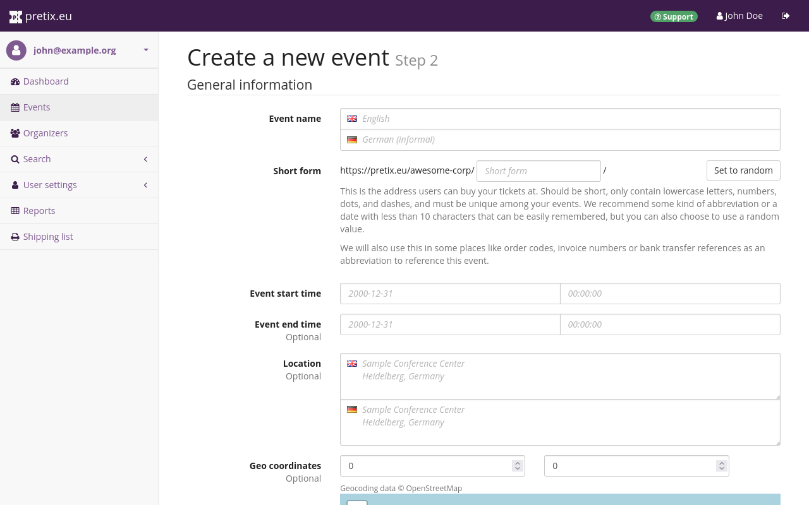

# Writing for MkDocs

This article describes the more technical side of writing documentation for pretix. 
It explains how to structure certain types of information, and what syntax to use to do it. 

## Screenshots 

Take screenshots of the pretix backend in a resolution of 1200 × 800 pixels. 
Resize your browser window or use the "Responsive Design View" in Firefox by pressing Ctrl + Shift + M. 
Log in as "Jordan Doe". 
Manage the "Tutorial Ltd." organizer account. 
Edit the "Tutorial Conference" event.
If the page in question is specific to event series, edit "Tutorial series" instead. 

If you do **not** have access to these accounts or events, edit your screenshots with the top and sidebar of already existing screenshots. 

If you are adding the screenshot to help the user with navigating the website, that is, you want them to know they are on the right page, do **not** use highlighting. 
If you want to tell the user to interact with one specific element on the page, highlight that element. 
Use the color OrangeRed #FF4500 (255, 69, 0) for highlighting. 
Use the Fontawesome-3 arrow symbols and boxes with a width of [0.5em](https://en.wikipedia.org/wiki/Em_(typography)).
Take a look at the screenshots in the [tutorial](../tutorial/getting-started.md) to get an idea what it should look like. 

Save screenshots in one of the directories in `/pretix-docs/site/assets/screens/`. 
If there is no directory corresponding to your subject, create a new one. 
Choose a straightforward and descriptive name for the screenshot. 
Use a hyphen-minus `-` to separate two words in the filename. 

## Image descriptions

You can find basic information on how to write a good image description at [Axess Lab](https://axesslab.com/alt-texts/).
This is how you include an image description in markdown: 
```

```

Example:

```

```

## Buttons

Mark all buttons that you want the user to click the following way:

```
:btn:Button Label:
```

If a button includes an icon, include the icon before the button label:

```
:btn-icon:icon-name:Button Label:
```

Example:

```
The :btn-icon:fa3-upload: Import vouchers: button lets you upload such a list after saving it from a different event.
```

>The :btn-icon:fa3-upload: Import vouchers: button lets you upload such a list after saving it from a different event.

Do **not** mark buttons this way if you are not telling the user to click them. 
Put them in quotation marks instead. 

## Navigation paths

Navigation paths start either from a placeholder ("Your Event") or from the dashboard. 
For consistency and accessibility reasons, use this formatting for all navigation paths. 
You can insert icons at any point in the path.
Close it with `:`. 
Use ` → ` (AltGr + i) between each step. 
Put spaces before and after the arrow symbol. 
Paths starting from the dashboard automatically begin with an arrow pointing to the first element.

Examples:

```
:navpath:Your Organizer → Layer1 → Layer2:
:rootnavpath:Layer1 → Layer2:
:navpath:Your Event → :fa3-ticket:Layer1 → Layer2:
```

## Input fields

Use quotation marks and the label in the exact spelling as it occurs in the UI for interactive elements such as text input fields and drop-down menus. 
Refer to them explicitly as a "field" or as a "menu". 

Example:

```
In the "Check-in text" field, provide instructions for the person operating the check-in at your event.
```

Refer to a checkbox as "the checkbox next to [Label]". 
If the instructions already contain the words "check" or "uncheck", refer to them as "box".

Example:

```
Check the box next to "requires special attention".
```

There is currently no standard formatting for radio buttons or other controls.

## Admonitions 

If you want to tell the reader about legal, technical, or irreversible actions, use colored text boxes. 
The color is based on ISO standards:

 - **Blue** for notes
 - **Yellow** for warnings

Use three exclamation marks and a space `!!! ` followed by the box type. 
If you do **not** specify a title, the title of the box will default to the type ("Note" or "Warning"). 
Indent the text of the warning with four spaces. 
To continue with normal text, insert an empty line and remove the indentation. 

Example:

```
!!! Note
    Reading note boxes is useful.
```

If you use a note or warning box in multiple articles, place it in the `include` directory. 
If you use it in only one article, you do not have to do that. 
In that case, include the warning in the article. 

To include a reusable text block, use the following formatting:

```

```

MkDocs also supports other types of admonitions. 
The pretix documentation currently only uses notes and warnings. 
If you think it is necessary to use any other type of admonition, talk to the team before you do so. 

## Icons

As of 03/2025, pretix uses Font Awesome 3 icons and some custom icons. 
You can find these icons in the repo at `/overrides/.icons/`. 
In order to insert an icon into the text, use `:fa3-iconname:`, where `iconname` is the filename of the icon minus the file type extension. 
For example, use `:fa3-transgender-alt:` for the icon :fa3-transgender-alt: and use `:i-seat:` for :i-seat:. 

## Links and cross references

Do **not** insert external or internal links without context. 
Make them as informative as possible in their descriptive text (the part that is visible to readers in the text and looks like a hyperlink). 
Make them large enough so that the reader can click them without great effort. 
Single words such as "here" and "next" are **not** suitable as link text.

Screen readers sometimes read out contextless lists of links. 
Hearing the link text "here" five times in a row is **not** very informative. 
Even without a screen reader, it helpful for the reader if they have a general idea what is behind the link. 

MkDocs uses different symbols to precede internal and external links in the documentation visible to readers to make it easier to distinguish between them. 
You do not have to specify this because it works automatically. 
The formatting for both types of links is "link text in square brackets, URL/path in round brackets". 
Insert cross references to a subheading within another (or the same) article work as follows: 

```
[monitoring incoming payments](../topics/payment/bank-transfer.md#monitoring-incoming-payments) 
```

If you want to link to the entire article, omit the # symbol and the parts after it. 
You can also omit parts of the file path that are identical to the path of the current file. 
Examples:

``` 
Our organizer's profile and all the events we are going to create will be found at [https://pretix.eu/tut/](https://pretix.eu/tut/) from now on. 
 
 In this tutorial, we will be:

 - creating a [personal and organizer account](getting-started.md#creating-an-account)
 - setting up our [organizer account](organizer-account.md) 
 - creating our [event](event.md) 
```

If you link an article that is not yet available (for example due to an open pull request), GitHub will throw a warning. 
To avoid this, put a space between square and round brackets and leave a corresponding comment starting with "TK". 

```
TK fix link after merge
```

## Placeholders

Use `:placeholder: ... :` to mark placeholders outside of navigation paths. 
MkDocs will display these the same way as placeholders *within* navigation paths. 
This does **not** work in combination with button or icons formatting
Example:

```
A shop created with pretix Hosted will by default be located at https://pretix.eu/:placeholder:OrganizerShortForm:/:placeholder:EventShortForm:/. 
```
>A shop created with pretix Hosted will by default be located at https://pretix.eu/:placeholder:OrganizerShortForm:/:placeholder:EventShortForm:/. 


## Line breaks

Put a line break after each single sentence. 
If each sentence is not in a single line in the .md file, then reviewing the article through GitHub becomes unnecessarily messy and difficult. 

You can use the following command to automatically move every sentence in a text file (Markdown) to a separate line. 
This command is as follows:

```
sed 's|\. |. \n|g' < input.md > output.md
```

!!! Warning 
    The name of the output file must be different from the name of the input file, otherwise the command will create an empty file. 

This command searches for occurrences of ". " (that is a dot followed by a space) and replaces them with dot followed by space followed by newline. 
This also adds line breaks after dotted abbreviations. 
It can also create double empty lines. 
Edit the output file and remove unnecessary line breaks manually. 
Markdown renders single line breaks as spaces. 
There is no need to remove the space at the end of the sentence. 
Markdown renders empty lines as line breaks. 
Place an empty line between every pair of paragraphs.

If want to add additional line breaks to the output text on the website, put at least two spaces at the end of the line of markdown code. 
You can insert additional empty lines using `<br>`. 
If you are inserting an image between two paragraphs, but the image concerns the content of only one of the paragraphs, insert additional empty lines. 
Insert `<br>` between the image and the topically **separate** paragraph. 

## English punctuation

English and German have different punctuation rules. 
This is an overview over commonly used special characters. 

For money, put currency symbol at the beginning. 
Do **not** separate it with a space. 
Use the comma for thousands
Use the period for decimals. 

`€1,899.99` 

For percentages, do not use a space between the number and the symbol. 

`19%` 

For quotation marks, use `"` (U+0022 QUOTATION MARK). 
Double-check that you have the correct quotation mark when copying text from Confluence, word editors, or other websites. 
They will sometimes replace the quotation mark above with a different symbol such as `”`. 
Do not use this symbol anywhere in our documentation. 
It only occurs here as a deterrent example. 

The hyphen and minus are the same symbol: `-`. 
The en-dash is a separate symbol, which is currently not used in our documentation: `–` 
The em-dash is yet another separate symbol: `—` (U+2014 EM DASH). 
Use the em-dash without spaces before or after it. 

## Articles specific to Germany

Some articles in our documentary are only relevant for the German-speaking world, for instance because they concern organizations that only exist in Germany. 
Although we are publishing the rest of our documentation in English first, it makes sense to write these articles in German. 

Because of the way MkDocs organizes the navigation on the website, you have to handle these articles in a special way. 
Put the main text of the article in the `include` directory. 
Do **not** put a level 1 heading or title in the file. 
Then, create a file with the following content in the `docs` directory where the article actually belongs: Heading, note on language and include command for the main text. 
Example: 

```
# KulturPass

!!! Note
    Since the KulturPass is specific to event organizers within Germany, the following page is also only provided in German.
    Should you require assistance with the KulturPass and do not speak this language, please feel free to reach out to <support@pretix.eu>.


```

Then, create a file with the extension .de.md in the same directory, which only contains the title and the include command. 
Do **not** put the hint regarding the language into the German docs file. 

## Indicating pretix editions

Mark sections that are specific to certain pretix editions the following way:

```
<!-- md:hosted -->
<!-- md:community -->
<!-- md:enterprise -->
```

You can use the same formatting for specific version updates.