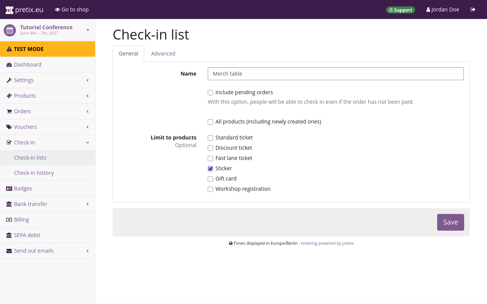

# Check-In Lists 

This article tells you how to create, configure, and use check-in lists. 
Check-in lists keep track of who attends your event. 
In most cases, you need one check-in list for every separate area with its own entrance at your event. 
If there is one venue with multiple entrances, then one shared check-in list for all entrances is enough. 
If you have separate entrances for separate products, such as fast lane access or VIP tickets, then you will need one check-in list for every entrance. 

Check-in lists operate independently from one another. 
A ticket is valid once on every check-in list that includes it. 
If you are hosting subevents with more exclusive attendance, then each of those subevents will need its own check-in list. 

We recommend using the [pretixSCAN](https://pretix.eu/about/en/scan) app running on dedicated devices for your check-in. 
It is by far the most convenient method. 
You can also do a manual check-in through the backend, or you can print your lists and check people in with a pen and paper. 

## Prerequisites 

Check-in lists are handled on the event level, so you have to create an event first. 

## General usage 

This section explains how to set up and configure check-in lists. 

Creating an event also automatically creates a check-in list named "Default". 
This check-in list includes all your products. 
If your event only has one area and there are no separate merch tables, no separate sessions, no fast lane access and no VIP tickets, then this list is enough. 
You do not need to make any changes to it. 

However, if your event does include any of those things, then you need to configure the default check-in list and create new check-in lists. 

In order to view the "Default" list, make changes to it, or create new lists, navigate to :navpath:Your event → :fa3-check-square-o: Check-in:. 
This lands you on the "Check-in lists" page. 

The following sections guide you through the configuration of check-in lists for straightforward use cases and for more complex applications.
Assume, for example, that you are selling the following types of products: 

 - basic access tickets
 - fast lane tickets
 - merchandise that your staff distributes to customers at a designated merch table
 - registrations for exclusive workshops 
 - gift cards

The following sections explain how to set up check-in lists to support all of these things. 

### Configuring a check-in list

In order to configure a check-in list, click the :btn-icon:fa3-wrench:: button next to it. 

If you also want attendees who have not yet completed the payment for their order to be able to check in at your event, check the box next to "Include pending orders". 

The box next to  "All products (including newly created ones)" is checked by default. 
If all your products are admission products and there are no separate areas with their own entrances at your event, then you do not need to change that. 
In any other case, uncheck the box and check the products you want to include on the list under "Limit to products". 

If you want to implement a use case similar to the example provided above, check the boxes next to your basic access tickets and leave all other boxes unchecked. 
You would then use this list at the main entrance to your event. 

Once you are done, click the :btn:Save: button. 

### Creating a new check-in list

In order to create a new check-in list, navigate back to :navpath:Your event → :fa3-check-square-o: Check-in:. 
Click the :btn-icon:fa3-plus: Create a new check-in list: button. 
Enter a name for the new check-in list and check the boxes next to any tickets you want to include on it. 

If you want to implement a use case similar to the example provided above, name the check-in list "Fast lane". 
Uncheck the box next to  "All products (including newly created ones)" and under "Limit to products", check the boxes next to your fast lane tickets. 
You would then use this list at the fast lane entrance at your event. 

Click the :btn:Save: button. 

A merchandise table may seem like a very different use case from a check-in, but a check-in list is still useful for keeping track of who has bought which merch, and who has picked it up already. 

If you want to create a check-in list for the merchandise table, repeat the creation process described above, name it "Merchandise" or something similar, and limit it to the merchandise products. 

If your event offers exclusive additional sessions such as workshops, create another check-in list for each of those workshops. 
Give it a descriptive name and limit it to the workshop registration products. 

Finally, since gift cards are only relevant for purchases and not for access to your event, you do **not** include gift cards on any of your check-in lists. 

## Applications

This section explains how you can use check-in lists to manage the check-in at your event. 

### Check-in via pretixSCAN

The most convenient and powerful method for checking in customers is using the pretixSCAN app. 
Acquire a device with a scanner or camera, install pretixSCAN on it, connect it to your organizer account, and place it at the entrance to your event. 
We will cover the specifics of using pretixSCAN in a dedicated article. 

### Manual check-in via backend 

!!! Note 
    This method is slow and only feasible if you are dealing with a low volume of customers. 
    We recommend using pretixSCAN instead. 

If you want to perform manual checks using the pretix backend, place a computer at the check-in. 
You will need a stable internet connection and access to the pretix backend from that computer. 
Take appropriate security measures so that only authorized personnel can use the computer. 

On that computer, open the pretix backend and navigate to :navpath:Your event → :fa3-check-square-o: Check-in → Check-in lists:. 
In the list, click the check-in list on which you want to record check-ins. 
The next page displays a list with all issued tickets. 

Ask attendees their name, email address, ticket code, or order code. 
Use the "Search attendee" function or browse the list to locate the corresponding entry. 
Check the box next to that entry and click the :btn-icon:fa3-sign-in: Check-In selected attendees (#): button. 
It is possible to select multiple attendees and check them all in at once. 

### Paper check-in 

!!! Note 
    This method is slow and only feasible if you are dealing with a low volume of customers. 
    We recommend using pretixSCAN instead. 

If you want to print a check-in list, navigate to :navpath:Your event → :fa3-check-square-o: Check-in → Check-in lists:. 
In the list, click the check-in list you want to print. 
On the next page, click the :btn-icon:fa3-download: PDF: button. 

Alternatively, navigate to :navpath:Your event → :fa3-shopping-cart: Orders → Export: and click :btn:Check-in list (PDF):. 

Regardless of which path you take, you will land on a page titled "Data export – Check-in List (PDF)". 
Under "Check-in list", select the list you want to export. 
You can use the settings on this page to filter and sort the file export by certain parameters. 
If you want to use the export for manual check-in, then you probably want an alphabetical list of all ticket holders. 
Under "Check-in status", select "All attendees". 
"Sort by" one of the attendee name options. 

Under "Include questions", select any questions that are relevant for check-in. 
Once you are satisfied with your settings, click the :btn-icon:fa3-download: Start export: button. 
Your browser will now download a PDF of the list or open it in a new tab. 
The list includes the following columns: 

 - a column containing a double exclamation mark `‼` for products that require special attention. 
 This cell is empty for products that do not have the "Requires special attention" setting activated. 
 - a box for checking off tickets. 
 This box will be checked for tickets that were already checked in via pretixSCAN or the backend before you exported the list. 
 - "Paid" contains a check for orders that have been paid. 
 - "Order" contains the order code. 
 - "Name" contains the attendee's name. 
 - "Product / Price" contains the name of the product and the price in parentheses. 
 - optional columns for questions you chose to include in the export 

Print the exported list, place it at your check-in, and check entries off the list manually as visitors appear. 

If you are looking for a faster method, we recommend using [pretixSCAN](https://pretix.eu/about/en/scan). 