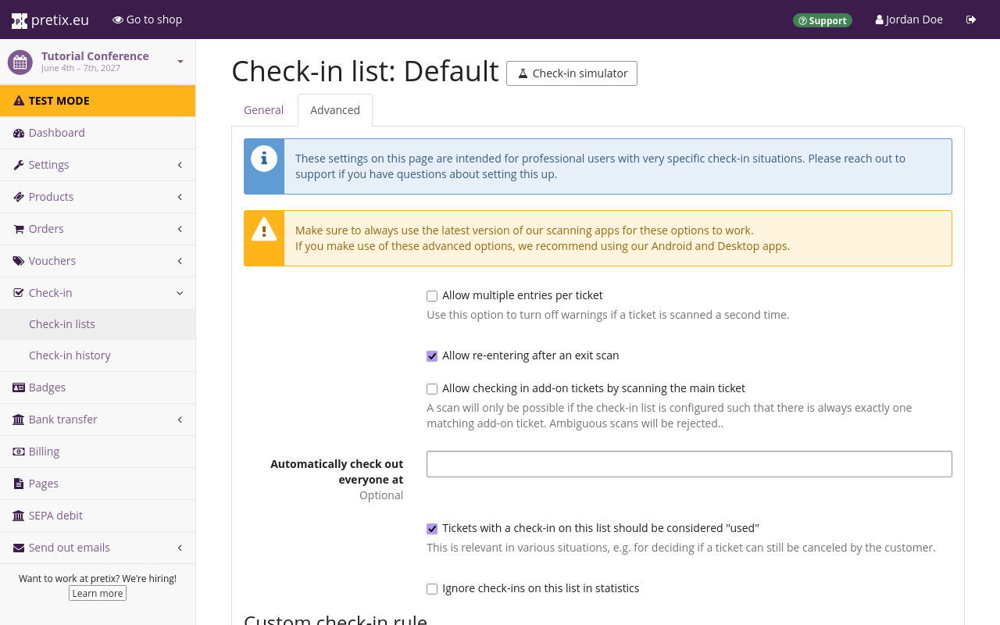
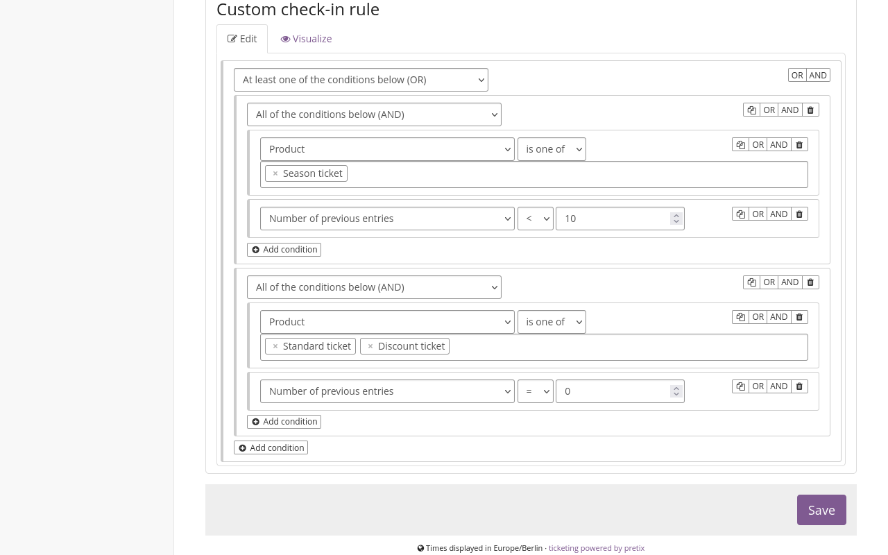
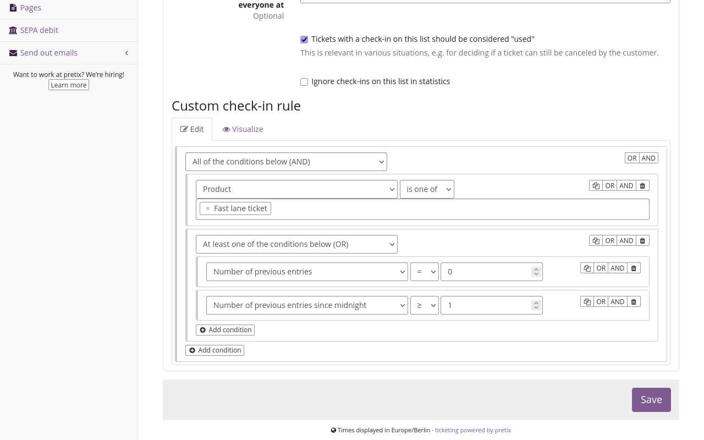
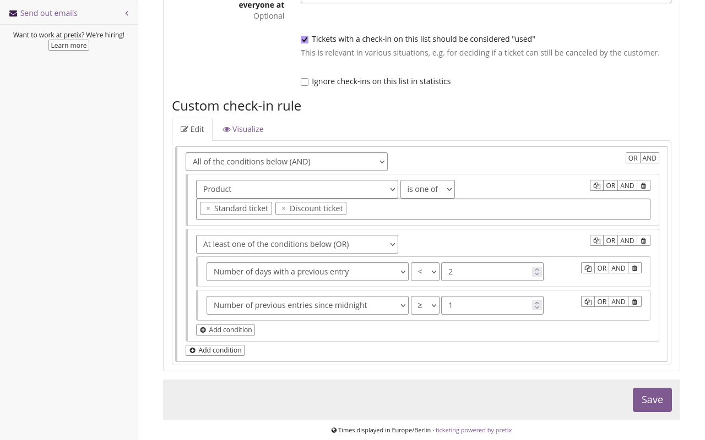
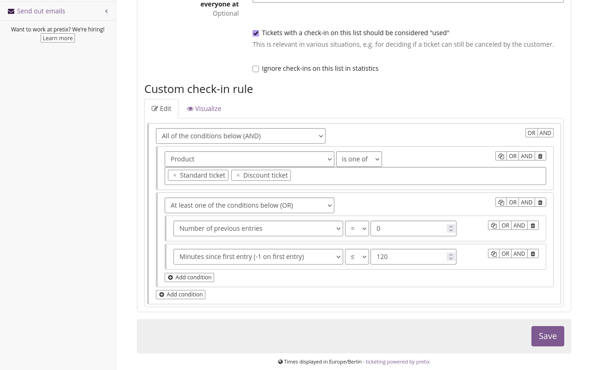
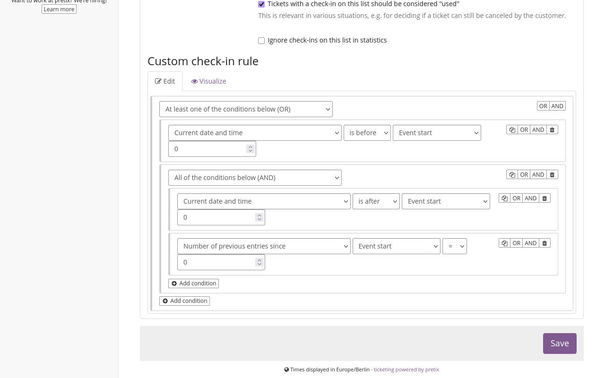

# Custom check-in rules

This article explains how to set up custom check-in rules. 
A custom check-in rule is always specific to one check-in list. 
You can use custom check-in rules to place restrictions on the validity of tickets based on time, number of previous entries, ticket type, gate, and other conditions. 
pretixSCAN will interpret these  rules when scanning the ticket and arrive at the correct result automatically. 

## Prerequisites

This article assumes that you have read [check-in lists](check-in-lists.md) and set up one or more basic check-in lists. 
A basic understanding of predicate logic is helpful. 
If the proposition `∀xP(x)` is meaningless to you, ask a philosopher, a linguist, an electrical engineer, or a programmer.
Alternatively, contact our support. 
Do **not** ask a Sherlock Holmes fan. 
They do not know the difference between induction and deduction. 

## General usage

In order to add custom rules to a check-in list, navigate to :navpath:Your event → :fa3-check-square-o: Check-in:. 
Click the change button :btn-icon:fa3-wrench:: next to the check-in list you want to edit. 

By default, pretixSCAN will recognize any ticket on the check-in list as valid as long as the ticket has been paid for and either the ticket has not been scanned before. 
The app will also recognize the ticket as valid if it has been scanned and then scanned for exit, meaning the entry status is `absent`. 
The exact behavior depends on your settings on the :btn:General: and :btn:Advanced: tabs on this page. 

If you want to place additional restrictions on a ticket for pretixSCAN to recognize it as valid, set up a custom check-in rule. 
In order to do so, under "Custom check-in rule", on the :btn-icon:fa3-edit: Edit: tab, click the :btn-icon:fa3-plus-circle: Add condition: button. 
A dropdown menu appears, listing types of conditions. 

### Adding a simple condition 

All conditions **except** `All of the conditions below (AND)` and `At least one of the conditions below (OR)` are simple conditions. 
Depending on your use case, you may only need a single one of these simple conditions for your custom check-in rule. 
If you need to set up more than one condition, then you need to organize these conditions using [AND- and OR-conditions](custom.md#organizing-conditions-with-and--and-or-brackets). 

Select a condition from the dropdown menu, for instance, `Current day of the week (1 = Monday, 7 = Sunday)`. 
The page now displays an additional dropdown menu listing mathematical symbols for "equals", "greater than", "smaller than or equal to" and so on. 
Select a symbol, for example, `<`. 
The page now displays an additional field in which you can enter a number. 
Enter a number, for example, `6`. 
Click the :btn:Save: button. 

If you set up a condition as described in the example, then pretixSCAN will only recognize a ticket as valid if the current day of the week is less than 6, or in other words, only Monday through Friday. 
pretixSCAN will reject tickets scanned on Saturday or Sunday. 

You can remove a simple condition by clicking the :btn-icon:fa3-trash:: delete button. 
You can duplicate it by clicking the :btn-icon:fa3-copy:: clone button. 

### Organizing conditions with AND- and OR-brackets

The most important types of conditions are `All of the conditions below (AND)` and `At least one of the conditions below (OR)`. 
These conditions are special because they allow you to organize conditions into a complex logic for the check-in. 
Adding one of these two conditions creates an AND-bracket or an OR-bracket to which you can add more conditions. 

If you select `All of the conditions below (AND)` from the dropdown menu and add conditions to the resulting AND-bracket, then all of those conditions must be fulfilled for pretixSCAN to recognize the ticket as valid. 

If you select `At least one of the conditions below (OR)` and add conditions to the resulting OR-bracket, then at least one of those conditions must be fulfilled for pretixSCAN to recognize the ticket as valid. 
If multiple or even all conditions within the OR-bracket are fulfilled, then pretixSCAN will still recognize the ticket as valid. 

This may be counter-intuitive. 
The condition `At least one of the conditions below (OR)` represents an [inclusive or](https://en.wikipedia.org/wiki/Logical_disjunction). 
This is distinct from an [exclusive or](https://en.wikipedia.org/wiki/Exclusive_or), also known as XOR ("either one or the other"). 
The custom check-in rule feature does not offer an "exclusive or" condition because its use would be very limited. 

You can create an AND- or an OR-bracket around an existing condition by clicking :btn:OR: or :btn:AND: next to the condition. 
When hovering the mouse over nested brackets, the website will highlight AND-brackets in red, OR-brackets in green, and other conditions in purple. 

You can remove an AND- or OR-bracket **without** removing its contents by clicking the :btn-icon:fa3-cut:: cut button next to it. 
You can remove it **along with all rules nested within it** by clicking the :btn-icon:fa3-trash:: delete button. 
You can duplicate it along with all rules nested within it by clicking the :btn-icon:fa3-copy:: clone button. 

### Allowing multiple entries 

By default, pretixSCAN will only recognize a ticket as valid **once** if it has not been checked out in the meantime. 
If you set up custom check-in rules that allow tickets to be used multiple times, then you also need to check the box next to "Allow multiple entries per ticket" further up on the same page. 

### Setting conditions specific to products or variations 

Whenever you set up a custom check-in rule using the condition "Product" or "Product variations", then you need to cover all products or product variations on the check-in list in that rule. 

For illustrative purposes, assume you have a check-in list called "Default" containing the products "Standard ticket" and "Discount ticket". 
You set up a custom check-in rule with the condition `Product` `is one of` `Standard ticket`. 
The page will now display the following infobox: 

> Your rule always filters by product or variation, but the following products or variations are not contained in any of your rule parts so people with these tickets will not get in: 
> 
> - Discount ticket. 
> 
> Please double-check if this was intentional. 

If you want the same conditions to apply to all products, add all remaining products to the condition you have already set up. 
Click the field that already lists a product and select all products that are on this check-in list from the dropdown menu. 

If you want different conditions to apply to the other products, set up an OR-bracket at the base level. 
Add an AND-bracket within that OR-bracket. 
Add the following condition within the AND-bracket: `Product` `is one of` and then select all remaining products on the check-in list. 
Add another simple condition of your choosing to the end-bracket. 

As soon as the custom check-in rule mentions every product on the check-in list at least once, the infobox will disappear. 
pretixSCAN will not reject products outright anymore, but will recognize them as valid or invalid depending on the rule you set up. 

### Visualizing rules 

Visualizing rules can help you better understand the logic you set up. 
It aids you in comprehending the possible conditional paths a ticket scan can take. 

After setting up your check-in rule, open the :btn-icon:fa3-eye: Visualize: tab. 
This tab displays your custom check-in rule as a flowchart. 
OR-brackets take the shape of branching paths. 
AND-brackets are listed one after the other on the same path. 
All paths end in a green :fa3-check-circle: checkmark, representing a successful validation. 

If you want a full-screen view of the visualization, hover the mouse over the flowchart and click the :fa3-window-maximize: maximize button on the right. 

You cannot make any changes to the visualization itself. 
If you want to make any further changes to your rule, click the btn-icon:fa3-edit: Edit:. 

### Date and time tolerances 

The condition`Current date and time` allows you to set tolerances. 
This section explains how those tolerances work. 

A tolerance always extends to the opposite direction of the restriction you set. 
The deciding factor is the selection you make in the second dropdown menu: `is before` or `is after`. 
Assume, for example, that you select `Current date and time`, then `is after`, then `Event start` and set a tolerance of `10`. 
In this case, attendees will be admitted up to ten minutes **before** the event has started. 

Assume, for example, that you select `Current date and time`, then `is before`, then `Event start` and set a tolerance of `10`. 
In this case, attendees will be admitted up to ten minutes **after** the event has started. 

If you enter a tolerance of `0`, then pretixSCAN will recognize tickets in the exact time frame you define. 

## Applications 

This section guides you through some useful applications of custom check-in rules. 

### Allowing a specific number of entries per ticket 

This section explains how to set up a custom check-in rule to allow a certain number of entries per ticket. 
Check the box next to "Allow multiple entries per ticket". 

Create an AND-bracket and add a condition within that bracket. 
Select `Product`, then `is one of`, and then choose the products in question. 
Add another condition, select `Number of previous entries` and then `<`.
Enter the number of total entries you want to allow, for instance, `10`. 

If your check-in list also contains products that the condition above does not include, then the page will now display an information box listing those products. 
The logic now only allows entry for one type of product. 

In order to solve this problem, you need to add conditions that include the other tickets. 
Click the :btn:OR: button in the top right. 
This creates an OR-bracket around the conditions you previously created. 

Click the :btn-icon:fa3-plus-circle: Add condition: button located within the OR-bracket, but not within the AND-bracket. 
Select `All of the conditions below (AND)` and add another condition directly below. 
Select `Product`, then `is one of`, and then choose those products that the rule above does not cover. 
Add another condition immediately below. 
Select `Number of previous entries`, then `=`, and then `0`.

With the setup in the screenshot, pretixSCAN will recognize the product "Season ticket" as valid as long as it has been used to enter less than ten times. 
This allows up to ten uses of the ticket. 
pretixSCAN will recognize the products "Standard ticket" and "Discount ticket" if they have been used 0 times, so only once in total. 

### Allowing unlimited entries on a single day 

This section explains how to set up a custom check-in rule to allow a certain number of entries per ticket. 
Check the box next to "Allow multiple entries per ticket". 

Create an AND-bracket and add a condition within that bracket. 
Select `Product`, then `is one of`, and then choose the products in question. 
Add an OR-bracket below. 
Add a condition within the OR-bracket, select `Number of previous entries`, then `=`, and then `0`. 
Add another condition within the OR-bracket, select `Number of previous entries since midnight`, then `≥`, and then `1`. 

With the setup in the screenshot, pretixSCAN will recognize a product if it is being used for the first time, or if it has been used previously on the same day. 
This allows for unlimited entries on a singular calendar day of the ticket holder's choosing. 

### Allowing entries on a specific number of days 

This section explains how to set up a custom check-in rule to allow entry on any specific number of days. 
Check the box next to "Allow multiple entries per ticket". 

Create an AND-bracket and add a condition within that bracket. 
Select `Product`, then `is one of`, and then choose the products in question. 
Add an OR-bracket below. 

Add a condition within the OR-bracket, select `Number of days with a previous entry`, then `<`, and select the number of days on which you want to allow entry. 
For instance, if you want to allow entry on any two days, select `2`. 
Add another condition within the OR-bracket, select `Number of previous entries since midnight`, then `≥`, and then `1`. 

With this setup, the ticket holder can enter as many times as they like, but only on two days of the event. 

### Setting a minimum time between entries 

This section explains how to set up a custom check-in rule to allow unlimited entries if a certain period of time has passed between entries. 
Check the box next to "Allow multiple entries per ticket". 

Create an AND-bracket and add a condition within that bracket. 
Select `Product`, then `is one of`, and then choose the products in question. 
Add an OR-bracket below. 
Add a condition within the OR-bracket, select `Number of previous entries`, then `=`, and then `0`. 
Add another condition within the OR-bracket, select `Minutes since last entry (-1 on first entry)`, and then `>`

Enter the number of minutes for the minimum period of time that must pass between entries. 
For instance, if you want to allow entry after at least 2 hours, select `120`. 

With this setup, the ticket holder can enter as many times as they like, but only if 120 minutes or more have passed since the previous scan. 

### Allow entries for a specific time span 

This section explains how to set up a custom check-in rule to allow entries for a limited period of time after the first entry. 
Check the box next to "Allow multiple entries per ticket". 

Create an OR-bracket and add a condition within that bracket. 
Select `Product`, then `is one of`, and then choose the products in question. 
Add another condition, select `Minutes since last first (-1 on first entry)`, and then `≤`

Enter the number of minutes for which you want to allow entry after the ticket holder has had their ticket validated for the first time. 
For instance, if you want to allow entry for 2 hours, select `120`. 

With this setup, the ticket holder can enter as many times as they like for 120 minutes after the first successful scan. 

### Allow unlimited entries only before the actual event 

This section explains how to set up a custom check-in rule to allow unlimited entries **before** the start of the event, but only limited entries during the event itself. 
This can be useful if you want attendees to be able to access the venue while the event is being set up. 
Check the box next to "Allow multiple entries per ticket". 

Create an OR-bracket and add a condition within that bracket. 
Select `Current date and time`, then `is before`, then `Event start`, and enter a tolerance of `0`. 
Create an AND-bracket below and add a new condition within that bracket. 
Select `Current date and time`, then `is after`, then `Event start`, and enter a tolerance of `0`. 
Create another condition within the AND-bracket. 
Select `Number of previous entries since`, then `Event start`, then `=` and enter a tolerance of `0`. 

With this setup, ticket holders will be able to enter however often they want before the start of the event, but only once after the event has started. 