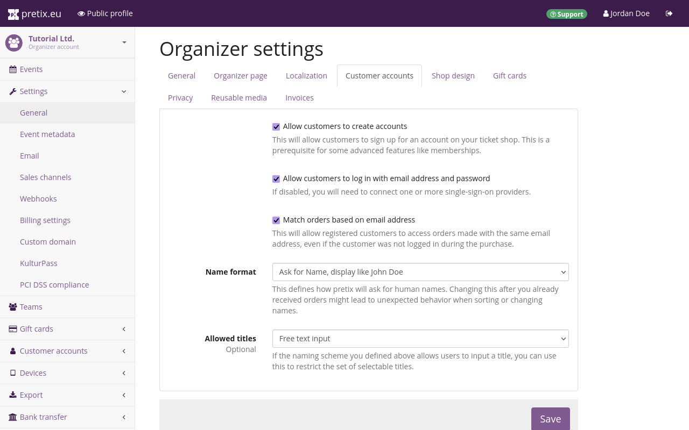
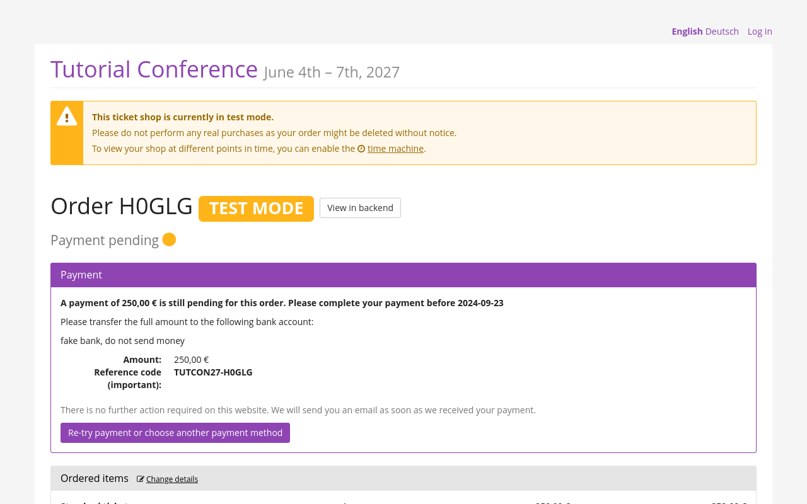
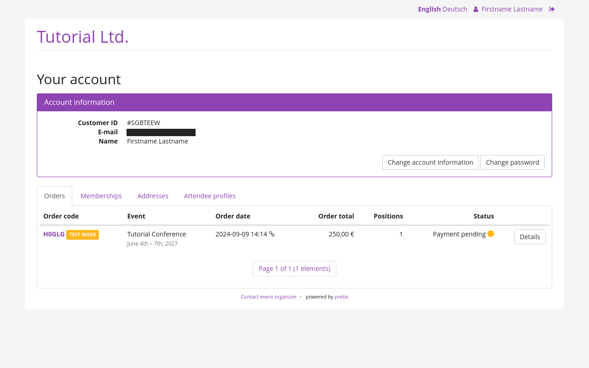

# Customer accounts 

pretix allows your customers to use your ticket shop without having to create an account. 
However, pretix also lets you enable customer accounts. 
Customer accounts have three advantages: 

First, they allow your customers to store their personal data so that they do not have to enter addresses and attendee information on every purchase. 
Second, they allow you to interact with customers through their personal accounts, and not just through individual orders. 
Third, they allow you to grant memberships to your customers, which can then be used for season passes, special members-only offers, and reusable media. 

!!! Note 
    Customer accounts and memberships are not the same thing. 
    Customer accounts are usually created by the customers themselves. 
    Activating customer accounts is a prerequisite for access to the memberships feature. 
    Having access to a customer account is a prerequisite for getting access to a membership. 

    Memberships are usually assigned to a customer account with the purchase of a product and can then be used for exclusive discounts and access to products. 

This article tells you how to enable and manage customer accounts. 

## Prerequisites

Customer accounts are handled on the organizer level. 
You need access to an organizer account if you want to enable customer accounts. 

## General usage

Customer accounts are always tied to the organizer account. 
Once a customer has created an account while placing an order for one of your events, they will be able to log in and place an order through the same account for all events managed by the same organizer account. 
Creating a customer account for a purchase at one organizer does not create a customer account for a transaction with any other organizer. 

It is not possible to activate or deactivate customer accounts on a per-event basis. 
It is also not possible to force customers to create an account. 
The option to place an order as a guest is always available. 

 

If you want to allow your customers to create accounts, navigate to :navpath:Your organizer → Settings → General:, open the :btn:Customer accounts: tab, and check the box next to "Allow customers to create accounts". 

Checking that box makes another box appear that is checked by default: "Allow customers to log in with email address and password". 
Keep this box checked if you want customers to log in to your pretix ticket shop directly. 
Uncheck it if you want them to log in exclusively via an external single sign-on service. 

By default, customers will be able to view and edit orders placed with the same customer account. 
If you check the box next to "Match orders based on email address", they will also be able to view and edit any orders that have been placed with the same email address without logging in. 

### Customer accounts from the customers' perspective 

From your customers' perspective, a pretix ticket shop is perfectly usable without creating an account. 
Giving your customers the option to create an account makes sense if you expect them to place orders repeatedly and to access and change their memberships, addresses, attendee profiles, account information, and password after placing an order. 

 

If a customer places an order without logging into a customer account or creating one, they receive an email with a URL. 
The URL points to a page on which they can make a payment, download their ticket, as well as change the details of their orders, shipping, and personal information. 
The URL is specific to that order. 

 

If the customer creates an account and then logs into that account, they will see an overview of their orders which they can view and edit individually just like described above. 
They will also be able to view and edit their memberships, addresses, attendee profiles, account information, and password. 

### Managing customer accounts 

Navigate to :navpath:Your organizer → :fa3-user: Customer accounts → Customers:. 
This menu option will only appear if customer accounts are enabled in the organizer account settings. 
The "Customers" page displays a list of all customer accounts known to your organizer account with their "Customer ID", email address, name, and optional "External identifier". 

The page gives you the option to search and filter customer accounts as well as to create a new one with the :btn-icon:fa3-plus: Create a new customer: button. 
pretix will automatically generate a "Customer ID" for every customer account. 
You can change this customer ID manually during creation. 
It serves as the account's unique identifier and cannot be changed after the account has been created. 
The identifier may only contain letters, numbers, dots, dashes, and underscores. 
It must start and end with a letter or number. 

The only other mandatory piece of information for a customer account is the associated email address. 

The customer can only log in to their account if the boxes next to "Account active" **and** "Verified email address" are checked. 
The "Verified email address" box will be checked automatically as soon as the customer clicks the link in the verification email or password reset email. 
This box can also be checked or unchecked manually. 
If the customer attempts to log in while this box is unchecked, they will be prompted to either click the verification link or to reset their password. 

If you already have customer accounts in a different software and you need to connect them to the pretix customer accounts unambiguously, then it makes sense to fill the "External identifier" field with the unique identifier of the account from the other software. 
If you want to import, export, or sync data between pretix and another software, then it makes sense to fill this field automatically using an integration with the pretix API. 
Consult the [pretix REST API documentation](https://docs.pretix.eu/en/latest/api/resources/customers.html) for further information. 

Entries in the "Notes" field will only be visible to you and your team; they will not be visible to the customer. 

### Single Sign-On (SSO) 

"Single sign-on" or SSO refers to a setup that allows users to sign in to multiple systems (e.g. apps or websites) with a single set of login data. 
It makes sense to implement SSO if pretix is just one of multiple applications you are planning for your customers to use. 
This has the advantage of unburdening your customers from memorizing the difference between your various systems and keeping track of different usernames and passwords for them. 
With an SSO setup, your customers can use the same credentials for every interaction with your company or your brand. 

You can use pretix as an SSO provider. 
Customers will be able to create a pretix account and then use that account for all other applications you connect as SSO clients with pretix serving as the source of truth. 

You can also use pretix as the SSO client. 
If you are already using a different SSO provider that serves as the source of truth for your applications, you can connect pretix as an SSO client. 
This means that customers will be able to log into your pretix shop and make purchases there using your existing SSO setup. 

All SSO support for customer accounts in pretix is currently built on the OpenID Connect standard, a modern and widely accepted standard for SSO in all industries.

#### Using pretix as an SSO provider 

If you want to use pretix as an SSO provider, navigate to :navpath:Your organizer → :fa3-user: Customer accounts → SSO clients: and click the :btn-icon:fa3-plus: Create a new SSO client: button. 

The checkbox next to "Active" is enabled by default. 
Disable it if you want to disable SSO integration with the client in question. 

Enter an informative and unambiguous name in the "Application name" field, for example the name of the application or website for which you want to use pretix as an SSO provider. 

Under "Client type", choose "Confidential" if the server-side application is able to store a secret that will be inaccessible to end users.
For a client-side application such as a typical mobile app, choose "Public".

Your choice for the "Grant type" depends on the implementation of the OpenID Connect standard used by the application you are connecting. 

Enter one or multiple URIs that the user might be redirected to after the successful or failed login into the "Redirection URIs" field. 

Under "Allowed access scopes", check the boxes for which you want to grant access to the application. 

Once you click the :btn:Save: button, the client secret will be displayed at the top of the page. 
The client secret will only be displayed once. 
Copy and paste it to your application. 
You will also need the "Client ID" which will be displayed in a new field underneath "Application name". 

If you need a new client secret, check the box next to "Invalidate old client secret and generate a new one" and click the :btn:Save: button. 
The old client secret will not be usable anymore. 
The new client secret will be displayed in a green box at the top of the page. 

Beyond the client ID and secret, the service you are connecting is also going to need your issuer URI. 
If you are using pretix Hosted without a custom domain, your issuer URI will be the address of your organizer's public profile **without** the final slash. 
For instance, the issuer URI of our Tutorial Ltd. with the organizer short form "tut" will be [https://pretix.eu/tut](https://pretix.eu/tut). 

If you are using a custom domain, then your issuer URI will be the custom domain preceded by "https://". 
For instance, if your custom domain is tickets.mycompany.net, then your issuer URI will be [https://tickets.mycompany.net](https://tickets.mycompany.net). 

#### Technical details for using pretix as an SSO provider

pretix implements the [OpenID Connect Core 1.0](https://openid.net/specs/openid-connect-core-1_0.html) specification. 
A few optional parts that have no use within pretix are excluded. 
For example, encrypted tokens, offline access, refresh tokens, and passing request parameters as JWTs are not supported. 

pretix implements the provider metadata section from [OpenID Connect Discovery 1.0](https://openid.net/specs/openid-connect-discovery-1_0.html). 
You can find the endpoint relative to the issuer URI as described above, for example at https://pretix.eu/demo/.well-known/openid-configuration.

All three OpenID Connect Core flows are implemented:

 - Authorization Code Flow (response type `code`)
 - Implicit Flow (response types `id_token token` and `id_token`)
 - Hybrid Flow (response types `code id_token`, `code id_token token`, and `code token`)

The response modes `query` and `fragment` are implemented. 

pretix offers the following scopes: `openid`, `profile`, `email`, `phone`. 

As well as the following standardized claims: `iss`, `aud`, `exp`, `iat`, `auth_time`, `nonce`, `c_hash`, `at_hash`, `sub`, `locale`, `name`, `given_name`, `family_name`, `middle_name`, `nickname`, `email`, `email_verified`, `phone_number`.

The various endpoints are located relative to the issuer URI as described above:

 - Authorization: `<issuer>/oauth2/v1/authorize`
 - Token: `<issuer>/oauth2/v1/token`
 - User info: `<issuer>/oauth2/v1/userinfo`
 - Keys: `<issuer>/oauth2/v1/keys`

They follow the OpenID Connect and OAuth specifications without any special behavior. 
Please refer to those specifications for further information. 

#### Using pretix as an SSO client 

If you want to use pretix as an SSO client, navigate to :navpath:Your organizer → :fa3-user: Customer accounts → SSO providers: and click the :btn-icon:fa3-plus: Create a new SSO provider: button. 

Choose a "Provider name" and "Login button label". 
The "Provider name" is used to refer to the provider internally in the pretix backend. 
The "Login button label" is used as the label for the login button that is displayed to customers in your shop. 
Under "Single-sign-on method", choose "OpenID Connect". 
Fill out the fields that are displayed after you selected "OpenID Connect" with the information from your SSO provider. 

If you want your customers to log in exclusively via SSO and not create accounts via pretix directly, navigate to :navpath:Your organizer → Settings → General:, open the :btn:Customer accounts: tab, and uncheck the box next to "Allow customers to log in with email address and password". 

#### Technical details for using pretix as an SSO client

In order to use an SSO provider with pretix, it has to fulfill the following requirements:

 - Implementation according to [OpenID Connect Core 1.0](https://openid.net/specs/openid-connect-core-1_0.html).
 - Published meta-data document at `<issuer>/.well-known/openid-configuration` as specified in [OpenID Connect Discovery 1.0](https://openid.net/specs/openid-connect-discovery-1_0.html).
 - Support for Authorization code flow (`response_type=code`) with `response_mode=query`.
 - Support for client authentication using client ID and client secret and without public key cryptography. 

#### Using GitHub as an SSO provider for pretix 

If you want to use GitHub as an SSO provider for pretix, follow the instructions on [authorizing OAuth apps](https://docs.github.com/en/apps/oauth-apps/building-oauth-apps/authorizing-oauth-apps) in the GitHub documentation. 

While creating a "New OAuth App" in GitHub, 
3. Fill in the details:
   - **Application name**: Something your users will recognize, like "MyConference Tickets"
   - **Homepage URL**: Your main website (e.g., `https://myconference.com`)
   - **Application description**: A brief explanation, like "Ticket purchases for MyConference"
   - **Authorization callback URL**: This is critical! Use:
     ```
     https://your-pretix-domain.com/your-organizer/oauth2/v1/callback
     ```
     Replace `your-pretix-domain.com` with your actual domain and `your-organizer` with your pretix organizer slug.

4. Click "Register application"
5. On the next screen, note your **Client ID**
6. Generate a new client secret and copy it immediately (you won't be able to see it again)

##### Configure GitHub in pretix

1. In your pretix admin, go to **Your organizer → Customer accounts → SSO providers**
2. Click "Create a new SSO provider"
3. Complete the form:
   - **Provider name**: `GitHub` (internal reference name)
   - **Login button label**: `Sign in with GitHub` (visible to customers)
   - **Single-sign-on method**: `OpenID Connect`
   - **Issuer URL**: `https://github.com`
   - **Client ID**: Paste from GitHub (looks like `a1b2c3d4e5f6g7h8i9j0`)
   - **Client secret**: Paste from GitHub (looks like `a1b2c3d4e5f6g7h8i9j0k1l2m3n4o5p6q7r8s9`)
   - **Scope**: `openid user:email` (to get verified email addresses)
   - Leave other fields with default values
   - **Email address claim**: `email`
   - **Identity claim**: `sub`
   - First/last name claims can be left empty as GitHub doesn't consistently provide these

4. Save your changes

#### Using Google Accounts as an SSO provider for pretix 

If you want to use Google as an SSO provider for pretix, follow the instructions on [OpenID Connect](https://developers.google.com/identity/openid-connect/openid-connect) in the Google documentation. 
Open the [Google Cloud backend](https://console.cloud.google.com/auth/clients) and create a new client. 
During the creation process, under "Application type", select "Web application". 
Note down the "Client ID" and "Client secret" so that you can enter them in the pretix backend later. 

Open the pretix backend and navigate to :navpath:Your organizer → :fa3-user: Customer accounts → SSO providers: and click the :btn-icon:fa3-plus: Create a new SSO provider: button. 
Choose a "Provider name" such as "Google" and a "Login button label" such as "Sign in with Google". 
Fill in the following details: 

 - **Single-sign-on method**: `OpenID Connect`
 - **Base URL**: `https://accounts.google.com`
 - **Client ID**: Insert the ID you noted down during the client creation process in the Google backend. 
 - **Client secret**: Insert the secret you noted down during the client creation process in the Google backend. 

For the next three fields, consult the documentation linked above under [technical details](customer-accounts.md#technical-details-for-using-pretix-as-an-sso-client). 
An example configuration might look like this: 

 - **Scope**: `openid email profile`
 - **Email address claim**: `email`
 - **Identity claim**: `sub`

Click the :btn:Save: button. 
You will be taken back to the overview page titled "SSO providers". 
Click the "Google" entry in the list. 
Copy the value from the "Redirection URL" field. 
It will look similar to, but **not exactly** like `https://pretix.eu/tut/account/login/199/return`. 
Open the Google backend, edit your client, add a URL, paste the value into the field, and save the settings. 

#### Using Wikimedia as an SSO provider for pretix 

If you want to use Google as an SSO provider for pretix, follow the instructions on [OpenID Connect](https://developers.google.com/identity/openid-connect/openid-connect) in the Google documentation. 
Open the [Google Cloud backend](https://console.cloud.google.com/auth/clients) and create a new client. 
 - **Application name**: Your event or organization name
 - **Consumer version**: 1.0 
 - **Application description**: Brief explanation of your use case
 - **Contact email**: Your support email
 - **Public RSA key**: Leave blank (not needed)
 - **Applicable project**: Usually "all" is appropriate
 - **Permissions**: Basic rights and High-volume editing (minimum required)
 - **Grant types**: `authorization_code`

3. Accept the developer agreement and submit
4. After approval (which may take some time), note your **Consumer Key** and **Consumer Secret**

##### Configure Wikimedia in pretix

1. In pretix, go to **Your organizer → Customer accounts → SSO providers**
2. Click "Create a new SSO provider"
3. Fill in the form:
 - **Provider name**: `Wikimedia`
 - **Login button label**: `Log in with Wikimedia`
 - **Single-sign-on method**: `OpenID Connect`

 - **Client ID**: Your Consumer Key (looks like `a12b34c56d78e90f1a2b3c4d5e6f7g8h`)
 - **Client secret**: Your Consumer Secret (looks like `a12b34c56d78e90f1a2b3c4d5e6f7g8h9i0j1k2l3m4n5o6p7q8r9`)
 - **Scope**: `openid profile email`
 - **Email field**: `email`
 - **User ID field**: `sub`

4. Save your settings

#### Testing the login flow

Always test your SSO setup before going live:

1. Open your pretix shop in an incognito/private browser window
2. Go to any event and start the checkout process
3. When prompted to log in or create an account, you should see buttons for your configured providers
4. Click each button and verify you're correctly redirected to the login page
5. After logging in, you should be sent back to pretix with your account connected

#### Troubleshooting common issues

If your setup doesn't work, check these common problems:

##### The redirect doesn't work (OAuth error)

**Problem**: After login, you get an error about invalid redirect or client.

**Solution**: 
- Double-check that the callback URL in your OAuth provider settings **exactly** matches what pretix expects
- The URL should be: `https://your-pretix-domain.com/your-organizer/oauth2/v1/callback`
- Be careful about trailing slashes and typos

##### Missing user information

**Problem**: Login works but name or email information isn't passed to pretix.

**Solution**:
- Verify you've requested the correct scopes:
  - GitHub: `openid user:email`
  - Google: `openid email profile`
  - Wikimedia: `openid profile email`
- Check the claim mappings in your SSO provider configuration

##### Users can't log in with SSO

**Problem**: The login buttons don't appear or don't work.

**Solution**:
- Confirm your OAuth client is active/published (Google requires publishing the OAuth consent screen)
- Make sure your callback domain has HTTPS properly configured
- Check browser console for JavaScript errors
- Verify your pretix installation is publicly accessible

#### Advanced tips

##### Looking professional with branded buttons

Customers respond better to a polished, branded experience:

- Use clear, action-oriented button text like "Continue with Google" instead of just "Google"
- If you have multiple SSO options, list the most popular one first
- Consider custom button styling to match your event branding

##### Security considerations

Implement these best practices for production use:

- Regularly audit your OAuth applications and rotate client secrets annually
- Only request the minimum necessary scopes
- Consider implementing a backup login method in case an SSO provider has an outage
- For high-security events, remember that SSO security is only as strong as the provider's security

##### When to use SSO-only login

Disabling password login in favor of SSO-only works best when:

1. Your audience primarily uses one of your SSO providers already
2. You've set up multiple SSO options to accommodate different users
3. You want to enforce stronger authentication than password-based login

To switch to SSO-only mode:
1. Go to **Your organizer → Settings → General → Customer accounts**
2. Uncheck "Allow customers to log in with email address and password"

#### Finding SSO Settings in pretix

If you're new to pretix and having trouble locating the SSO configuration pages, follow these steps:

##### Accessing Customer Account Settings

1. Log in to your pretix admin panel with your organizer account
2. From the main dashboard, locate and click on your organizer name in the left sidebar
3. In the organizer menu, click on the settings icon (⚙️) or the "Settings" option
4. In the Settings page, locate and click on the "Customer accounts" tab
5. Ensure the "Allow customers to create accounts" checkbox is enabled
6. Save your changes if you made any modifications

##### Accessing SSO Provider Configuration

1. Return to your organizer dashboard
2. Look for the "Customer accounts" menu item in the left sidebar (it has a user icon 👤)
   - This option only appears after you've enabled customer accounts in the settings
3. Click on "Customer accounts" to expand the submenu
4. Select "SSO providers" from the submenu
5. You'll now see the SSO providers management page where you can add, edit, or delete providers

If you don't see these options:
- Verify you have sufficient administrative permissions
- Make sure customer accounts are enabled
- Check that you're using a pretix version that supports SSO (4.0 or newer)

#### Complete Client-Side Testing Guide

After setting up your SSO providers, it's crucial to thoroughly test the experience from your customers' perspective. Here's a comprehensive testing plan:

##### Basic Login Flow Testing

1. **Open an incognito/private browser window**
   - This ensures you're starting with a clean session without existing cookies or login data

2. **Navigate to your pretix shop front-end**
   - Go to: `https://your-pretix-domain.com/your-organizer/`
   - Or go to any specific event page: `https://your-pretix-domain.com/your-organizer/your-event/`

3. **Start the checkout process**
   - Select an event if you're on the organizer page
   - Choose a ticket/product 
   - Click "Add to cart" and then proceed to checkout

4. **At the customer information step**
   - You should see login options at the top of the form
   - Look for the SSO buttons you configured (e.g., "Continue with Google")

5. **Click on one of the SSO provider buttons**
   - You should be redirected to the provider's login page
   - For GitHub: GitHub's login page should appear
   - For Google: Google's account selection and/or login page should appear
   - For Wikimedia: Wikimedia's login screen should appear

6. **Authenticate with the provider**
   - Enter your credentials for that service
   - Approve any permission requests

7. **Verify the redirect back to pretix**
   - After successful authentication, you should be automatically redirected back to pretix
   - You should now be logged in
   - The checkout form may be partially filled with information from your SSO provider

8. **Complete the purchase process**
   - Continue with the checkout to ensure everything works end-to-end

##### Testing Edge Cases

Test these scenarios to ensure robust SSO implementation:

1. **New vs. Existing Customer**
   - Test with a social account that has never been used with your pretix shop
   - Test with a social account that has been used before
   - Test with a social account whose email matches an existing customer account

2. **Account Linking**
   - Create an account using email/password
   - Then try logging in with SSO using the same email address
   - Verify the accounts are correctly linked

3. **Multiple SSO Providers**
   - If you have multiple SSO providers configured, test logging in with each one
   - Try using different SSO providers with the same email address

4. **Session Persistence**
   - Log in via SSO
   - Close the browser (not just the tab)
   - Return to your shop and see if the session persists as expected

5. **Mobile Testing**
   - Test the SSO flow on mobile devices
   - Verify the redirect works properly in mobile browsers

##### Verification Checklist

After completing a login, verify these important details:

- ✅ The user is properly authenticated
- ✅ The correct name appears in the account section (if available from the provider)
- ✅ The correct email is associated with the account
- ✅ Any previous orders are accessible if the account was linked
- ✅ The user can access their customer dashboard at `https://your-pretix-domain.com/your-organizer/customer/`

##### Troubleshooting During Testing

If you encounter issues during testing:

1. **Check browser console for errors**
   - Open developer tools (F12 or right-click > Inspect)
   - Look for error messages in the Console tab

2. **Examine the URL when errors occur**
   - Often, OAuth errors will appear in the URL parameters
   - Look for parameters like `error=` or `error_description=`

3. **Verify redirection**
   - Use browser developer tools to monitor network requests
   - Check if redirects are happening as expected
   - Look for 4xx or 5xx responses

4. **Test in multiple browsers**
   - Some issues might be browser-specific
   - Try at least Chrome, Firefox, and Safari

5. **Verify HTTPS**
   - OAuth redirects typically require secure connections
   - Make sure your SSL certificate is valid

By thoroughly testing all these scenarios, you'll ensure a smooth experience for your customers when they use SSO to access your pretix shop. 
