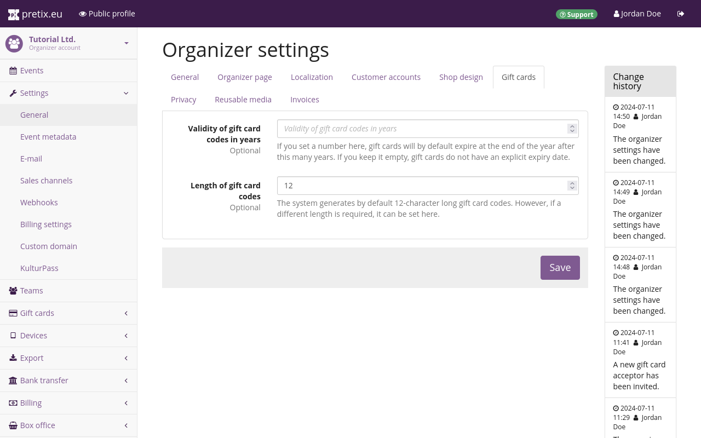
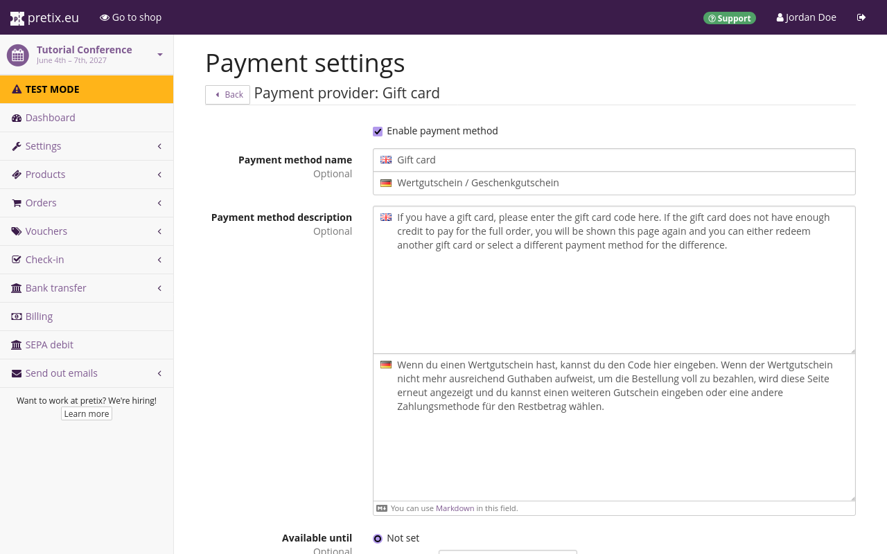
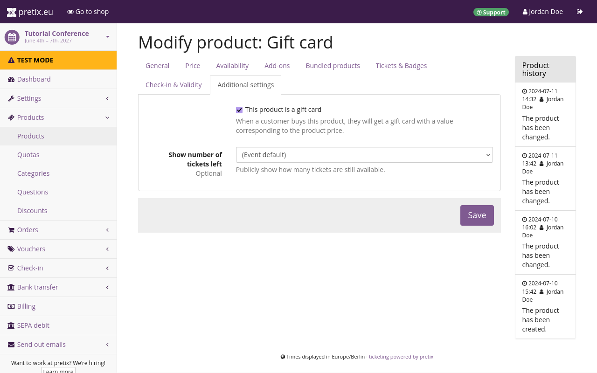
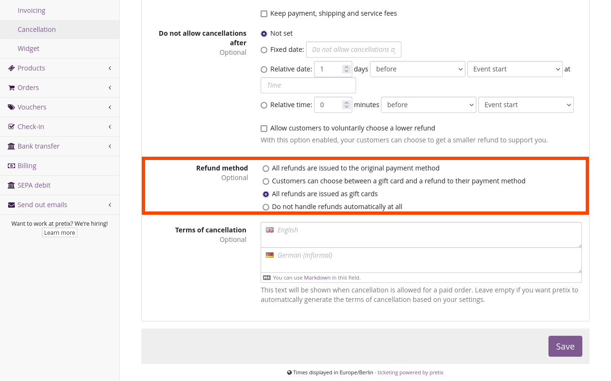
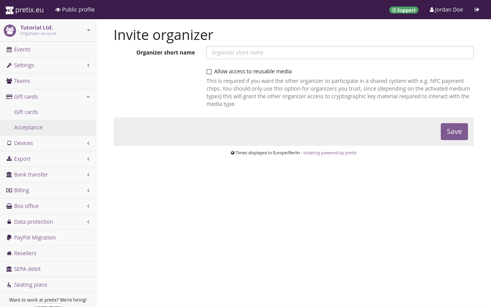

# Wertgutscheine

Wertgutscheine sind Produkte, die Sie in Ihren Shops verkaufen können.
Ihre Kund\*innen können sie dann als Zahlungsmethode beim Einkauf in Ihren Shops einsetzen.
Wertgutscheine fungieren als Zahlungsmethode und können wie jeder andere Zahlungsdienstleister aktiviert oder deaktiviert werden.
Der Unterschied zu anderen Produkten besteht lediglich darin, dass es für Wertgutscheine kein spezielles Plugin gibt, da sie eine Kernfunktionalität der pretix-Software darstellen.

Wertgutscheine unterscheiden sich von [Gutscheinen](vouchers.md).
Im Gegensatz zu Gutscheinen entsprechen Wertgutscheine immer einem festen Geldbetrag, der von der Gesamtsumme einer Bestellung abgezogen wird.
Wertgutscheine können nicht für einen Rabatt vom Wert gekaufter Produkte eingesetzt werden und eigenen sich deshalb nicht für Promotionaktionen.
Außerdem können Sie Wertgutscheine – anders als Gutscheine – bei verschiedenen Veranstaltungen und Veranstaltern eingesetzt werden und wirken sich nicht auf die Verfügbarkeit und die Sichtbarkeit bestimmter Produkte aus.

!!! Hinweis
    pretix behandelt Wertgutscheine als "Mehrzweckgutscheine" entsprechend der EU-Richtline 2016/1065 vom 27. Juni 2016.
    Das Erheben von Steuern auf den Verkauf von Wertgutscheinen wird von pretix nicht unterstützt.
    Stattdessen werden Steuern immer bei dem Kauf berechnet, für den der jeweilige Wertgutschein verwendet wird.

## Voraussetzungen

Damit Sie Wertgutscheine bei einer Veranstaltung als Zahlungsmethode einesetzen können, müssen Sie diese für die Veranstaltung aktivieren.
Wertgutscheine sind standardmäßig aktiviert.
Sollten sie nicht aktiviert sein, können Sie sie aktivieren, indem Sie zu :navpath:Ihre Veranstaltung → :fa3-wrench: Einstellungen → Zahlung: navigieren, auf den Button :btn-icon:fa3-gear:Einstellungen: neben "Wertgutscheine" klicken und das Kontrollkästchen neben "Zahlungsmethode aktivieren" oben auf der Seite aktivieren.

Der Verkauf von Wertgutscheinen erfolgt bei pretix ausschließlich mit einem Steuersatz von 0 %.
Die Umsatzsteuer wird auf den Einkauf erhoben, der mit dem Wertgutschein getätigt wird – nicht auf den Kauf des Wertgutscheins selbst.
Dies entspricht der steuerrechtlichen Regelung für Mehrzweckgutscheine in Deutschland und weiteren Ländern.

Bevor Sie einen Wertgutschein erstellen, müssen Sie eine Steuer-Regel mit einem Satz von 0 % anlegen.
Gehen Sie dazu wie folgt vor: Navigieren Sie zu :navpath:Ihre Veranstaltung → :fa3-wrench: Einstellungen → Steuer-Regeln:, klicken Sie auf den Button :btn-icon:fa3-plus:Neue Steuerregel erstellen:, setzen Sie das Feld "Steuersatz" auf 0,00 % und speichern Sie diese Regel unter einem eindeutigen Namen für Ihren internen Gebrauch.



## Allgemeine Verwendung

Standardmäßig sind Wertgutscheine unbefristet gültig; sie verfügen über 12-stellige Codes und werden ohne Einschränkungen als Zahlungsmethode für alle neu erstellten Veranstaltungen akzeptiert.
In den nächsten beiden Abschnitten erfahren Sie, wie Sie diese Einstellungen ändern können.

### Gültigkeitsdauer von Wertgutscheinen und Länge des Codes

Die allgemeinen Einstellungen für Wertgutscheine finden Sie auf Ihrer Verantalter-Seite.
Die Einstellungen auf der Veranstalter-Ebene gelten nur für Wertgutscheine, die Sie **nach** dem Speichern dieser Einstellungen ausstellen.
Sie gelten **nicht** rückwirkend für bereits erstellte Wertgutscheine.
Es ist deshalb empfehlenswert, dass Sie diesen Unterabschnitt zunächst lesen und Ihre Entscheidungen zu diesen Einstellungen zu treffen, bevor Sie Wertgutscheine verkaufen oder manuell ausstellen.

Navigieren Sie zu: :navpath:Ihr Veranstalter → :fa3-wrench: Einstellungen → Allgemein: und wechseln Sie zum Reiter "Wertgutscheine".
Auf dieser Seite können Sie die Einstellungen für Wertgutscheine auf Versanstalter-Ebene anpassen.
Im Feld "Gültigkeitsdauer von Wertgutschein-Codes in Jahren" können Sie festlegen, wie viele Jahre Ihre Wertgustscheine gültig sein sollen.
In dieses Feld können nur ganze Zahlen eingegeben werden.

Das genaue Ablaufdatum ist immer das Ende des Kalenderjahres, in dem die angegebene Laufzeit abläuft.
Wenn Sie beispielsweise die Zahl 1 in das Feld eingeben und dann im Jahr 2025 einen Wertgutschein erstellen, ist dieser bis zum 31.
Dezember 2026 um Mitternacht gültig.
Dieses Feld ist standardmäßig leer.
Mit dieser Einstellung sind Wertgutscheine unbegrenzt gültig.
Beim manuellen Ausstellen von Wertgutscheinen können Sie ein individuelles Ablaufdatum festlegen, das vor oder nach dem Ende des hier eingetragenen Zeitraums liegt.

!!! Warnung
    In vielen Rechtssystemen ist für Wertgutscheine eine Mindestgültigkeitsdauer von drei Jahren vorgeschrieben.
    Wir empfehlen Ihnen, sich juristisch beraten zu lassen, bevor Sie eine Gültigkeitsdauer für Wertgutscheine festlegen.

Auf dieser Seite können Sie außerdem die Länge der in Ihrem Shop erstellten Wertgutschein-Codes festlegen.
Die Standardlänge beträgt 12 Ziffern, das Minimum sind 6 Ziffern und das Maximum 64 Ziffern.
Wir empfehlen, die standardmäßig vorgegebene Länge von 12 Zeichen beizubehalten, sofern es keinen speziellen Grund gibt, diese zu ändern.

### Wertgutscheine als Zahlungsmethode einrichten

Wertgutscheine, die über Ihr Veranstalterkonto ausgestellt wurden, gelten für jedes Event, das von diesem Veranstalterkonto erstellt wurde.
Bei neu erstellten Events sind Wertgutscheine standardmäßig als Zahlungsmethode aktiviert.
In der Kund\*innenansicht Ihrer Shops ist die Option für die Zahlung mit Wertgutschein ausgeblendet, bis Sie über Ihr Veranstalterkonto den ersten Wertgutschein ausgestellt haben.

Zu den Einstellungen für Wertgutscheine als Zahlungsmethode gelangen Sie, indem Sie zu :navpath:Ihre Veranstaltung → :fa3-wrench: Einstellungen → Zahlung: navigieren und auf den Button :btn-icon:fa3-gear:Einstellungen: neben "Wertgutscheine" klicken.
Hier können Sie die Verfügbarkeit der Zahlungsmethode nach Datum, Zeitraum in Bezug auf die Veranstaltung, Verkaufskanal und Region einschränken, ebenso wie dies auch bei anderen Zahlungsmethoden möglich ist.

Wenn Sie für eine Veranstaltung Wertgutscheine als Zahlungsmittel nicht akzeptieren möchten, deaktivieren Sie bitte das Kontrollkästchen neben "Zahlungsmethode aktivieren" oben auf der Seite.
Beachten Sie bitte, dass diese Einstellungen auf Veranstaltungsebene gelten und Sie sie daher für jede Veranstaltung einzeln ändern müssen.

## Wege für das Ausstellen von Wertgutscheinen

Es gibt drei Wege, auf denen Sie Wertgutscheine für Ihre Kund\*innen ausstellen können: durch den Verkauf in Ihrem Shop  oder über pretixPOS, als Erstattung eines Kaufbetrags in Form eines Wertgutscheins sowie durch manuelles Ausstellen.
Diese Wege werden in den folgenden Abschnitten beschrieben.

### So erstellen Sie einen Wertgutschein für Ihren Shop

Wenn Sie in Ihrem Shop Wertgutscheine verkaufen möchten, erstellen Sie diese wie jedes andere Produkt.
Navigieren Sie zu :navpath:Ihre Veranstaltung → :fa3-ticket: Produkte: und klicken Sie auf den Button :btn-icon:fa3-plus:Neues Produkt erstellen:.
Wählen Sie als "Produktart" "Produkt ohne Eintrittsberechtigung" und als "Umsatzsteuer" eine Steuer-Regel von 0,00 % aus.

Klicken Sie auf :btn:"Speichern und mit weiteren Einstellungen fortfahren:" und wechseln Sie dann zum Reiter "Zusätzliche Einstellungen".
Aktivieren Sie das Kontrollkästchen neben "Dieses Produkt ist ein Wertgutschein" und klicken Sie auf :btn:"Speichern:".
Wenn Sie das Kontrollkästchen neben "Freie Preiseingabe" aktivieren, kann Ihr*e Kund*in den Wert des Wertgutscheins frei wählen.

Nachdem Sie den Wertgutschein erstellt haben, richten Sie ein neues Kontingent ein und fügen Sie dort den Wertgutschein hinzu.
Da Wertgutscheine in der Regel keinerlei physischen Beschränkungen unterliegen, ist es sinnvoll, diesem Kontingent eine unbegrenzte Kapazität zuzuweisen, indem Sie das Feld "Gesamtkapazität" leer lassen.

Es empfiehlt sich, das Kästchen neben "Dieses Kontingent bei der Ermittlung der Verfügbarkeit für die  Veranstaltung ignorieren" anzukreuzen, da Wertgutscheine nicht für den Eintritt zu einer Veranstaltung genutzt werden können.
Die Anzahl der von Ihnen verkauften Wertgutscheine hat keinen Einfluss auf die Gesamtzahl der Eintrittskarten, die für Ihre Veranstaltung zur Verfügung stehen.

### Verwendung von Wertgutscheinen für Selbstbedienungs-Erstattungen

pretix kann Erstattungen automatisch in Form von Wertgutscheinen ausstellen.
Navigieren Sie zu :navpath:Ihre Veranstaltung → :fa3-wrench: Einstellungen → Stornierung: und öffnen Sie den Reiter "Bezahlte Bestellungen", um diese Funktion einzurichten.
Wählen Sie unter "Erstattungsmethode" entweder "Kund\*innen können zwischen einem Wertgutschein und einer Erstattung auf ihre Zahlungsmethode wählen" oder "Alle Erstattungen werden als Wertgutschein ausgestellt".
Klicken Sie auf den Button :btn:Speichern:, um Ihre Einstellungen zu bestätigen.

Achten Sie darauf, dass Wertgutscheine als Zahlungsmethode für dieselbe Veranstaltung, für aktuelle oder für zukünftige Veranstaltungen aktiviert sind, bei denen die Wahrscheinlichkeit besteht, dass Kund\*innen ihre Wertgutscheine dort einlösen möchten.

### Verwendung von Wertgutscheinen für manuelle Erstattungen

Mit pretix können Sie einen Wertgutschein erstellen, um eine manuelle Erstattung für eine Bestellung vorzunehmen.
Navigieren Sie zu :navpath:Ihre Veranstaltung → :fa3-shopping-cart: Bestellungen: und klicken Sie auf die Bestellung, für die Sie eine Erstattung vornehmen möchten.
Klicken Sie unter der Unterüberschrift "Zahlungen" auf den Button :btn:Erstattung erstellen:.

Wählen Sie den zu erstattenden Betrag und die gewünschte Aktion für die Bestellung aus und klicken Sie anschließend auf :btn:Weiter:.
Geben Sie im Feld "Erstattungsbetrag" neben "Neuen Wertgutschein erstellen" einen Betrag größer als 0,00 ein.
Auf Wunsch können Sie außerdem ein "Ablaufdatum" auswählen.

Sobald Sie auf "Erstattung vornehmen" klicken, wird ein Wertgutschein mit dem angegebenen Wert erstellt.
Anschließend gelangen Sie auf eine Seite mit dem Titel "E-Mail senden", wo Sie die Möglichkeit haben, dem/der Kund*in eine E-Mail mit dem Wertguschein-Code zu senden.
Für Erstattungen erstellte Wertgutscheine werden außerdem unter :navpath:Ihr Organisator → :fontawesome-regular-credit-card: Wertgutscheine: angezeigt.

### Wertgutscheine manuell ausstellen

Möglicherweise möchten Sie einen einzelnen Wertgutschein manuell ausstellen, beispielsweise wenn ein*e Kund*in einen Gutschein in Papierform oder über eine andere Software erworben hat.
Navigieren Sie dafür zu: :navpath:Ihr Veranstalter → :fontawesome-regular-credit-card: Wertgutscheine:.
Sie gelangen dann auf eine Seite mit dem Titel "Ausgestellte Wertgutscheine", auf der ein Suchdialog, ein Button zum manuellen Ausstellen eines Wertgutscheins sowie eine Liste der bereits ausgestellten Wertgutschein-Codes angezeigt werden.

!!! Hinweis
    [Ein einmal erstellter Wertgutschein kann nicht  gelöscht werden (Sie können lediglich den Wert reduzieren – siehe hierzu "Das Guthaben eines Wertgutscheins manuell ändern").](gift-cards.md#manually-changing-a-gift-cards-value)
    Wenn Sie diese Funktion lediglich vorab testen möchten, aktivieren Sie unbedingt das Kontrollkästchen neben "Wertgutschein im Testmodus".
    Dies bedeutet, dass der Wertgutschein nur gültig ist, solange sich Ihr Shop im Testmodus befindet.

    Ein im Testmodus erstellter Wertgutschein kann nicht in einen gültigen Wertgutschein umgewandelt werden und umgekehrt.
    Geben Sie außerhalb des Testmodus keine Wertgutscheine mit leicht zu erratenden Codes aus.

Klicken Sie auf den Button :btn-icon:fa3-plus:Wertgutschein manuell ausstellen:.
Das Feld "Wertgutschein-Code" ist bereits mit einem zufällig generierten Code ausgefüllt, den Sie nach Belieben ändern können.
Jeder Code, den Sie hier manuell eingeben, muss zwischen 2 und 190 Zeichen lang sein und darf nur lateinische Buchstaben, Ziffern, Punkte und Bindestriche enthalten.
Diakritische Zeichen wie Umlaute und Akzente werden nicht unterstützt.

Geben Sie einen "Wertgutschein-Wert" in der Währung Ihrer Wahl an, der größer als null ist.
Die hier ausgewählte Währung muss mit der Währung der Veranstaltungen übereinstimmen, für die Sie den Wertgutschein einsetzen möchten.

Wenn Sie im Testmodus einen Wertgutschein erstellen möchten, aktivieren Sie das Kontrollkästchen neben "Wertgutschein für den Testmodus".
Wenn Sie einen Wertgutschein für den Live-Shop erstellen möchten, lassen Sie dieses Kontrollkästchen deaktiviert.
Ein für den Testmodus erstellter Wertgutschein funktioniert nur im Testmodus, ein Wertgutschein für den Live-Shop hingegen nur, wenn der Shop live ist.

Der Standardwert in den Feldern "Ablaufdatum" wird durch die Einstellung "Gültigkeitsdauer von Wertgutschein-Codes in Jahren" auf der Seite Einstellungen für Veranstalter festgelegt.
Wenn Sie den Inhalt der Felder "Ablaufdatum" löschen, bleibt der von Ihnen erstellte Wertgutschein unabhängig von den Einstellungen auf Veranstalterebene unbefristet gültig.
Der Wertgutschein wird erstellt, sobald Sie auf :btn:Speichern: klicken.

Ein einmal erstellter Wertgutschein kann nicht gelöscht werden.
Sie können lediglich die folgenden Eigenschaften bearbeiten: Ablaufdatum und -zeit, Inhaber sowie besondere Geschäftsbedingungen.
Navigieren Sie dafür zu :navpath:Ihr Veranstalter → :fontawesome-regular-credit-card: Wertgutscheine:, klicken Sie auf den Wertgutschein und anschließend auf den Button :btn-icon:fa3-edit: Bearbeiten:.
Wie Sie den Wert eines Wertgutscheins durch manuelle Transaktionen ändern, lesen Sie im Abschnitt [Das Guthaben eines Wertgutscheins manuell ändern](gift-cards.md#manually-changing-a-gift-cards-value).

## Erweiterte Nutzung

Einige zusätzliche Funktionen für Wertgutscheine sind nur für bestimmte Anwendungsfälle relevant.
Mit pretix können Sie einen anderen Veranstalter einladen, Ihre Wertgutscheine anzunehmen, oder sich von einem anderen Veranstalter einladen lassen, dessen Wertgutscheine anzunehmen.
Außerdem können Sie mit pretix den Wert von Wertgutscheinen manuell reuzieren.
Diese Vorgänge werden in den folgenden Abschnitten erläutert.

### Wertgutscheine von verschiedenen Veranstaltern akzeptieren

Andere Veranstalterkonten können von Ihnen ausgestellte Wertgutscheine akzeptieren.
Standardmäßig werden von Ihrem Veranstalterkonto ausgestellte Wertgutscheine nur von Ihrem eigenen Veranstalterkonto akzeptiert.
Sie können jedoch einen anderen Veranstalter einladen, Ihre Wertgutscheine zu akzeptieren.

Gehen Sie dafür zu: :navpath:Ihr Veranstalter → :fontawesome-regular-credit-card: Wertgutscheine → Akzeptanz: und klicken Sie auf den Button :btn:Neuen Veranstalter einladen:.
Geben Sie die Kurzbezeichnung des Veranstalters in das Feld ein und klicken Sie auf :btn:Speichern:.
Daraufhin gelangen Sie zurück zur Seite mit den Akzeptanzeinstellungen, wo der Veranstalter nun mit dem Status "eingeladen" aufgeführt ist.

Der Veranstalter kann dann zu dieser Einstellungsseite navigieren und die Einladung über die Buttons "Annehmen" oder "Ablehnen" beantworten.
Wenn er Ihre Einladung annimmt, wird auf der Seite sein Status als "aktiv" angezeigt.
Sie können die Einladung zurückziehen oder ihm die Möglichkeit entziehen, Ihre Wertgutscheine anzunehmen, indem Sie auf den Button :btn:Entfernen: klicken.

Wenn Sie in Ihren Shops die Wertgutscheine eines anderen Veranstalters akzeptieren möchten, bitten Sie diesen, Ihnen eine Einladung zu senden, und nehmen Sie sie wie oben beschrieben an.
Die Abrechnung und Abwicklung über Geldbeträge zum Ausgleich dieser Transaktionen zwischen Ihnen und anderen Veranstaltern liegt in Ihrer eigenen Verantwortung.
Für die Abwicklung der Abrechnung dieser Geldbeträge kann die Funktion "Einlösung von Wertgutscheinen" unter :navpath:Veranstalter → Export: hilfreich sein.

### Das Guthaben eines Wertgutscheins manuell ändern

Sie können das Guthaben eines Wertgutscheins manuell ändern.
Dies ist sinnvoll, wenn ein Kunde einen Wertgutschein für eine Transaktion verwendet, die nicht über pretix erfasst wurde.
Wenn Sie beispielsweise ein separates Kassensystem für den Verkauf von Speisen und Getränken verwenden und ein*e Kund*in an dieser Kasse einen Wertgutschein zur Bezahlung nutzt, können Sie das Guthaben des Wertgutscheins manuell um diesen Betrag reduzieren.

Navigieren Sie dafür zu: :navpath:Ihr Veranstalter → :fontawesome-regular-credit-card: Wertgutsscheine: und klicken Sie in der Liste auf den betreffenden Wertgutschein.

Tragen Sie den Grund für die Änderung in das Textfeld in der Spalte "Informationen" ein.
Der "Aktuelle Wert" des Wertgutscheins wird im Feld "Details" angezeigt.
Geben Sie den Betrag der Transaktion als Negativbetrag in das Feld "Wert" ein.
Bei einem Einkauf im Wert von 12,50 geben Sie beispielsweise "-12,50" ein und klicken Sie auf den Button :btn-icon:fa3-plus::.
Dies fügt einen neuen Eintrag zur Liste der Transaktionen hinzu und der "Aktuelle Wert" des Wertgutscheins wird entsprechend angepasst.

Gehen Sie ebenso vor, um den Wert eines Wertgutscheins zu erhöhen oder zu verringern, falls dieser mit einem falschen Wert erstellt wurde.
Wurde der Wertgutschein irrtümlich erstellt, ziehen Sie einfach den gesamten Wert ab.
In diesem Fall erscheint beim Versuch, den Wertgutschein in Ihrem Shop einzulösen, die Nachricht, dass das gesamte Guthaben des Wergutscheins aufgebraucht ist.

## Weitere Informationen

- [pretix Tutorial: Geschenkgutscheine auf YouTube](https://www.youtube.com/watch?v=ZEnXy2SXNsc)

## Siehe auch

- [Zahlung](payment/index.md)
- [Gutscheine](vouchers.md)
