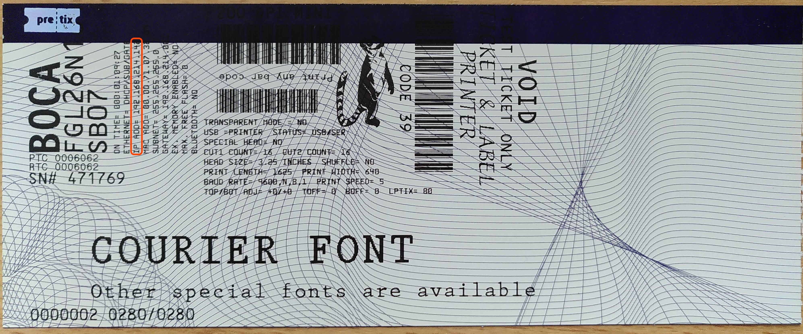
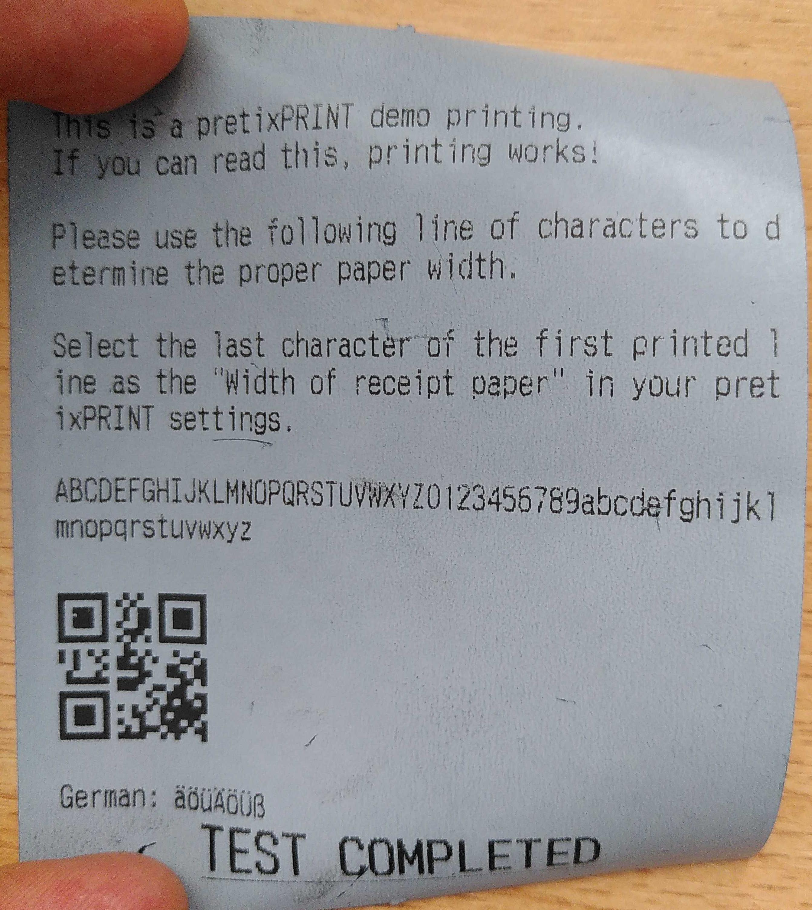

# Hardware-Einrichtung 

Dieser Artikel behandelt die Einrichtung von Hardware für Ihr Event. 
Wir bieten [professionelle Hardware](https://pretix.eu/about/de/hardware) zur Miete und zum Kauf an. 
Mit diesen Geräten können Sie Produkte verkaufen, Einlasskontrolle machen, sowie Belege, Tickets und Badges ausdrucken. 
Dazu nutzen Sie unsere Apps pretixPOS, pretixPRINT und pretixSCAN. 

Diese Funktionen können Sie auch mit Ihrer eigenen Hardware abdecken, solange Sie ein funktionierendes Netzwerk haben und Ihre Geräte kompatibel mit unseren Apps sind. 

## Voraussetzungen

Die Voraussetzungen hängen von Ihrem individuellen Anwendungsfall ab. 
In jedem Fall brauchen Sie ausreichend Steckdosen und entweder mobilen Datenempfang oder einen Kabelanschluss für die Internetverbindung. 
Für die Einrichtung eines Druckers benötigen Sie einen dünnen, stabilen Gegenstand wie z.B. eine geradegebogene Büroklammer. 

## Anleitung

Packen Sie Ihre Hardware-Lieferung aus und überprüfen Sie diese anhand des Lieferscheins auf Vollständigkeit. 
Die Einrichtung der Hardware besteht aus folgenden Schritten: 

 - Router einrichten (außer Sie verbinden die Hardware mit einem bestehenden Netzwerk)
 - Scan-Smartphones einrichten (falls Sie die Hardware für die Einlasskontrolle nutzen)
 - Kassengerät einrichten (falls Sie die Hardware für den Verkauf nutzen)
 - Drucker einrichten und mit Scan- oder Kassengeräten verbinden 

Je nach Anwendungsfall sind eventuell nur einige dieser Schritte für Sie relevant. 

### Router einrichten 

Die von uns angebotenen Router erkennen Sie an den Antennen auf der Rückseite und den nummerierten LAN-Buchsen an der Vorderseite.  

Schließen Sie das Netzteil an die Buchse mit der Aufschrift "PWR" am Router und an eine Steckdose an. 
Warten Sie ab, bis die LEDs des Routers nicht mehr blinken, sondern durchgängig leuchten. 
Das kann einige Minuten dauern. 

Falls Sie den Router mit dem Netzwerk am Veranstaltungsort verbinden wollen, dann verbinden Sie die WAN-Buchse des Routers über ein LAN-Kabel mit einem Switch oder dem Kabelanschluss des Veranstaltungsorts. 
Die LED an der WAN-Buchse des Routers leuchtet und blinkt, wenn eine Verbindung besteht und Daten übertragen werden.  
Falls Sie die mobile Datenverbindung des Routers nutzen wollen, werfen Sie einen Blick auf die LEDs "2G", "3G" und "4G" über dem "SIM1"-Slot des Routers. 
Sobald die LEDs nicht mehr abwechselnd blinken, sondern eine der LEDs durchgängig leuchtet, hat der Router eine mobile Datenverbindung hergestellt. 

Wenn die LEDs "2.4" und "5" unterhalb von "WiFi" durchgängig leuchten, dann stellt der Router ein Netz mit 2,4 GHz und ein Netz mit 5 GHz zur Verfügung. 
Die SSIDs dieser Netze lauten `pretix_onsite` und `pretix_onsite_5ghz`. 
Falls Sie mehrere Router verwenden, werden an die SSIDs ein Unterstrich und eine Zahl angehängt, z.B. `pretix_onsite_1` und `pretix_onsite_5ghz_1`. 

Verbinden Sie die anderen Geräte über LAN-Kabel oder über WLAN mit dem Router. 
Smartphones verbinden Sie immer mit dem WLAN. 
Drucker verbinden Sie mit einem LAN-Kabel mit einem der nummerierten LAN-Anschlüsse am Router. 
Verbinden Sie den Drucker **nicht** mit dem WAN-Anschluss am Router. 

### Scan-Smartphones einrichten 

Die von uns angebotenen Scan-Smartphones sind robuste, schwere Smartphones mit eingebautem Scanner. 
Unser Team hat das Mietgerät bereits Ihrem Veranstalterkonto hinzugefügt. 
Schließen Sie das Smartphone an ein Ladegerät an oder stecken Sie es in die Ladestation, bis der Akku ausreichend geladen ist. 
Schalten Sie es ein und verbinden Sie es mit dem WLAN des Routers. 

### Kassengerät einrichten 

Die von uns angebotenen Kassengeräte sind Tablets mit großem Bildschirm und einem eingebauten Belegdrucker oder einem Standfuß. 
Unser Team hat das Mietgerät bereits Ihrem Veranstalterkonto hinzugefügt. 
Schließen Sie die Kasse an das Netzteil und an eine Steckdose an. 
Schalten Sie Sie ein und verbinden Sie mit dem WLAN des Routers. 

### Drucker einrichten 

Wir bieten Drucker für drei verschiedene Anwendungen an: Belege, Tickets und Badges (Namensschilder). 
Unabhängig von der genauen Anwendung müssen Sie Ihren Drucker mit Strom, einer Internetverbindung und bedruckbarem Material versorgen. 
Dann drucken Sie eine Testseite. 
Schließlich verbinden Sie den Drucker über unsere App pretixPRINT mit der Kasse oder den Scannern. 
Diese Schritte werden im folgenden genauer erklärt. 

#### Drucker anschließen

Falls Ihr Drucker intern über eine Rolle mit Material versorgt wird (Thermopapier oder Labels), dann legen Sie zunächst diese Rolle ein. 
Verbinden Sie den Drucker dann über ein LAN-Kabel mit einem der nummerierten "LAN"-Anschlüsse des Routers. 
Schließen Sie das Netzteil an den Drucker und an eine Steckdose an. 

Falls Ihr Drucker über einen flachen Papierstapel mit Material versorgt wird (Tickets oder Butterfly-Badges), dann schieben Sie das Papier jetzt in den Drucker. 
Drehen Sie das Papier so, dass die bedruckbare Seite nach oben zeigt und die schwarzen quadratischen Markierungen an dem Ende befinden liegen, das weiter vom Drucker entfernt ist. 
Sobald Sie das Papier weit genug in den Drucker geschoben haben, zieht er das Papier automatisch ein und schneidet das erste Ticket bzw. den ersten Badge ab. 

#### Testseite drucken

Das Ausdrucken einer **Testseite** wird je nach Modell des Druckers unterschiedlich ausgelöst: 

 - Die Belegdrucker **Epson TM-m30iii** und **TM-T88vii** drucken innerhalb einer Minute nach Einschalten automatisch eine Testseite. 
   Das funktioniert nur, wenn der Drucker mit Stromversorgung und Router verbunden ist und Papier hat. 
   Falls Sie erneut eine Testseite drucken wollen, schalten Sie den Drucker aus und wieder ein. 
   Die Testseite könnte z.B. so aussehen: 

 - Der Etikettendrucker **Bixolon XD5-40d** hat neben dem Strom- und LAN-Anschluss ein wenige Millimeter breites Loch, in dem ein Button verborgen ist. 
   Schalten Sie den Drucker ein und benutzen Sie einen dünnen, stabilen Gegenstand wie z.B. eine geradegebogene Büroklammer, um den Button zu drücken. 
   Das löst den Druck einer Testseite aus. 
   Die Testseite könnte z.B. so aussehen: 

 - Die Ticketdrucker **Boca Lemur** und **Lemur C** haben an der Seite drei Aussparungen, in denen jeweils eine Status-LED und ein Button verborgen sind. 
   Drücken Sie den Button unter dem Label "TEST — NO TKT". 
   Dies löst den Druck einer Testseite aus. 
   Die Testseite könnte z.B. so aussehen: 

Sie können der Testseite die IP-Adresse des Druckers entnehmen. 
Diese IP-Adresse benötigen Sie, um Scan-Smartphones und Kassengeräte mit den Druckern zu verbinden. 
Das wird im nächsten Abschnitt näher erklärt. 

#### Drucker mit Scan-Smartphone oder Kasse verbinden

Auf den Android-Geräten (Scan-Smartphone und Kasse) können Sie unsere App pretixPRINT benutzen, um die Drucker anzusteuern. 
Unser Team hat die App auf den Mietgeräten bereits vorkonfiguriert. 
Allerdings sollten Sie diese Einrichtung vor Beginn Ihrer Veranstaltung überprüfen. 
Dieser Abschnitt erklärt Ihnen, wie Sie sicherstellen können, dass das Drucken wie gewünscht funktioniert. 

pretixPRINT erlaubt die Einrichtung von Druckern für drei verschiedene Verwendungszwecke: Belegdrucker, Ticketdrucker und Badgedrucker.  
Daher zeigt die App drei verschiedene Schaltflächen mit der Beschriftung "Drucker einrichten" an. 
Entscheidend ist die Überschrift oberhalb der Schaltfläche, die dem Verwendungszweck entspricht. 

Beleg- und Ticketdrucker richten Sie normalerweise an einem Kassengerät ein. 
Das ermöglicht es, für jede Transaktion am POS einen Kaufbeleg und die erworbenen Tickets auszudrucken. 
Den Badgedrucker richten Sie dagegen am Scanner ein, um am Einlass für jede teilnehmende Person einen passenden Badge zu drucken. 

Tippen Sie daher am richtigen Gerät unter der richtigen Überschrift (Belegdrucker, Ticketdrucker oder Badgedrucker) die Schaltfläche :btn:Drucker einrichten:. 
Danach ist der Prozess immer der gleiche. 

Falls Sie den **integrierten** Belegdrucker des Kassengeräts verbinden wollen, wählen Sie auf der Seite "Wie ist Ihr Drucker verbunden?" die Option "Eingebauter Drucker (SUNMI)" und tippen :btn:Weiter:. 
Sie müssen keine IP-Adresse angeben und unter Protokoll und Dialekt die jeweils einzige Möglichkeit wählen. 

Tippen Sie :btn:Testseite drucken: und beobachten Sie, ob der verbundene Drucker wie erwartet druckt. 
Tippen Sie :btn:Einstellungen speichern:. 

Falls Sie einen Drucker im **Netzwerk** verbinden wollen, wählen Sie auf der  Seite "Wie ist Ihr Drucker verbunden?" die Option "Netzwerk (LAN/WLAN) und tippen :btn:Weiter:. 
Geben Sie die IP-Adresse des Routers ein. 
Das Feld "Port" können Sie in den meisten Fällen unverändert lassen. 
Bearbeiten Sie es nur dann, wenn die Testseite des Druckers eine Port-Nummer ausgibt, die **nicht** `9100` lautet. 
Tippen Sie dann :btn:Weiter:. 

Auf der Seite "Welches Protokoll spricht Ihr Drucker?" wählen Sie das Protokoll aus, das am ehesten zu Ihrem Drucker passt. 
Falls Sie einen Ticketdrucker der Marke Lemur verwenden, wählen Sie "FGL-Ticketdrucker (z.B. Boca, Practical Automation, ...)". 
Falls Sie einen Etikettendrucker der Marke Bixolon verwenden, wählen Sie "SLCS-Etikettendrucker (z.B. Bixolon, Metapace, ...)". 
Tippen Sie :btn:Weiter:, nehmen Sie auf der nächsten Seite gegebenenfalls Feineinstellungen vor und tippen Sie erneut :btn:Weiter:. 

Tippen Sie :btn:Testseite drucken: und beobachten Sie, ob der verbundene Drucker wie erwartet druckt. 
Tippen Sie :btn:Einstellungen speichern:. 

!!! Note 
    Die Testseite des Druckers und die Testseite von pretixPRINT erfüllen unterschiedliche Funktionen. 
    Die Testseite des Druckers testet die Funktion des Druckers und enthält Informationen zur Verbindung wie die IP-Adresse. 
    Die Testseite von pretixPRINT bestätigt, dass die Verbindung zwischen dem Gerät (Kasse oder Scan-Smartphone) und dem Drucker besteht und dass die beiden Geräte mit dem richtigen Protokoll kommunizieren. 

Wiederholen Sie diese Schritte an allen Geräten, mit denen Sie drucken möchten, für jeden Drucker, den Sie von dem Gerät aus ansteuern möchten. 
Es folgen Beispiele für die pretixPRINT-Testseiten verschiedener Druckermodelle. 

Epson: 

Bixolon: 

Boca Lemur: 

Falls bei der pretixPRINT-Testseite Probleme auftauchen, werfen Sie einen Blick auf [den entsprechenden Abschnitt](hardware-setup.de.md#drucker-druckt-pretixprint-testseite-nicht) unter [Problemlösung](hardware-setup.de.md#problemlösung). 

## Problemlösung 

#### Drucker druckt die eigene Testseite nicht

**Problem:** Sie können einen Drucker nicht dazu bringen können, seine eigene Testseite zu drucken wie beschrieben unter [Testseite drucken](hardware-setup.de.md#testseite-drucken). 

**Lösung:** Überprüfen Sie: 

 - ob der Drucker mit Strom versorgt wird (das Netzteil sollte verbunden sein und Status-LED oder Display am Drucker sollten leuchten)
 - ob das passende Material eingelegt ist
 - ob das Material richtig eingelegt ist
 - ob die Klappe des Druckers geschlossen ist

Wenn all diese Punkte erfüllt sind, liegt möglicherweise ein technisches Problem vor. 
Lesen Sie die Dokumentation des Herstellers oder kontaktieren Sie unseren [Support](mailto:support@pretix.eu). 

#### IP-Adresse auf der Testseite lautet 0.0.0.0 

**Problem:** Die Testseite des Druckers liefert als IP-Adresse `0.0.0.0` oder ein ähnlich unbrauchbares Ergebnis. 

**Lösung:**  Der Drucker ist nicht mit dem Netzwerk verbunden. 
Prüfen Sie, ob das LAN-Kabel richtig in der Buchse des Druckers steckt. 
Prüfen Sie, ob das andere Ende desselben LAN-Kabels in der LAN-Buchse (**nicht** in der WAN-Buchse) des Routers steckt. 
Verwenden Sie gegebenenfalls ein anderes Kabel. 

Geben Sie dem Drucker etwa eine Minute Zeit, um sich mit dem Netzwerk zu verbinden. 
Drucken Sie dann eine neue Testseite aus, um die korrekte IP-Adresse zu erhalten. 

#### Drucker druckt pretixPRINT-Testseite nicht

**Problem:** Der Drucker druckt die Testseite zwar richtig aus, aber nicht die pretixPRINT-Testseite wie beschrieben unter [Drucker mit Scan-Smartphone oder Kasse verbinden](hardware-setup.de.md#drucker-mit-scan-smartphone-oder-kasse-verbinden). 

**Lösung:** Überprüfen Sie: 

 - ob das Gerät, auf dem pretixPRINT läuft, mit dem korrekten WLAN verbunden ist (SSID fängt an mit `pretix-onsite`)
 - ob die IP-Adresse in pretixPRINT korrekt ist
 - ob in pretixPRINT das richtige Protokoll ausgewählt ist (plus gegebenenfalls der richtige Dialekt) 

Speichern Sie die Einstellungen in pretixPRINT und testen Sie erneut. 

#### Druckauftrag kommt auf einem anderen Drucker an

**Problem:** Die pretixPRINT-Testseite oder Ihre anderen Druckaufträge werden zwar gedruckt, aber von einem anderen Drucker als erwartet. 

**Lösung:** Die in pretixPRINT hinterlegte IP-Adresse ist nicht die des gewünschten Druckers. 
Verwenden Sie das Gerät mit dem verbundenen Drucker. 
Passen Sie Ihren Hardware-Aufbau entsprechend an. 

Alternativ können Sie die IP-Adresse auf die des gewünschten Druckers ändern. 
Speichern Sie die Einstellungen und testen Sie erneut. 

#### Druckauftrag enthält Unsinn 

**Problem:** Die pretixPRINT-Testseite oder Ihre anderen Druckaufträge werden zwar ausgedruckt, enthalten aber Unsinn (z.B. Sonderzeichen oder zufällige Zeichenfolgen). 

**Lösung:** In pretixPRINT ist das falsche Protokoll für den Drucker konfiguriert. 
Ändern Sie in pretixPRINT Protokoll und gegebenenfalls Dialekt, mit dem das Gerät den Drucker anspricht. 
Speichern Sie die Einstellungen und testen Sie erneut. 