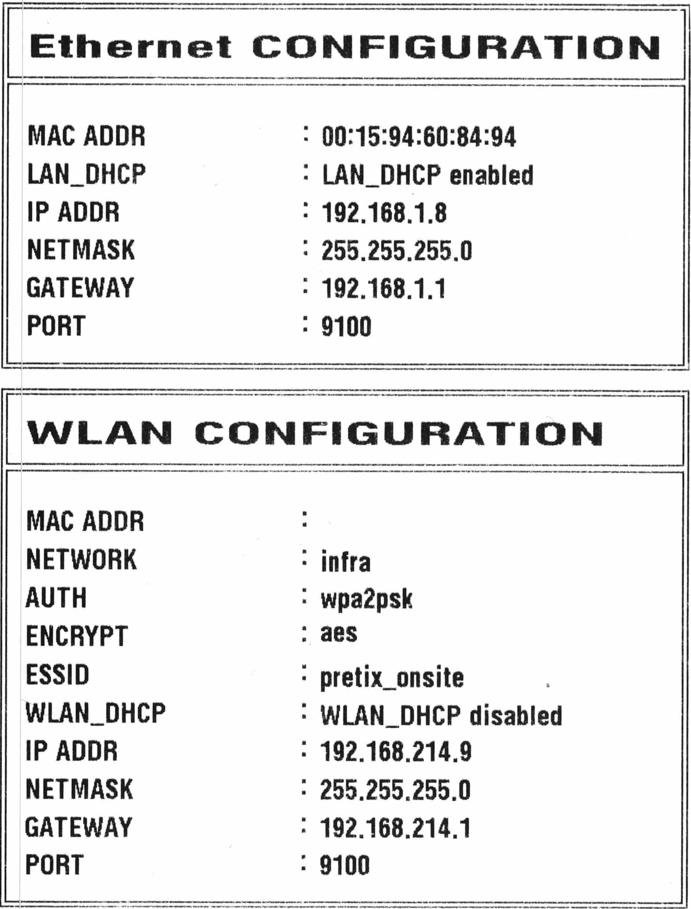
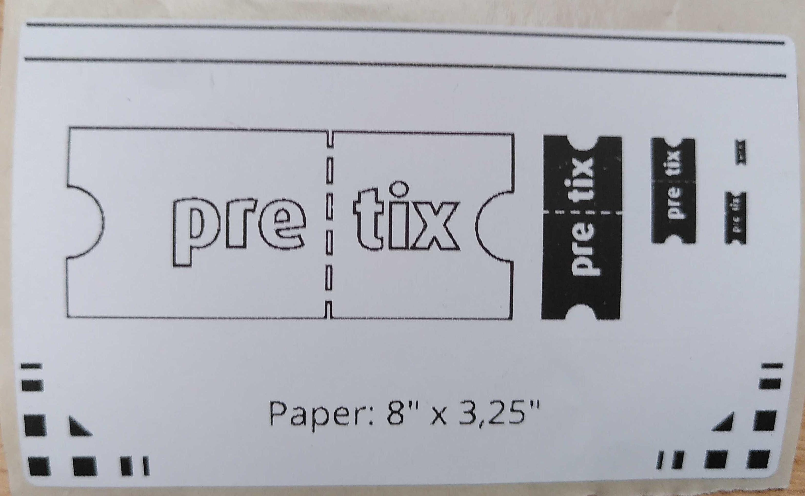

# Drucker einrichten: Bixolon XD5-40d 

Bei diesem Artikel handelt es sich um eine Schnellstart-Anleitung für die Verwendung des Druckers Bixolon XD5-40d oder vergleichbaren Geräten zusammen mit pretix. 
Er erklärt, wie Sie den Drucker aufbauen und über die App pretixPRINT mit Kassen oder Scan-Smartphones verbinden. 
Falls Sie den Drucker mit einem Desktop-Computer verbinden wollen, konsultieren Sie die Dokumentation des Herstellers. 

!!! Note 
    Diese Seite ersetzt nicht die Dokumentation für die Geräte selbst. 
    Informieren Sie sich auf der Webseite des Herstellers über das Modell [Bixolon XD5-40d](https://bixoloneu.com/product/xd5-40d/?lang=de). 

## Voraussetzungen

Für die Stromversorgung des Geräts benötigen Sie eine Steckdose in der Nähe. 
Für die Netzwerkverbindung über LAN brauchen Sie einen Router mit einem freien LAN-Anschluss oder eine alternative Lösung. 
Bei manchen Exemplaren erfordert die Verbindung über WLAN einen WLAN-Dongle. 
Als Material benötigen Sie aufgerollte bedruckbare Thermoetiketten mit einer Breite von bis zu 127mm. 

Falls Sie die Netzwerkkonfiguration des Druckers ändern, benötigen Sie für das Drucken der Konfigurationsseite einen dünnen, stabilen Gegenstand wie z.B. eine geradegebogene Büroklammer. 

## Anleitung

Mit dem Bixolon XD5-40d können Sie Badges in Form von Klebeetiketten drucken. 
Um einen dieser Drucker in Betrieb zu nehmen, sind folgende Schritte notwendig: 

 - [Versorgen Sie Ihren Drucker](#drucker-anschließen) mit Strom, einer Netzwerkverbindung und bedruckbarem Material
 - [Testen Sie die Konfiguration](#konfiguration-testen)
 - Falls die Hardware nicht vorkonfiguriert wurde, [drucken Sie eine Konfigurationsseite](#konfigurationsseite-drucken)
 - [Verbinden Sie den Drucker](#drucker-mit-scan-smartphone-oder-kasse-verbinden) über unsere App pretixPRINT mit der Kasse oder den Scannern. 

Diese Schritte werden im Folgenden genauer erklärt. 

### Drucker anschließen

Stellen Sie zuerst sicher, dass der Drucker **nicht** mit dem Strom verbunden ist und **nicht** eingeschaltet ist. 
Legen Sie dann das Druckmaterial in den Drucker ein. 

Ziehen Sie die beiden Hebel an den Seiten des Geräts nach vorne und klappen Sie den oberen Teil des Gehäuses nach oben. 
Im Inneren des Druckers schieben Sie vorsichtig die Halterungen für die Rolle auseinander. 

!!! Note 
    Falls die Halterungen sich nicht mit geringem Kraftaufwand bewegen lassen, sind sie möglicherweise fixiert. 
    Lösen Sie die Fixierung vorne an der Außenseite der Halterung. 
    Konsultieren Sie dazu auch das Handbuch des Herstellers: [User's Manual section 5-12-1](https://bixolon.com/_upload/manual/Manual_user_XD5-40d_%EC%8B%9C%EB%A6%AC%EC%A6%88_ENG_V1.02.pdf#%5B%7B%22num%22%3A124%2C%22gen%22%3A0%7D%2C%7B%22name%22%3A%22XYZ%22%7D%2C45%2C777%2C0%5D)

Drehen Sie die Etikettenrolle so, dass das Ende des Streifens nach vorne zeigt und die Etiketten oben liegen. 

Stecken Sie die Etikettenrolle auf eine der Halterungen lassen Sie die Halterungen so von allein zusammenfahren, dass die Rolle zwischen Ihnen klemmt. 
Falls diese Bewegung nicht von allein passiert, müssen Sie zuerst den Hebel lösen. 
Schieben Sie die Halterungen **nicht** gewaltsam zusammen. 
Ziehen Sie das Papier bis zum vorderen Ende des Druckers und schließen Sie die Klappe, sodass das Papier glatt und gerade aus dem Schlitz ragt. 

Überprüfen Sie, ob der Stromschalter des Druckers ausgeschaltet ist, und schalten Sie ihn gegebenenfalls aus. 
Verbinden oder entfernen Sie **keine** Kabel, während der Drucker eingeschaltet ist. 
Alle Anschlüsse befinden sich hinten und unten am Gerät. 

Um den Drucker über **LAN** mit dem Netzwerk zu verbinden, stecken Sie ein LAN-Kabel in die Buchse mit der Aufschrift "ETHERNET" an der Rückseite des Druckers. 
Stecken Sie das andere Ende des LAN-Kabels in einen freien LAN-Anschluss an Ihrem Router. 

Um den Drucker über **WLAN** mit dem Netzwerk zu verbinden, stecken Sie den einen WLAN-Dongle in die USB-A-Buchse an der Rückseite des Routers. 
Falls der Drucker über ein eingebautes WLAN-Modul verfügt, ist dieser Schritt nicht notwendig. 
Wir schicken Ihnen nur dann einen WLAN-Dongle, wenn einer Ihrer Drucker ihn benötigt. 

Alternativ zur Netzwerkverbindung können Sie den Drucker auch über **USB** direkt an eine Kasse anschließen. 
Um das zu tun, stecken Sie ein USB-Typ-B-Kabel in die entsprechende Buchse an der Rückseite des Druckers. 
Stecken Sie das andere Ende des Kabels in einen freien USB-Anschluss an Ihrer Kasse. 
Ein Anschluss an ein Scan-Smartphone über USB ist **nicht** möglich. 

Schließen Sie das Netzteil an die "POWER"-Buchse am Drucker und an eine Steckdose an. 
Schalten Sie das Gerät ein, indem Sie den Schalter neben der "POWER"-Buchse umlegen. 

### Konfiguration testen

!!! Note 
    Falls Sie Hardware von uns gemietet haben, dann ist sie bereits betriebsbereit konfiguriert. 
    Das gilt auch, falls Sie Hardware von uns gekauft haben und vor dem Versand eine entsprechende Konfiguration in Auftrag gegeben haben. 

    In diesen Fällen müssen Sie die Konfiguration nur testen. 
    Sie können die beiden Unterabschnitte [Konfigurationsseite drucken](bixolon.de.md#konfigurationsseite-drucken) und [Drucker mit Scan-Smartphone oder Kasse verbinden](bixolon.de.md#drucker-mit-scan-smartphone-oder-kasse-verbinden) überspringen. 

Um die Konfiguration zu testen, starten Sie das Android-Gerät (Kasse oder Scan-Smartphone), von dem Sie den Drucker ansteuern wollen. 
Überprüfen Sie, ob das Gerät mit einem WLAN verbunden ist, dessen Name mit `pretix_onsite` beginnt. 
Öffnen Sie die App pretixPRINT. 

pretixPRINT erlaubt die Einrichtung von Druckern für drei verschiedene Verwendungszwecke: Belegdrucker, Ticketdrucker und Badgedrucker. 
Falls ein Drucker für eine dieser Rollen eingerichtet ist, wird er unter der entsprechenden Überschrift mit der Art der Verbindung und gegebenenfalls seiner IP-Adresse angezeigt. 

Tippen Sie neben der Anzeige des Druckers in pretixPRINT das Drei-Punkte-Menü :btn-icon:fa3-ellipsis-v:: und dann :btn:Testseite drucken:. 
Beobachten Sie, ob der Drucker wie erwartet eine Testseite produziert. 
Falls Sie mehrere Drucker für je Badge-, Ticket- oder Belegdruck von dem Android-Gerät aus ansteuern wollen, führen Sie den Schritt einmal für jeden der Drucker durch. 

Falls der Drucker keine Testseite produziert oder es dabei zu Problemen kommt, lesen Sie den Abschnitt [Problemlösung](bixolon.de.md#problemlosung). 
Um die gesamte Konfiguration selbst vorzunehmen, lesen Sie die beiden Unterabschnitte [Konfigurationsseite drucken](bixolon.de.md#konfigurationsseite-drucken) und [Drucker mit Scan-Smartphone oder Kasse verbinden](bixolon.de.md#drucker-mit-scan-smartphone-oder-kasse-verbinden). 

### Konfigurationsseite drucken

Der Etikettendrucker Bixolon XD5-40d hat zwischen dem USB- und Ethernet-Anschluss ein wenige Millimeter breites rechteckiges Loch, in dem ein Button verborgen ist. 
Schalten Sie den Drucker ein und benutzen Sie einen dünnen, stabilen Gegenstand wie z.B. eine geradegebogene Büroklammer, um den Button zu drücken. 
Das löst den Druck einer Konfigurationsseite aus. 
Die Konfigurationsseite könnte z.B. so aussehen: 

Wenn Sie den Drucker über das **LAN-Kabel** verbinden wollen, dann ist der Teil unter der Überschrift "Ethernet CONFIGURATION" für Sie relevant. 
Wenn Sie den Drucker stattdessen über **WLAN** verbinden wollen, dann brauchen Sie den Teil unter der Überschrift "WLAN CONFIGURATION". 
Für eine Verbindung über USB brauchen Sie keine Informationen von der Konfigurationsseite. 

Die IP-Adresse des Druckers befindet sich in der Zeile, die mit `IP ADDR` beginnt. 
Im Beispielfoto oben lautet die IP-Adresse für die Kabelverbindung `192.168.1.8`. 
Die IP-Adresse für die WLAN-Verbindung lautet `192.168.214.9`. 
Bei Ihrem Drucker wird sie wahrscheinlich anders lauten. 
Die IP-Adresse ist nicht zu verwechseln mit der Gateway-Adresse, die in die Zeile mit `GATEWAY` gedruckt wird. 
Das wird im nächsten Abschnitt näher erklärt. 

### Drucker mit Scan-Smartphone oder Kasse verbinden

Auf Android-Geräten (Scan-Smartphone und Kasse) können Sie unsere App pretixPRINT benutzen, um Drucker anzusteuern. 
Dieser Abschnitt erklärt, wie Sie den Drucker Bixolon XD5-40d über die App verbinden und die Funktion testen. 

pretixPRINT erlaubt die Einrichtung von Druckern für drei verschiedene Verwendungszwecke: Belegdrucker, Ticketdrucker und Badgedrucker. 
Daher zeigt die App drei verschiedene Schaltflächen mit der Beschriftung "Drucker einrichten" an. 
Entscheidend ist die Überschrift oberhalb der Schaltfläche, die dem Verwendungszweck entspricht. 

Drucker für Belege und Tickets richten Sie üblicherweise an einer Kasse ein. 
Das ermöglicht es, für jede Transaktion am POS einen Kaufbeleg und die erworbenen Tickets auszudrucken. 
Badgedrucker richten Sie dagegen normalerweise am Scanner ein, um am Einlass für jede teilnehmende Person ein passendes Badge zu drucken. 

Der Bixolon XD5-40d ist für die Verwendung als Badgedrucker geeignet. 
Um den Drucker als Badgedrucker mit einem Scan-Smartphone oder einer Kasse zu verbinden, öffnen Sie pretixPRINT auf dem Scan-Smartphone oder der Kasse und tippen dann unter "Badgedrucker" :btn:Drucker einrichten:. 

Falls der Drucker über **LAN** oder **WLAN** verbunden ist, wählen Sie auf der Seite "Wie ist Ihr Drucker verbunden?" die Option "Netzwerk (LAN/WLAN)" und tippen :btn:Weiter:. 
Geben Sie die IP-Adresse des Druckers ein. 
Das Feld "Port" können Sie in den meisten Fällen unverändert lassen. 
Tippen Sie dann :btn:Weiter:. 

Falls der Drucker über **USB** verbunden ist, wählen Sie auf der Seite "Wie ist Ihr Drucker verbunden?" die Option "USB (experimentell, funktioniert nicht auf allen Geräten)". 
Tippen Sie dann den Button :btn:Gerät auswählen: und wählen Sie den Drucker aus der Liste aus. 
Daraufhin trägt die App die Seriennummer in das entsprechende Feld ein. 
Tippen Sie dann :btn:Weiter:. 

Auf der Seite "Welches Protokoll spricht Ihr Drucker?" wählen Sie "SLCS-Etikettendrucker (z.B. Bixolon, Metapace, ...)" und tippen Sie :btn:Weiter:. 
Auf der nächsten Seite nehmen Sie gegebenenfalls Feineinstellungen vor und tippen Sie erneut :btn:Weiter:. 

Tippen Sie :btn:Testseite drucken: und beobachten Sie, ob der verbundene Drucker wie erwartet druckt. 
Tippen Sie :btn:Einstellungen speichern:. 

!!! Note 
    Die Konfigurationsseite des Druckers und die Testseite von pretixPRINT erfüllen unterschiedliche Funktionen. 
    Die Konfigurationsseite des Druckers testet die Funktion des Druckers und enthält Informationen zur Verbindung wie die IP-Adresse. 
    Die Testseite von pretixPRINT bestätigt, dass die Verbindung zwischen dem Gerät (Kasse oder Scan-Smartphone) und dem Drucker besteht und dass die beiden Geräte mit dem richtigen Protokoll kommunizieren. 

Wiederholen Sie diese Schritte an allen Geräten, mit denen Sie drucken möchten. 
Die pretixPRINT-Testseite könnte beim Bixolon XD5-40d z.B. so aussehen: 

Falls bei der pretixPRINT-Testseite Probleme auftauchen, werfen Sie einen Blick auf [den entsprechenden Abschnitt](bixolon.de.md#drucker-druckt-pretixprint-testseite-nicht) unter [Problemlösung](bixolon.de.md#problemlosung). 

## Problemlösung 

### Drucker druckt nicht

**Problem:** Sie können den Drucker nicht dazu bringen, zu drucken – nicht einmal seine eigene Konfigurationsseite wie beschrieben unter [Konfigurationsseite drucken](bixolon.de.md#Konfigurationsseite-drucken). 

**Lösung:** Stellen Sie sicher, dass: 

 - der Drucker mit Strom versorgt wird (das Netzteil/Stromkabel sollte verbunden sein und Status-LED oder Display am Drucker sollten leuchten)
 - das passende Material eingelegt ist
 - das Material richtig eingelegt ist
 - das Gehäuse des Druckers geschlossen ist

Wenn all diese Punkte erfüllt sind, liegt möglicherweise ein technisches Problem vor. 
Lesen Sie die Dokumentation des Herstellers oder kontaktieren Sie unseren [Support](mailto:support@pretix.eu). 

### Drucker druckt pretixPRINT-Testseite nicht

**Problem:** Der Drucker druckt die eigene Konfigurationsseite zwar richtig aus, aber nicht die pretixPRINT-Testseite wie beschrieben unter [Drucker mit Scan-Smartphone oder Kasse verbinden](bixolon.de.md#drucker-mit-scan-smartphone-oder-kasse-verbinden). 

**Lösung:** Überprüfen Sie zuerst, ob pretixPRINT auf dem Gerät womöglich für die Benutzung mit einem anderen Drucker konfiguriert ist. 
Dazu versorgen Sie alle mitgelieferten Drucker mit Strom, Netzwerkverbindung und Druckmaterial. 
Versuchen Sie dann erneut, die pretixPRINT-Testseite zu drucken. 

Falls die Testseite nun von einem anderen Drucker ausgedruckt wird, bedeutet das, dass pretixPRINT auf dem Gerät für die Benutzung mit diesem Drucker konfiguriert ist. 
Passen Sie Ihren Hardware-Aufbau entsprechend an. 

Falls die Testseite von keinem der Drucker ausgedruckt wird, liegt ein anderes Problem vor. 
Stellen Sie sicher, dass das Gerät, auf dem pretixPRINT läuft, mit dem korrekten WLAN verbunden ist (bei von uns vermieteten Routern fängt der Netzwerkname mit `pretix-onsite` an). 

Überprüfen Sie die IP-Adresse in pretixPRINT und korrigieren Sie sie gegebenenfalls. 
Stellen Sie auch sicher, dass in pretixPRINT das richtige Protokoll ausgewählt ist (plus gegebenenfalls der richtige Dialekt). 
Die Auswahl des Protokolls hängt vom Modell des Druckers ab. 
Für mehr Informationen zu IP-Adresse und Protokoll lesen Sie den Abschnitt [Drucker mit Scan-Smartphone oder Kasse verbinden](bixolon.de.md#drucker-mit-scan-smartphone-oder-kasse-verbinden). 

Speichern Sie die Einstellungen in pretixPRINT und testen Sie erneut. 

### Druckauftrag kommt auf einem anderen Drucker an

**Problem:** Die pretixPRINT-Testseite oder Ihre anderen Druckaufträge werden zwar gedruckt, aber von einem anderen Drucker als erwartet. 
Die in pretixPRINT hinterlegte IP-Adresse ist also nicht die des gewünschten Druckers. 

**Lösung:** Verwenden Sie das Gerät mit dem verbundenen Drucker. 
Passen Sie Ihren Hardware-Aufbau entsprechend an. 

Alternativ können Sie die IP-Adresse auf die des gewünschten Druckers ändern. 
Speichern Sie die Einstellungen und testen Sie erneut. 

### Druckauftrag enthält fehlerhafte Zeichen 

**Problem:** Die pretixPRINT-Testseite oder Ihre anderen Druckaufträge werden zwar ausgedruckt, enthalten aber fehlerhafte Zeichen (z.B. Sonderzeichen oder zufällige Zeichenfolgen). 
Das deutet darauf hin, dass in pretixPRINT das falsche Protokoll für den Drucker konfiguriert ist. 

**Lösung:** Ändern Sie in pretixPRINT Protokoll und gegebenenfalls Dialekt, mit dem das Gerät den Drucker anspricht. 
Speichern Sie die Einstellungen und testen Sie erneut. 

### Druck ist falsch gedreht 

**Problem:** Das Drucken funktioniert zwar, aber das Ergebnis ist so gedreht, dass es nicht vollständig lesbar ist oder nicht gut aussieht. 
In pretixPRINT ist die Drehung also nicht richtig konfiguriert. 

**Lösung:** Öffnen Sie auf dem Android-Gerät pretixPRINT und tippen Sie unter dem betreffenden Druckertyp "Drucker einrichten". 
Tippen Sie :btn:Weiter: bis Sie die Seite geöffnet haben, auf der das Dropdown-Menü "Drehung" angezeigt wird. 
Die Standardeinstellung hier ist `0°`. 

Ändern Sie diese Einstellung entgegen der Fehldrehung auf dem Druck. 
Tippen Sie :btn:Weiter: und dann :btn:Testseite drucken:. 
Wenn der Druck jetzt richtig gedreht ist, tippen Sie :btn:Einstellungen speichern:. 
Falls nicht, tippen Sie :btn:Zurück: und ändern die Einstellung "Drehung" auf einen anderen Wert. 

### Druck ist verschmutzt oder fleckig

**Problem:** Der Druck ist zwar sinnvoll, enthält aber schwarze Flecken, weiße Stellen, oder ist verschmutzt. 
Das bedeutet, dass der Druckkopf verschmutzt ist. 

**Lösung:** 
Reinigen Sie den Druckkopf und gegebenenfalls andere Teile im Inneren des Druckers. 
Ziehen Sie dazu die Dokumentation des Herstellers zu Rate: [XD5-40d Series: Printer Maintenance](https://bixolon.com/_upload/manual/Manual_user_XD5-40d_%EC%8B%9C%EB%A6%AC%EC%A6%88_ENG_V1.02.pdf#%5B%7B%22num%22%3A130%2C%22gen%22%3A0%7D%2C%7B%22name%22%3A%22XYZ%22%7D%2C45%2C777%2C0%5D). 

### Druck ist leer oder enthält nur Teile des Layouts 

**Problem:** Gedruckte Badges sind leer oder enthalten nur Teile des Layouts, z.B. nur das pretix-Logo. 
Das Layout ist also zu groß für das Druckmaterial. 

**Lösung:** Ändern Sie das Layout so, dass es auf das Papier passt. 

Öffnen Sie dazu das pretix-Backend und navigieren Sie zu :navpath:Ihre Veranstaltung → :fa3-wrench: Einstellungen → Tickets:. 
Klicken Sie :btn-icon:fa3-paint-brush: Layout-Editor öffnen: oder :btn:Erweiterter Modus (mehrere Layouts) und bearbeiten Sie das relevante Layout. 

Laden Sie ein PDF als Hintergrund in der Größe Ihres Druckmaterials hoch.
Alternativ wählen Sie die Papiergröße so, dass sie Ihrem Druckmaterial entspricht oder etwas kleiner ist. 