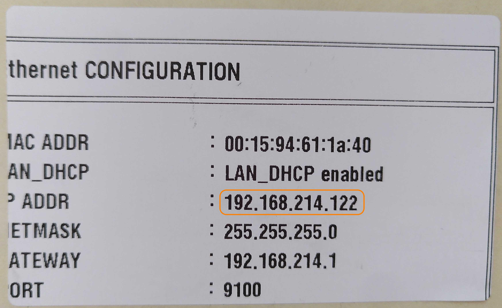

# Drucker einrichten: Bixolon XD5-40d 

Bei diesem Artikel handelt es sich um eine Schnellstart-Anleitung für die Verwendung von Druckern der Marke Bixolon zusammen mit pretix. 
Er erklärt, wie Sie den Drucker aufbauen und über die App pretixPRINT mit Kassen verbinden. 

Note !!! 
    Diese Seite ersetzt nicht die Dokumentation für die Geräte selbst. 
    Informieren Sie sich auf der Webseite des Herstellers über das Modell [Bixolon XD5-40d](https://bixoloneu.com/product/xd5-40d/?lang=de). 

## Voraussetzungen

Für die Stromversorgung des Geräts benötigen Sie eine Steckdose in der Nähe. 
Für die Netzwerkverbindung brauchen Sie einen Router mit einem freien LAN-Anschluss oder eine alternative Lösung. 
Sie benötigen aufgerollte bedruckbare Thermoetiketten mit einer Breite von bis zu 127mm. 
Für das Drucken der Testseite benötigen Sie einen dünnen, stabilen Gegenstand wie z.B. eine geradegebogene Büroklammer. 

## Anleitung

Sie können den Bixolon XD5-40d als Badgedrucker verwenden. 
Sie müssen Ihren Drucker mit Strom, einer Netzwerkverbindung und bedruckbarem Material versorgen. 
Dann drucken Sie eine Testseite. 
Schließlich verbinden Sie den Drucker über unsere App pretixPRINT mit der Kasse oder den Scannern. 
Diese Schritte werden im folgenden genauer erklärt. 

#### Drucker anschließen

Legen Sie zunächst das Druckmaterial in den Drucker ein. 
Ziehen Sie die beiden orangen Hebel an den Seiten des Geräts nach vorne und klappen Sie den oberen Teil des Gehäuses nach oben. 
Im Inneren des Druckers schieben Sie die Halterungen für die Rolle auseinander. 
Drehen Sie die Etikettenrolle so, dass das Ende des Streifens nach vorne zeigt und die Etiketten oben liegen. 
Stecken Sie die Etikettenrolle auf die Halterung und schieben Sie dann die Halterungen so zusammen, dass die Rolle zwischen Ihnen klemmt. 
Ziehen Sie das Papier bis zum vorderen Ende des Druckers und schließen Sie die Klappe, sodass das Papier glatt und gerade aus dem Schlitz ragt. 

Alle Anschlüsse befinden sich hinten und unten am Gerät. 
Stecken Sie ein LAN-Kabel in die Buchse mit der Aufschrift "ETHERNET". 
Stecken Sie das andere Ende des LAN-Kabels in den freien LAN-Anschluss an Ihrem Router. 
Schließen Sie das Netzteil an die "POWER"-Buchse am Drucker und an eine Steckdose an. 

#### Testseite drucken

Der Etikettendrucker **Bixolon XD5-40d** hat neben dem Strom- und LAN-Anschluss ein wenige Millimeter breites Loch, in dem ein Button verborgen ist. 
Schalten Sie den Drucker ein und benutzen Sie einen dünnen, stabilen Gegenstand wie z.B. eine geradegebogene Büroklammer, um den Button zu drücken. 
Das löst den Druck einer Testseite aus. 
Die Testseite könnte z.B. so aussehen: 

Die IP-Adresse des Druckers befindet sich in der Zeile, die mit `IP ADDR` beginnt. 
Sie ist nicht zu verwechseln mit der Gateway-Adresse, die in die Zeile mit `GATEWAY` gedruckt wird.  
Diese IP-Adresse benötigen Sie, um Scan-Smartphones und Kassen mit den Druckern zu verbinden. 
Das wird im nächsten Abschnitt näher erklärt. 

#### Drucker mit Scan-Smartphone oder Kasse verbinden

Auf den Android-Geräten (Scan-Smartphone und Kasse) können Sie unsere App pretixPRINT benutzen, um Drucker anzusteuern. 
Dieser Abschnitt erklärt Ihnen, wie Sie den Drucker Bixolon XD5-40d über die App verbinden und die Funktion testen. 

pretixPRINT erlaubt die Einrichtung von Druckern für drei verschiedene Verwendungszwecke: Belegdrucker, Ticketdrucker und Badgedrucker. 
Daher zeigt die App drei verschiedene Schaltflächen mit der Beschriftung "Drucker einrichten" an. 
Entscheidend ist die Überschrift oberhalb der Schaltfläche, die dem Verwendungszweck entspricht. 

Beleg- und Ticketdrucker richten Sie üblicherweise an einer Kassen ein. 
Das ermöglicht es, für jede Transaktion am POS einen Kaufbeleg und die erworbenen Tickets auszudrucken. 
Den Badgedrucker richten Sie dagegen am Scanner ein, um am Einlass für jede teilnehmende Person einen passenden Badge zu drucken. 

Sie können den Bixolon XD5-40d als Badgedrucker verwenden. 
Um den Drucker als Badgedrucker mit einem Scan-Smartphone oder einer Kasse zu verbinden, öffnen Sie pretixPRINT auf dem Smartphone oder der Kasse und tippen dann unter "Badgedrucker" auf :btn:Drucker einrichten. 
Der Prozess ist danach immer der gleiche. 

Wenn der Drucker über das Netzwerk verbunden ist, wählen Sie auf der Seite "Wie ist Ihr Drucker verbunden?" die Option "Netzwerk (LAN/WLAN)" und tippen :btn:Weiter:. 
Geben Sie die IP-Adresse des Routers ein. 
Das Feld "Port" können Sie in den meisten Fällen unverändert lassen. 
Tippen Sie dann :btn:Weiter:. 

Auf der Seite "Welches Protokoll spricht Ihr Drucker?" wählen Sie "SLCS-Etikettendrucker (z.B. Bixolon, Metapace, ...)" und tippen Sie :btn:Weiter:. 
Auf der nächsten Seite nehmen Sie gegebenenfalls Feineinstellungen vor und tippen Sie erneut :btn:Weiter:. 

Tippen Sie :btn:Testseite drucken: und beobachten Sie, ob der verbundene Drucker wie erwartet druckt. 
Tippen Sie :btn:Einstellungen speichern:. 

!!! Note 
    Die Testseite des Druckers und die Testseite von pretixPRINT erfüllen unterschiedliche Funktionen. 
    Die Testseite des Druckers testet die Funktion des Druckers und enthält Informationen zur Verbindung wie die IP-Adresse. 
    Die Testseite von pretixPRINT bestätigt, dass die Verbindung zwischen dem Gerät (Kasse oder Scan-Smartphone) und dem Drucker besteht und dass die beiden Geräte mit dem richtigen Protokoll kommunizieren. 

Wiederholen Sie diese Schritte an allen Geräten, mit denen Sie drucken möchten. 
Die pretixPRINT-Testseite könnte beim Bixolon XD5-40d z.B. so aussehen: 

Falls bei der pretixPRINT-Testseite Probleme auftauchen, werfen Sie einen Blick auf [den entsprechenden Abschnitt](bixolon.de.md#drucker-druckt-pretixprint-testseite-nicht) unter [Problemlösung](bixolon.de.md#problemlösung). 

## Problemlösung 

#### Drucker druckt die eigene Testseite nicht

**Problem:** Sie können einen Drucker nicht dazu bringen können, seine eigene Testseite zu drucken wie beschrieben unter [Testseite drucken](bixolon.de.md#testseite-drucken). 

**Lösung:** Überprüfen Sie: 

 - ob der Drucker mit Strom versorgt wird (das Netzteil/Stromkabel sollte verbunden sein und Status-LED oder Display am Drucker sollten leuchten)
 - ob das passende Material eingelegt ist
 - ob das Material richtig eingelegt ist
 - ob das Gehäuse des Druckers geschlossen ist

Wenn all diese Punkte erfüllt sind, liegt möglicherweise ein technisches Problem vor. 
Lesen Sie die Dokumentation des Herstellers oder kontaktieren Sie unseren [Support](mailto:support@pretix.eu). 

#### IP-Adresse auf der Testseite lautet 0.0.0.0 

**Problem:** Die Testseite des Druckers liefert als IP-Adresse `0.0.0.0` oder ein ähnlich unbrauchbares Ergebnis. 

**Lösung:** Der Drucker ist nicht mit dem Netzwerk verbunden. 
Prüfen Sie, ob das LAN-Kabel richtig in der Buchse des Druckers steckt. 
Prüfen Sie, ob das andere Ende desselben LAN-Kabels in der LAN-Buchse (**nicht** in der WAN-Buchse) des Routers steckt. 
Verwenden Sie gegebenenfalls ein anderes Kabel. 

Geben Sie dem Drucker etwa eine Minute Zeit, um sich mit dem Netzwerk zu verbinden. 
Drucken Sie dann eine neue Testseite aus, um die korrekte IP-Adresse zu erhalten. 

#### Drucker druckt pretixPRINT-Testseite nicht

**Problem:** Der Drucker druckt die eigene Testseite zwar richtig aus, aber nicht die pretixPRINT-Testseite wie beschrieben unter [Drucker mit Scan-Smartphone oder Kasse verbinden](bixolon.de.md#drucker-mit-scan-smartphone-oder-kasse-verbinden). 

**Lösung:** Überprüfen Sie: 

 - ob das Gerät, auf dem pretixPRINT läuft, mit dem korrekten WLAN verbunden ist (SSID fängt an mit `pretix-onsite`)
 - ob die IP-Adresse in pretixPRINT korrekt ist
 - ob in pretixPRINT das richtige Protokoll ausgewählt ist (plus gegebenenfalls der richtige Dialekt) 

Speichern Sie die Einstellungen in pretixPRINT und testen Sie erneut. 

#### Druckauftrag kommt auf einem anderen Drucker an

**Problem:** Die pretixPRINT-Testseite oder Ihre anderen Druckaufträge werden zwar gedruckt, aber von einem anderen Drucker als erwartet. 

**Lösung:** Die in pretixPRINT hinterlegte IP-Adresse ist nicht die des gewünschten Druckers. 
Verwenden Sie das Gerät mit dem verbundenen Drucker. 
Passen Sie Ihren Hardware-Aufbau entsprechend an. 

Alternativ können Sie die IP-Adresse auf die des gewünschten Druckers ändern. 
Speichern Sie die Einstellungen und testen Sie erneut. 

#### Druckauftrag enthält Unsinn 

**Problem:** Die pretixPRINT-Testseite oder Ihre anderen Druckaufträge werden zwar ausgedruckt, enthalten aber Unsinn (z.B. Sonderzeichen oder zufällige Zeichenfolgen). 

**Lösung:** In pretixPRINT ist das falsche Protokoll für den Drucker konfiguriert. 
Ändern Sie in pretixPRINT Protokoll und gegebenenfalls Dialekt, mit dem das Gerät den Drucker anspricht. 
Speichern Sie die Einstellungen und testen Sie erneut. 

What are common problems that could be encountered here? How do you solve them? 