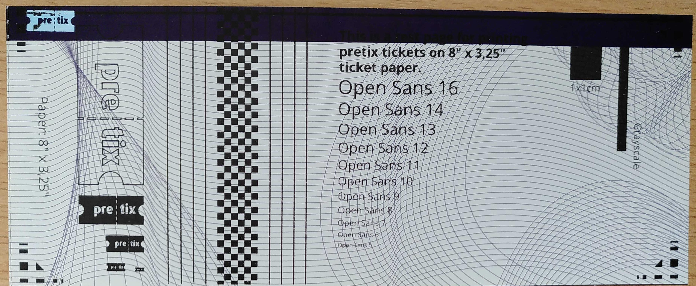

# Drucker einrichten: Boca Lemur und Boca Lemur C 

Bei diesem Artikel handelt es sich um eine Schnellstart-Anleitung für die Verwendung von Druckern der Marke Boca zusammen mit pretix. 
Er erklärt, wie Sie den Drucker aufbauen und über die App pretixPRINT mit Kassen oder Scan-Smartphones verbinden. 
Falls Sie den Drucker mit einem Desktop-Computer verbinden wollen, konsultieren Sie die Dokumentation des Herstellers. 

!!! Note
    Diese Seite ersetzt nicht die Dokumentation für die Geräte selbst. 
    Informieren Sie sich auf der Webseite des Herstellers über die Modelle [Boca Lemur](https://tls-bocasystems.com/de/225/lemur/) und [Boca Lemur C](https://tls-bocasystems.com/de/232/lemur-c/). 

Die Geräte Boca Lemur und Boca Lemur C unterscheiden sich in ihrem Aufbau nur in folgenden Punkten voneinander: 

 - Stromversorgung (Lemur: integriertes Netzteil und Kaltgeräteanschluss. Lemur C: externes Netzteil)
 - Position der Buttons und LEDs (Lemur: linke Seite bei Blick auf die Papierausgabe. Lemur C: rechte Seite). 
   Der Netzschalter befindet sich bei beiden Geräten rechts. 
 - Bildschirm (der Lemur besitzt einen Bildschirm, der Lemur C nicht)
 - maximale Druckbreite (Lemur: 101mm. Lemur C: 82mm)

## Voraussetzungen

Für die Stromversorgung des Geräts benötigen Sie eine Steckdose in der Nähe. 
Für die Netzwerkverbindung über LAN brauchen Sie einen Router mit einem freien LAN-Anschluss oder eine alternative Lösung. 
Als Material benötigen Sie kompatibles bedruckbares Thermopapier, z.B. in Form von Tickets oder Butterfly-Badges, mit einer Breite von 50mm bis 82mm (Lemur C) oder 50mm bis 101mm (Lemur) und einer schwarzen Steuermarke auf der Rückseite. 

## Anleitung

Mit dem Boca Lemur oder Lemur C können Sie entweder Tickets oder Butterfly-Badges bedrucken. 
Um einen dieser Drucker in Betrieb zu nehmen, sind folgende Schritte notwendig: 

 - [Versorgen Sie Ihren Drucker](#drucker-anschließen) mit Strom, einer Netzwerkverbindung und bedruckbarem Material
 - [Testen Sie die Konfiguration](#konfiguration-testen)
 - Falls die Hardware nicht vorkonfiguriert wurde, [drucken Sie eine Konfigurationsseite](#konfigurationsseite-drucken)
 - [Verbinden Sie den Drucker](#drucker-mit-scan-smartphone-oder-kasse-verbinden) über unsere App pretixPRINT mit der Kasse oder den Scannern. 

Diese Schritte werden im Folgenden genauer erklärt. 

### Drucker anschließen

Überprüfen Sie, ob der Stromschalter des Druckers ausgeschaltet ist, und schalten Sie ihn gegebenenfalls aus. 
Verbinden oder entfernen Sie **keine** Kabel, während der Drucker eingeschaltet ist. 

**Lemur:** Schließen Sie das Kaltgerätekabel zuerst an den Drucker und danach an eine Steckdose an. 
**Lemur C:** Schließen Sie das Netzteil zuerst an den Drucker und danach an eine Steckdose an. 
Lassen Sie den Drucker weiterhin ausgeschaltet. 

Um den Drucker über **LAN** mit dem Netzwerk zu verbinden, stecken Sie ein LAN-Kabel in die Buchse mit der Aufschrift "ETHERNET" an der Rückseite des Druckers. 
Stecken Sie das andere Ende des LAN-Kabels in einen freien LAN-Anschluss an Ihrem Router. 

!!! Warning 
    Es ist möglich, die USB-Ports von Drucker und Kasse beim Verbinden über USB zu beschädigen. 
    Weichen Sie **nicht** von der hier geschilderten Reihenfolge ab, um potenzielle Beschädigungen zu vermeiden. 

Alternativ zur Netzwerkverbindung können Sie den Drucker auch über **USB** direkt an eine Kasse anschließen. 
Um das zu tun, stecken Sie ein USB-Typ-B-Kabel in die entsprechende Buchse an der Rückseite des Druckers. 
Stecken Sie das andere Ende des Kabels in einen freien USB-Anschluss an Ihrer Kasse. 
Ein Anschluss an ein Scan-Smartphone über USB ist **nicht** möglich. 

Schalten Sie das Gerät ein, indem Sie den Schalter an der rechten Seite umlegen. 
Beim Lemur ist der Schalter in einer Nische verborgen. 
Daraufhin sollten der Bildschirm (nur Lemur) und mindestens eine LED an der Seite des Druckers aufleuchten. 

!!! Note 
    Die Anweisungen zum Druckmaterial gelten für die Konfiguration unserer Mietgeräte. 
    Falls Sie Ihre Drucker bei einem Dritthändler gekauft haben oder ihn in einer abweichenden Konfiguration bei uns geordert haben, müssen Sie das Druckmaterial möglicherweise anders einlegen. 

Legen Sie Ihr Druckmaterial passend bereit. 
Die bedruckbare Seite muss nach oben zeigen.
Die schwarzen quadratischen Markierungen müssen sich auf der Unterseite befinden und an dem Ende liegen, das weiter vom Drucker entfernt ist. 
Schieben Sie das Papier in den Drucker, bis dieser das Papier automatisch einzieht. 
Falls der Drucker mit einer Schneideeinrichtung ausgestattet ist (Lemur: manche, Lemur C: alle), schneidet er das erste Ticket bzw. das erste Badge ab. 

### Konfiguration testen

!!! Note 
    Falls Sie Hardware von uns gemietet haben, dann ist sie bereits betriebsbereit konfiguriert. 
    Das gilt auch, falls Sie Hardware von uns gekauft haben und vor dem Versand eine entsprechende Konfiguration in Auftrag gegeben haben. 

    In diesen Fällen müssen Sie die Konfiguration nur testen. 
    Sie können die beiden Unterabschnitte [Konfigurationsseite drucken](boca.de.md#konfigurationsseite-drucken) und [Drucker mit Scan-Smartphone oder Kasse verbinden](boca.de.md#drucker-mit-scan-smartphone-oder-kasse-verbinden) überspringen. 

Um die Konfiguration zu testen, starten Sie das Android-Gerät (Kasse oder Scan-Smartphone), von dem Sie den Drucker ansteuern wollen. 
Überprüfen Sie, ob das Gerät mit einem WLAN verbunden ist, dessen Name mit `pretix_onsite` beginnt. 
Öffnen Sie die App pretixPRINT. 

pretixPRINT erlaubt die Einrichtung von Druckern für drei verschiedene Verwendungszwecke: Belegdrucker, Ticketdrucker und Badgedrucker. 
Falls ein Drucker für eine dieser Rollen eingerichtet ist, wird er unter der entsprechenden Überschrift mit der Art der Verbindung und gegebenenfalls seiner IP-Adresse angezeigt. 

Tippen Sie neben der Anzeige des Druckers in pretixPRINT das Drei-Punkte-Menü :btn-icon:fa3-ellipsis-v:: und dann :btn:Testseite drucken:. 
Beobachten Sie, ob der Drucker wie erwartet eine Testseite produziert. 
Falls Sie mehrere Drucker für je Badge-, Ticket- oder Belegdruck von dem Android-Gerät aus ansteuern wollen, führen Sie den Schritt einmal für jeden der Drucker durch. 

Falls der Drucker keine Testseite produziert oder es dabei zu Problemen kommt, lesen Sie den Abschnitt [Problemlösung](boca.de.md#problemlosung). 
Um die gesamte Konfiguration selbst vorzunehmen, lesen Sie die beiden Unterabschnitte [Konfigurationsseite drucken](boca.de.md#konfigurationsseite-drucken) und [Drucker mit Scan-Smartphone oder Kasse verbinden](boca.de.md#drucker-mit-scan-smartphone-oder-kasse-verbinden). 

### Konfigurationsseite drucken

Um eine Konfigurationsseite auszudrucken, drücken Sie an der Seite des Geräts den Button mit der Beschriftung "TEST". 
Die Konfigurationsseite könnte z.B. so aussehen: 

Die IP-Adresse befindet sich im oberen linken Viertel des Ausdrucks in der Zeile, die mit `IP ADD=` beginnt. 
Im Beispielfoto oben lautet Sie `192.168.214.142`. 
Bei Ihrem Drucker wird sie wahrscheinlich anders lauten. 
Diese IP-Adresse benötigen Sie, um Scan-Smartphones und Kassen mit den Druckern zu verbinden. 
Das wird im nächsten Abschnitt näher erklärt. 

### Drucker mit Scan-Smartphone oder Kasse verbinden

Auf Android-Geräten (Scan-Smartphone und Kasse) können Sie unsere App pretixPRINT benutzen, um Drucker anzusteuern. 
Dieser Abschnitt erklärt, wie Sie die Drucker Lemur und Lemur C über die App verbinden und die Funktion testen. 

pretixPRINT erlaubt die Einrichtung von Druckern für drei verschiedene Verwendungszwecke: Belegdrucker, Ticketdrucker und Badgedrucker. 
Daher zeigt die App drei verschiedene Schaltflächen mit der Beschriftung "Drucker einrichten" an. 
Entscheidend ist die Überschrift oberhalb der Schaltfläche, die dem Verwendungszweck entspricht. 

Drucker für Belege und Tickets richten Sie üblicherweise an einer Kasse ein. 
Das ermöglicht es, für jede Transaktion am POS einen Kaufbeleg und die erworbenen Tickets auszudrucken. 
Badgedrucker richten Sie dagegen normalerweise am Scanner ein, um am Einlass für jede teilnehmende Person ein passendes Badge zu drucken. 

Die Drucker Lemur und Lemur C sind sowohl für die Verwendung als Ticketdrucker als auch als Badgedrucker geeignet. 
Um den Drucker als Ticketdrucker mit einer Kasse zu verbinden, öffnen Sie pretixPRINT auf der Kasse und tippen dann unter "Ticketdrucker" auf :btn:Drucker einrichten. 
Um den Drucker als Badgedrucker mit einem Scan-Smartphone zu verbinden, öffnen Sie pretixPRINT auf dem Scan-Smartphone und tippen dann unter "Badgedrucker" auf :btn:Drucker einrichten. 
Unabhängig von Ihrer Auswahl ist der Prozess danach immer der gleiche. 

Falls der Drucker über das **Netzwerk** verbunden ist, wählen Sie auf der Seite "Wie ist Ihr Drucker verbunden?" die Option "Netzwerk (LAN/WLAN)" und tippen :btn:Weiter:. 
Geben Sie die IP-Adresse des Druckers ein. 
Das Feld "Port" können Sie in den meisten Fällen unverändert lassen. 
Tippen Sie dann :btn:Weiter:. 

Falls der Drucker über **USB** verbunden ist, wählen Sie auf der Seite "Wie ist Ihr Drucker verbunden?" die Option "USB (experimentell, funktioniert nicht auf allen Geräten)". 
Tippen Sie dann den Button :btn:Gerät auswählen: und wählen Sie den Drucker aus der Liste aus. 
Daraufhin trägt die App die Seriennummer in das entsprechende Feld ein. 
Tippen Sie dann :btn:Weiter:. 

Auf der Seite "Welches Protokoll spricht Ihr Drucker?" wählen Sie "FGL-Ticketdrucker (z.B. Boca, Practical Automation, ...)" und tippen Sie :btn:Weiter:. 

Wenn Sie den Drucker von uns gemietet haben, dann lassen Sie auf der nächsten Seite unter "DPI" die Eingabe `200` unverändert, da der Drucker nur 200 DPI unterstützt. 
Andere Drucker sind möglicherweise anders konfiguriert. 
Die richtige Auflösung können Sie dem Typenschild auf der Unterseite des Druckers entnehmen. 
Nehmen Sie hier gegebenenfalls Feineinstellungen vor und tippen Sie erneut :btn:Weiter:. 

Tippen Sie :btn:Testseite drucken: und beobachten Sie, ob der verbundene Drucker wie erwartet druckt. 
Tippen Sie :btn:Einstellungen speichern:. 

!!! Note 
    Die Konfigurationsseite des Druckers und die Testseite von pretixPRINT erfüllen unterschiedliche Funktionen. 
    Die Konfigurationsseite des Druckers testet die Funktion des Druckers und enthält Informationen zur Verbindung wie die IP-Adresse. 
    Die Testseite von pretixPRINT bestätigt, dass die Verbindung zwischen dem Gerät (Kasse oder Scan-Smartphone) und dem Drucker besteht und dass die beiden Geräte mit dem richtigen Protokoll kommunizieren. 

Wiederholen Sie diese Schritte an allen Geräten, mit denen Sie drucken möchten. 
Die pretixPRINT-Testseite könnte beim Lemur und Lemur C z.B. so aussehen: 

Falls bei der pretixPRINT-Testseite Probleme auftauchen, werfen Sie einen Blick auf [den entsprechenden Abschnitt](boca.de.md#drucker-druckt-pretixprint-testseite-nicht) unter [Problemlösung](boca.de.md#problemlosung). 

## Problemlösung 

### Drucker druckt nicht

**Problem:** Sie können den Drucker nicht dazu bringen, zu drucken – nicht einmal seine eigene Konfigurationsseite wie beschrieben unter [Konfigurationsseite drucken](boca.de.md#Konfigurationsseite-drucken). 

**Lösung:** Stellen Sie sicher, dass: 

 - der Drucker mit Strom versorgt wird (das Netzteil/Stromkabel sollte verbunden sein und "READY"-LED oder Display am Drucker sollten leuchten)
 - das passende Material eingelegt ist
 - das Material richtig eingelegt ist
 - das Gehäuse des Druckers geschlossen ist

Wenn all diese Punkte erfüllt sind, liegt möglicherweise ein technisches Problem vor. 
Lesen Sie die Dokumentation des Herstellers oder kontaktieren Sie unseren [Support](mailto:support@pretix.eu). 

### IP-Adresse auf der Konfigurationsseite lautet 0.0.0.0 

**Problem:** Die Konfigurationsseite des Druckers liefert als IP-Adresse `0.0.0.0` oder ein ähnlich unbrauchbares Ergebnis. 
Der Drucker ist also nicht mit dem Netzwerk verbunden. 

**Lösung:** Prüfen Sie, ob das LAN-Kabel richtig in der Buchse des Druckers steckt. 
Prüfen Sie, ob das andere Ende desselben LAN-Kabels in der LAN-Buchse (**nicht** in der WAN-Buchse) des Routers steckt. 
Verwenden Sie gegebenenfalls ein anderes Kabel. 
Danach starten Sie den Drucker neu. 

Geben Sie dem Drucker etwa eine Minute Zeit, um sich mit dem Netzwerk zu verbinden. 
Drucken Sie dann eine neue Konfigurationsseite aus, um die korrekte IP-Adresse zu erhalten. 

### Drucker druckt pretixPRINT-Testseite nicht

**Problem:** Der Drucker druckt die eigene Konfigurationsseite zwar richtig aus, aber nicht die pretixPRINT-Testseite wie beschrieben unter [Drucker mit Scan-Smartphone oder Kasse verbinden](boca.de.md#drucker-mit-scan-smartphone-oder-kasse-verbinden). 

**Lösung:** Überprüfen Sie zuerst, ob pretixPRINT auf dem Gerät womöglich für die Benutzung mit einem anderen Drucker konfiguriert ist. 
Dazu versorgen Sie alle mitgelieferten Drucker mit Strom, Netzwerkverbindung und Druckmaterial. 
Versuchen Sie dann erneut, die pretixPRINT-Testseite zu drucken. 

Falls die Testseite nun von einem anderen Drucker ausgedruckt wird, bedeutet das, dass pretixPRINT auf dem Gerät für die Benutzung mit diesem Drucker konfiguriert ist. 
Passen Sie Ihren Hardware-Aufbau entsprechend an. 

Falls die Testseite von keinem der Drucker ausgedruckt wird, liegt ein anderes Problem vor. 
Stellen Sie sicher, dass das Gerät, auf dem pretixPRINT läuft, mit dem korrekten WLAN verbunden ist (bei von uns vermieteten Routern fängt der Netzwerkname mit `pretix-onsite` an). 

Überprüfen Sie die IP-Adresse in pretixPRINT und korrigieren Sie sie gegebenenfalls. 
Stellen Sie auch sicher, dass in pretixPRINT das richtige Protokoll ausgewählt ist (plus gegebenenfalls der richtige Dialekt). 
Die Auswahl des Protokolls hängt vom Modell des Druckers ab. 
Für mehr Informationen zu IP-Adresse und Protokoll lesen Sie den Abschnitt [Drucker mit Scan-Smartphone oder Kasse verbinden](boca.de.md#drucker-mit-scan-smartphone-oder-kasse-verbinden). 

Speichern Sie die Einstellungen in pretixPRINT und testen Sie erneut. 

### Druckauftrag kommt auf einem anderen Drucker an

**Problem:** Die pretixPRINT-Testseite oder Ihre anderen Druckaufträge werden zwar gedruckt, aber von einem anderen Drucker als erwartet. 
Die in pretixPRINT hinterlegte IP-Adresse ist also nicht die des gewünschten Druckers. 

**Lösung:** Verwenden Sie das Gerät mit dem verbundenen Drucker. 
Passen Sie Ihren Hardware-Aufbau entsprechend an. 

Alternativ können Sie die IP-Adresse auf die des gewünschten Druckers ändern. 
Speichern Sie die Einstellungen und testen Sie erneut. 

### Druckauftrag enthält fehlerhafte Zeichen 

**Problem:** Die pretixPRINT-Testseite oder Ihre anderen Druckaufträge werden zwar ausgedruckt, enthalten aber fehlerhafte Zeichen (z.B. Sonderzeichen oder zufällige Zeichenfolgen). 
Das deutet darauf hin, dass in pretixPRINT das falsche Protokoll für den Drucker konfiguriert ist. 

**Lösung:** Ändern Sie in pretixPRINT Protokoll und gegebenenfalls Dialekt, mit dem das Gerät den Drucker anspricht. 
Speichern Sie die Einstellungen und testen Sie erneut. 

### Druck ist falsch gedreht 

**Problem:** Das Drucken funktioniert zwar, aber das Ergebnis ist so gedreht, dass es nicht vollständig lesbar ist oder nicht gut aussieht. 
In pretixPRINT ist die Drehung also nicht richtig konfiguriert. 

**Lösung:** Öffnen Sie auf dem Android-Gerät pretixPRINT und tippen Sie unter dem betreffenden Druckertyp "Drucker einrichten". 
Tippen Sie :btn:Weiter: bis Sie die Seite geöffnet haben, auf der das Dropdown-Menü "Drehung" angezeigt wird. 
Die Standardeinstellung hier ist `0°`. 

Ändern Sie diese Einstellung entgegen der Fehldrehung auf dem Druck. 
Tippen Sie :btn:Weiter: und dann :btn:Testseite drucken:. 
Wenn der Druck jetzt richtig gedreht ist, tippen Sie :btn:Einstellungen speichern:. 
Falls nicht, tippen Sie :btn:Zurück: und ändern die Einstellung "Drehung" auf einen anderen Wert. 

### Druck ist verschmutzt oder fleckig

**Problem:** Der Druck ist zwar sinnvoll, enthält aber schwarze Flecken, weiße Stellen, oder ist verschmutzt. 
Das bedeutet, dass der Druckkopf verschmutzt ist. 

**Lösung:** Reinigen Sie den Druckkopf und gegebenenfalls andere Teile im Inneren des Druckers nach Vorgabe des Herstellers. 
Ziehen Sie dazu die Dokumentation des Herstellers zu Rate: [Lemur: Thermal Print Head](https://tls-bocasystems.com/pdf/tls-boca-systems-uk-manual-l-series.pdf#%5B%7B%22num%22%3A64%2C%22gen%22%3A0%7D%2C%7B%22name%22%3A%22XYZ%22%7D%2C33%2C774%2C0%5D) oder [Lemur C: Thermal Print Head](https://tls-bocasystems.com/pdf/tls-boca-systems-uk-manual-lemur-c.pdf#%5B%7B%22num%22%3A57%2C%22gen%22%3A0%7D%2C%7B%22name%22%3A%22XYZ%22%7D%2C33%2C774%2C0%5D). 

### Druck ist blass oder streifig

**Problem:** Der Druck ist zwar sinnvoll, ist aber zu blass oder hat hellere und dunklere Streifen. 
Das bedeutet, dass das Druckmaterial zu sehr gealtert sind. 

**Lösung:** Entfernen Sie das Druckmaterial aus dem Drucker. 
Trennen Sie die ersten zehn Tickets oder Badges ab. 
Legen Sie den Stapel dann erneut in den Drucker ein. 
Falls Sie weitere Stapel mit Tickets oder Badges haben, können Sie alternativ einen der anderen Stapel einlegen und testen. 

Thermopapier altert und ist empfindlich gegenüber Licht und Wärme. 
Das kann in manchen Fällen den Druck unbrauchbar machen.  
Je nach Lagerung sind davon in erster Linie die obersten Tickets oder Badges betroffen. 

### Druck ist leer oder enthält nur Teile des Layouts 

**Problem:** Gedruckte Tickets oder Badges sind leer oder enthalten nur Teile des Layouts, z.B. nur das pretix-Logo. 
Das Layout ist also zu groß für das Druckmaterial. 

**Lösung:** Ändern Sie das Layout so, dass es auf das Papier passt. 

Öffnen Sie dazu das pretix-Backend und navigieren Sie zu :navpath:Ihre Veranstaltung → :fa3-wrench: Einstellungen → Tickets:. 
Klicken Sie :btn-icon:fa3-paint-brush: Layout-Editor öffnen: oder :btn:Erweiterter Modus (mehrere Layouts) und bearbeiten Sie das relevante Layout. 

Laden Sie ein PDF als Hintergrund in der Größe Ihres Druckmaterials hoch.
Alternativ wählen Sie die Papiergröße so, dass sie Ihrem Druckmaterial entspricht oder etwas kleiner ist. 

### Drucker schneidet Papier an der falschen Stelle ab 

**Problem:** Der Drucker schneidet Tickets oder Badges nach dem Drucken an der falschen Stelle ab (mehr als ein paar Millimeter neben der Schnittkante). 

**Lösung:** Stellen Sie sicher, dass: 

 - das Druckmaterial richtig herum bereitgelegt ist. 
   Die bedruckbare Seite muss nach oben zeigen. 
   Die Steuermarken (schwarze quadratische Markierungen) müssen an dem Ende liegen, das weiter vom Drucker entfernt ist. 
 - der Sensor an der richtigen Position ist. 
   Ziehen Sie dazu die Dokumentation des Herstellers zu Rate: [Lemur: Cut or Tear Opto](https://tls-bocasystems.com/pdf/tls-boca-systems-uk-manual-l-series.pdf#%5B%7B%22num%22%3A53%2C%22gen%22%3A0%7D%2C%7B%22name%22%3A%22XYZ%22%7D%2C33%2C774%2C0%5D) oder [Lemur C: Cut or Tear SQ Opto](https://tls-bocasystems.com/pdf/tls-boca-systems-uk-manual-lemur-c.pdf#%5B%7B%22num%22%3A53%2C%22gen%22%3A0%7D%2C%7B%22name%22%3A%22XYZ%22%7D%2C33%2C774%2C0%5D). 

## Weitere Informationen

 - [Boca Lemur: Inbetriebname](https://www.youtube.com/watch?v=w5n8h9GMDyg) auf YouTube (deutsch)
 - [Boca Lemur: Öffnen des Druckkopfs](https://www.youtube.com/watch?v=xmT-tPVkHhs) auf YouTube (deutsch)
 - [Boca Lemur C: Öffnen des Druckkopfs]( https://www.youtube.com/watch?v=zjdRD_SUmhA) auf YouTube (deutsch)