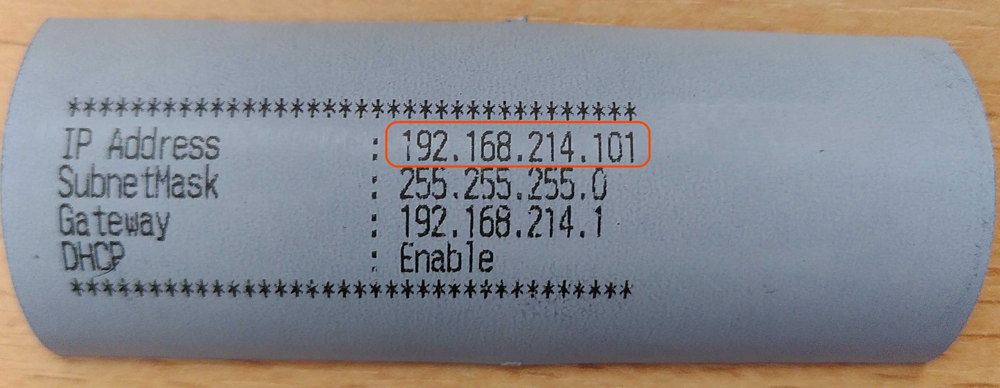

# Drucker einrichten: Epson TM-m30iii und Epson TM-T88vii 

Bei diesem Artikel handelt es sich um eine Schnellstart-Anleitung für die Verwendung von Druckern der Marke Epson zusammen mit pretix. 
Er erklärt, wie Sie den Drucker aufbauen und über die App pretixPRINT mit Kassen oder Scan-Smartphones verbinden. 

Note !!! 
    Diese Seite ersetzt nicht die Dokumentation für die Geräte selbst. 
    Informieren Sie sich auf der Webseite des Herstellers über die Modelle [Epson TM-m30iii](https://www.epson.de/de_DE/support/sc/tm-m30iii/s/s3018#manuals) und [Epson TM-T88vii](https://www.epson.de/de_DE/support/sc/tm-t88vii/s/s2258#manuals). 

Die Geräte Epson TM-m30iii und TM-T88vii unterscheiden sich in der Bedienung nur in folgenden Punkten voneinander: 

 - Position des Stromschalters (TM-m30iii: Oberseite. TM-T88vii: Vorderseite)
 - Öffnen der Materialklappe (TM-m30iii: nach hinten schieben. TM-T88vii: nach unten drücken)
 - Die Anschlüsse am TM-m30iii sind unter einer Abdeckung verborgen, die entfernt werden kann. 

## Voraussetzungen

Für die Stromversorgung des Geräts benötigen Sie eine Steckdose in der Nähe. 
Für die Netzwerkverbindung brauchen Sie einen Router mit einem freien LAN-Anschluss oder eine alternative Lösung. 
Sie benötigen aufgerolltes bedruckbares Thermopapier mit einer Breite von 80mm. 

## Anleitung

Sie können den Epson TM-m30iii und den TM-T88vii als Belegdrucker verwenden. 
Sie müssen Ihren Drucker mit Strom, einer Netzwerkverbindung und bedruckbarem Material versorgen. 
Dann drucken Sie eine Testseite. 
Schließlich verbinden Sie den Drucker über unsere App pretixPRINT mit der Kasse oder den Scannern. 
Diese Schritte werden im folgenden genauer erklärt. 

#### Drucker anschließen

Legen Sie zunächst das Druckmaterial in den Drucker ein. 
Stellen Sie dazu zuerst sicher, dass der Drucker nicht mit dem Strom verbunden ist und nicht eingeschaltet ist. 

**TM-m30iii:** Schieben Sie den grauen Hebel an der Oberseite des Geräts nach hinten und öffnen Sie die Materialklappe. 
**TM-T88vii:** Drücken Sie das graue Element an der Oberseite des Geräts nach unten und öffnen Sie die Materialklappe. 
Legen Sie die Papierrolle so in die Vertiefung im inneren des Geräts, dass das Papier an der Vorderseite des Innenraums nach oben läuft. 
Ziehen Sie das Papier ein Stück weit nach oben und schließen Sie die Klappe, sodass das Papier glatt und gerade aus dem Schlitz ragt. 

Überprüfen Sie, ob der Stromschalter des Druckers ausgeschaltet ist, und schalten Sie ihn gegebenenfalls aus. 
Verbinden oder entfernen Sie **keine** Kabel, während der Drucker eingeschaltet ist. 
Alle Anschlüsse befinden sich hinten und unten am Gerät. 
Beim TM-m30iii können Sie die Abdeckung an der Unterseite des Geräts entfernen, um Zugang zu den Anschlüssen zu erhalten. 

Um den Drucker über **LAN** anzuschließen, stecken Sie ein LAN-Kabel in die entsprechende Buchse am Drucker. 
Stecken Sie das andere Ende des LAN-Kabels in den freien LAN-Anschluss an Ihrem Router. 

Alternativ zum Anschluss über LAN können Sie den Drucker auch über **USB** anschließen. 
Um das zu tun, stecken Sie ein USB-Typ-B-Kabel in die entsprechende Buchse am Drucker. 
Stecken Sie das andere Ende des Kabels in einen freien USB-Anschluss an Ihrer Kasse. 

**TM-m30iii:** Drücken Sie den Stromschalter an der Oberseite des Druckers ein. 
**TM-T88vii:** Legen Sie den Stromschalter an der Vorderseite des Druckers um. 

#### Testseite drucken

Die Drucker produzieren innerhalb einer Minute nach dem Einschalten automatisch eine Testseite. 
Das funktioniert nur, wenn der Drucker mit Stromversorgung und Router verbunden ist und Papier hat. 
Falls Sie erneut eine Testseite drucken wollen, schalten Sie den Drucker aus, warten Sie einen Moment ab, und schalten Sie ihn dann wieder ein. 
Die Testseite könnte z.B. so aussehen: 

Die IP-Adresse des Druckers befindet sich in der Zeile, die mit `IP Address` beginnt. 
Diese IP-Adresse benötigen Sie, um Scan-Smartphones und Kassen mit den Druckern zu verbinden. 
Das wird im nächsten Abschnitt näher erklärt. 

#### Drucker mit Scan-Smartphone oder Kasse verbinden

Auf den Android-Geräten (Scan-Smartphone und Kasse) können Sie unsere App pretixPRINT benutzen, um Drucker anzusteuern. 
Dieser Abschnitt erklärt Ihnen, wie Sie die Drucker TM-m30iii und TM-T88vii über die App verbinden und die Funktion testen. 

pretixPRINT erlaubt die Einrichtung von Druckern für drei verschiedene Verwendungszwecke: Belegdrucker, Ticketdrucker und Badgedrucker. 
Daher zeigt die App drei verschiedene Schaltflächen mit der Beschriftung "Drucker einrichten" an. 
Entscheidend ist die Überschrift oberhalb der Schaltfläche, die dem Verwendungszweck entspricht. 

Beleg- und Ticketdrucker richten Sie üblicherweise an einer Kasse ein. 
Das ermöglicht es, für jede Transaktion am POS einen Kaufbeleg und die erworbenen Tickets auszudrucken. 
Den Badgedrucker richten Sie dagegen am Scanner ein, um am Einlass für jede teilnehmende Person einen passenden Badge zu drucken. 

Sie können die Drucker Epson TM-m30iii und TM-T88vii als Belegdrucker verwenden. 
Um den Drucker als Belegdrucker mit einem Scan-Smartphone oder einer Kasse zu verbinden, öffnen Sie pretixPRINT auf dem Smartphone oder der Kasse und tippen dann unter "Belegdrucker" auf :btn:Drucker einrichten. 
Der Prozess ist danach immer der gleiche. 

Falls der Drucker über das **Netzwerk** verbunden ist, wählen Sie auf der Seite "Wie ist Ihr Drucker verbunden?" die Option "Netzwerk (LAN/WLAN)" und tippen :btn:Weiter:. 
Geben Sie die IP-Adresse des Routers ein. 
Das Feld "Port" können Sie in den meisten Fällen unverändert lassen. 
Tippen Sie dann :btn:Weiter:. 

Falls der Drucker über **USB** verbunden ist, wählen Sie auf der Seite "Wie ist Ihr Drucker verbunden?" die Option "USB (experimentell, funktioniert nicht auf allen Geräten)". 
Tippen Sie dann den Button :btn:Gerät auswählen: und wählen Sie den Drucker aus der Liste aus. 
Daraufhin trägt die App die Seriennummer in das entsprechende Feld ein. 
Tippen Sie dann :btn:Weiter:. 

Auf der Seite "Welches Protokoll spricht Ihr Drucker?" wählen Sie "ESC/POS-Bondrucker (z.B. Epson, Bixolon, ...)" und tippen Sie :btn:Weiter:. 
Auf der nächsten Seite wählen Sie unter Dialekt "Epson, Bixolon, Metapace, SNBC", passen Sie falls nötig die Wartezeit an, und tippen :btn:Weiter:. 

Tippen Sie :btn:Testseite drucken: und beobachten Sie, ob der verbundene Drucker wie erwartet druckt. 
Tippen Sie :btn:Einstellungen speichern:. 

!!! Note 
    Die Testseite des Druckers und die Testseite von pretixPRINT erfüllen unterschiedliche Funktionen. 
    Die Testseite des Druckers testet die Funktion des Druckers und enthält Informationen zur Verbindung wie die IP-Adresse. 
    Die Testseite von pretixPRINT bestätigt, dass die Verbindung zwischen dem Gerät (Kasse oder Scan-Smartphone) und dem Drucker besteht und dass die beiden Geräte mit dem richtigen Protokoll kommunizieren. 

Wiederholen Sie diese Schritte an allen Geräten, mit denen Sie drucken möchten. 
Die pretixPRINT-Testseite könnte beim Epson TM-m30iii und TM-T88vii z.B. so aussehen: 

Falls bei der pretixPRINT-Testseite Probleme auftauchen, werfen Sie einen Blick auf [den entsprechenden Abschnitt](epson.de.md#drucker-druckt-pretixprint-testseite-nicht) unter [Problemlösung](epson.de.md#problemlösung). 

## Problemlösung 

#### Drucker druckt die eigene Testseite nicht

**Problem:** Sie können einen Drucker nicht dazu bringen können, seine eigene Testseite zu drucken wie beschrieben unter [Testseite drucken](epson.de.md#testseite-drucken). 

**Lösung:** Überprüfen Sie: 

 - ob der Drucker mit Strom versorgt wird (das Netzteil/Stromkabel sollte verbunden sein und Status-LED oder Display am Drucker sollten leuchten)
 - ob das passende Material eingelegt ist
 - ob das Material richtig eingelegt ist
 - ob das Gehäuse des Druckers geschlossen ist

Wenn all diese Punkte erfüllt sind, liegt möglicherweise ein technisches Problem vor. 
Lesen Sie die Dokumentation des Herstellers oder kontaktieren Sie unseren [Support](mailto:support@pretix.eu). 

#### Drucker druckt pretixPRINT-Testseite nicht

**Problem:** Der Drucker druckt die eigene Testseite zwar richtig aus, aber nicht die pretixPRINT-Testseite wie beschrieben unter [Drucker mit Scan-Smartphone oder Kasse verbinden](epson.de.md#drucker-mit-scan-smartphone-oder-kasse-verbinden). 

**Lösung:** Überprüfen Sie: 

 - ob das Gerät, auf dem pretixPRINT läuft, mit dem korrekten WLAN verbunden ist (bei Mieten fängt der Name an mit `pretix-onsite`)
 - ob die IP-Adresse in pretixPRINT korrekt ist
 - ob in pretixPRINT das richtige Protokoll ausgewählt ist (plus gegebenenfalls der richtige Dialekt) 

Speichern Sie die Einstellungen in pretixPRINT und testen Sie erneut. 

#### Druckauftrag kommt auf einem anderen Drucker an

**Problem:** Die pretixPRINT-Testseite oder Ihre anderen Druckaufträge werden zwar gedruckt, aber von einem anderen Drucker als erwartet. 

**Lösung:** Die in pretixPRINT hinterlegte IP-Adresse ist nicht die des gewünschten Druckers. 
Verwenden Sie das Gerät mit dem verbundenen Drucker. 
Passen Sie Ihren Hardware-Aufbau entsprechend an. 

Alternativ können Sie die IP-Adresse auf die des gewünschten Druckers ändern. 
Speichern Sie die Einstellungen und testen Sie erneut. 

#### Druckauftrag enthält Unsinn 

**Problem:** Die pretixPRINT-Testseite oder Ihre anderen Druckaufträge werden zwar ausgedruckt, enthalten aber Unsinn (z.B. Sonderzeichen oder zufällige Zeichenfolgen). 

**Lösung:** In pretixPRINT ist das falsche Protokoll für den Drucker konfiguriert. 
Ändern Sie in pretixPRINT Protokoll und gegebenenfalls Dialekt, mit dem das Gerät den Drucker anspricht. 
Speichern Sie die Einstellungen und testen Sie erneut. 

## Weitere Informationen

 - [EPSON TM-m30ii: Inbetriebnahme ](https://www.youtube.com/watch?v=iT_66QIcY0I) auf YouTube (deutsch)
