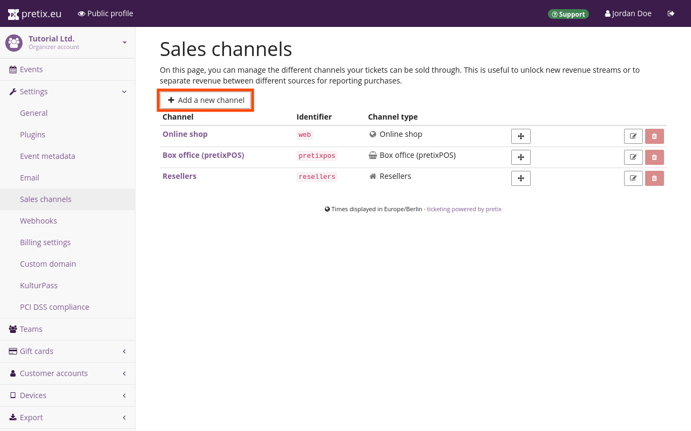
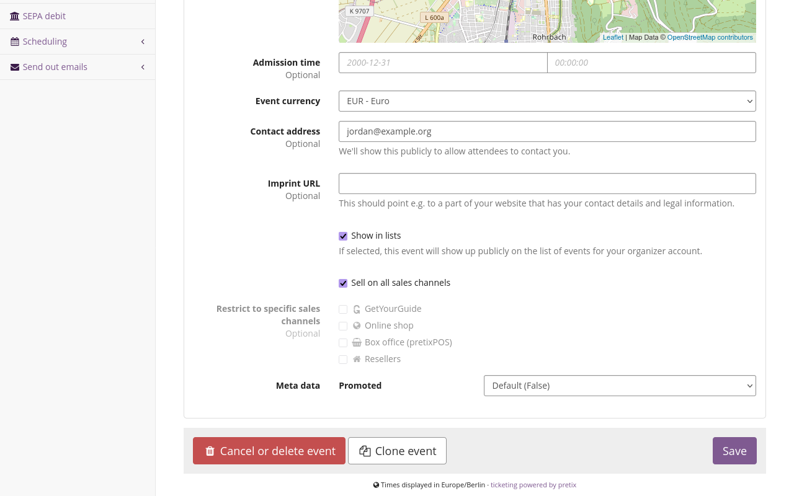
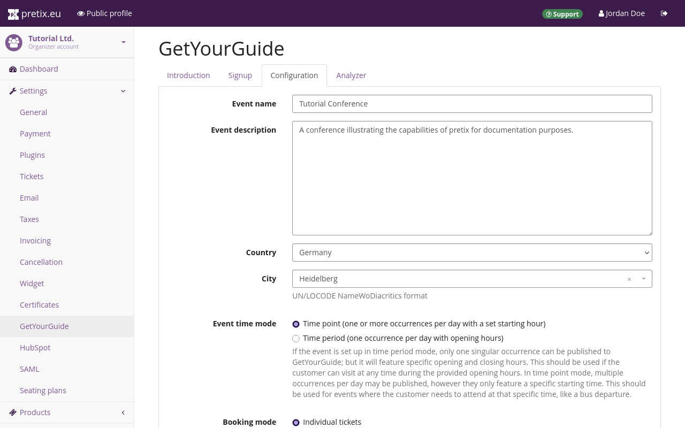
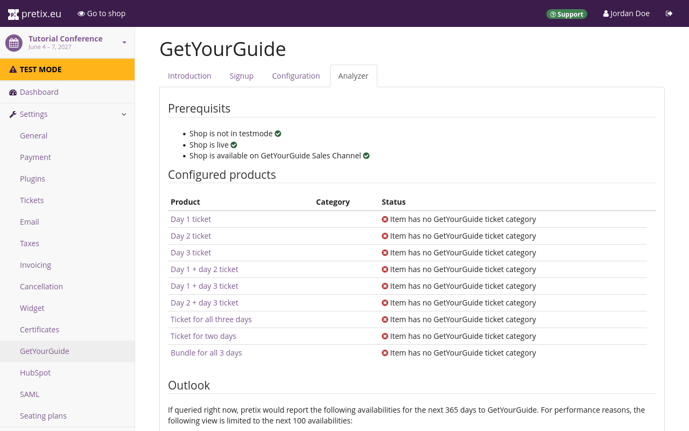

# GetYourGuide

You can use third-party aggregators such as GetYourGuide to sell tickets not only through your own ticket shop, but also through the aggregator's website. 
Using GetYourGuide entails additional cost, but it allows you to reach a larger audience that would otherwise not have found their way to your shop. 

pretix offers an integration with GetYourGuide that allows you to benefit from an additional sales and revenue channel, while keeping the effort for setting up and maintaining multiple ticket shops at a minimum. 
This article is going to tell you how to do that. 

## Prerequisites

If you want to use the GetYourGuide integration for pretix, then you need to have access to an active GetYourGuide supplier account. 
The GetYourGuide integration is handled on the event level, so you have to create an event first. 

## How to 

Setting up the GetYourGuide integration involves the following steps: 

 1. Ask pretix support to [make the GetYourGuide plugin available](getyourguide.md#setting-up-your-organizer-account-for-getyourguide) for your account. 
 2. Create a [sales channel](getyourguide.md#setting-up-your-organizer-account-for-getyourguide))
 3. Enable the [plugin](getyourguide.md#setting-up-your-event-for-getyourguide)
 4. Configure [products](getyourguide.md#setting-up-products-for-getyourguide)
 5. [Connect](getyourguide.md#connecting-to-getyourguide) to GetYourGuide

This article will guide you through those steps in detail. 

### Setting up your organizer account for GetYourGuide

The pretix integration with GetYourGuide is currently in beta. 
The pretix team has to make it available for your organizer account before you can use it. 
Contact support via [email](mailto:support@pretix.eu) or [phone](tel:+4962213217750) and ask them to make the GetYourGuide plugin available for you. 

The second action you need to take on your organizer account before you can use GetYourGuide is to create a corresponding sales channel on your organizer account. 
pretix will use the sales channel to properly attribute sales via GetYourGuide. 
This means that pretix will register all orders placed through GetYourGuide to the "GetYourGuide" sales channel. 

Navigate to :navpath:Your organizer → :fa3-wrench: Settings → Sales channels:. 
Click the :btn-icon:fa3-plus: Add a new channel: button. 
On the page titled "Add sales channel", select :btn:GetYourGuide:. 
Click the :btn:Save: button. 

Repeat these steps for every additional organizer account that you want to integrate with GetYourGuide. 

### Setting up your event for GetYourGuide

In order to enable the GetYourGuide plugin for your event, navigate to :navpath:Your event → :fa3-wrench: Settings → Plugins: and open the :btn:Integrations: tab. 
Seek out the plugin labeled "GetYourGuide" in the list and click the :btn:Enable: button next to it. 
Now that you have enabled the GetYourGuide plugin, the pretix integration with GetYourGuide and all settings associated with it are available for your event. 

In order to sell tickets for your event via the GetYourGuide sales channel, navigate to :navpath:Your event → :fa3-wrench: Settings → General:. 
Under "Sales channels", check the box next to "GetYourGuide" or the box next to "Sell on all sales channels". 

In order to set up your offer for the GetYourGuide website, navigate to :navpath:Your event → :fa3-wrench: Settings → GetYourGuide: and open the :btn:Configuration: tab. 
Supply the required information and select the "Event time mode" as well as the "Booking mode". 

For each of your events, you can only offer either individual tickets or group tickets through GetYourGuide. 
For more information on individual vs. group tickets, see the [next section](getyourguide.md#setting-up-products-for-getyourguide). 
Once you are happy with your choices, click the :btn:Save: button. 

Repeat these steps for every additional event for which you want to sell products via GetYourGuide. 

### Setting up products for GetYourGuide 

Configure at least one product to be sold via GetYourGuide. 
In order to do so, navigate to :navpath:Your event → :fa3-ticket: Products: and create or edit a product. 
Switch to the :btn:Availability: tab and under "Sales channels", check the box next to "GetYourGuide" or the box next to "Sell on all sales channels". 

Then, switch to the :btn:GetYourGuide: tab and set the GetYourGuide equivalent ticket category. 
This "Ticket Category" setting is only relevant for the sale through GetYourGuide. 
It is completely separate from the "Categories" settings within pretix. 

There can only be one product per GetYourGuide ticket category for each one of your events. 
For each one of your pretix events, you can only either sell individual tickets or group tickets via GetYourGuide—not both. 

If you selected the booking mode **"Group tickets"**, then, under "Ticket Category", you need to select "Group". 
You can only offer one product through GetYourGuide for this event. 
You can use the fields "Minimal group size" and "Maximal group size" to place restrictions on the number of people for whom each ticket is valid. 

If you selected the booking mode **"Individual tickets"**, then you need to add one product to the "Adult" category. 
You can also add other products to the other GetYourGuide categories ("Child", "Youth", "Senior", etc.), but **not** to the "Group" category. 
Each GetYourGuide category may only contain a single product. 

The pretix integration with GetYourGuide overwrites the price settings within GetYourGuide. 
The prices you define for categories on the GetYourGuide website will **not** apply. 
In order to set the price for a product you want to sell via GetYourGuide, edit the product in pretix. 
Open the :btn:Price: tab and under "Default price", enter the intended price. 

Just like with any other product, you also have to add the tickets you intend to sell via GetYourGuide to a quota in pretix before they become available in your shop. 

### Connecting to GetYourGuide 

The GetYourGuide backend refers to your pretix event as a "product". 
Open the GetYourGuide [Supplier Portal](https://suppliers.getyourguide.com/) and connect it with your pretix shop. 
In order to do so, follow the instructions for [Connecting a new product to your Reservation System](https://supply.getyourguide.support/hc/en-us/articles/18008029689373-Connecting-a-new-product-to-your-Reservation-system) in the GetYourGuide Supply Partner Help Center.
Select "pretix.eu" as your "reservation system". 
You can find the required "product ID" by navigating to :navpath:Your event → :fa3-wrench: Settings → GetYourGuide: and opening the :btn:Configuration: tab. 
It is displayed in the infobox at the bottom of the page as soon as you have entered and saved all mandatory information. 

Navigate to :navpath:Your event → :fa3-wrench: Settings → GetYourGuide: and open the :btn:Analyzer: tab. 
This page tells you whether your shop and the products in the shop are set up properly for the integration with GetYourGuide. 
If you have a working setup, then you will only see green :fa3-check-circle: and no red :fa3-times-circle: on this page. 

Once your shop is live and the integration with GetYourGuide is working, the analyzer tab displays the availability information that pretix has communicated to GetYourGuide for each product. 
From this point on, GetYourGuide will automatically import products along with their availability status and offer them for sale. 