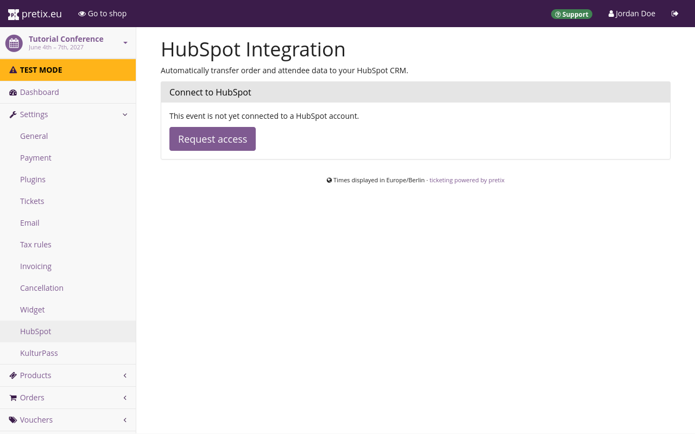
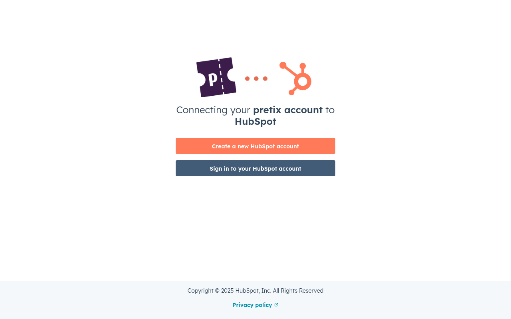
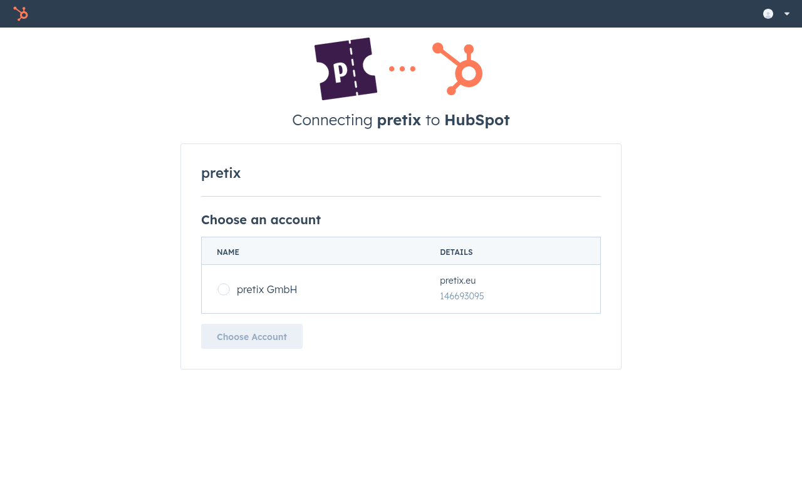
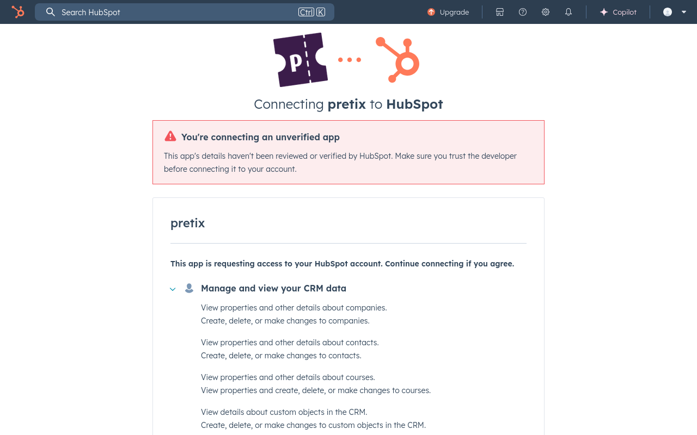
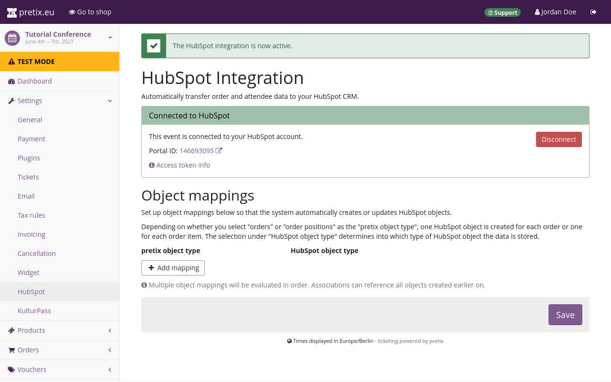
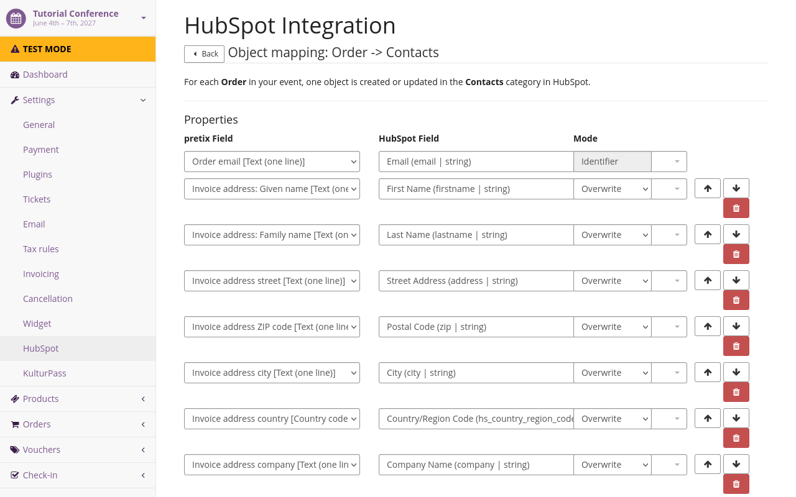
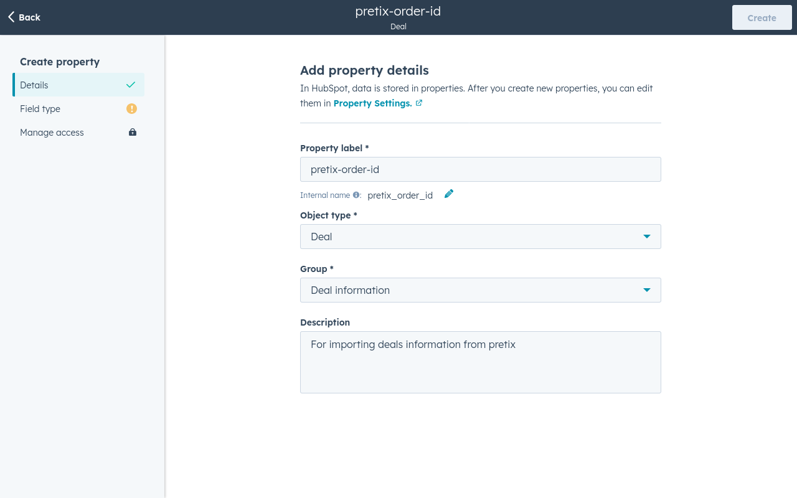
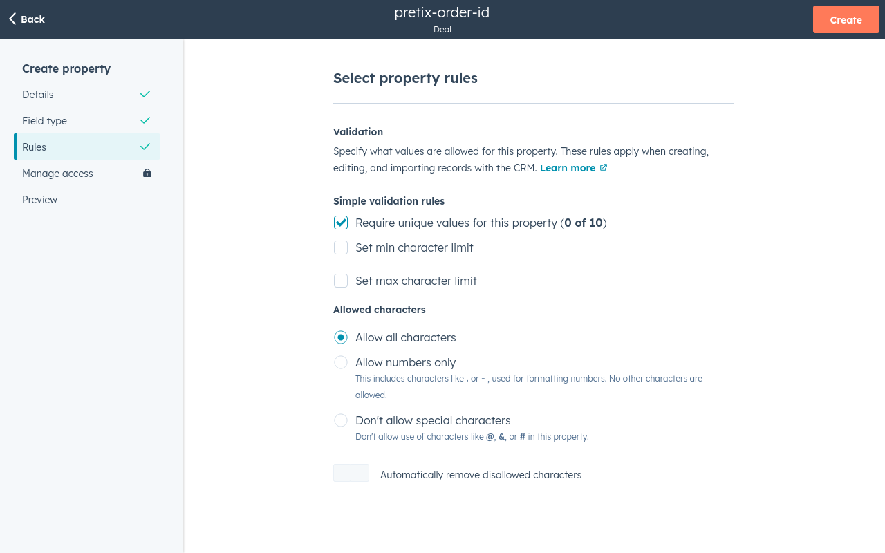
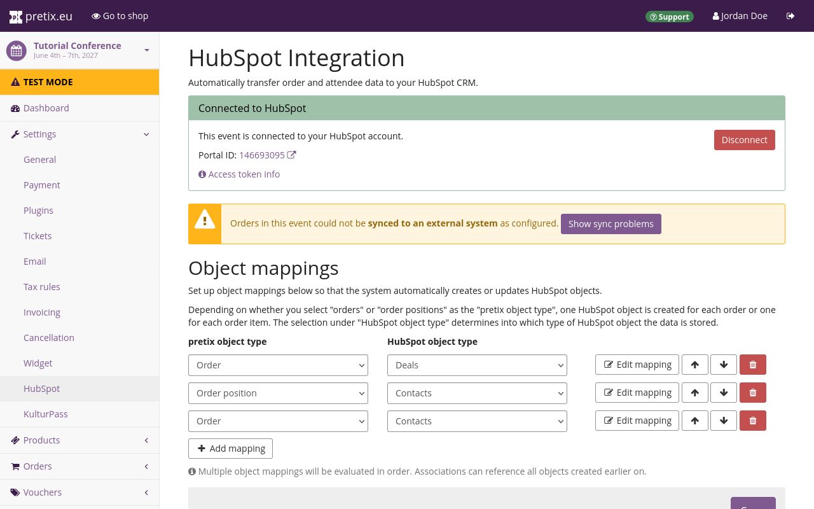
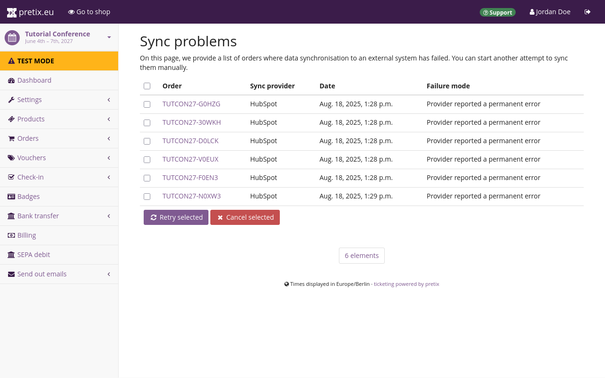

# HubSpot

The HubSpot integration plugin allows you to export data such as customer contact data or transactions to HubSpot. 
This article explains how to use it. 

## Prerequisites

Plugins are handled on the event level, so you have to create an event first. 
You also need to have access to a HubSpot account. 

## General usage

This section explains how to enable the HubSpot plugin and how to set up the connection between your pretix account and your HubSpot account. 
These steps are necessary before you can export any data from pretix to HubSpot. 

### Enabling the plugin

In order to activate the HubSpot plugin, navigate to :navpath:Your Event → :fa3-wrench: Settings → Plugins: and switch to the :btn:Integrations: tab. 
Click the :btn:Enable: button next to the "HubSpot" plugin. 

### Setting up the connection to HubSpot

Click the :btn-icon:fa3-gear: Settings: drop-down menu next to the HubSpot plugin and then click the entry :btn:Settings > HubSpot:. 
Alternatively, navigate to :navpath:Your event → :fa3-wrench: Settings → HubSpot:. 
Both paths take you to a page titled "HubSpot Integration". 

In order to set up the connection to HubSpot, click the :btn:Request access: button. 

This opens a page on HubSpot, prompting you to create a HubSpot account or to sign into your existing one. 

Click the :btn:Sign in to your HubSpot account: button. 
This takes you to a page prompting you to choose an account. 

Click your account in the list and then click the :btn:Choose Account: button. 
The next page warns you that you are connecting an unverified app. 

Scroll to the bottom of the page and click the :btn:Connect app: button. 
Once you have done that, the page will redirect you back to the HubSpot Integration settings page in the pretix backend. 
Instead of the "Request access" button, this page now states that the event is connected to HubSpot and displays settings for object mappings. 

Click the :btn:Save: button. 

## Applications

This section explains some useful applications of the HubSpot integration plugin: 

 - [Adding customers and attendees to your HubSpot contacts database](hubspot.md#adding-customers-and-attendees-to-your-hubspot-contacts-database)
 - [Adding payments to your HubSpot deals database](hubspot.md#adding-payments-to-your-hubspot-deals-database)

Before you can do any of these things, you have to set up the plugin as described in [General usage](hubspot.md#general-usage). 

### Adding customers to your HubSpot contacts database

This section explains how to add customers in pretix to your contacts database in HubSpot. 
Open the pretix backend and navigate to :navpath:Your Event → :fa3-wrench: Settings → HubSpot:. 
Under "Object mappings", change the first entry or, if you are already using it for a different purpose, click the :btn-icon:fa3-plus: Add mapping: button. 

Under "pretix object type", choose "Order position". 
Under "HubSpot order type", choose "Contacts". 
Click the :btn:Save: button. 

In order to change the details of the data that pretix maps to the entries in HubSpot, click the :btn-icon:fa3-edit: Edit mapping: button. 

The first line under "Properties" specifies the identifier. 
Under "pretix Field", select `Order email [Text (one line)]`. 
Under "HubSpot Field", select `Email (email | string)`. 
The "Mode" option is fixed to `Identifier`, meaning that HubSpot will use this line as the unique identifier for an entry in the contacts database. 

Click the :btn-icon:fa3-plus: Add property: button to add a new property to export to HubSpot. 
Map invoice address fields from pretix to corresponding fields in HubSpot. 

Pair pretix fields of the type `Text (one line)` with HubSpot fields of the type `string`. 
Pair pretix fields of the type `Number` with HubSpot fields of the type `number`. 
Pair pretix fields of the type `Choose one from a list` with HubSpot fields of the type `enumeration`. 
Pair pretix fields of the type `Date and Time` with HubSpot fields of the type `datetime`. 
If a warning symbol :fa3-warning: appears in one of the lines, that means that line may cause issues due to incompatible data types. 

If you set "Mode" to `Overwrite`, then the plugin will overwrite any fields in your HubSpot database. 

If you set it to `Fill if new`, then it will only fill the field on an entirely new entry. 
The plugin will not make any changes if an entry with the same unique identifier already exists. 
This avoids overwriting existing entries and filling them with mismatching data. 

If you set "Mode" to `Fill if empty`, then the plugin will only fill empty fields. 
This can complete an entry with missing information, but it may sometimes complete it with mismatching information. 

If you set it to `Add to list`, then the plugin will add the content from pretix as an item in a list-type HubSpot field. 
This is suitable for HubSpot variables that allow multiple entries, such as "Multiple checkboxes", "Radio select", and "Dropdown select". 
If you use this on a text variable in HubSpot, the plugin will append the text from pretix to the end, separated by semicolon. 
If you use it on a number variable, then the export will work without issues on an empty field, but will cause an error if the field is already filled. 

For example, your mapping could look like this: 

This maps the email address used to place an order in pretix to the email property in HubSpot. 
It also maps  given name, family name, street, post code, city, country code, and company name onto the most closely matching properties in HubSpot. 
According to the configuration in the screenshot, the plugin overwrites all those properties. 

Once you are satisfied with your mapping, click the :btn:Save: button. 

### Adding attendees to your HubSpot contacts database

If you want to fill your HubSpot contacts database with attendee data in addition to customer data, navigate to :navpath:Your Event → :fa3-wrench: Settings → HubSpot:. 
Add an object mapping with the "pretix object type" set to `Order position` and the "HubSpot object type" set to `Contacts`. 

Edit the mapping and set it up analogously to the customer mapping [described above](hubspot.md#adding-customers-to-your-hubspot-contacts-database), replacing invoice data with attendee data, but still mapping to the same HubSpot fields. 

### Adding payments to your HubSpot deals database

This section explains how to add payments from pretix to your deals database in HubSpot. 

Before you can export any information from pretix to the deals database in HubSpot, you need to create a custom property. 
The integration plugin will use this property during export. 

Refer to the HubSpot documentation on how to [Create a custom property](https://knowledge.hubspot.com/properties/create-and-edit-properties#create-a-custom-property).
Under "Details", enter the following: 

 - Property label: `pretix-order-id`
 - Object type: `Deal` 
 - Group: `Deal information` 

Under "Field type", select `Single-line text`. 
Under rules, check the box next to "Require unique values for this property". 

Creating the property means that some of the settings here will become fixed and you will not be able to change them anymore. 
Verify that you have configured the property as described here and then click the :btn:Create: button. 

Open the pretix backend and navigate to :navpath:Your Event → :fa3-wrench: Settings → HubSpot:. 
Under "Object mappings", change the first entry or, if you are already using it for a different purpose, click the :btn-icon:fa3-plus: Add mapping: button. 

Under "pretix object type", choose "Order". 
Under "HubSpot order type", choose "Deals". 
Click the :btn:Save: button. 

In order to change the details of the data that pretix maps to the entries in HubSpot, click the :btn-icon:fa3-edit: Edit mapping: button. 
The first line under "Properties" specifies the identifier. 
Under "pretix Field", select `Order code [Text (one line)]`. 
Under "HubSpot Field", select `pretix-order-id (pretix_order_id | string)`. 
The "Mode" option is fixed to `Identifier`. 

Click the :btn-icon:fa3-plus: Add property: button to add a new property to export to HubSpot. 
Add pretix fields such as the date and time or the amount and map them to corresponding fields in HubSpot. 

Click the :btn:Save: button to confirm. 

### Managing data transfers 

Once you have set up exports from pretix to HubSpot, the plugin will transfer data every time the server executes `periodic_task`. 
The frequency depends on the configuration of the server. 
The pretix Hosted server runs the `periodic_task` every ten minutes, starting five minutes after the full hour. 
Thus, the plugin exports every incoming order to HubSpot within ten minutes or less. 

The plugin only exports data from new incoming orders. 
It does not export any orders your customers placed before you set up the connection to HubSpot. 
It also does not automatically export any data a second time, even if you make changes to the configuration. 
If you want to export data from older orders, or export again following a change in the configuration, then you have to trigger a data transfer on those orders manually. 

In order to do so, navigate to :navpath:Your event → :fa3-shopping-cart: Orders: and select the order in question. 
In the box labeled "Data transfer to external systems", click the :btn-icon:fa3-refresh: Sync now: button. 

The box will then display the status ":fa3-hourglass: Pending". 
The plugin will transfer data to HubSpot the next time the server executes `periodic_task`. 
If you refresh the page after that, then the box will display links to the corresponding records in HubSpot along with timestamps. 

## Troubleshooting

In order to check for errors that occur during the export to HubSpot, navigate to :navpath:Your Event → :fa3-wrench: Settings → HubSpot:. 
If errors have occurred, the page will display a warning box. 

Click the :btn:Show sync problems: button in the warning box. 
This takes you to an overview of orders with which problems have occurred during the export to HubSpot. 

You can also check individual orders for errors by navigating to :navpath:Your event → :fa3-shopping-cart: Orders: and selecting the order in question. 
Take a look at the box labeled "Data transfer to external systems". 
If this box displays ":fa3-warning Error" underneath the heading "HubSpot", then there is an issue with the export of this order's data to HubSpot. 

### Handling temporary errors

If you have previously made successful exports with the same HubSpot plugin configuration, then the error may be temporary. 
Check the status of the pretix server, the HubSpot server, and your internet provider. 
If you are using pretix Hosted, then you can visit [https://pretixstatus.com/](https://pretixstatus.com/) to check the status of the pretix server. 

Once you have confirmed that all of these services are working as intended, navigate back to the "Sync problems" page. 
Check the box at the top of the list and click the :btn-icon:fa3-refresh: Retry selected: button. 
This marks these orders for export to HubSpot upon the next time the server runs the job. 

Wait ten minutes and then either refresh the page or navigate to :navpath:Your Event → :fa3-wrench: Settings → HubSpot:. 
If the errors are resolved, then the list on the "Sync problems" page will be empty and the warning box on the "HubSpot" settings page will have disappeared. 

### Handling configuration errors

If errors are occurring after you have made changes to the configuration of the HubSpot plugin, then it is likely that the configuration is faulty and causes the errors. 
Navigate to navigate to :navpath:Your Event → :fa3-wrench: Settings → HubSpot: and edit one of your mappings. 
If a warning symbol :fa3-warning: appears in one of the lines, then that line is causing issues due to incompatible data types. 

Change the "pretix Field" and "HubSpot Field" to a compatible pair of entries. 
Pair pretix fields of the type `Text (one line)` with HubSpot fields of the type `string`. 
Pair pretix fields of the type `Number` with HubSpot fields of the type `number`. 
Pair pretix fields of the type `Choose one from a list` with HubSpot fields of the type `enumeration`. 
Pair pretix fields of the type `Date and Time` with HubSpot fields of the type `datetime`. 
Click the :btn:Save: button to confirm. 

Repeat this process for every mapping in your configuration. 
Confirm that no warnings pop up in any of the mappings. 