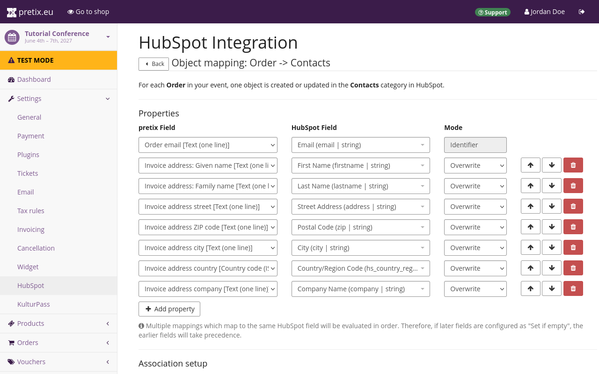

# HubSpot

This article explains the HubSpot integration plugin in pretix and what you can do with it. 

## Prerequisites

Plugins are handled on the event level, so you have to create an event first. 
You need to have access to a HubSpot account. 

## General usage

This section explains: 

 - how to enable the HubSpot plugin
 - how to set up the connection between your pretix account and your HubSpot account
 - how to create a custom property in HubSpot for mapping exports

These three steps are necessary before you can export any data from pretix to HubSpot. 

### Enabling the plugin

In order to activate the HubSpot plugin, navigate to :navpath:Your Event → :fa3-wrench: Settings → Plugins: and switch to the :btn:Integrations: tab. 
Click the :btn:Enable: button next to the "HubSpot" plugin. 

### Setting up the connection to HubSpot

Click the :btn-icon:fa3-gear: Settings: drop-down menu next to the HubSpot plugin and then click the entry :btn:Settings > HubSpot:. 
Alternatively, navigate to :navpath:Your event → :fa3-wrench: Settings → HubSpot:. 
Both paths take you to a page titled "HubSpot Integration". 

In order to set up the connection to HubSpot, click the :btn:Request access: button. 

This opens a page on HubSpot, prompting you to create a HubSpot account or to sign into your existing one. 

Click the :btn:Sign in to your HubSpot account: button. 
This takes you to a page prompting you to choose an account. 

Click your account in the list and then click the :btn:Choose Account: button. 
The next page warns you that you are connecting an unverified app. 

Scroll to the bottom of the page and click the :btn:Connect app: button. 
Once you have done that, you will be taken back to the HubSpot Integration settings page in the pretix backend. 
Instead of the "Request access" button, this page now states that the event is connected to HubSpot and displays settings for object mappings. 

Click the :btn:Save: button. 

### Creating a custom property for mapping 

Before you can export any information from pretix to HubSpot, you need to create a custom property. 
The integration plugin will use this property during export. 

Refer to the HubSpot documentation on how to [Create a custom property](https://knowledge.hubspot.com/properties/create-and-edit-properties#create-a-custom-property).
Add the following property details: 

 - Property label: `pretix-order-id`
 - Object type: `Contact` 
 - Group: Order `information` 
 - Field type: `Single-line text` 

The "Object type" detail depends on your intended use case. 
If you want to export data to the contacts database in HubSpot, select `Contact`. 
If you want to export to the deals database, select `Deal`. 

If you want to export to both, create two objects: one with the `Contact` type, the other with the `Deal` type. 
It is possible to give both objects the same name. 

Confirm by clicking the :btn:Create: button. 

## Applications

This section explains some useful applications of the HubSpot integration plugin: 

 - [Adding customers and attendees to your HubSpot contacts database](hubspot.md#adding-customers-and-attendees-to-your-hubspot-contacts-database)
 - [Adding payments to your HubSpot deals database](hubspot.md#adding-payments-to-your-hubspot-deals-database)

Before you can do any of these things, you have to set up the plugin as described in [General usage](hubspot.md#general-usage). 

### Adding customers and attendees to your HubSpot contacts database

This section explains how to add customers or attendees in pretix to your contacts database in HubSpot. 
Open the pretix backend and navigate to :navpath:Your Event → :fa3-wrench: Settings → HubSpot:. 
Under "Object mappings", edit the first entry or, if you are already using it for a different purpose, click the :btn-icon:fa3-plus: Add mapping: button. 

Under "pretix object type", choose "Order". 
Under "HubSpot order type", choose "Contacts". 
Click the :btn:Save: button. 

In order to change the details of the data that pretix maps to the entries in HubSpot, click the :btn-icon:fa3-edit: Edit mapping: button. 

The first line under "Properties" specifies the identifier. 
Under "pretix Field", select `Order code [Text (one line)]`. 
Under "HubSpot Field", select `pretix-order-id (pretix_order_id | string)`. 
The "Mode" option is fixed to `Identifier`. 

Click the :btn-icon:fa3-plus: Add property: button to add a new property to export to HubSpot. 
Map the pretix field `Order email [Text (one line)]` to the HubSpot field `Email (email | string). 
This is useful because HubSpot internally uses the email address as the unique identifier for an entry in the list of contacts. 

If you set "Mode" to `Overwrite`, then the plugin will overwrite any fields in your HubSpot database. 
If you set it to `Fill if new`, then it will only fill the field on a new entry. 
If you set it to `Fill if empty`, then the plugin will only fill the field if the field is empty. 
If you set it to `Add to list`, then the plugin will create a list in the HubSpot field. 
The HubSpot field will contain a list of its previous content and the content of the pretix field appended to the end of that list. 

Add more properties and map the information you ask of your customers to the closest matching field in HubSpot. 
For example, your mapping could look like this: 

This uses the order code of your orders in pretix to the property `pretix-order-id` in HubSpot. 
It also maps email, given name, family name, street, post code, country, and company name onto the most closely matching properties in HubSpot. 
According to the configuration in the screenshot, the plugin overwrites all those properties. 

If you want to fill your HubSpot contacts database with attendee data in addition to customer data, navigate to the HubSpot integration page. 
Add an object mapping with the "pretix object type" set to `Order position` and the "HubSpot object type" set to `Contacts`. 

Edit the mapping and set it up analogously to the `Order` mapping, replacing invoice data with attendee data. 

### Adding payments to your HubSpot deals database

This section explains how to add payments from pretix to your deals database in HubSpot. 
Open the pretix backend and navigate to :navpath:Your Event → :fa3-wrench: Settings → HubSpot:. 
Under "Object mappings", edit the first entry or, if you are already using it for a different purpose, click the :btn-icon:fa3-plus: Add mapping: button. 

Under "pretix object type", choose "Order". 
Under "HubSpot order type", choose "Deals". 
Click the :btn:Save: button. 

In order to change the details of the data that pretix maps to the entries in HubSpot, click the :btn-icon:fa3-edit: Edit mapping: button. 
The first line under "Properties" specifies the identifier. 
Under "pretix Field", select `Order code [Text (one line)]`. 
Under "HubSpot Field", select `pretix-order-id (pretix_order_id | string)`. 
The "Mode" option is fixed to `Identifier`. 

Click the :btn-icon:fa3-plus: Add property: button to add a new property to export to HubSpot. 
Add pretix fields such as the date and time or the amount and map them to corresponding fields in HubSpot. 

### Managing data transfers 

Once you have set up exports from pretix to HubSpot, the plugin will transfer data every time the server executes `periodic_task`. 
The frequency depends on the configuration of the server. 

<!-- md:hosted -->

The pretix Hosted server runs the `periodic_task` every ten minutes, starting five minutes after the full hour. 
Thus, the plugin exports every incoming order to HubSpot within ten minutes or less. 

The plugin does not export any orders your customers placed before you set up the connection to HubSpot. 
It also does not automatically export any data again after you have made changes to the HubSpot integration settings. 
If you want to export data from older orders, or export again following a change in the configuration, then you have to trigger a data transfer on those orders manually. 

In order to do so, navigate to :navpath:Your event → :fa3-shopping-cart: Orders: and select the order in question. 
In the box labeled "Data transfer to external systems", click the :btn-icon:fa3-refresh: Sync now: button. 

The box will then display the status ":fa3-hourglass: Pending". 
The plugin will transfer data to HubSpot the next time the server executes `periodic_task`. 
If you refresh the page after that, then the box will display links to the records that were created in HubSpot during the export along with timestamps. 

If an error occurred during the export, then the box will display an ":fa3-warning: Error" status as well as buttons for retrying or canceling the transfer. 