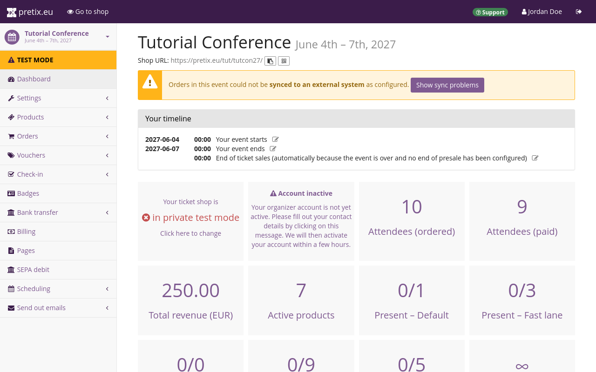
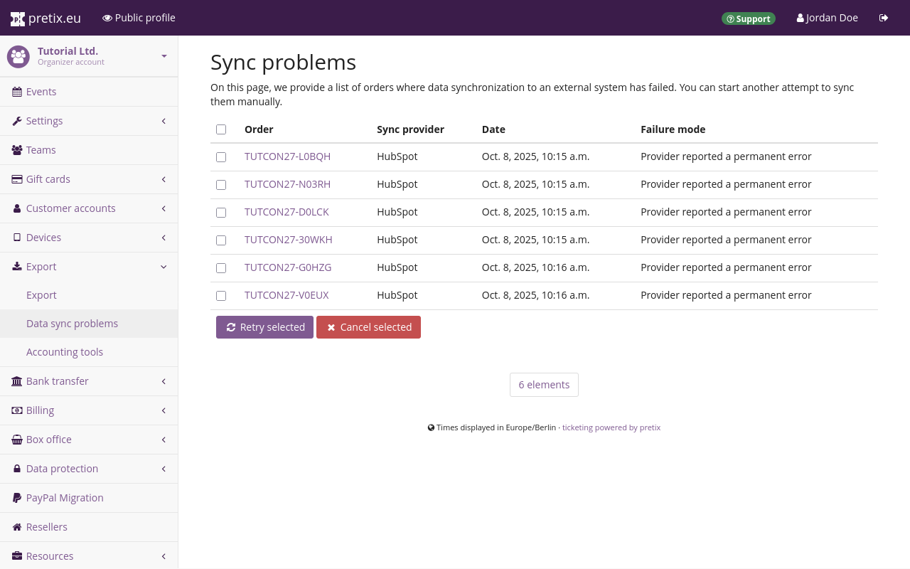

# HubSpot

The HubSpot integration allows you to export data such as customer contact data or transactions to HubSpot. 
This article explains how to use it. 

## Prerequisites

Plugins are handled on the event level, so you have to create an event first. 
You also need to have access to a HubSpot account. 

## General usage

This section explains how to enable the HubSpot plugin and how to set up the connection between your pretix account and your HubSpot account. 
These steps are necessary before you can export any data from pretix to HubSpot. 

### Enabling the plugin

In order to activate the HubSpot plugin, navigate to :navpath:Your event → :fa3-wrench: Settings → Plugins: and switch to the :btn:Integrations: tab. 
Click the :btn:Enable: button next to the "HubSpot" plugin. 

### Setting up the connection to HubSpot

Click the :btn-icon:fa3-gear: Settings: drop-down menu next to the HubSpot plugin and then click the entry :btn:Settings > HubSpot:. 
Alternatively, navigate to :navpath:Your event → :fa3-wrench: Settings → HubSpot:. 
Both paths take you to a page titled "HubSpot Integration". 

In order to set up the connection to HubSpot, click the :btn:Request access: button. 

This opens a page on HubSpot, prompting you to create a HubSpot account or to sign in to your existing one. 

Click the :btn:Sign in to your HubSpot account: button. 
This takes you to a page prompting you to choose an account. 
Alternatively, if you do not have a HubSpot account yet, click the :btn:Create a new HubSpot account: instead and create an account. 

Select your account in the list and then click the :btn:Choose Account: button. 
The next page warns you that you are connecting an unverified app. 

Scroll to the bottom of the page and click the :btn:Connect app: button. 
Once you have done that, the page will redirect you back to the HubSpot Integration settings page in the pretix backend. 
Instead of the "Request access" button, this page now states that the event is connected to HubSpot and displays settings for object mappings. 

Click the :btn:Save: button. 

## Applications

This section explains some useful applications for the HubSpot integration: 

 - [Adding customers to your HubSpot contacts database](hubspot.md#adding-customers-to-your-hubspot-contacts-database)
 - [Adding attendees to your HubSpot contacts database](hubspot.md#adding-attendees-to-your-hubspot-contacts-database) 
 - [Adding orders to your HubSpot deals database](hubspot.md#adding-orders-to-your-hubspot-deals-database)

Before you can do any of these things, you have to enable the plugin and set up the connection as described in [General usage](hubspot.md#general-usage). 

### Adding customers to your HubSpot contacts database

This section explains how to add customers in pretix to your contacts database in HubSpot. 
Open the pretix backend and navigate to :navpath:Your event → :fa3-wrench: Settings → HubSpot:. 
Under "Object mappings", click the :btn-icon:fa3-plus: Add mapping: button. 

Under "pretix object type", choose "Order position". 
Under "HubSpot order type", choose "Contacts". 
Click the :btn:Save: button. 

In order to change the details of the data that pretix maps to the entries in HubSpot, click the :btn-icon:fa3-edit: Edit mapping: button. 

The first line under "Properties" specifies the identifier. 
Under "pretix Field", select `Order email [Text (one line)]`. 
Under "HubSpot Field", select `Email (email | string)`. 
The "Mode" option is fixed to `Identifier`, meaning that HubSpot will use this line as the unique identifier for an entry in the contacts database. 

Click the :btn-icon:fa3-plus: Add property: button to add a new property to export to HubSpot. 
Map invoice address fields from pretix to corresponding fields in HubSpot. 

Pair pretix fields of the type `Text (one line)` with HubSpot fields of the type `string`. 
Pair pretix fields of the type `Number` with HubSpot fields of the type `number` or `string`. 
Pair pretix fields of the type `Choose one from a list` with HubSpot fields of the type `enumeration`. 
Pair pretix fields of the type `Date and Time` with HubSpot fields of the type `datetime`. 
If a warning symbol :fa3-warning: appears in one of the lines, that means that line may cause issues due to incompatible data types. 

If you set "Mode" to `Overwrite`, then the integration will overwrite any fields in your HubSpot database. 

If you set it to `Fill if new`, then it will only fill the field on an entirely new entry. 
The integration will not make any changes if an entry with the same unique identifier already exists. 
This avoids overwriting existing entries and filling them with mismatching data. 

If you set "Mode" to `Fill if empty`, then the integration will only fill empty fields. 
This can complete an entry with missing information, but it may sometimes complete it with mismatching information. 
The difference between `Fill if new` and `Fill if empty` is that `Fill if new` only writes completely new entries whose unique identifier does not yet exist in the HubSpot database. 
`Fill if empty` also adds information to already existing entries. 

If you set it to `Add to list`, then the integration will add the content from pretix as an item in a list-type HubSpot field. 
This is suitable for HubSpot variables that allow multiple entries, such as "Multiple checkboxes", "Radio select", and "Dropdown select". 
If you use this on a text variable in HubSpot, the integration will append the text from pretix to the end, separated by semicolon. 
If you use it on a number variable, then the export will work without issues on an empty field, but will cause an error if the field is already filled. 

For example, your mapping could look like the one portrayed in the following screenshot and table: 

| pretix Field                                                | HubSpot Field                                          | Mode       |
|-------------------------------------------------------------|--------------------------------------------------------|------------|
| Order email [Text (one line)]                               | Email (email \| string)                                | Identifier |
| Invoice address: Given name [Text (one line)]               | First name (firstname \| string)                       | Overwrite  |
| Invoice address: Family name [Text (one line)]              | Last Name (lastname \| string)                         | Overwrite  |
| Invoice address street [Text (one line)]                    | Street Address (address \| string)                     | Overwrite  |
| Invoice address ZIP code  [Text (one line)]                 | Postal Code (ZIP \| string)                            | Overwrite  |
| Invoice address city [Text (one line)]                      | City (city \| string)                                  | Overwrite  |
| Invoice address country [Country code (ISO 3116-1 alpha-2)] | Country/Region Code (hs_country_region_code \| string) | Overwrite  |
| Invoice address company [Text (one line)]                   | Company (company \| string)                            | Overwrite  |

This maps the email address used to place an order in pretix to the email property in HubSpot. 
It also maps  given name, family name, street, post code, city, country code, and company name onto the most closely matching properties in HubSpot. 
According to the configuration in the screenshot, the integration overwrites all those properties. 

Once you are satisfied with your mapping, click the :btn:Save: button. 

### Adding attendees to your HubSpot contacts database

If you want to fill your HubSpot contacts database with attendee data in addition to customer data, navigate to :navpath:Your event → :fa3-wrench: Settings → HubSpot:. 
Add an object mapping with the "pretix object type" set to `Order position` and the "HubSpot object type" set to `Contacts`. 

Edit the mapping and set it up analogously to the customer mapping [described above](hubspot.md#adding-customers-to-your-hubspot-contacts-database), replacing invoice data with attendee data, but still mapping to the same HubSpot fields. 

### Adding orders to your HubSpot deals database

This section explains how to add orders from pretix to your deals database in HubSpot. 

Before you can export any information from pretix to the deals database in HubSpot, you need to create a custom property in HubSpot. 
The integration will use this property during export. 

Refer to the HubSpot documentation on how to [Create a custom property](https://knowledge.hubspot.com/properties/create-and-edit-properties#create-a-custom-property).
Under "Details", enter the following: 

 - Property label: `pretix-order-id`
 - Object type: `Deal` 
 - Group: `Deal information` 

Under "Field type", select `Single-line text`. 
Under rules, check the box next to "Require unique values for this property". 

Creating the property means that some of the settings here will become fixed and you will not be able to change them anymore. 
Verify that you have configured the property as described here and then click the :btn:Create: button. 

Open the pretix backend and navigate to :navpath:Your event → :fa3-wrench: Settings → HubSpot:. 
Under "Object mappings", change the first entry or, if you are already using it for a different purpose, click the :btn-icon:fa3-plus: Add mapping: button. 

Under "pretix object type", choose "Order". 
Under "HubSpot order type", choose "Deals". 
Click the :btn:Save: button. 
The page will refresh and display a :btn-icon:fa3-edit: Edit mapping: button next to the entry. 

In order to change the details of the data that pretix maps to the entries in HubSpot, click that button. 
The first line under "Properties" specifies the identifier. 
Under "pretix Field", select `Order code [Text (one line)]`. 
Under "HubSpot Field", select `pretix-order-id (pretix_order_id | string)`. 
The "Mode" option is fixed to `Identifier`. 

Click the :btn-icon:fa3-plus: Add property: button to add a new property to export to HubSpot. 
Add pretix fields such as the date and time or the amount and map them to corresponding fields in HubSpot. 

Click the :btn:Save: button to confirm. 

### Managing data transfers 

Once you have set up exports from pretix to HubSpot, the integration will transfer data every time the server executes `periodic_task`. 
The frequency depends on the configuration of the server. 
The pretix Hosted server runs the `periodic_task` every ten minutes, starting five minutes after the full hour. 
Thus, the integration exports every incoming order to HubSpot within ten minutes or less. 

The integration only exports data from new incoming orders. 
It does not export any orders your customers placed before you set up the connection to HubSpot. 
It also does not automatically export any data a second time, even if you make changes to the configuration. 
If you want to export data from older orders, or export again following a change in the configuration, then you have to trigger a data transfer on those orders manually. 

In order to do so, navigate to :navpath:Your event → :fa3-shopping-cart: Orders: and select the order in question. 
In the box labeled "Data transfer to external systems", click the :btn-icon:fa3-refresh: Sync now: button. 

The box will then display the status ":fa3-hourglass: Pending". 
The integration will transfer data to HubSpot within seconds. 
Refresh the page. 
The box will now display links to the corresponding records in HubSpot along with timestamps. 
In case a problem with the export occurred, the box will instead display ":fa3-warning: Error" and an error message underneath the heading "HubSpot", along with buttons for retrying and canceling the export. 

For information on handling errors with exports, see [troubleshooting](hubspot.md#troubleshooting). 

### Checking for errors

After setting up exports to HubSpot, you should confirm that the configuration works as intended. 
You should also do this after making changes to the configuration. 

In order to check for errors that may have occured during the export to HubSpot, navigate to :navpath:Your event:. 
If errors have occurred, the dashboard will display a yellow warning box at the top. 

Alternatively, you can navigate to :navpath:Your event → :fa3-wrench: Settings → HubSpot:. 
This page will also display a warning box if errors have occurred. 

Click the :btn:Show sync problems: button in the warning box. 
This takes you to an overview of orders with which problems have occurred during the export to HubSpot. 

You can also check for sync problems on the organizer level. 
This is useful if you are using the HubSpot integration for multiple events. 
Navigate to :navpath:Your organizer → :fa3-download: Export → Data sync problems:. 
The page displays a list of sync problems across all events for which the HubSpot plugin is active. 

You can also check individual orders for errors by navigating to :navpath:Your event → :fa3-shopping-cart: Orders: and selecting the order in question. 
Take a look at the box labeled "Data transfer to external systems". 
If this box displays ":fa3-warning: Error" underneath the heading "HubSpot", then there is an issue with the export of this order's data to HubSpot. 

For information on how to resolve errors, see [Troubleshooting](hubspot.md#troubleshooting). 

## Troubleshooting

There are four different error messages that can be displayed on the "Sync problems" overview page or on the page for an individual order being exported to HubSpot: 

 - Temporary error, auto-retry limit exceeded
 - System error, needs manual intervention
 - Provider reported a permanent error
 - Misconfiguration, please check provider settings

If you get the "temporary error" message, then you do not need to intervene. 
The server running pretix should resolve the issue by itself upon one of the next runs of `periodic_task`. 

If you get the "system error" message, then there is an issue with the server running pretix. 
If you are using pretix Hosted, contact support. 
If you are hosting pretix (Community or Enterprise), then you need to resolve some issues with the configuration of the server. 

If you get the "permanent error" or "misconfiguration" message, then the issue lies in the mapping of pretix variables to HubSpot variables. 
See [Handling configuration errors](hubspot.md#handling-configuration-errors) for instructions on resolving these errors. 

### Handling configuration errors

If you see "permanent error" or "misconfiguration" messages after you have made changes to the configuration of the HubSpot integration, then it is likely that the configuration is faulty and causes the errors. 
Navigate to navigate to :navpath:Your event → :fa3-wrench: Settings → HubSpot: and edit one of your mappings. 
If a warning symbol :fa3-warning: appears in one of the lines, then that line is causing issues due to incompatible data types. 

Check the corresponding entry in the HubSpot backend for mistakes. 
It is possible that pretix exported the data successfully despite the warning displayed here. 

Change the "pretix Field" and "HubSpot Field" to a compatible pair of entries. 
Pair pretix fields of the type `Text (one line)` with HubSpot fields of the type `string`. 
Pair pretix fields of the type `Number` with HubSpot fields of the type `number` or `string`. 
Pair pretix fields of the type `Choose one from a list` with HubSpot fields of the type `enumeration`. 
Pair pretix fields of the type `Date and Time` with HubSpot fields of the type `datetime`. 
Click the :btn:Save: button to confirm. 

Repeat this process for every mapping in your configuration. 
Confirm that no warnings pop up in any of the mappings. 

If you experience errors, but no warning symbols appear on the mappings pages, check the order logs. 
Navigate to one of the "Sync problems" pages as described in [Checking for errors](hubspot.md#checking-for-errors). 
Click one of the orders causing an error. 
The "Order history" box on the right side will display "Error while transferring data to HubSpot" and an error message which may be helpful for identifying the problem. 