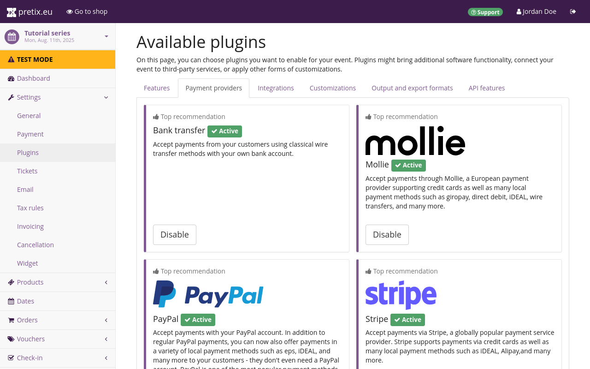
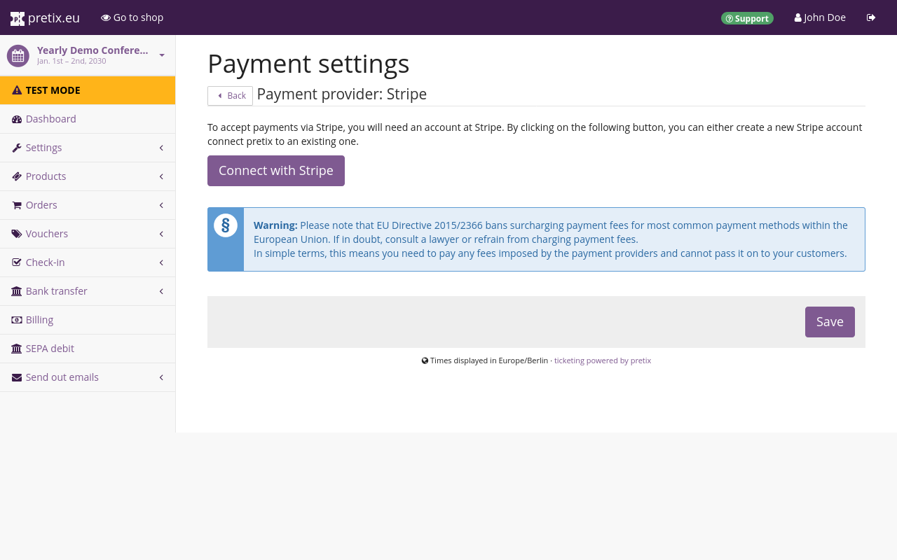
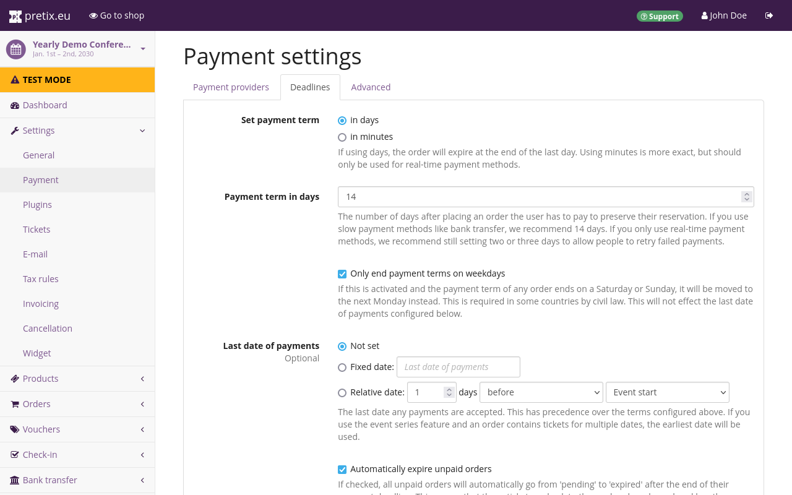

# Payment

If you are not operating an entirely free shop, your customers need some way of sending you payments. 
pretix takes care of payment via a wide selection of payment providers. 
There are two types of payment providers: 

 - methods that are handled entirely within pretix, such as bank transfers and gift cards 
 - integrations with external services such as Mollie, PayPal or Stripe 

You have to enable and set up at least one payment provider if you want to receive payments from your customers via pretix. 
This article shows you how to do that. 
It also tells you how to take some optional steps such as setting up additional fees or deadlines. 

If you want to sell tickets at the box office, or if you want to sell tickets for cash, you should use the app [pretixPOS](../pretixpos/index.md). 

## Prerequisites

Setting up payment providers is handled on the event level, so you need to create an event first. 

Make sure you have an active account with each external payment provider you intend to use with pretix. 
For example, if you want to receive payments via Mollie, you need to have a Mollie account. 

## How To

Setting up payment providers in pretix involves the following steps: 

 1. [Enable the plugin](index.md#plugins-for-payment-providers) for the payment provider
 2. Connect to your account with the payment provider 
 3. Enter mandatory info on the [settings page](index.md#general-settings-for-payment-providers) for the payment provider
 4. Make optional adjustments, such as adding [additional fees](index.md#additional-fees)
 5. Enable the payment provider for use in your shop
 6. Repeat steps 1 through 5 for each payment provider you want to use
 7. Set [deadlines](index.md#deadlines) and advanced settings

The following sections guide you through those steps in detail. 

### Plugins for payment providers

pretix allows handling payment via more than three dozen payment providers. 
There is a plugin for each one of them. 
You have to enable the plugins for every payment provider that you want to use for your event. 
This section tells you how to do that. 



Navigate to :navpath:Your Event → :fa3-wrench: Settings → Plugins:. 
The :btn:Payment providers: tab displays our top recommendations for payment provider plugins: bank transfer, Mollie, PayPal and Stripe at the top of the page. 
Below that, you can find the list of plugins for all other payment providers available in pretix. 
By default, the plugins for bank transfer, PayPal, Stripe and SEPA Direct debit will be active. 


Choose the payment providers that you want to use from the top recommendations and the list and click the :btn:Enable: button next to them. 
After you have activated a plugin, it will have a green ":fa3-check: Active" tag next to it and a white "Disable" button will take the place of the purple "Enable" button. 
Deactivate any active plugins that you do not want to use for your event. 

### General settings for payment providers

Enabling a plugin does not automatically make the payment method available in your shop. 
You also need to provide some data for each payment provider you want to use on the settings page. 
This section tells you how to do that. 

Navigate to :navpath:Your Event → :fa3-wrench: Settings → Payment:. 
The :btn:Payment providers: tab on this page displays the list of active payment providers. 
By default, this list includes bank transfer, gift card, PayPal, SEPA debit and Stripe. 
Gift card is enabled and all other entries are disabled. 
If you have enabled or disabled any of the plugins for payment providers, your list will look different. 

Every payment provider for which you have enabled the plugin on the "Plugins" page appears in this list. 
The list will also always contain the entry for gift cards. 
Gift cards are the only payment method that is not handled by a plugin since gift cards are part of the core functions of pretix. 
For more information, see [gift cards](../gift-cards.md). 


You can edit and enable payment providers by clicking the :btn-icon:fa3-gear:Settings: button next to them. 
Each payment method requires some mandatory information and settings before you can enable it. 
For example, the settings page for bank transfer requires you to enter your bank details and to check a box confirming that you have understood the specific conditions that apply to this payment method. 

You can also apply a wide range of optional settings to each payment provider. 
You can restrict availability of the payment method by date ("Available from" and "Available until"), country ("Restrict to countries") and sales channel ("Restrict to specific sales channels"). 



If the payment provider is an external service, the settings page only contains a button for connecting with your account on that service. 
Once you have set up that connection, the settings page for the payment provider will display the usual settings. 
For detailed information on how to set up and enable specific payment providers, refer to the pages nested below this one: 

 - [Bank transfer](bank-transfer.md) 
 - [Mollie](mollie.md)
 - [PayPal](paypal.md) 
 - [Stripe](stripe.md) 

### Additional fees

!!! Warning 
    EU Directive 2015/2366 bans surcharging payment fees for most common payment methods within the European Union. 
    Consult a lawyer or refrain from charging payment fees for transactions within the European Union.

Most payment providers charge a fee on every transaction they process. 
If you are planning to pay this fee yourself, you do not need to change any settings. 
If you want to add the fee to your customer's total, consult an expert to confirm it is legal for you to do so. 

Once you have done that, navigate to :navpath:Your Event → :fa3-wrench: Settings → Payment:, and open the :btn:Advanced: tab. 
In the dropdown menu labeled "Tax rule for payment fees", select the appropriate tax rule. 

If you want to learn more on how to handle taxes in pretix, refer to our guide on [taxes](../taxes.md). 

Then, open the :btn:Payment providers: tab and then open the settings page for the payment provider for which you want to enable additional fees. 

Three elements on this page are relevant for additional fees: two fields labeled "Additional fee" and a checkbox labeled "Calculate the fee from the total value including the fee". 
The first field has the description "Absolute value" and interprets input as currency. 
The second field has the description "Percentage of the order total" and interprets input as a percentage. 
Your choices here depend on your exact use case. 

The next sections explain what to do if you want to pass on a fee to your customers, or if you want to discourage use of a payment provider with an extra fee. 

#### Passing payment provider fees on to your customers

For illustrative purposes, let us assume that your payment provider is charging you a transaction fee of 2.99% plus a fixed rate of $0.49. 
Enter 0.49 in the "Absolute value" field and 2.99 in the "Percentage of the order total" field. 
Neither input is mandatory. 
You can also add an absolute value only, or a percentage value only. 

Verify that the box next to "Calculate the fee from the total value including the fee" is checked and click the :btn:Save: button. 
This checkbox determines the way pretix calculates additional fees. 
If the box is checked, pretix will calculate fees in the following way: 

```
((price + fee_abs) * (1 / (1 - fee_percent / 100)) - price)
```

`price` is the net total of the order, `fee_abs` is the fixed portion of the fee, and `fee_percent` is the percentage portion of the fee. 
Applying the example fees from above to a purchase with a net total of $250 yields the following calculation: 

```
((250 + 0.49) * (1 / (1 - 2.99 / 100)) - 250) = 8.21049376353 ≈ 8.21
```

The result is the fee that pretix calculates on top of the net total of the order. 
In this example, your customer will have to pay $258.21, the payment provider will subtract $8.21 in transaction fees, and $250 will be added to your balance. 
Depending on the exact calculation and rounding methods used by the payment provider, the final amount that is added to your balance may vary by one cent. 

A payment provider will always use the total amount of a transaction or multiple transactions to calculate their fees. 
The "Calculate the fee from the total value including the fee" method gives you better control over the final amount of money added to your bank account by the payment provider. 
The following table compares the two different calculation methods provided by pretix: 

|                                         | calculation from subtotal without the fee | calculation from total value including the fee |
|-----------------------------------------|-------------------------------------------|------------------------------------------------|
| ticket price                            | $250.00                                   | $250.00                                        |
| fee calculated by pretix                | $7.96                                     | $8.21                                          | 
| total paid by customer                  | $257.96                                   | $258.21                                        |
| fee calculated by payment provider      | $8.20                                     | $8.21                                          |
| final amount added to your bank balance | $249.76                                   | $250.00                                        |

#### Discouraging use of a payment provider with an extra fee

pretix allows you to use a more straightforward formula for the calculation of that fee. 
This is useful if, for instance, you want to discourage your customers from using a certain payment provider by adding an additional fee. 

For illustrative purposes, assume a fee of 2.99% plus a fixed rate of $0.49. 
Enter 0.49 in the "Absolute value" field and 2.99 in the "Percentage of the order total" field. 
Neither input is mandatory. 
You can also add an absolute value only, or a percentage value only. 

If you uncheck the box next to "Calculate the fee from the total value including the fee" and click the :btn:Save: button, pretix will use the following formula for the calculation: 

```
price * (fee_percent / 100) + fee_abs
```

If the example fees from above are applied to a purchase with a net total of $100, this yields the following calculation: 

```
250 * (2.99 / 100) + 0.49 = 7.965 ≈ 7.96
```

Your customer will have to pay $257.96. 
This sum is smaller than the one resulting from the formula described above. 
If you use this method for calculating the fee raised by an external payment provider, the amount added to your balance will be 249.756996 ≈ 249.76 and thus slightly smaller than the originally intended net total of $250. 

Use the method described [above](index.md#passing-payment-provider-fees-on-to-your-customers) if you want your users to cover the payment fees charged by the payment provider.

### Deadlines



Navigate to :navpath:Your Event → :fa3-wrench: Settings → Payment:. 
The :btn:Deadlines: tab lets you set payment terms measured in either days or minutes. 
The default value for the payment term for your customers is 14 days. 
This page also lets you make optional adjustments such as a last date of payment, an additional expiration delay beyond the time communicated to your customer, and the option to only end payment terms on weekdays. 

!!! Note 
    If you define a "Last date of payment", then that last date of payment overrides both the "Payment term" and the "Accept late payments" settings. 
    No payments will be accepted after the date defined under "Last date of payments". 
    
    You cannot manually accept an order as paid after the "Last date of payments". 
    If you want to avoid a situation in which this would be necessary, leave the "Last date of payments" setting at "Not set". 

Deadlines settings apply on the event level, i.e. equally to all payment methods. 
If you are using payment methods with long processing times such as bank transfers, set the deadlines long enough to incorporate those processing times. 

pretix does not support setting different deadlines for different payment methods because this could make ordering and paying very confusing and frustrating for your customers. 

Consider, for example, if pretix allowed different deadlines for each payment method. 
A customer first places their order with one payment method, but then switches to a different one with a shorter deadline. 
The customer's order would be rendered invalid. 
They would have to place a new one for reasons that are not clearly evident to them. 

Placing a new order also means losing the reservation for the items in the shopping cart. 
If a quota has been exhausted in the meantime, then your customer cannot order their preferred product anymore, possibly discouraging them from placing an order at all. 

Alternatively, if pretix added each payment method's deadline on top of the old one, switching back and forth between payment methods would allow a customer to extend the deadline indefinitely, thus never actually being required to pay you. 

It is for these reasons that pretix only lets you set unified payment deadlines that apply to all payment methods equally. 

## Troubleshooting

### A payment provider does not show up in the payment settings

If a payment provider does not show up in :navpath:Your Event → :fa3-wrench: Settings → Payment:, then the plugin is not active. 

Navigate to :navpath:Your Event → :fa3-wrench: Settings → Plugins: and open the "Payment providers" tab. 
Enable the corresponding plugin. 
Verify that it has the green ":fa3-check: Active" tag next to it. 

### A payment provider does not show up in your shop 

If a payment provider does not appear in your test shop or customers cannot select a payment method during their purchase, you should verify that the provider and the method are active. 

Navigate to :navpath:Your Event → :fa3-wrench: Settings → Payment:. 
This lands you on the "Payment" tab. 
Click the :btn-icon:fa3-gear:Settings: button next to the payment provider that is not showing up in the shop. 
Ensure that all necessary information is filled in. 
Check the box next to "Enable payment method". 
If the payment provider offers several different methods, check the boxes next to the methods which you want to offer in your shop. 
Then scroll to the bottom of the page and click :btn:Save:. 

If any mandatory information is still missing, the page will notify you. 
Fill out all the mandatory information and click :btn:Save: again. 
The corresponding payment method should now show up in your online shop. 

## Further Information

Here is the full list of articles on setting up and using specific payment providers: 

 - [Bank transfer](bank-transfer.md) 
 - [Mollie](mollie.md)
 - [PayPal](paypal.md) 
 - [Stripe](stripe.md)
