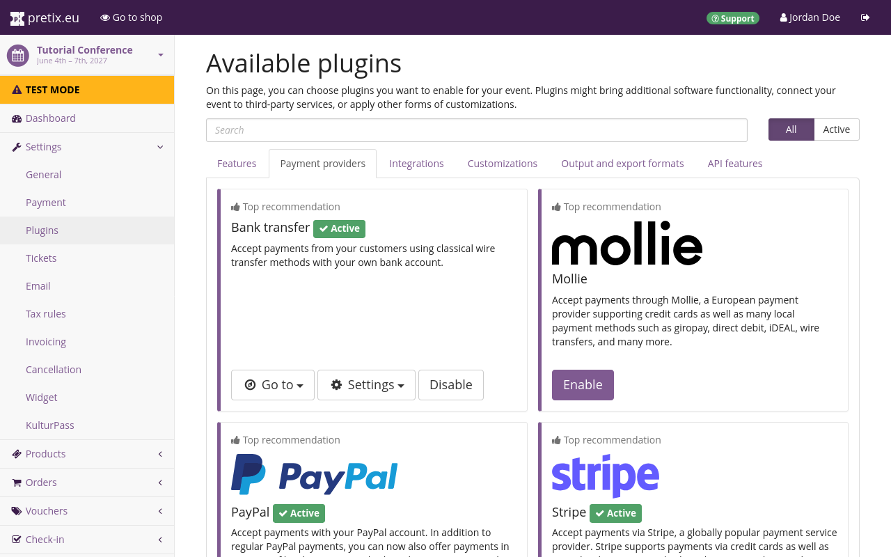

# Mollie

Mollie is one of the many options for handling payments within pretix. 
Mollie allows handling payments via the following methods: 

Alma, Apple Pay, BANCOMAT Pay, Bancontact, bank transfer, Belfius Pay Button, bitcoin, BLIK, credit card, EPS, Google Pay, iDEAL, ING Home'Pay, Klarna, KBC/CBC Payment Button, MyBank, PayPal, paysafecard, Przelewy24, Satispay, SOFORT, Trustly, and Twint. 

This article tells you how to connect to your Mollie account and use it to receive payments via pretix. 

## Prerequisites

Setting up payment providers is handled on the event level, so you need to create an event first. 
Make sure you have an active Mollie account. 
You can find [instructions on how to sign up for a Mollie account](https://docs.mollie.com/docs/create-an-account) on the Mollie website. 

## How To 

Setting up Mollie as a payment provider in pretix involves the following steps: 

 1. Enable the Mollie plugin 
 2. Connect to your Mollie account 
 3. Enter mandatory info on the settings page for Mollie
 4. Make optional adjustments
 5. Enable payment via Mollie
 6. Test it 
 7. Switch the Mollie endpoint to "Live" 

This section will guide you through those steps in detail. 

Navigate to :navpath:Your Event → Settings → Plugins:.
Switch to the :btn:Payment providers: tab. 
The Mollie plugin is displayed at the top of the page. 
It should be enabled by default. 
If it is enabled, it will have a green ":fa3-check: Active" tag and a white :btn:Disable: button. 
If it isn't enabled, the tag will be missing and it will have a purple :btn:Enable: button. 
Make sure that the plugin is enabled. 

Navigate to :navpath:Your Event → Settings → Payment:. 
The :btn:Payment providers: tab on this page displays the list of active payment providers. 
The list should now include an entry for Mollie with a red ":fa3-times: Disabled" tag. 
The plugin is enabled, but Mollie has not been set up and enabled as a payment provider for the event yet. 

Click the :btn-icon:fa3-cog:Settings: button next to Mollie. 
From this point on, the process is different depending on whether you are using pretix Hosted or a self-hosted edition of pretix (Community or Enterprise). 

### Connecting to Mollie with pretix Hosted 

<!-- md:hosted -->

If you are using pretix Hosted and you have not connected your account to Mollie yet, the settings page for Mollie only includes the :btn:Connect with Mollie: button. 
Click the button and complete the the login and authorization process with Mollie. 

For more information on the authorization process with Mollie, refer to the [Mollie documentation](https://docs.mollie.com/docs/getting-started). 

After you have completed the process, the Mollie settings page in the pretix backend will look different. 
Instead of the single button, it will now offer a multitude of settings. 
Your Mollie account will be displayed near the top of the page. 
There are several checkboxes for activating payment methods such as credit cards, Apple and Google Pay, bank transfer. 

Check the box for each payment method you want to enable. 
Some of the payment methods offered here require additional permissions in your Mollie account. 
If you enable them, you need to click the :btn:Reconnect to Mollie (update permissions): button. 

All further settings on this page are optional. 
Take a detailed look at the page and enable any settings you want for this payment provider for your event. 
Once you are satisfied, check the box next to "Enable payment method" and click the :btn:Save: button. 
The payment methods you enabled on this page and in your Mollie account settings will now appear as options for customers in your shop. 

Once you take your ticket shop live, switch the "endpoint" option on this page from "testing" to "live". 

### Connecting to Mollie with a self-hosted edition of pretix 

<!-- md:community --> 
<!-- md:enterprise -->

If you are using pretix Community or pretix Enterprise and you have not connected your account to Mollie yet, the settings page for Mollie will display fields for API keys. 
Go to [https://www.mollie.com/dashboard/settings/profiles](https://www.mollie.com/dashboard/settings/profiles) and log in to your account. 
If you want to test payments via Mollie, copy the testing keys form the Mollie API page to the corresponding fields on the settings page for Mollie in pretix. 

Once you are ready to receive actual payments via Mollie, copy the live keys form the Mollie API page to the corresponding fields on the settings page for Mollie in pretix.
For further information, refer to the Mollie documentation pages on [API keys]https://docs.mollie.com/reference/authentication#creating-api-keys).  

You also need to create a webhook so that Mollie can update pretix with information such as payment cancellations. 
Copy the webhook URL from the infobox near the bottom of the Mollie settings page in pretix and paste it into the corresponding field in the Mollie backend. 
During the webhook setup process, select all event types for being sent to pretix. 
For further information, refer to the Mollie documentation pages on [webhooks](https://docs.mollie.com/reference/webhooks). 

After you have set up the connection between pretix and Mollie, the Mollie settings page in the pretix backend will now offer a multitude of settings. 
All new settings here are optional. 
Take a detailed look at the page and enable any settings you want for this payment provider for your event. 
Once you are satisfied, scroll to the top of the page and check the box next to "enable payment method". 
Mollie and the other payment methods you enabled on this site will now appear as a payment option for customers in your shop. 

Once you take your ticket shop live, switch the "Endpoint" option on this page from "Testing" to "Live". 