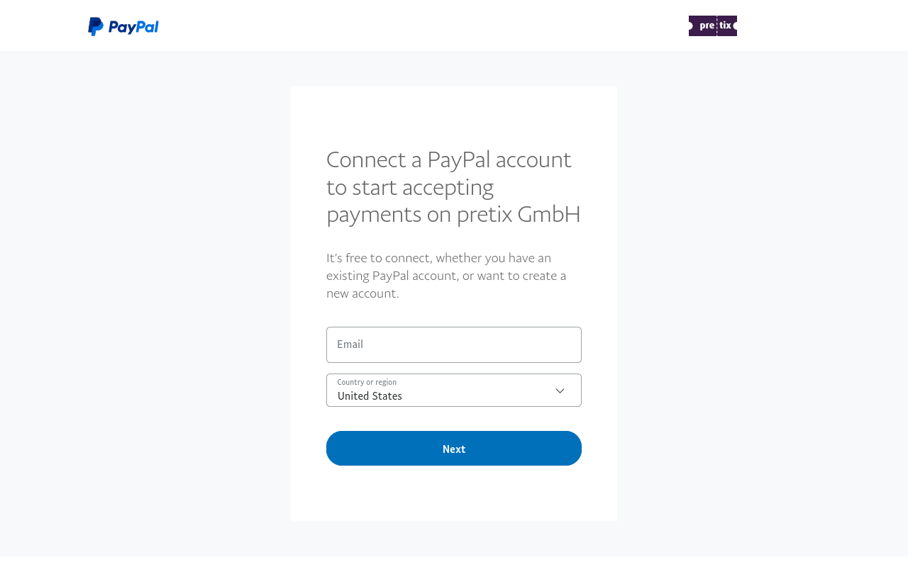

# PayPal

PayPal ist eine von vielen Möglichkeiten, Zahlungen in pretix abzuwickeln.
PayPal ermöglicht die Zahlungsabwicklung über folgende Methoden:
Echtzeitzahlung per PayPal-Konto, „Jetzt kaufen, später bezahlen" per PayPal-Konto, SEPA-Lastschrift sowie alternative Zahlungsmethoden wie EPS, iDEAL und weitere.

Dieser Artikel erklärt, wie Sie Ihr PayPal-Konto verbinden und es verwenden, um damit Zahlungen über pretix zu empfangen.

## Voraussetzungen

Die Einrichtung von Zahlungsanbietern erfolgt auf Event-Ebene, daher müssen Sie zunächst ein Event erstellen.
Stellen Sie sicher, dass Sie ein aktives PayPal-Geschäftskonto haben.
Ein reguläres PayPal-Konto ist **nicht** ausreichend für die Integration mit pretix.
Eine [Anleitung zur Registrierung eines PayPal-Geschäftskontos](https://www.paypal.com/c2/webapps/mpp/how-to-guides/sign-up-business-account) finden Sie auf der PayPal-Website.

## Anleitung

Die Einrichtung von PayPal als Zahlungsanbieter in pretix umfasst folgende Schritte:

 1. PayPal-Plugin aktivieren
 2. Mit Ihrem PayPal-Geschäftskonto verbinden
 3. Notwendige Informationen auf der PayPal-Einstellungsseite eintragen
 4. Optionale Anpassungen vornehmen.
 5. Zahlung per PayPal aktivieren.
 6. Testen.

Dieser Abschnitt führt Sie im Detail durch diese Schritte.

Navigieren Sie zu :navpath:Dein Event → :fa3-wrench: Einstellungen → Plugins:.
Wechseln Sie zum Tab :btn:Zahlungsanbieter:.
Auf dieser Seite wird das PayPal-Plugin oben angezeigt.
Es sollte standardmäßig aktiv sein.
Wenn es aktiv ist, hat es einen grünen „:fa3-check: Aktiv"-Badge, einen weißen „Deaktivieren"-Button sowie zwei Dropdown-Menüs.
Wenn es nicht aktiv ist, fehlt der Badge und es erscheint ein lila :btn:Aktivieren:-Button.
Überprüfen Sie, ob das Plugin aktiv ist.

Sie können direkt zu den PayPal-Einstellungen springen, indem Sie auf das Dropdown-Menü :btn-icon:fa3-gear: Einstellungen: und dann auf :btn:Zahlung → PayPal: klicken.

Alternativ navigieren Sie :navpath:Dein Event → :fa3-wrench: Einstellungen → Zahlung:.
Der Tab :btn:Zahlungsanbieter: auf dieser Seite zeigt die Liste der aktiven Zahlungsanbieter.
Die Liste sollte nun einen Eintrag für PayPal mit einem roten „:fa3-remove: Deaktiviert"-Badge enthalten.
Das Plugin ist aktiviert, aber PayPal wurde noch nicht als Zahlungsanbieter für das Event eingerichtet und freigeschaltet.
Klicken Sie auf den :btn-icon:fa3-gear:Einstellungen:-Button neben PayPal.
Dies führt Sie zur Einstellungsseite für PayPal.

Ab diesem Punkt unterscheidet sich das Vorgehen je nachdem, ob Sie pretix Hosted oder eine selbst gehostete Edition von pretix (Community oder Enterprise) verwenden.

### Verbindung mit PayPal über pretix Hosted

<!-- md:hosted -->

Wenn Sie pretix Hosted verwenden und Ihr Konto noch nicht mit PayPal verbunden ist, enthält die Einstellungsseite für PayPal nur den Button :btn:Mit PayPal verbinden:.
Klicke auf den Button und schließe den Anmelde- und Autorisierungsprozess bei PayPal ab.

Das Plugin ist aktiv, aber PayPal wurde noch nicht als Zahlungsanbieter für das Event eingerichtet.
Klicken Sie auf den :btn-icon:fa3-gear:Einstellungen:-Button neben PayPal.
Dies führt Sie zur Einstellungsseite für PayPal, die aktuell nur den Button :btn:Mit PayPal verbinden: enthält.
Klicken Sie den Button und schließen Sie den Anmelde- und Autorisierungsprozess bei PayPal ab.

Nachdem Sie den Autorisierungsprozess bei PayPal abgeschlossen haben, sieht die PayPal-Einstellungsseite im pretix-Backend anders aus.
Anstelle des einzelnen Buttons bietet sie nun  zahlreiche Einstellungen an.
Die Seite zeigt oben Ihre PayPal-Merchant-ID an.

Alle Einstellungen hier sind optional.
Sehen Sie sich die Seite genau an und aktivieren Sie alle Einstellungen, die Sie für diesen Zahlungsanbieter bei Ihrem Event nutzen möchten.
Wenn Sie zufrieden sind, scrollen Sie zum Seitenanfang und setzen Sie das Häkchen bei „Zahlungsmethode aktivieren".
PayPal und die anderen auf dieser Seite aktivierten Zahlungsmethoden erscheinen nun als Zahlungsoption für Kunden in Ihrem Shop.

### Verbindung mit PayPal über eine selbst gehostete Edition von pretix

<!-- md:community -->
<!-- md:enterprise -->

Wenn Sie pretix Community oder pretix Enterprise verwenden und Ihr Konto noch nicht mit PayPal verbunden haben, zeigt die Einstellungsseite für PayPal Felder mit der Bezeichnung „Client ID" und „Secret".
Gehen Sie zu [https://developer.paypal.com](https://developer.paypal.com) und melden Sie sich in Ihrem Konto an.
Erstellen Sie eine neue REST-API-App und wechseln Sie diese von „Sandbox" auf „Live".
Kopieren Sie die Client-ID und das Secret von der PayPal-REST-API-App-Seite in die Einstellungsseite für PayPal in pretix.
Weitere Informationen finden Sie in der PayPal-Dokumentation zu [PayPal REST APIs](https://developer.paypal.com/api/rest/).

Sie müssen außerdem einen Webhook erstellen, damit PayPal pretix über Ereignisse wie Zahlungsabbrüche informieren kann.
Kopieren Sie die Webhook-URL aus dem Infokasten am unteren Ende der PayPal-Einstellungsseite in pretix.
Öffnen Sie [https://developer.paypal.com](https://developer.paypal.com) und bearbeiten Sie die REST-API-App, die Sie für dieses Event erstellt haben.
Fügen Sie einen Webhook hinzu und fügen Sie die Webhook-URL in das entsprechende Feld ein.
Setzen Sie das Häkchen bei „Alle Ereignisse" und speichern Sie Ihre Einstellungen.

Nachdem Sie die Verbindung zwischen pretix und PayPal eingerichtet haben, bietet die PayPal-Einstellungsseite im pretix-Backend nun zahlreiche Einstellungen.
Alle neuen Einstellungen hier sind optional.
Sehen Sie sich die Seite genau an und aktivieren Sie alle Einstellungen, die Sie für diesen Zahlungsanbieter bei Ihrem Event nutzen möchten.
Wenn Sie zufrieden sind, scrollen Sie zum Seitenanfang und setzen Sie das Häkchen bei „Zahlungsmethode aktivieren".
PayPal und die anderen auf dieser Seite aktivierten Zahlungsmethoden erscheinen nun als Zahlungsoption für Kunden in Ihrem Shop.
