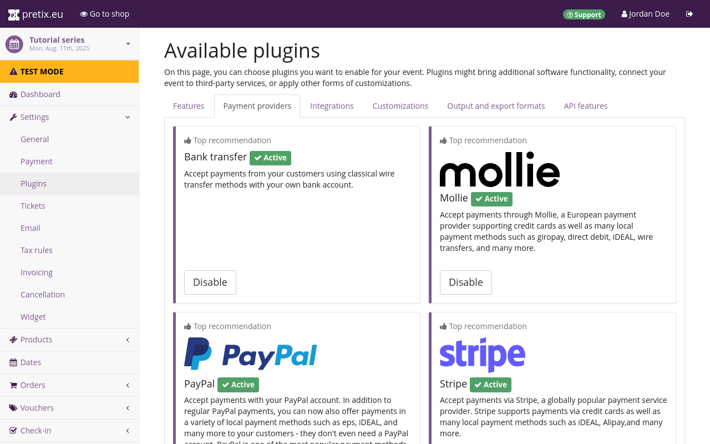

# PayPal

PayPal ist eine von vielen Möglichkeiten, Zahlungen in pretix abzuwickeln.
PayPal ermöglicht die Zahlungsabwicklung über folgende Methoden:
Echtzeitzahlung per PayPal-Konto, „Jetzt kaufen, später bezahlen" per PayPal-Konto, SEPA-Lastschrift sowie alternative Zahlungsmethoden wie EPS, iDEAL und weitere.

Dieser Artikel erklärt, wie du dein PayPal-Konto verbindest und damit Zahlungen über pretix empfängst.

## Voraussetzungen

Die Einrichtung von Zahlungsanbietern erfolgt auf Event-Ebene, daher musst du zunächst ein Event erstellen.
Stelle sicher, dass du ein aktives PayPal-Geschäftskonto hast.
Ein reguläres PayPal-Konto ist **nicht** ausreichend für die Integration mit pretix.
Eine [Anleitung zur Registrierung eines PayPal-Geschäftskontos](https://www.paypal.com/c2/webapps/mpp/how-to-guides/sign-up-business-account) findest du auf der PayPal-Website.

## Vorgehensweise

Die Einrichtung von PayPal als Zahlungsanbieter in pretix umfasst folgende Schritte:

 1. PayPal-Plugin aktivieren.
 2. Verbindung mit deinem PayPal-Geschäftskonto herstellen.
 3. Pflichtangaben auf der PayPal-Einstellungsseite eintragen.
 4. Optionale Anpassungen vornehmen.
 5. Zahlung per PayPal aktivieren.
 6. Testen.

Dieser Abschnitt führt dich im Detail durch diese Schritte.

Navigiere zu :navpath:Dein Event → :fa3-wrench: Einstellungen → Plugins:.
Wechsle zum Tab :btn:Zahlungsanbieter:.
Auf dieser Seite wird das PayPal-Plugin oben angezeigt.
Es sollte standardmäßig aktiv sein.
Wenn es aktiv ist, hat es einen grünen „:fa3-check: Aktiv"-Badge, einen weißen „Deaktivieren"-Button sowie zwei Dropdown-Menüs.
Wenn es nicht aktiv ist, fehlt der Badge und es erscheint ein lila :btn:Aktivieren:-Button.
Überprüfe, ob das Plugin aktiv ist.

Du kannst direkt zu den PayPal-Einstellungen springen, indem du auf das Dropdown-Menü :btn-icon:fa3-gear: Einstellungen: und dann auf :btn:Zahlung → PayPal: klickst.

Alternativ navigiere zu :navpath:Dein Event → :fa3-wrench: Einstellungen → Zahlung:.
Der Tab :btn:Zahlungsanbieter: auf dieser Seite zeigt die Liste der aktiven Zahlungsanbieter.
Die Liste sollte nun einen Eintrag für PayPal mit einem roten „:fa3-remove: Deaktiviert"-Badge enthalten.
Das Plugin ist aktiviert, aber PayPal wurde noch nicht als Zahlungsanbieter für das Event eingerichtet und freigeschaltet.
Klicke auf den :btn-icon:fa3-gear:Einstellungen:-Button neben PayPal.
Dies führt dich zur Einstellungsseite für PayPal.

Ab diesem Punkt unterscheidet sich das Vorgehen je nachdem, ob du pretix Hosted oder eine selbst gehostete Edition von pretix (Community oder Enterprise) verwendest.

### Verbindung mit PayPal über pretix Hosted

<!-- md:hosted -->

Wenn du pretix Hosted verwendest und dein Konto noch nicht mit PayPal verbunden hast, enthält die Einstellungsseite für PayPal nur den Button :btn:Mit PayPal verbinden:.
Klicke auf den Button und schließe den Anmelde- und Autorisierungsprozess bei PayPal ab.

Das Plugin ist aktiv, aber PayPal wurde noch nicht als Zahlungsanbieter für das Event eingerichtet.
Klicke auf den :btn-icon:fa3-gear:Einstellungen:-Button neben PayPal.
Dies führt dich zur Einstellungsseite für PayPal, die aktuell nur den Button :btn:Mit PayPal verbinden: enthält.
Klicke auf den Button und schließe den Anmelde- und Autorisierungsprozess bei PayPal ab.

Nachdem du den Autorisierungsprozess bei PayPal abgeschlossen hast, sieht die PayPal-Einstellungsseite im pretix-Backend anders aus.
Anstelle des einzelnen Buttons werden nun zahlreiche Einstellungen angeboten.
Die Seite zeigt oben deine PayPal-Merchant-ID an.

Alle Einstellungen hier sind optional.
Sieh dir die Seite genau an und aktiviere alle Einstellungen, die du für diesen Zahlungsanbieter bei deinem Event nutzen möchtest.
Wenn du zufrieden bist, scrolle zum Seitenanfang und setze das Häkchen bei „Zahlungsmethode aktivieren".
PayPal und die anderen auf dieser Seite aktivierten Zahlungsmethoden erscheinen nun als Zahlungsoption für Kunden in deinem Shop.

### Verbindung mit PayPal über eine selbst gehostete Edition von pretix

<!-- md:community -->
<!-- md:enterprise -->

Wenn du pretix Community oder pretix Enterprise verwendest und dein Konto noch nicht mit PayPal verbunden hast, zeigt die Einstellungsseite für PayPal Felder mit der Bezeichnung „Client ID" und „Secret".
Gehe zu [https://developer.paypal.com](https://developer.paypal.com) und melde dich in deinem Konto an.
Erstelle eine neue REST-API-App und wechsle diese von „Sandbox" auf „Live".
Kopiere die Client-ID und das Secret von der PayPal-REST-API-App-Seite in die Einstellungsseite für PayPal in pretix.
Weitere Informationen findest du in der PayPal-Dokumentation zu [PayPal REST APIs](https://developer.paypal.com/api/rest/).

Du musst außerdem einen Webhook erstellen, damit PayPal pretix über Ereignisse wie Zahlungsabbrüche informieren kann.
Kopiere die Webhook-URL aus dem Infokasten am unteren Ende der PayPal-Einstellungsseite in pretix.
Öffne [https://developer.paypal.com](https://developer.paypal.com) und bearbeite die REST-API-App, die du für dieses Event erstellt hast.
Füge einen Webhook hinzu und füge die Webhook-URL in das entsprechende Feld ein.
Setze das Häkchen bei „Alle Ereignisse" und speichere deine Einstellungen.

Nachdem du die Verbindung zwischen pretix und PayPal eingerichtet hast, bietet die PayPal-Einstellungsseite im pretix-Backend nun zahlreiche Einstellungen.
Alle neuen Einstellungen hier sind optional.
Sieh dir die Seite genau an und aktiviere alle Einstellungen, die du für diesen Zahlungsanbieter bei deinem Event nutzen möchtest.
Wenn du zufrieden bist, scrolle zum Seitenanfang und setze das Häkchen bei „Zahlungsmethode aktivieren".
PayPal und die anderen auf dieser Seite aktivierten Zahlungsmethoden erscheinen nun als Zahlungsoption für Kunden in deinem Shop.
