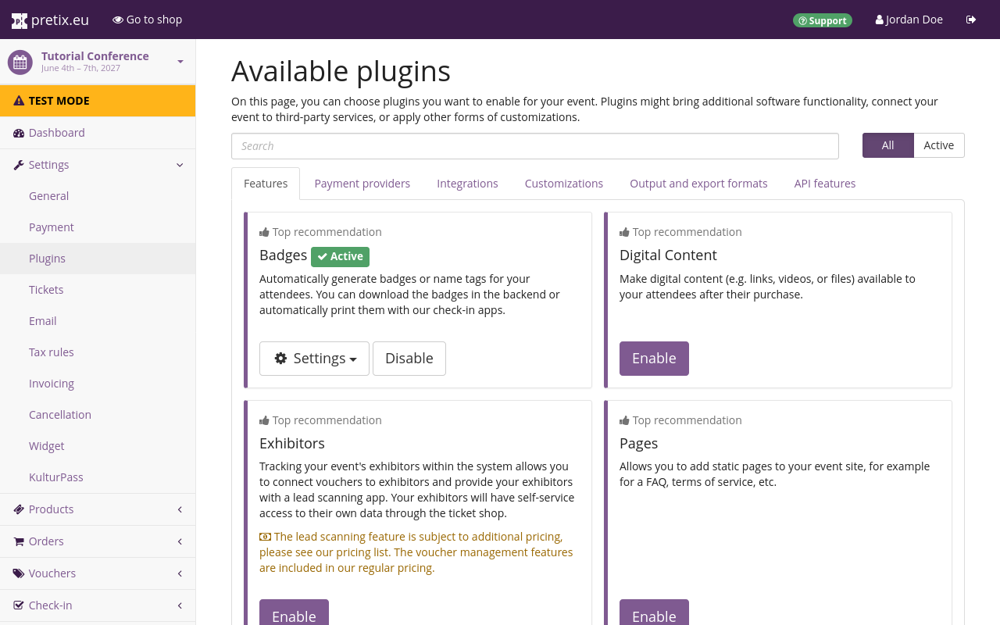

# Plugins

Plugins are optional pieces of software that can be enabled or disabled for every event. 
Plugins handle functions including, but not limited to: 

 - native features such as participant badges, [emails](email.md), and seating plans
 - integrations with [payment providers](payment/index.md) such as [Mollie](payment/mollie.md) or [PayPal](payment/paypal.md)
 - integrations with external services such as Google Analytics or Venueless 
 - output formats such as PDF tickets or sales reports 

Some plugins are active by default while others have to be enabled first. 
The availability of plugins depends on the edition of pretix you are using. 
You may have to install plugins before you can enable them. 
If you are using pretix Enterprise, refer to the guide on [installing pretix Enterprise plugins](../self-hosting/installation/enterprise.md). 

This article explains how to manage pretix plugins that are already available. 
If you want to create a plugin yourself, refer to the [developer documentation](https://docs.pretix.eu/dev/).

If you want to learn how to activate payment providers for your events, refer to the guide on [payment providers](payment/index.md). 

## Prerequisites

Plugins are handled on the event level, so you have to create an event first. 

## How To

In order to enable or disable plugins, navigate to :navpath:Your Event → :fa3-wrench: Settings → Plugins:. 
This lands you on the :btn:Features: tab which lists plugins for optional features. 
More plugins for functions such as integrations with payment providers or other external services can be found on the other tabs at the top of the page. 

On each tab, choose the plugins that you want to use from the top recommendations and the list and click the :btn:Enable: button next to them. 
You can also use the search function to find the plugin you need. 

A plugin that has been enabled will have a green "✓ Active" tag next to it and the purple "Enable" button will be replaced by a white "Disable" button. 
If you want to filter for active plugins only, click :btn:Active: in the "All|Active" toggle next to the search field. 
Disable any active plugins that you do not want to use for your event. 

### Configuring plugins

Some enabled plugins will add a corresponding entry to the sidebar menu which grants access to its settings. 
If there are settings pages associated with an active plugin, then extra buttons will be displayed next to the "Available plugins" page. 
In order to configure a plugin, navigate to :navpath:Your Event → :fa3-wrench: Settings → Plugins:. 
Search the plugin and click the :btn-icon:fa3-gear: Settings: drop-down menu next to it. 
The drop-down menu displays links to the settings pages for the plugin. 

### Controlling plugins

Some enabled plugins will add a corresponding entry to the sidebar menu which allow you to control their functionality. 
For instance, the "Statistics" plugin will gather statistics on orders placed on your shop and display them in the pretix backend. 
The "Bank transfer" plugin will require handling of bank data imports and refunds. 
In order to control such plugin functions, navigate to :navpath:Your Event → :fa3-wrench: Settings → Plugins:. 
Search the plugin and click the :btn-icon:fa3-compass: Go to: drop-down menu next to it. 
The drop-down menu displays links to pages that are relevant for the plugin. 

## Further Information

For more information on plugins for handling [payments](payment/index.md), refer to the following articles: 

 - [Bank transfer](payment/bank-transfer.md) 
 - [ePayBL](payment/epaybl.md)
 - [Mollie](payment/mollie.md)
 - [PayPal](payment/paypal.md) 
 - [Stripe](payment/stripe.md)

For more information on plugins for [integrations](integrations/index.md) with external services, refer to the following articles: 

 - [GetYourGuide](integrations/getyourguide.md)
 - [HubSpot](integrations/hubspot.md)
 - [Kulturpass](integrations/kulturpass.md)
 - [Presale SAML authentication](integrations/presale-saml.md)
