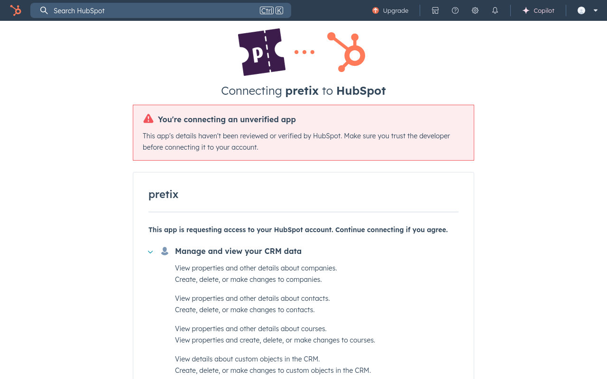

# HubSpot

This article explains the HubSpot integration plugin in pretix and what you can do with it. 

## Prerequisites

Plugins are handled on the event level, so you have to create an event first. 
You need to have access to a HubSpot account. 

## How To

This section explains how to enable the HubSpot plugin and how to set up the connection between your pretix account and your HubSpot account. 

In order to activate the HubSpot plugin, navigate to :navpath:Your Event → :fa3-wrench: Settings → Plugins: and switch to the :btn:Integrations: tab. 
Click the :btn:Enable: button next to the "HubSpot" plugin. 

Click the :btn-icon:fa3-gear: Settings: drop-down menu next to HubSpot and then click the entry :btn:Settings > HubSpot:. 
This takes you to a page titled "HubSpot Integration". 
In order to set up the connection to HubSpot, click the :btn:Request access: button. 

This opens a page on HubSpot, prompting you to create a HubSpot account or to sign into your existing one. 

Click the :btn:Sign in to your HubSpot account: button. 
This takes you to a page prompting you to choose an account

Click your account in the list and then click the :btn:Choose Account: button. 
The next page warns you that you are connecting an unverified app. 

Scroll to the bottom of the page and click the :btn:Connect app: button. 
Once you have done that, you will be taken back to the HubSpot Integration settings page. 
Instead of the "Request access" button, this page now states that the event is connected to HubSpot and displays settings for object mappings. 

Click the :btn:Save: button. 

## Troubleshooting 

What are common problems that could be encountered here? How do you solve them? 

## Further Information

What other media do we have on the subject? Youtube videos, PDF handouts, vendor documentation (for plugins etc.) etc.? Link it here and explain what it does

## See Also 

Link to other relevant guides, for example, in the case of Payment Providers, link to the articles on payment settings and plugins. Do not link to pages already linked underneath the title heading, prerequisites, or further information. 