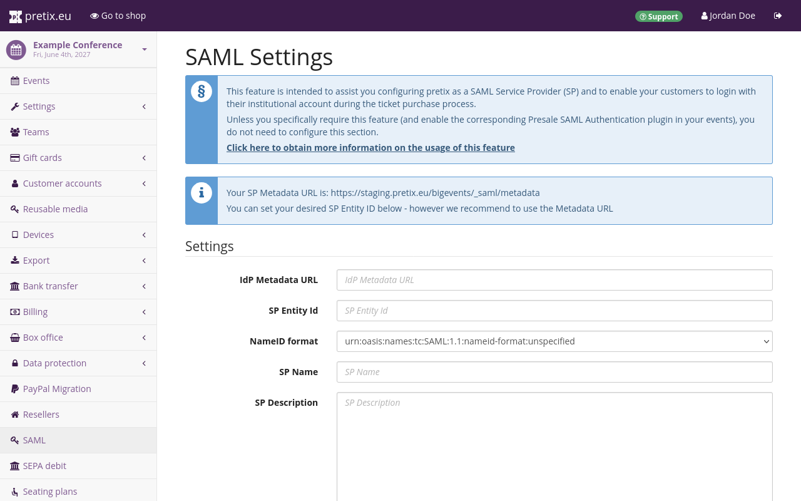

# Presale SAML Authentication

This guide explains how to set up strong customer authentication using Security Assertion Markup Language (SAML). 
You can use the plugin "Presale SAML Authentication" to integrate pretix as a service provider (SP) with a SAML identity provider (IdP). 
Once this is set up, customers will have to log in to your SAML IdP during checkout. 

!!! Note 
    SAML authentication is intended for advanced use cases only. 
    If you do not already have a working SAML setup outside of pretix, it is very likely that you do not need to use this feature. 

## Prerequisites 

Before you can use the SAML integration, you need to have access to a SAML identity provider. 

## How to 

Setting up the SAML integration involves the following steps: 

 1. If you are using pretix Hosted, ask pretix support to make the "Presale SAML Authentication" plugin available on your account. 
 If you are using pretix Enterprise, install the plugin and set it up. 
 2. Set up the Service Provider (SP) on the global or organizer level. 
 3. Activate the plugin for the event. 
 4. Set up SAML authentication on the event level. 

### Plugin installation and initial configuration

<!-- md:enterprise -->  

If you are using pretix Enterprise, then you first have to install the plugin "Presale SAML Authentication" and do some setup on your pretix instance. 
These steps are **not** necessary if you are using pretix Hosted. 

Follow the instructions on how to [install pretix Enterprise plugins](../../self-hosting/installation/enterprise.md) in the self-hosting documentation. 

You have to decide if you want your pretix instance to be a single service provider (SP) for all organizers, or if every organizer acts as their own SP.
A single unified SP makes sense if all organizers hosted on the pretix instance are part of the same organization. 
For example, if your company controls the SP, the pretix instance, and all organizers hosted on it, then a single SP is enough. 

If every organizer is a separate legal entity, then you have to set up the pretix instance so that every organizer acts as their own SP. 
For example, pretix Hosted as provided on [pretix.eu](https://pretix.eu) serves a multitude of clients. 
Every organizer is a separate legal entity and as such will have to act as their own SP if they need to use the SAML integration. 

If you want to use a single SP for the entire instance, extend the configuration file `<config>` with the following lines: 

``` ini
[presale-saml]
level=global
```

If you want every organizer to act as their own SP, extend the configuration file `<config>` with the following lines instead: 

``` ini
[presale-saml]
level=organizer
```

If you set `level` to `global`, then your instance will use a single system-wide SP. 
If you set `level`to `organizer`, then the SP will have to be configured for each organizer individually. 
If you do not define `level`, then it will default to `organizer`. 

### Plugin activation 

<!-- md:hosted --> 

If you are using pretix Hosted, the pretix team has to make the "Presale SAML Authentication" plugin available for your organizer account before you can use it. 
Contact support via [email](mailto:support@pretix.eu) or [phone](tel:+4962213217750) and ask them to activate the SAML plugin. 
Once the plugin has been made available for the organizer account, the button ":fa3-key: SAML" will appear under the organizer settings in the sidebar menu. 

<!-- md:enterprise --> 

If you are using pretix Enterprise, then there is no restriction on the plugin. 
You can enable "Presale SAML Authentication" like any other plugin. 

Navigate to :navpath:Your organizer: → :fa3-wrench: Settings → Plugins:. 
Open the :btn:Integrations: tab. 
Look for the "Presale SAML Authentication" plugin in the list. 
If it is active, it will have a green "Active" tag and a white "Disable" button. 
If it is not active, the tag will be missing and it will have a purple Enable button. 

Verify that the plugin is active. 
If the plugin is active, then, in the sidebar menu, under the organizer settings, there will be an entry labeled ":fa3-key: SAML". 

Repeat these steps for every organizer account with which you want to use SAML authentication. 

### Setting up the SP 

<!-- md:enterprise -->

If you are using pretix Enterprise and want to configure the service provider (SP) for the entire pretix instance, navigate to :navpath::i-pretix: Dashboard:, click the :btn-icon:fa3-id-card: Admin mode: button and then the :btn-icon:fa3-key: SAML: button in the sidebar menu. 
If you want to configure the SP for the organizer account, navigate to :navpath:Your organizer → :fa3-key: SAML: instead. 
The process is the same from here on out. 

#### Setting up the connection 

Setting up the connection between SP and IdP requires a lot of information. 
If you are not sure which setting you should choose or what information you should provide in any of the fields, contact your IdP operator. 
They should know exactly what information the IdP expects and supports. 



Provide the URL where your IdP outputs its metadata under "IdP Metadata URL". 
For most IdPs, this URL is static and the same for all SPs. 
If you are a member of DFN-AAI, you can find the metadata for the [Test-, Basic- and Advanced-Federation](https://doku.tid.dfn.de/en:metadata) on their website. 

Contact your IdP operator and ask them whether or not you need to go through the DFN-AAI. 
It is also possible that you can just use your institution's local IdP, which will also host their metadata on a different URL.

The URL needs to be publicly accessible.
Saving the settings will fail if the IdP metadata cannot be retrieved. 
pretix will automatically refresh the IdP metadata on a regular basis.

Use the system-proposed metadata URL as the "SP Entity ID". 
You can also set any URL as the SP Entity ID if required by your IdP. 

Most IdPs will display the name and description of your SP to your customers during authentication. 
You can use the "SP Name" and "SP Description" fields to explain to your customers how their data is being used.

Your SP needs an "SP X.509 Certificate" and an "SP X.509 Private Key". 
Ask your IdP if they can provide you with a certificate and key. 
If not, you need to generate these yourself. 

Certificates have an expiry date and need to be renewed on a regular basis. 
In order to facilitate the rollover from the expiring to the new certificate, you can provide an "SP X.509 New Certificate" before the expiration of the existing one. 
pretix will automatically use the correct one. 

Once the old certificate has expired and is not in use anymore, you can move the new certificate to the "SP X.509 Certificate" field and keep the new slot empty for your next renewal process.

#### Choosing which attributes to request

Not all IdPs use the same attributes to authenticate a user. 
Your IdP will dictate which of the available attributes your SP can receive. 

pretix will use most attributes only to authenticate your customer and not process the received data any further. 
There are two special cases in which pretix will automatically populate the corresponding fields during the checkout process and lock them so that they **cannot be edited** by the customer:  

 - If both `givenName` and `sn` are present and pretix is configured to collect the customer's name, then pretix will use `givenName` for the given name and `sn` for the family name. 
 - If the attribute `email`is present, pretix will use it for the email address of the customer. 

This latter case can cause problems if the IdP is transmitting an `email` attribute which does contain a system-level mail address which is only used as an internal identifier but not as a real mailbox. 
You can fix this by setting the `friendlyName` property to any value other than `email` or by removing the attribute from the list entirely. 

Use the "Requested Attributes" field to define exactly which attributes the SP should request.
This field comes with a template input that will help you with the proper formatting. 
The notation is a JSON list of objects with 5 properties each:

 - `attributeValue`: can be defaulted to `[]`.
 - `friendlyName`: string used in the event-level settings to retrieve the attribute data.
 - `isRequired`: boolean indicating whether the IdP must enforce the transmission of this attribute. 
   In most cases, `true` is the best choice.
 - `name`: string containing the internal/technical name of the requested attribute. 
   Often starting with `urn:mace:dir:attribute-def:`, `urn:oid:` or `http://`/`https://`.
 - `nameFormat`: String describing the type of `name` that has been set in the previous section. 
   Often starting with `urn:mace:shibboleth:1.0:` or `urn:oasis:names:tc:SAML:2.0:`.

Ask your IdP for a list of available attributes. 
For two examples on what this configuration could look like, refer to the section on [configuration examples](presale-saml.md#configuration-examples) below. 

!!! Note
    You can have multiple attributes with the same `friendlyName` value but different `name` values. 
    This can be used in cases in which the same information, for example a customer's name, is stored in more than one field. 
    Such a setup may be necessary in a case in which one piece of software returns SAML 1.0 and another piece of software returns SAML 2.0-style attributes. 

    This mostly occurs in mixed environments like the DFN-AAI with a large number of participants. 
    If you are only using your own institution's IdP and not providing authentication for any third parties, then this will probably not apply to you. 

#### Optional settings 

Inquire with your IdP for the correct settings for the checkboxes on the SAML settings page. 
Every checked box improves the security of the setup. 
Some IdP setups may cause problems with some of these settings. 

Choose a "Signature Algorithm" and a "Digest algorithm" that both pretix/your SP and the IdP can communicate with. 
A common source of issues when connecting to a Shibboleth-based IdP is the Digest Algorithm. 
pretix does not support RSA-OAEP and authentication will fail if the IdP enforces this.

Technical contacts and support contacts are encoded into the SPs public metadata. 
They might be displayed to customers if they run into problems while trying to authenticate. 
We recommend providing two dedicated point of contact, one for general support and one for technical issues. 

Once you are happy with your settings, click the :btn:Save: button. 

### Event-level configuration 

This section explains how to set up SAML authentication on the event level. 
In order to activate the plugin, navigate to :navpath:Your Event → :fa3-wrench: Settings → Plugins: and switch to the :btn:Integrations: tab. 
Click the :btn:Enable: button next to the "Presale SAML Authentication" plugin. 

The :btn-icon:fa3-key: SAML: button will now appear in the sidebar menu. 
Click that button in order to access the event-level SAML settings. 


Many customers will not know the reason why they have to authenticate in order to make a purchase in your shop. 
Use the "Checkout Explanation" field to provide an explanation for the process and the reasoning behind it to be displayed in the shop. 

#### Using "Attribute RegEx" to further restrict attendance

By default, any successful authentication with the IdP will allow the customer to proceed with their purchase. 
If you need to restrict the intended audience further, you can use the "Attribute RegEx" field to define a set of regular expressions to do this.
The default regular expression is`{}`. 
This will allow any authenticated user to pass.

If, for example, you edit the "Attribute RegEx" field to contain `{ "affiliation": "^(employee@pretix.eu|staff@pretix.eu)$" }`, then only customers who have the `affiliation` attribute and whose attribute matches `employee@pretix.eu` or `staff@pretix.eu` will be allowed to pass. 
You can only query attributes that are requested by the IdP. 
The "Information" section at the top of this page lists all currently configured attributes. 

The "RegEx Fail Explanation" field is only used in conjunction with the "Attribute RegEx" field described above. 
Use it to define an error message which will be displayed to the customer if they do not pass the restrictions put into place by the regular expression. 
For example, if you are organizing a university event and restricting access to students only, you can use the "RegEx Fail Explanation" field to explain that employees are not allowed to book tickets.

#### Using "Ticket Secret SAML Attribute" to include a SAML attribute in the ticket secret 

pretix can use one of the customer's attributes to generate the ticket secret, for example their ID or access card number. 
If you want pretix to generate ticket secrets this way, specify the SAML attribute under "Ticket Secret SAML Attribute". 
Ticket secrets still need to be unique. 
If an attribute is specified in "Ticket Secret SAML attribute", pretix generates ticket secrets prefixed with the attribute value. 

For illustrative purposes, consider the following example: 
A customer's `cardid` attribute has the value `01189998819991197253`. 
With nothing specified under "Ticket Secret SAML attribute", the random ticket secret is `yczygpw9877akz2xwdhtdyvdqwkv7npj`. 
If you specify an attribute under "Ticket Secret SAML attribute", the full random ticket secret is `01189998819991197253_yczygpw9877akz2xwdhtdyvdqwkv7npj`.

This way, the ticket secret is still unique, but when checking into an event, the customer can easily be searched and found using their identifier.

### Saving attributes to questions

You can save the value of a SAML attribute into the answer to a user-defined question. 
The answer will then be fixed and cannot be edited by the customer anymore. 


In order to set up a question this way, navigate to :navpath:Your event: → :fa3-ticket: Products → Questions. 
Click the :btn-icon:fa3-plus: Create a new question: button or click the edit button :btn-icon:fa3-wrench: next to an existing question. 
Switch to the :btn:Advanced: tab. 
Set the "Internal identifier" field to the same as the `friendlyName` of one of the SAML attributes that you defined under "Requested Attributes" in the global or organizer-level SAML settings. 

Some more complex question types may not be compatible with SAML attributes due to format requirements. 
If you are unsure whether your question type is supported, or if you are encountering an error, switch to the :btn:General: tab and under "Question type", select "Text (one line)". 

### Configuration examples

This section contains two examples for SAML configurations with which the "Requested Attributes" field in the global or organizer-level SAML settings could be populated. 
For more information on that field, see the section on [Choosing which attributes to request](presale-saml.md#choosing-which-attributes-to-request). 

#### Requesting SAML 1.0 and 2.0 attributes from an academic IdP

This requests `eduPersonPrincipalName` (also sometimes called EPPN), `email`, `givenName` and `sn` both in SAML 1.0 and SAML 2.0 attributes.

``` json
[
    {
        "attributeValue": [],
        "friendlyName": "eduPersonPrincipalName",
        "isRequired": true,
        "name": "urn:mace:dir:attribute-def:eduPersonPrincipalName",
        "nameFormat": "urn:mace:shibboleth:1.0:attributeNamespace:uri"
    },
    {
        "attributeValue": [],
        "friendlyName": "eduPersonPrincipalName",
        "isRequired": true,
        "name": "urn:oid:1.3.6.1.4.1.5923.1.1.1.6",
        "nameFormat": "urn:oasis:names:tc:SAML:2.0:attrname-format:uri"
    },
    {
        "attributeValue": [],
        "friendlyName": "email",
        "isRequired": true,
        "name": "urn:mace:dir:attribute-def:mail",
        "nameFormat": "urn:mace:shibboleth:1.0:attributeNamespace:uri"
    },
    {
        "attributeValue": [],
        "friendlyName": "email",
        "isRequired": true,
        "name": "urn:oid:0.9.2342.19200300.100.1.3",
        "nameFormat": "urn:oasis:names:tc:SAML:2.0:attrname-format:uri"
    },
    {
        "attributeValue": [],
        "friendlyName": "givenName",
        "isRequired": true,
        "name": "urn:mace:dir:attribute-def:givenName",
        "nameFormat": "urn:mace:shibboleth:1.0:attributeNamespace:uri"
    },
    {
        "attributeValue": [],
        "friendlyName": "givenName",
        "isRequired": true,
        "name": "urn:oid:2.5.4.42",
        "nameFormat": "urn:oasis:names:tc:SAML:2.0:attrname-format:uri"
    },
    {
        "attributeValue": [],
        "friendlyName": "sn",
        "isRequired": true,
        "name": "urn:mace:dir:attribute-def:sn",
        "nameFormat": "urn:mace:shibboleth:1.0:attributeNamespace:uri"
    },
    {
        "attributeValue": [],
        "friendlyName": "sn",
        "isRequired": true,
        "name": "urn:oid:2.5.4.4",
        "nameFormat": "urn:oasis:names:tc:SAML:2.0:attrname-format:uri"
    }
]
```

#### Requesting skIDentity attributes for electronic identity cards

This requests the basic attributes `eIdentifier`, `IDType`, `IDIssuer`, and `NameID` from the [skIDentity](https://www.skidentity.de/) SAML service. 
These attributes are available for electronic ID cards such as the German ePA/NPA. 
(Other attributes such as the name and address are available from the IdP for an extra charge).

``` json
[
    {
        "attributeValue": [],
        "friendlyName": "eIdentifier",
        "isRequired": true,
        "name": "http://www.skidentity.de/att/eIdentifier",
        "nameFormat": "urn:oasis:names:tc:SAML:2.0:attrname-format:uri"
    },
    {
        "attributeValue": [],
        "friendlyName": "IDType",
        "isRequired": true,
        "name": "http://www.skidentity.de/att/IDType",
        "nameFormat": "urn:oasis:names:tc:SAML:2.0:attrname-format:uri"
    },
    {
        "attributeValue": [],
        "friendlyName": "IDIssuer",
        "isRequired": true,
        "name": "http://www.skidentity.de/att/IDIssuer",
        "nameFormat": "urn:oasis:names:tc:SAML:2.0:attrname-format:uri"
    },
    {
        "attributeValue": [],
        "friendlyName": "NameID",
        "isRequired": true,
        "name": "http://www.skidentity.de/att/NameID",
        "nameFormat": "urn:oasis:names:tc:SAML:2.0:attrname-format:uri"
    }
]
```