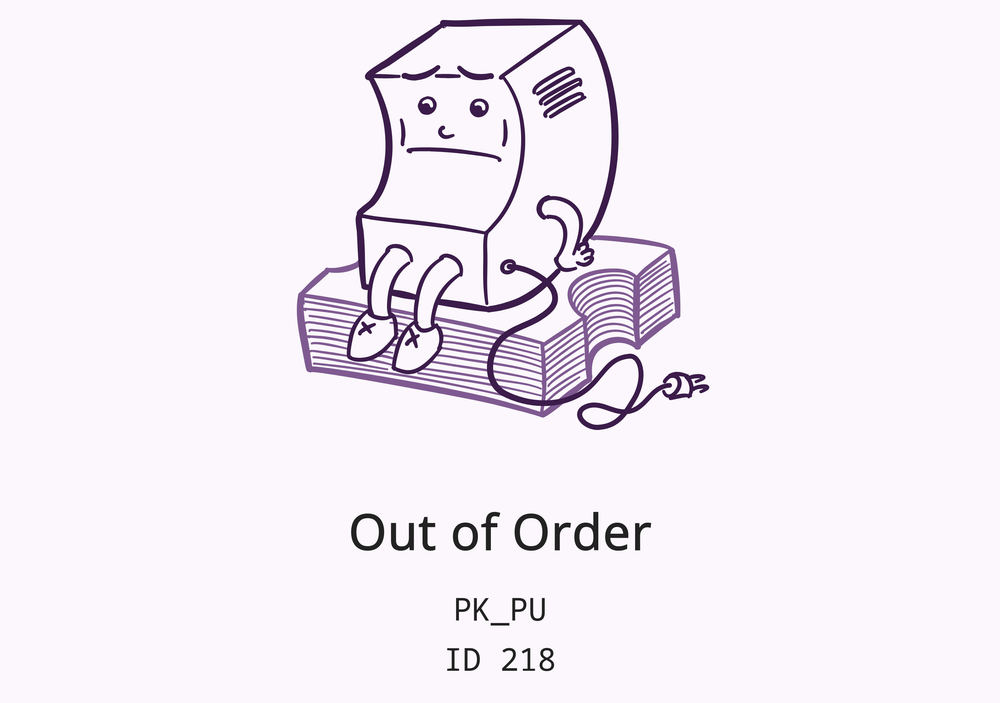

# Error codes

When pretixKIOSK is out of service, it shows an error screen like this:

The first line, `PK_PU` is an error code that you can find in the table below.
The second line, `ID 218` is the ID of the device within your organizer account.

| Error code | Meaning                                   | Recommendation                                                                        |
|------------|-------------------------------------------|---------------------------------------------------------------------------------------|
| `PK_IN`    | No internet / server connection           | Check internet connection of kiosk                                                    |
| `PK_PM`    | No payment method available               | Check logs of kiosk server component for payment errors, restart payment terminal     |
| `PK_MO`    | Manually out of service                   | Open service menu and disable "out of service" mode                                   |
| `PK_SM`    | Service mode enabled                      | Open service menu and disable service mode                                            |
| `PK_BD`    | Bill deposit mode enabled                 | Open service menu and continue or quit bill deposit operation, or wait for timeout    |
| `PK_CD`    | Coin deposit mode enabled                 | Open service menu and continue or quit coin deposit operation, or wait for timeout    |
| `PK_HD`    | Hardware abstraction layer is deactivated | Check hardware manufacturer's service interface                                       |
| `PK_HI`    | Hardware abstraction is being initialized | Wait for initialization to complete or check log files                                |
| `PK_HC`    | Hardware abstraction layer disconnected   | Check if hardware manufactuer's software is running                                   |
| `PK_HF`    | Hardware fault                            | Check hardware manufacturer's service interface                                       |
| `PK_VL`    | Power lost (USV mode)                     | Ensure power is reconnected                                                           |
| `PK_PU`    | Printer unavailable                       | Check printer names in configuration and printer availability in the operating system |
| `PK_PD`    | Printer disabled                          | Check logs, open service menu and restart printer connections                         |
| `PK_PF`    | Printer fault                             | Check printer functionality, open service menu and restart printer connections        |
| `PK_PP`    | Printer out of paper                      | Refill paper                                                                          |
