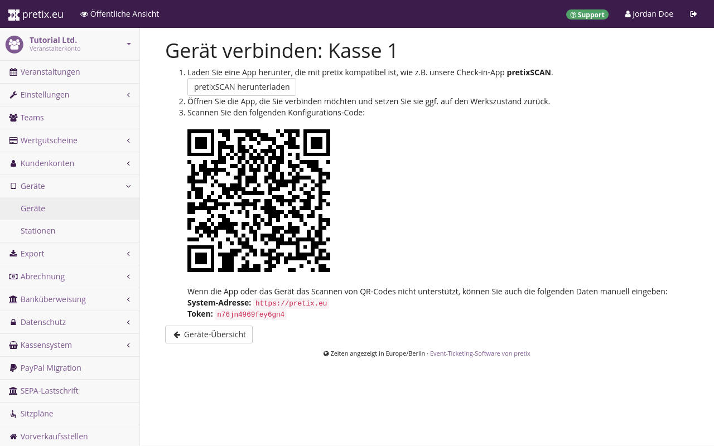
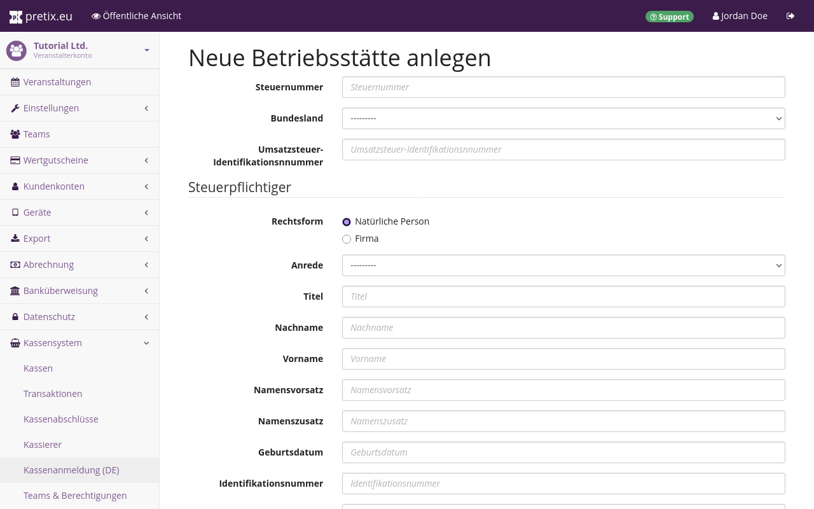
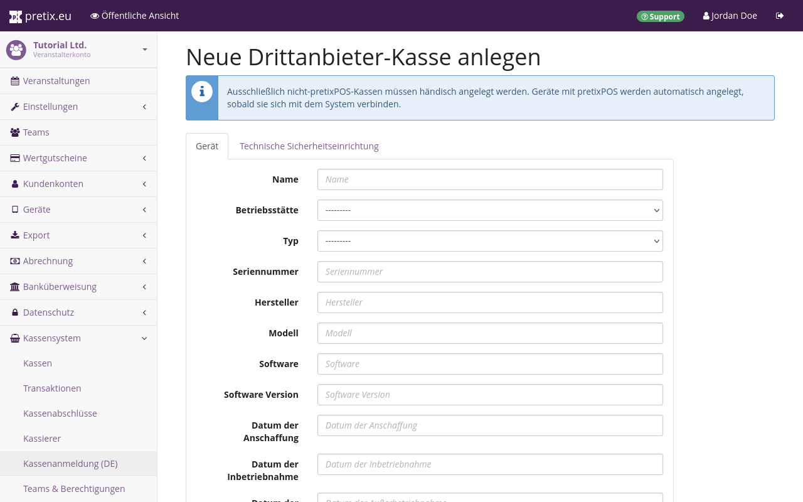

# Kassenanmeldung in Deutschland



Dieser Artikel erklärt die Anmeldung von Kassensystemen in Deutschland. 
Falls Sie als Einzelperson oder Firma in der Bundesrepublik Deutschland steuerpflichtig sind und eine Kasse haben, die Sie für den Verkauf über pretix nutzen, dann ist dieser Artikel relevant für Sie. 
Das gilt nicht nur dann, wenn es sich bei der Kasse um Ihr Eigentum handelt, sondern auch, wenn Sie eine Kasse von pretix mieten. 

Sie müssen grundsätzlich jede Kasse anmelden. 
Das gilt auch für Kassen ohne technische Sicherheitseinrichtung (TSE) und für Kassen, die nicht in aktiv in Benutzung sind. 
Sie müssen jegliche Änderung an den Kassendaten melden, also beispielsweise wenn Sie eine Kasse außer Betrieb nehmen, eine TSE entfernen, oder eine TSE tauschen. 
pretix bietet Funktionen, die Ihnen diese Meldungen erleichtern. 

## Voraussetzungen 

Für die Anmeldung einer Kasse mit pretix benötigen Sie: 

 - ein aktives Veranstalterkonto 
 - eine Veranstaltung 
 - mindestens ein Kassengerät mit pretixPOS
 - ein Konto bei [ELSTER](https://www.elster.de/) 

## Anleitung 

pretix erleichtert Ihnen die ordnungsgemäße Anmeldung einer Betriebsstätte mit allen zugehörigen Kassen. 
Das beinhaltet folgende Schritte, welche in diesem Artikel erläutert werden: 

 1. Verbinden Sie die pretixPOS-Kasse mit pretix 
 2. Legen Sie in pretix eine Betriebsstätte an 
 3. Weisen Sie die pretixPOS-Kasse einer Betriebsstätte zu 
 4. Falls vorhanden legen Sie in pretix Drittanbieter-Kassen an
 5. Exportieren Sie Kassendaten in eine XML-Datei

Die XML-Datei laden Sie dann beim ELSTER-Portal hoch. 
Diese Vorgehensweise vereinfacht den Prozess der Anmeldung von Kassen und Betriebsstätten bei ELSTER erheblich. 
Die Schritte dahin werden in den folgenden Abschnitten beschrieben. 

Dieses Vorgehen ist sinnvoll, wenn Sie an Ihrer Betriebsstätte alle Verkäufe über pretixPOS abwickeln. 
Es ist genauso sinnvoll, wenn Sie an einer Betriebsstätte mehrere Kassen mit unterschiedlichen Softwares nutzen, aber den Großteil dieser Kassen mit pretixPOS betreiben. 

Falls Sie Ihre Kassen überwiegend mit einer anderen Software benutzen, ist es möglicherweise einfacher, die Anmeldung über diese andere Software vorzunehmen. 
In diesem Fall [verbinden Sie Ihre pretixPOS-Kasse mit pretix](register.md#pretixpos-kasse-mit-pretix-verbinden) und folgen dann den Anweisungen unter [Alternative: Manuelle Anmeldung](register.md#alternative-manuelle-anmeldung). 

### pretixPOS-Kasse mit pretix verbinden 

Um ein Gerät, auf dem pretixPOS läuft, mit pretix zu verbinden, navigieren Sie zu :navpath:Ihr Veranstalter → :fa3-tablet: Geräte → Geräte: und klicken den Button :btn-icon:fa3-plus: Neues Gerät verbinden:. 
Benennen Sie die Kasse und wählen Sie die relevanten Veranstaltungen aus. 
Unter "Security profile" wählen Sie "pretixPOS" und klicken dann den Button :btn:Speichern:. 
Auf der nächsten Seite wird ein Anmeldecode als QR-Code und als alphanumerischer Code angezeigt.

Öffnen Sie die App pretixPOS auf dem Kassengerät und scannen Sie den QR-Code oder geben Sie den alphanumerischen Code ein. 
pretixPOS stellt Ihnen nun folgende Frage: "In welchem Land ist der Betrieb dieser Kasse steuerpflichtig?". 
Wählen Sie das entsprechende Land aus und tippen Sie den Button :btn:OK:. 
Wählen Sie dann eine oder mehrere Veranstaltungen, für die Sie die Kasse benutzen möchten. 

Falls eine TSE in das Kassengerät eingebaut und aktiviert wurde, dann überträgt es nun automatisch die Daten der Kasse und der TSE an das pretix-Backend. 
Wiederholen Sie diese Schritte für jedes Gerät mit pretixPOS, das Sie in Verbindung mit Ihrem Veranstalterkonto nutzen wollen. 

### Betriebsstätte anlegen

Die Anmeldung von Kassen in Deutschland erfolgt immer als Bruttomeldung, bei der alle Kassen an einer Betriebsstätte gesammelt übermittelt werden. 
Legen Sie daher zunächst in pretix eine Betriebsstätte an. 
Navigieren Sie dazu zu :navpath:Ihr Veranstalter → :fa3-shopping-basket: Kassensystem → Kassenanmeldung (DE): und klicken Sie den Button :btn-icon:fa3-plus: Neue Betriebsstätte anlegen:. 

Auf der Seite mit dem Titel "Neue Betriebsstätte anlegen" geben Sie zunächst Steuernummer, Bundesland und Umsatzsteuer-Identifikationsnummer an. 
Wählen Sie dann unter "Rechtsform" entweder "Natürliche Person" oder "Firma" aus. 
Abhängig von Ihrer Auswahl werden unterschiedliche Eingabefelder angezeigt. 
Füllen Sie diese aus. 

Falls die Daten Ihrer Betriebsstätte mit Ihren Daten als Steuerpflichtiger übereinstimmen, klicken Sie den Button :btn:Daten des Steuerpflichtigen übernehmen:.
Falls nicht, füllen Sie diese Felder ebenfalls aus. 
Sobald Sie den Button :btn:Speichern: klicken, prüft pretix, ob die eingegebene Steuernummer gültig ist, und ob die anderen Eingaben vollständig sind. 

### Kasse einer Betriebsstätte zuweisen

Um eine Kasse einer Betriebsstätte zuzuordnen, navigieren Sie zu :navpath:Ihr Veranstalter → :fa3-shopping-basket: Kassensystem → Kassenanmeldung (DE):. 
Diese Seite zeigt eine Liste mit dem Titel "Kassen, die keiner Betriebsstätte zugewiesen sind" an und unterhalb davon eine weitere Liste für jede Betriebsstätte, die Sie angelegt haben. 
Klicken Sie neben einer der nicht zugeordneten Kassen den Bearbeiten-Button :btn-icon:fa3-edit::.

Wählen Sie unter "Betriebsstätte" die Betriebsstätte aus, die Sie im vorigen Schritt erstellt haben. 
Überprüfen Sie die Angaben auf dieser Seite und korrigieren oder vervollständigen Sie sie falls nötig. 
Wechseln Sie dann zum Reiter :btn:Technische Sicherheitseinrichtung: und tun Sie dort das gleiche. 
Wählen Sie unter "Vorlage" das TSE-Modell um die Felder "Typ" und "BSI-Zertifizierungs-ID" automatisch füllen zu lassen. 
Die Module, die vermutlich am besten passen, werden farbig hervorgehoben. 
Wenn alle Felder ausgefüllt und die Angaben korrekt sind, klicken Sie den Button:btn:Speichern:. 

Sie kehren dadurch zurück zur Seite "Kassenanmeldung (DE)". 
Die bearbeitete Kasse befindet sich nun in der Liste für die Betriebsstätte, der Sie sie zugewiesen haben. 
Wiederholen Sie diese Schritte für alle Kassen mit pretixPOS an der Betriebsstätte – auch für Kassen, die nicht aktiv im Gebrauch sind und für Kassen ohne TSE. 

### Drittanbieter-Kasse anlegen

Falls an derselben Betriebsstätte weitere Kassen vorhanden sind, die Sie nicht mit pretixPOS betreiben, dann können Sie diese Kassen trotzdem auch über pretix erfassen. 
Hierfür navigieren Sie zu :navpath:Ihr Veranstalter → :fa3-shopping-basket: Kassensystem → Kassenanmeldung (DE): und klicken den Button :btn-icon:fa3-plus: Neue Drittanbieter-Kasse anlegen:. 
Wählen Sie unter "Betriebsstätte" die Betriebsstätte aus, die Sie im vorigen Schritt erstellt haben. 
Füllen Sie die Angaben auf dieser Seite vollständig aus. 

Wechseln Sie dann zum Reiter :btn:Technische Sicherheitseinrichtung: und tun Sie dort das gleiche. 
Wählen Sie unter "Vorlage" das TSE-Modell um die Felder "Typ" und "BSI-Zertifizierungs-ID" automatisch füllen zu lassen. 
Wenn alle Felder ausgefüllt und die Angaben korrekt sind, klicken Sie den Button:btn:Speichern:. 

Wiederholen Sie diese Schritte für alle Kassen mit Drittanbieter-Software an der Betriebsstätte – auch für Kassen, die nicht aktiv im Gebrauch sind und für Kassen ohne TSE. 

### Daten exportieren

Um Kassendaten für die Meldung über das ELSTER-Portal zu exportieren, navigieren Sie zu :navpath:Ihr Veranstalter → :fa3-shopping-basket: Kassensystem → Kassenanmeldung (DE):. 
Klicken Sie neben der Betriebsstätte, deren Daten Sie exportieren wollen, den Button :btn-icon:fa3-download: Export:. 

")

Klicken Sie auf der Seite mit dem Titel "Datenexport" den Button :btn-icon:fa3-download: Exportieren:. 
Daraufhin werden die Kassendaten in Form einer XML-Datei heruntergeladen. 
Sie können diese Datei nutzen, um über das ELSTER-Portal eine Mitteilung über elektronische Aufzeichnungssysteme (Kassengeräte) zu machen. 
Lesen Sie dazu auch die Hilfeseite von ELSTER: [Mitteilung über elektronische Aufzeichnungssysteme (§ 146a Absatz 4 AO)](https://www.elster.de/eportal/formulare-leistungen/alleformulare/aufzeichnung146a). 

Wiederholen Sie diese Schritte jedes Mal, wenn sich an den Kassen an Ihrer Betriebsstätte etwas ändert – also zum Beispiel dann, wenn Sie eine Kasse in Betrieb nehmen, eine Kasse außer Betrieb nehmen, eine TSE tauschen oder entfernen, oder wenn Sie ein neues Kassengerät erwerben. 
pretix zeigt auf der Seite mit dem Titel "Kassenanmeldung (DE)" einen entsprechenden Hinweis neben der Betriebsstätte an, wenn es entsprechende meldepflichtige Änderungen entdeckt. 

### Datenexport planen

!!! Warning
    Falls Sie einen regelmäßigen Export planen, müssen Sie jede der exportierten Dateien auf etwaige Änderungen überprüfen und bei ELSTER hochladen. 
    Wenn Sie das nicht tun, dann riskieren Sie, Ihrer gesetzlichen Meldepflicht nicht nachzukommen. 

Sie können auch einen regelmäßigen Export der Kassendaten planen. 
Um dies zu tun, navigieren Sie zu :navpath:Ihr Veranstalter → :fa3-shopping-basket: Kassensystem → Kassenanmeldung (DE):. 
Klicken Sie neben der Betriebsstätte, deren Daten Sie exportieren wollen, den Button :btn-icon:fa3-download: Export:. 
Klicken Sie auf der Seite mit dem Titel "Datenexport" den Button :btn-icon:fa3-clock-o: Export planen:. 

Auf der nächsten Seite können Sie den Zeitraum und die Wiederholungen für den automatischen Export definieren. 
Anders als beim einmaligen Export wird die XML-Datei nicht über den Browser heruntergeladen, sondern per Mail verschickt. 
Diese Mail wird nicht verschlüsselt. 
Falls die Exportdatei auf über 20 Megabyte anwächst, dann kann sie nicht mehr per Mail verschickt werden. 
Sie erhalten stattdessen eine Mail mit einer Fehlermeldung. 
Nutzen Sie in diesen Fällen den einmaligen Export. 

### Alternative: Manuelle Anmeldung 

Alternativ zur Erstellung der Betriebsstätte und zum automatisierten Export über pretix können Sie die Daten auch manuell übertragen. 
Das ist sinnvoll, wenn Sie die Kassenanmeldung über einen Drittanbieter oder manuell über das Formular bei ELSTER vornehmen wollen. 

Navigieren Sie zu :navpath:Ihr Veranstalter → :fa3-shopping-basket: Kassensystem → Kassenanmeldung (DE):. 
Klicken Sie neben der Kasse, die Sie anmelden wollen, den Bearbeiten-Button :btn-icon:fa3-edit::. 
Diese Seite zeigt Ihnen alle Daten an, die für die Anmeldung über einen Drittanbieter oder direkt bei ELSTER relevant sind. 
Übertragen Sie diese Daten an den gewünschten Ort. 

## Problemlösungen 

### Die Seite ":fa3-clock-o: Export planen" zeigt nur einen Warnhinweis an: 

Falls die Seite hinter dem Button :btn-icon:fa3-clock-o: Export planen: nur einen Warnhinweis anzeigt, dann bedeutet dies, das Ihr pretix-Account noch nicht aktiviert wurde. 
Klicken Sie den Button :btn:Zu den Account-Einstellungen: und vervollständigen Sie Ihre Kontaktinformationen. 
Lesen Sie den Tutorial-Abschnitt zur [Aktivierung des Veranstalterkontos](../../tutorial/organizer-account.md#activation) für mehr Informationen. 

## Weitere Informationen

Lesen Sie unseren Blogbeitrag: [So geht's: Kassenanmeldung in Deutschland](https://pretix.eu/about/de/blog/20250317-so-gehts-kassenanmeldung-in-deutschland/). 