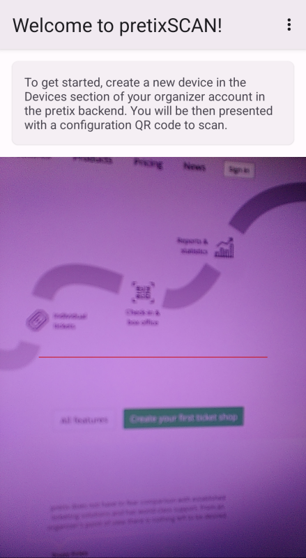
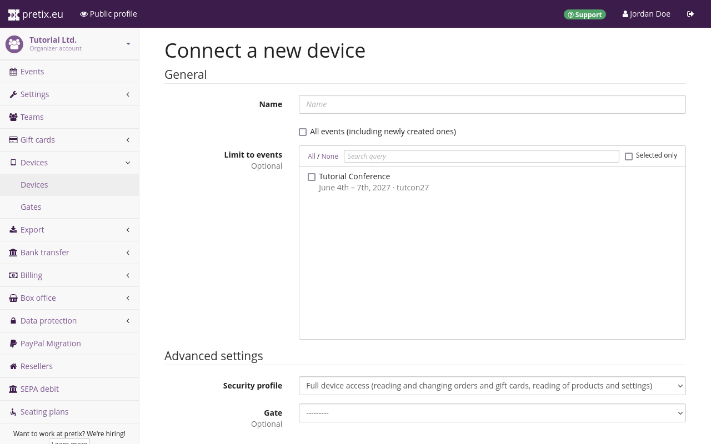
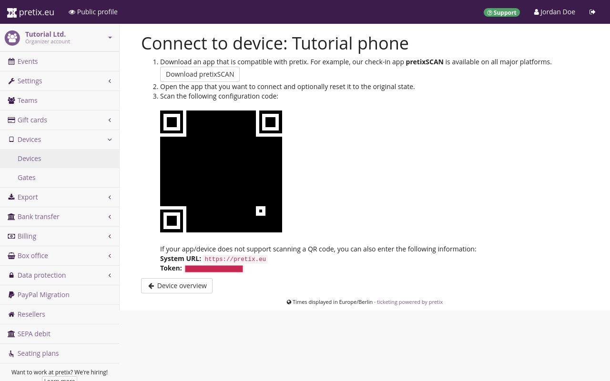
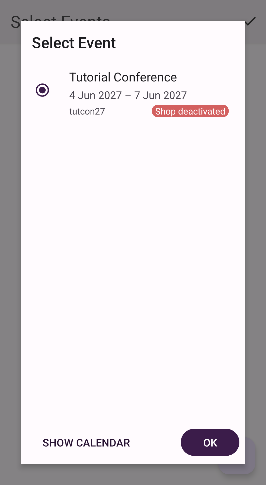
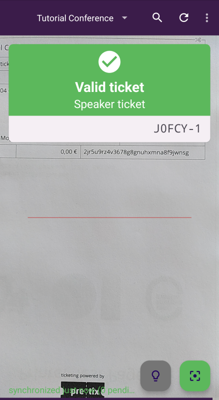
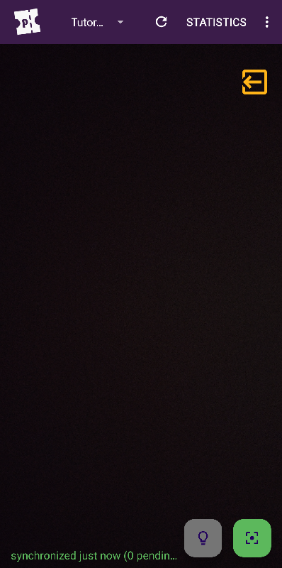
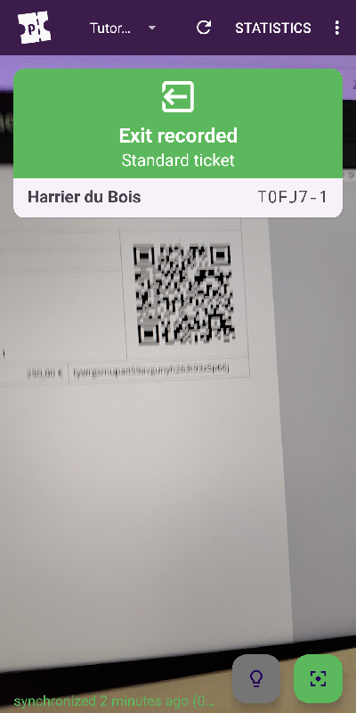
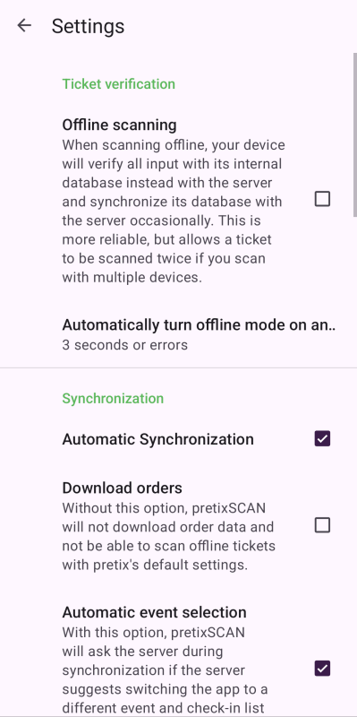
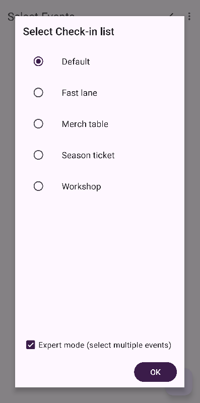
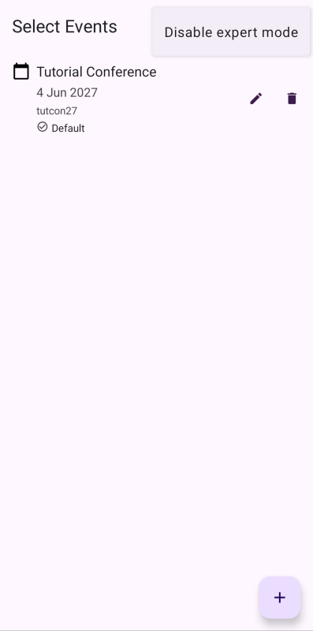

# pretixSCAN (Android)

Die Android-Version von [pretixSCAN](https://pretix.eu/about/en/scan) ist eine App, die Sie beim Check-in zu Ihren Veranstaltungen unterstützt.
Die wesentliche Funktion von pretixSCAN ist die Validierung von Tickets, aber darüber hinaus bietet die App noch weitere Funktionen:

 - manuell nach Teilnehmenden suchen, die ihr Ticket nicht zur Hand haben
 - Badges für Teilnehmende drucken
 - Zahlen zur Teilnahme rasch aufrufen

Dieser Artikel erklärt, wie Sie pretixSCAN für **Android** installieren und die Möglichkeiten dieser App nutzen.

## Voraussetzungen

pretixSCAN ist zur Verwendung bei Veranstaltungen vorgesehen, die mit pretix verwaltet werden.
Die Veranstaltung darf nicht offline sein.

Sie benötigen Zugriff auf ein Gerät mit der Android-Version 7 oder höher.
Weitere Informationen dazu finden Sie in unserer [Richtlinie zur Unterstützung von Android-Versionen](https://docs.pretix.eu/en/latest/user/android-version-support.html#pretixscan).

Um pretixSCAN auf Ihrem Gerät einzurichten, benötigen Sie einen QR-Code oder ein Zugriffstoken, der bzw. das im pretix-Backend generiert wurde.
Wenn Sie selbst keinen Zugriff auf das pretix-Backend haben, müssen Sie eine Person mit Zugriff darauf bitten, Ihnen den QR-Code bzw. das Zugriffstoken zu schicken.

## Allgemeine Verwendung

Dieser Abschnitt erläutert die grundlegende Nutzung von pretixSCAN auf Android-Geräten.
Dazu gehören die folgenden Schritte:

 - [App installieren](#installieren-und-einrichten) und einrichten
 - [mit dem Backend verbinden](#das-gerät-mit-dem-pretix-backend-verbinden)
 - einfaches [Scannen beim Einlass](#scannen-beim-einlass)
 - nach [Daten von Teilnehmenden](#nach-daten-von-teilnehmenden-suchen) suchen
 - den [Badge-Druck](#den-badge-druck-aktivieren) aktivieren

Dieser Abschnitt erklärt diese Schritte ausführlich.

### Installieren und einrichten

!!! Hinweis
    Wenn Sie Scan-Smartphones von uns mieten, haben wir für Sie bereits pretixSCAN und pretixPRINT auf den Geräten installiert.
    Wir haben auch alle benötigten Apps für Sie konfiguriert, sofern nichts anderes vereinbart war.
    Das gilt auch, wenn Sie die Geräte von uns gekauft und die fertig konfigurierte Variante bestellt haben.
    In beiden Fällen müssen Sie nichts mehr installieren, einrichten oder mit dem Backend verbinden.
    Machen Sie weiter beim Abschnitt über das [Scannen beim Einlass](#scannen-beim-einlass).

Sie können pretixSCAN auf Ihrem Android-Gerät [über den Google Play Store](https://play.google.com/store/apps/details?id=eu.pretix.pretixscan.droid) installieren wie jede andere App auch.
Wenn Ihr Gerät keinen Zugriff auf den Google Play Store hat, können Sie die aktuelle Version von unserem [pretix-Marketplace](https://marketplace.pretix.eu/products/pretixscan-android/versions) herunterladen.
Bei Geräten des Herstellers Sunmi finden Sie die App auch im App-Store von Sunmi.

Wenn Sie pretixSCAN zum ersten Mal starten, müssen Sie bestätigen, dass Sie die Konsequenzen für Datenschutz und Sicherheit verstehen, die sich durch das Speichern der Daten von Teilnehmenden auf dem Gerät ergeben.
Wenn Sie die Gerätekamera zum Validieren von Tickets nutzen möchten, müssen Sie pretixSCAN den Zugriff auf die Kamera erlauben.
Wenn Sie ein Smartphone mit speziellem Scanmodul nutzen, beispielsweise eines der Scan-Smartphones, die wir vermieten, müssen Sie pretixSCAN keinen Kamerazugriff erlauben.
Wir empfehlen die Nutzung des Scanmoduls.

Nachdem Sie die Berechtigung erteilt haben, kann pretixSCAN sofort auf das Scanmodul bzw. die Kamera zugreifen.
Die App fordert Sie außerdem in einem Textfeld auf, im pretix-Backend ein neues Gerät in Ihrem Veranstalterkonto anzulegen.
Der nächste Abschnitt erläutert, wie Sie das tun.

### Das Gerät mit dem pretix-Backend verbinden

Öffnen Sie das [pretix-Backend](https://pretix.eu/control/) und navigieren Sie zu :navpath:Ihr Veranstalter → :fa3-mobile-phone: Geräte:.
Klicken Sie den Button :btn-icon:fa3-plus: Neues Gerät verbinden:.
Geben Sie dem Gerät einen eindeutigen und aussagekräftigen Namen, etwa "Eingang B Smartphone 1".

Wenn Sie das Gerät für alle Veranstaltungen nutzen möchten, markieren Sie das Kontrollkästchen neben "Alle Veranstaltungen (auch zukünftig erstellte)".
Wenn Sie das Gerät nur für bestimmte Veranstaltungen nutzen möchten, lassen Sie das Kontrollkästchen leer.
Wählen Sie in dem Fall die gewünschten Veranstaltungen aus der Liste "Auf Veranstaltungen einschränken".

Öffnen Sie das Dropdown-Menü "Sicherheitsprofil" und wählen Sie eine der Optionen aus, die mit `pretixSCAN` beginnen.
Es gibt drei dieser Optionen:

 - `pretixSCAN`: Wählen Sie diese Option, wenn Sie alle Funktionen von pretixSCAN nutzen möchten.
 - `pretixSCAN (nur online, keine Bestellungs-Synchronisation)`: Wählen Sie diese Option, wenn Sie keine Daten von Bestellungen auf dem Gerät speichern möchten.
 Das [Offline-Scanning](#offline-scanning) funktioniert mit diesem Sicherheitsprofil nicht.
 - `pretixSCAN (Kiosk-Modus, keine Bestellungs-Synchronisation, keine Suche)`: Wählen Sie diese Option, wenn Sie den [Kiosk-Modus](#teilnehmende-scannen-ihre-tickets-selbst) nutzen möchten.
 Das [Offline-Scanning](#offline-scanning) funktioniert mit diesem Sicherheitsprofil nicht.
 Wenn Sie dieses Sicherheitsprofil wählen, bevor Sie das Gerät verbinden, wird der Kiosk-Modus aktiviert und die Suche deaktiviert.
 Wenn Sie erst nach dem Verbinden des Geräts dieses Sicherheitsprofil einstellen, müssen Sie diese Einstellungen manuell ändern.

Wenn Sie den Button :btn:Speichern: klicken, leitet pretix Sie zu einer Seite mit einem QR-Code.
Öffnen Sie pretixSCAN und scannen Sie den QR-Code mit der Kamera oder dem Scanmodul.

Wenn Sie den QR-Code nicht scannen können, können Sie das Gerät auch manuell verbinden.
Dazu tippen Sie den Drei-Punkte-Button :btn-icon:fa3-ellipsis-v:: oben rechts in der pretixSCAN-App.
Tippen Sie dann :btn:Manuelles Setup:.
Geben Sie die System-URL und das Token ein, das im pretix-Backend unterhalb des QR-Codes angezeigt wird.

Wenn Sie ein Gerät autorisieren möchten, das einer Person ohne Zugriff auf das pretix-Backend gehört, schicken Sie dieser Person den QR-Code.
Sie können den Code ausdrucken und auf Papier übergeben oder ihn an ein anderes Gerät schicken.
Es ist nicht sinnvoll, den QR-Code an das Gerät zu schicken, auf dem pretixSCAN läuft.
Als Alternative zum QR-Code können Sie auch die System-URL und das Token verschicken.

Wenn Sie mit Erfolg den QR-Code gescannt bzw. das Token eingegeben haben, fordert die App Sie auf, die Veranstaltung auszuwählen, für die Sie Tickets scannen möchten.
Sie können keine Veranstaltung wählen, die gerade offline ist.
Der nächste Schritt hängt von der Art der Veranstaltung ab, für die Sie Tickets scannen möchten.

 - **Einzelveranstaltung:** Wählen Sie aus der Liste oder dem Kalender die Veranstaltung und tippen Sie den Button :btn:OK:.
   Wählen Sie anschließend eine Check-in-Liste und tippen Sie erneut auf den Button :btn:OK:.

 - **Veranstaltungsreihe:** Wählen Sie einen der Termine aus der Veranstaltungsreihe.
   Es ist egal, welchen Termin Sie wählen:
   Es kommt nur auf die Veranstaltungsreihe als solche, die Check-in-Liste und die Check-in-Regeln an.
   Tippen Sie erneut den Button :btn:OK:, wählen Sie die Check-in-Liste und tippen Sie wieder auf den Button :btn:OK:.

 - **Mehrere Veranstaltungen oder Veranstaltungsreihen:** Hierfür benötigen Sie den Experten-Modus.
   Informationen dazu finden Sie unter [Tickets für mehrere Veranstaltungen scannen](#tickets-für-mehrere-veranstaltungen-scannen).

Die App zeigt nun den Hauptbildschirm an.
Wenn Sie das Sicherheitsprofil pretixSCAN gewählt haben, werden nun im Hintergrund die Veranstaltungsdaten vom Server heruntergeladen.

### Scannen beim Einlass

Standardmäßig ist die App jetzt im Modus für Einlass-Scans.
In dem Fall wird oben rechts als Piktogramm ein grauer Kasten angezeigt, in dem ein Pfeil nach rechts zeigt :fa3-sign-in:.
Wenn das Piktogramm gelb ist und der Pfeil nach links zeigt :fa3-sign-out:, ist die App im Modus für Ausgangsscans.
Um zum Einlass-Scan zu wechseln, tippen Sie den Drei-Punkte-Button :btn-icon:fa3-ellipsis-v:: und im Popup-Menü :btn:Zum Eingangs-Modus wechseln:.

Unsere Scan-Smartphones besitzen eine Kamera und ein Scanmodul.
Das Scanmodul arbeitet deutlich schneller und zuverlässiger als die Kamera.
Wenn Sie also ein Scanmodul zur Verfügung haben, sollten Sie es beim Check-in immer verwenden.

Um sicherzugehen, dass das Gerät mit der richtigen Einstellung arbeitet, öffnen Sie pretixSCAN, tippen den Drei-Punkte-Button :btn-icon:fa3-ellipsis-v:: oben rechts und tippen dann :btn:Einstellungen:.
Scrollen Sie zum Abschnitt "Benutzeroberfläche".
Wenn Ihr Gerät über ein Scanmodul verfügt, entfernen Sie die Markierung bei der Option "Geräte-Kamera benutzen".
Wenn Ihr Gerät kein Scanmodul hat, markieren Sie diese Option.

Das Scanmodul befindet sich am oberen Rand des Geräts.
Die Tasten zum Aktivieren des Scanmoduls sind am linken und rechten Rand.
Um einen QR-Code mit dem Scanmodul zu scannen, richten Sie das Scanmodul auf den Code und drücken eine der Tasten.
Das Scannen funktioniert am besten aus einer Entfernung von ca. 30 bis 50 cm.

Die Kamera befindet sich an der Geräterückseite.
Um einen QR-Code mit der Kamera zu scannen, richten Sie die Kamera so auf den Code, dass er im Bildschirm von pretixSCAN zu sehen ist.

!!! Hinweis
    Mit dem Scanmodul scannen Sie Codes schneller und zuverlässiger als mit einer Kamera.
    Sie sollten daher immer das Scanmodul nutzen, außer Sie arbeiten mit einem herkömmlichen Smartphone ohne spezielles Scanmodul.

Unabhängig vom Scanverfahren gleicht die App den gescannten Code gegen die gewählte Check-in-Liste auf dem Server ab.
Es gibt drei mögliche Ergebnisse:

 1. Das Ticket ist gültig und die Check-in-Regeln erlauben den Einlass unter den gegebenen Bedingungen: pretixSCAN zeigt ein grünes Feld mit dem Text "Ticket gültig" an.
 Darunter werden die Art des Tickets, die Nummer der Bestellung und die Positionsnummer angezeigt.
 2. Das Ticket ist gültig, wurde aber bereits ein- und nicht wieder ausgecheckt: pretixSCAN zeigt ein gelbes Feld mit dem Text "Ticket bereits eingelöst" an.
 Darunter werden die Art des Tickets, die Nummer der Bestellung und die Positionsnummer angezeigt, außerdem Datum und Uhrzeit des ersten Scans von diesem Ticket.
 3. In allen anderen Fällen zeigt pretixSCAN ein rotes Feld an, dessen Überschrift das Problem angibt.
 Mögliche Rückmeldungen sind beispielsweise "Ticket ungültig", "Ticket storniert" oder "Eintritt nicht erlaubt".

Wenn keines dieser Ergebnisse eintritt, hat Ihr Gerät den Code nicht gescannt.
Versuchen Sie in diesem Fall, den Winkel und den Abstand zwischen Scanmodul und Ticket zu verändern, oder verbessern Sie die Lichtverhältnisse.
Mit den Buttons unten im Bildschirm können Sie den Blitz und den Autofokus des Geräts ein- bzw. ausschalten.
Wenn beim Scannen eines Codes vom Bildschirm eines Smartphones Probleme auftreten, bitten Sie den\*die Kund\*in, die Bildschirmhelligkeit auf den maximalen Wert zu stellen.
Sie können auch probieren, ob es hilft, das Scangerät um 90 Grad in eine beliebige Richtung zu kippen.

### Nach Daten von Teilnehmenden suchen

Anstatt den Ticket-Code zu scannen können Sie in pretixSCAN auch nach Teilnehmenden suchen.
Falls ein\*e Teilnehmer\*in ohne Ticket beim Check-in erscheint, aber versichert, eines gekauft zu haben, können Sie nach den Daten dieser Person suchen.
Tippen Sie oben im Bildschirm den Button :btn-icon:fa3-search::.
Geben Sie in das Suchfeld den Namen der teilnehmenden Person ein, die Bestellnummer, den Ticket-Code oder die E-Mail-Adresse.
Tippen Sie das zutreffende Ergebnis in der Liste.

Die App überprüft daraufhin die Gültigkeit des Tickets und gibt dasselbe Ergebnis zurück, das ein Ticket-Scan erbracht hätte.

### Den Badge-Druck aktivieren

Der Badge-Druck funktioniert nur, wenn Sie für die betreffende Veranstaltung die Erweiterung "Badges" aktiviert haben und für das gescannte Ticket ein Badge-Layout gewählt wurde.
Um den Badge-Druck in pretixSCAN zu aktivieren, müssen Sie zuerst auf demselben Gerät unsere Zusatz-App pretixPRINT installieren und die Verbindung zu einem Drucker konfigurieren.

!!! Hinweis
    Auf den Scan-Smartphones, die Sie über unsere Website mieten können, ist pretixPRINT bereits installiert und konfiguriert.
    Im Normalfall müssen Sie pretixPRINT daher auf von uns gemieteten Scan-Smartphones nicht installieren und konfigurieren.

Anschließend öffnen Sie pretixSCAN, tippen den Drei-Punkte-Button :btn-icon:fa3-ellipsis-v:: oben rechts und tippen dann :btn:Einstellungen:.
Scrollen Sie zum Abschnitt "Badges" und markieren Sie das Kontrollkästchen neben "Badge-Druck aktivieren".

Von nun an enthält das Feld, das beim Scannen eines Tickets angezeigt wird, auch einen Button :btn-icon:fa3-print::.
Sie können für die Person mit dem Ticket manuell ein Badge ausdrucken, indem Sie den Button :btn-icon:fa3-print:: tippen.
Während das Gerät den Druckauftrag verschickt, wird eine Benachrichtigung angezeigt.

Wenn Sie für jedes gescannte Ticket automatisch ein Badge drucken möchten, rufen Sie die Seite mit den Einstellungen auf und scrollen Sie zum Abschnitt "Badges".
Öffnen Sie das Menü "Badges automatisch drucken" und wählen Sie `Immer`.
In der App wird weiterhin der Button :btn-icon:fa3-print:: angezeigt, sodass Sie manuell ein zusätzliches Badge drucken können.

Wenn Sie nach dem Scan alle Badges zweimal ausdrucken möchten, rufen Sie die Seite mit den Einstellungen auf.
Scrollen Sie zum Abschnitt "Badges" und markieren Sie das Kontrollkästchen neben "Jedes Badge doppelt drucken".

### Zu einer anderen Veranstaltung oder Check-in-Liste wechseln

Wenn Sie für Einlass-Scans zu einer anderen Veranstaltung oder Check-in-Liste wechseln möchten, tippen Sie oben im Bildschirm den Namen der Veranstaltung.
Wählen Sie aus dem Kalender oder der Liste die Veranstaltung und tippen Sie den Button :btn:OK:.
Wählen Sie die Check-in-Liste und tippen Sie wieder auf den Button :btn:OK:.

Wenn Sie in einem Durchgang Tickets für mehrere Veranstaltungen scannen möchten, sollten Sie den **Experten-Modus** aktivieren.
Weitere Informationen dazu finden Sie unter [Tickets für mehrere Veranstaltungen scannen](#tickets-für-mehrere-veranstaltungen-scannen).

## Weitergehende Einsatzmöglichkeiten

Dieser Abschnitt erläutert die folgenden weitergehenden Einsatzmöglichkeiten von pretixSCAN unter Android:

 - [Scannen am Ausgang](#scannen-am-ausgang)
 - [Einstellungen sperren](#einstellungen-sperren)
 - Mit dem Kiosk-Modus [Teilnehmende ihre Tickets selbst scannen](#teilnehmende-scannen-ihre-tickets-selbst) lassen
 - [Offline-Scannen](#offline-scannen)
 - Tickets für [mehrere Veranstaltungen](#tickets-für-mehrere-veranstaltungen-scannen) scannen

### Scannen am Ausgang

Wenn Sie Inhaber\*innen von Tickets beim Verlassen der Veranstaltung erfassen möchten, können Sie den Ausgangs-Modus von pretixSCAN verwenden.
Diese Vorgehensweise ist sinnvoll, wenn Sie möchten, dass Inhaber\*innen von Tickets die Veranstaltung mehrmals betreten können, sofern das betreffende Ticket nicht gerade bei dieser Veranstaltung eingecheckt ist.
Sie ist außerdem sinnvoll, wenn Sie Tickets, deren Inhaber\*innen an der Veranstaltung teilgenommen und sie bereits wieder verlassen haben, zurück ins Kontingent geben möchten, sodass Sie mehr Tickets verkaufen können.

Wenn pro Ticket **mehrere Einlässe** möglich sein sollen, muss die Check-in-Liste den erneuten Einlass nach dem Ausgangsscan zulassen.
Um dies zu aktivieren, öffnen Sie das [pretix-Backend](https://pretix.eu/control/) und navigieren Sie zu :navpath:Ihre Veranstaltung → :fa3-check-square-o: Check-in:.
Suchen Sie nach der Check-in-Liste und klicken Sie den Button :btn-icon:fa3-wrench:: "ändern" daneben.
Wechseln Sie zum Reiter :btn:Erweitert:.
Markieren Sie das Kontrollkästchen neben "Erneuten Eintritt erlauben, wenn Ausgang gescannt wurde".

Wenn es für die Veranstaltung Schließzeiten gibt, also Zeiten, in denen realistischerweise keine Teilnehmenden mehr vor Ort sind, ist es sinnvoll, ein automatisches Auschecken zu implementieren.
Dazu geben Sie in das Feld "Automatisch alle auschecken um" eine Uhrzeit ein.
Wenn Sie beispielsweise ein öffentliches Schwimmbad betreiben, das um 22 Uhr schließt und um 6 Uhr öffnet, könnten Sie in dieses Feld `02:00:00` eingeben.
Dadurch werden alle Tickets automatisch um 2 Uhr nachts ausgecheckt.

Wenn Sie möchten, dass nach dem Ausgangsscan weitere Produkte verkauft werden können, navigieren Sie zu :navpath:Ihre Veranstaltung → :fa3-ticket: Tickets → Kontingente:.
Bearbeiten Sie das Kontingent, zu dem Ihr Produkt gehört.
Markieren Sie unter "Erweiterte Optionen" das Kontrollkästchen neben "Mehr Tickets verkaufen sobald Kunden die Veranstaltung verlassen haben".
Klicken Sie den Button :btn:Speichern:.
Wiederholen Sie diese Schritte für jedes Kontingent, zu dem das Produkt gehört, für das Sie den Verkauf weiterer Tickets nach dem Ausgangsscan ermöglichen möchten.

Um den Modus für Ausgangsscans in pretixSCAN zu aktivieren, tippen Sie den Drei-Punkte-Button :btn-icon:fa3-ellipsis-v:: oben rechts und tippen dann :btn:Zum Ausgangs-Modus wechseln:.
Auf dem Startbildschirm wird nun ein Piktogramm mit einem gelben Kasten angezeigt, in dem ein Pfeil nach links zeigt :fa3-sign-out:.
Das zeigt, dass die App im Modus für Ausgangsscans ist.

Wenn Sie im Modus für Ausgangsscans ein gültiges Ticket für die Veranstaltung scannen, wird ein grüner Kasten mit dem Text "Ausgang erfasst" angezeigt.
Das passiert unabhängig davon, ob das Ticket eingecheckt ist.
Wenn Sie dasselbe Ticket mehrmals im Modus für Ausgangsscans scannen, wird jedes Mal die Meldung "Ausgang erfasst" angezeigt.

Um den Modus für Ausgangsscans zu verlassen, tippen Sie oben rechts den Button :btn-icon:fa3-ellipsis-v:: und anschließend :btn:Zum Eingangs-Modus wechseln:.
Daraufhin wird der Startbildschirm angezeigt, oben rechts mit dem Piktogramm eines grauen Kastens, in dem ein Pfeil nach rechts zeigt :fa3-sign-in:.
Die App ist jetzt im Modus für Einlass-Scans.

### Einstellungen sperren

In pretixSCAN haben Sie die Möglichkeit, für Einstellungen eine PIN-Sperre einzurichten.
Das ist sinnvoll, wenn die Personen, die den Check-in durchführen, keine Einstellungen ändern sollen.

Öffnen Sie pretixSCAN, tippen Sie oben rechts den Button :btn-icon:fa3-ellipsis-v:: und dann :btn:Einstellungen:.
Scrollen Sie zur Überschrift "Benutzeroberfläche" und tippen Sie :btn:PIN-Sperre:.
Tippen Sie nun :btn:PIN setzen:, geben Sie eine PIN ein und notieren Sie sie an einem sicheren Ort oder speichern Sie sie in einem Passwortmanager.
Sobald Sie das Kontrollkästchen bei "PIN-Sperre aktivieren" markieren, aktiviert pretixSCAN die PIN-Sperre für das Ändern von Einstellungen.

Das bedeutet, dass die App Sie bei Ihrem nächsten Versuch, vom Startbildschirm aus die Einstellungen aufzurufen, zum Eingeben der PIN auffordert.
Sie haben auch die Möglichkeit, weitere Funktionen mit derselben PIN zu schützen: statistische Auswertungen, den Wechsel zwischen Veranstaltungen und das Umschalten zwischen Einlass- und Ausgangsscans.

### Teilnehmende scannen ihre Tickets selbst

Wenn Sie möchten, dass die Teilnehmenden ihre Tickets selbst scannen, sollten Sie den **Kiosk-Modus** verwenden.
Im Kiosk-Modus ist die oberste Leiste des Hauptbildschirms von pretixSCAN ausgeblendet.
Dadurch ist es Benutzer\*innen nicht möglich, die Einstellungen aufzurufen, die Veranstaltung zu wechseln, nach Daten von Benutzer\*innen zu suchen oder die Synchronisierung mit dem Server zu starten.

pretix bietet ein Sicherheitsprofil, das speziell für den Einsatz von pretixSCAN im Kiosk-Modus entwickelt wurde.
Um dies zu aktivieren, öffnen Sie das [pretix-Backend](https://pretix.eu/control/) und navigieren Sie zu :navpath:Ihr Veranstalter → :fa3-mobile-phone: Geräte:.

Suchen Sie in der Liste das Gerät, für das Sie das Sicherheitsprofil für den Kiosk-Modus aktivieren möchten.
Klicken Sie den Button :btn-icon:fa3-edit:: "Bearbeiten" daneben.
Wählen Sie auf der folgenden Seite unter "Sicherheitsprofil" die Option `pretixSCAN (Kiosk-Modus, keine Bestellungs-Synchronisation, keine Suche)`.
Klicken Sie den Button :btn:Speichern:.

!!! Hinweis
    Beim Sicherheitsprofil für den Kiosk-Modus ist die Suche nach Bestellungen deaktiviert.
    Wenn es möglich sein soll, auf dem Gerät nach Bestellungen zu suchen, wählen Sie stattdessen das Sicherheitsprofil `pretixSCAN`.
    Wenn Sie die weiteren Anweisungen in diesem Artikel befolgen, ist die Suche nach Bestellungen dennoch hinter der PIN-Sperre.

Um den Kiosk-Modus auf Ihrem Gerät zu aktivieren, schützen Sie die Einstellungen durch eine PIN-Sperre wie unter [Einstellungen sperren](#einstellungen-sperren) beschrieben.
Wenn Sie im Untermenü "PIN-Sperre" sind, markieren Sie die Optionen "Kiosk-Modus" und "Suche deaktivieren".
Wenn Sie zum Hauptbildschirm zurückkehren, zeigt pretixSCAN oben im Bildschirm keine Menüleiste mehr an.

Damit die Benutzer\*innen die App nicht verlassen können, verwenden Sie die Funktion zum [Anpinnen von Bildschirmen](https://support.google.com/android/answer/9455138?hl=de) von Android oder der von Ihnen verwendeten Lösung.

Um den Kiosk-Modus zu verlassen und die Menüleiste wieder anzuzeigen, benötigen Sie einen QR-Code Ihrer PIN.
Öffnen Sie [unseren QR-Code-Generator](https://qr.pretix.dev/) und geben Sie Ihre PIN ein.
Sie können alternativ auch einen QR-Code-Generator Ihrer Wahl verwenden.
Scannen Sie den generierten QR-Code mit pretixSCAN.
Nun zeigt die App die obere Leiste wieder an und Sie können darüber auf die Einstellungen zugreifen.

### Offline-Scannen

Standardmäßig erfordert das Scannen mit pretixSCAN eine zuverlässige Netzwerkverbindung.
Die App vergleicht jeden gescannten Code mit der gewählten Check-in-Liste auf dem pretix-Server.
Wenn Sie pretixSCAN in einer Umgebung mit unzuverlässiger Netzwerkverbindung oder ohne Verbindung einsetzen, erhalten Sie eventuell Fehlermeldungen, wenn Sie einen Code scannen oder nach Daten von Teilnehmenden suchen möchten.
Die Lösung für dieses Problem ist der Offline-Modus von pretixSCAN.

Im Offline-Modus gleicht die App Daten gegen ihre interne Datenbank ab anstatt gegen die Datenbank auf dem Server.
Sie versucht aber weiterhin von Zeit zu Zeit, ihre intern gespeicherten Daten mit dem Server zu synchronisieren.
So können Sie auch ohne Netzwerkverbindung Codes scannen und nach Daten von Teilnehmenden suchen.

Für die Installation der App, die Verbindung zum Backend und zur wenigstens einmaligen Synchronisation der Daten zwischen Gerät und Server ist aber eine funktionierende Internetverbindung notwendig.
Erledigen Sie diese Schritte vorab in einer Umgebung mit zuverlässiger Internetverbindung, wenn Sie planen, pretixSCAN im Offline-Modus zu verwenden.

!!! Warnung
    Wenn Sie Offline-Scanning mit mehr als einem Gerät nutzen, besteht die Möglichkeit, dass Teilnehmende ein und dasselbe Ticket mehrmals für den Einlass nutzen.
    Dies ist allerdings nur in einem begrenzten Zeitraum möglich.
    Das Gerät, das dieses Ticket gescannt hat, wird in absehbarer Zeit eine erfolgreiche Synchronisierung durchführen und die anderen Geräte ebenso.
    Anschließend wird pretixSCAN dieses Ticket korrekt als "Ticket bereits eingelöst" erkennen.

Wenn Sie den Offline-Modus aktivieren möchten, öffnen Sie pretixSCAN, tippen Sie den Drei-Punkte-Button :btn-icon:fa3-ellipsis-v:: oben rechts und dann :btn:Einstellungen:.
Markieren Sie das Kontrollkästchen neben "Offline scannen" und "Bestellungen herunterladen".
Sie sollten auch das das Kontrollkästchen neben "Automatische Synchronisierung" markieren.
Wenn diese Option aktiv ist, versucht die App, Veranstaltungsdaten zu synchronisieren, sobald eine Verbindung verfügbar ist.
Sie müssen also nicht alle paar Minuten versuchen, von Hand eine Synchronisierung anzustoßen.

Wenn Sie am Einlass zwar eine Netzwerkverbindung haben, diese aber instabil ist, können Sie die Option "Offline scannen" deaktiviert lassen und stattdessen :btn:Offline-Modus automatisch steuern: tippen.
Standardmäßig ist `Manuelle Steuerung (aus)` gewählt.
Das bedeutet, dass pretixSCAN das Offline-Scannen nicht automatisch aktiviert oder deaktiviert.

Wenn Sie beispielsweise "3 Sekunden dauern oder Fehler" wählen, aktiviert pretixSCAN das Offline-Scannen, wenn mindestens eine der folgenden drei Bedingungen erfüllt ist:

 - pretixSCAN hat drei Sekunden lang erfolglos versucht, einen Code zu überprüfen.
 - pretixSCAN hat dreimal erfolglos versucht, einen Code zu überprüfen.
 - pretixSCAN hat bei dem Versuch, einen Code zu überprüfen, eine fehlende Verbindung festgestellt.

Wenn Sie "Nur bei Fehlern oder fehlender Verbindung" wählen, aktiviert pretixSCAN das Offline-Scannen, wenn bei dem Versuch, einen Code zu überprüfen, ein Fehler aufgetreten ist oder die Verbindung getrennt war.

!!! Hinweis
    Im Offline-Modus erkennt pretixSCAN Tickets, die bestellt wurden, während der Shop im Testmodus war, nicht als gültig an.
    Tickets, die im Testmodus bestellt wurden, werden auch nicht in der Suche angezeigt.

### Tickets für mehrere Veranstaltungen scannen

Standardmäßig scannt pretixSCAN jeweils nur Tickets für eine einzige Veranstaltung.
Wenn Sie Tickets für mehrere Veranstaltungen scannen möchten, können Sie den **Experten-Modus** aktivieren.

!!! Hinweis
    Wenn Sie Tickets für mehrere Termine derselben Veranstaltungsreihe scannen möchten, müssen Sie **nicht** den Experten-Modus verwenden.
    Sie benötigen den Experten-Modus nur, wenn Sie in einem Durchgang Tickets für mehrere Veranstaltungen oder mehrere Veranstaltungsreihen scannen möchten.

Das ist praktisch, wenn Sie einen gemeinsamen Check-in für mehrere parallele Veranstaltungen betreiben.

Wenn Sie Tickets für mehrere Veranstaltungen oder Veranstaltungsreihen scannen möchten, müssen Sie dem Gerät die Berechtigung für alle betreffenden Veranstaltungen erteilen.
Falls Sie das bei der Ersteinrichtung noch nicht getan haben, öffnen Sie das [pretix-Backend](https://pretix.eu/control/) und navigieren Sie zu :navpath:Ihr Veranstalter → :fa3-mobile-phone: Geräte:.

Suchen Sie das Gerät, dem Sie die Berechtigung erteilen möchten.
Klicken Sie den Button :btn-icon:fa3-edit:: "Bearbeiten" daneben.
Falls Sie dem Gerät die Berechtigung für alle Veranstaltungen erteilen möchten, markieren Sie das Kontrollkästchen bei "Alle Veranstaltungen (auch zukünftig erstellte)".
Wenn die Berechtigung nur für ausgewählte Veranstaltungen gelten soll, wählen Sie unter "Auf Veranstaltungen einschränken" die Veranstaltungen, für die Sie Tickets scannen möchten.
Klicken Sie den Button :btn:Speichern:.

Wenn Sie pretixSCAN frisch einrichten, scannen Sie den QR-Code oder geben Sie das Token ein, wie unter [Das Gerät mit dem pretix-Backend verbinden](#das-gerät-mit-dem-pretix-backend-verbinden) beschrieben.
Falls Sie pretixSCAN bereits für eine Veranstaltung eingerichtet haben, tippen Sie in der Leiste oben auf den Namen dieser Veranstaltung.
Auf beiden Wegen kommen Sie zum pretixSCAN-Bildschirm, auf dem Sie Veranstaltungen wählen können.
Ab hier ist die Vorgehensweise dieselbe.

Wählen Sie eine der Veranstaltungen, für die Sie Tickets scannen möchten.
Tippen Sie dann auf den Button :btn:OK:.
Wählen Sie Ihre Check-in-Liste.
Markieren Sie das Kontrollkästchen neben "Experten-Modus (mehrere Events auswählbar)" und tippen Sie den Button :btn:OK:.

Tippen Sie den Button :btn-icon:fa3-plus::.
Wählen Sie eine andere Veranstaltung und eine andere Check-in-Liste, für die Sie Tickets scannen möchten.
Wiederholen Sie diesen Schritt für alle Veranstaltungen, für die Sie Tickets scannen möchten.
Sie können beliebig viele Veranstaltungen hinzufügen, aber nur eine Check-in-Liste pro Veranstaltung.

Sie können die Check-in-Liste ändern, indem Sie den Button :btn-icon:fa3-pencil:: daneben tippen.
Sie entfernen eine Veranstaltung, indem Sie den Button :btn-icon:fa3-trash:: tippen.

Wenn Sie alles wie gewünscht gewählt haben, tippen Sie oben im Bildschirm den Button :btn-icon:fa3-check::.
Damit gelangen Sie zurück zum Startbildschirm von pretixSCAN.

Wenn Sie den Experten-Modus **deaktivieren** möchten, tippen Sie oben im Bildschirm den Namen der Veranstaltung.
Entfernen Sie alle Veranstaltungen, für die Sie keine Tickets scannen möchten.
Tippen Sie anschließend den Drei-Punkte-Button :btn-icon:fa3-ellipsis-v:: und dann :btn:Experten-Modus deaktivieren:.

## Fehlerbehebung

### Sie haben keinen Zugriff auf die PIN

**Problem:** Die Einstellungen von pretixSCAN sind durch eine PIN-Sperre geschützt oder der Kiosk-Modus ist aktiviert.
Sie haben keinen Zugriff auf die PIN, müssen aber auf die Einstellungen zugreifen.

**Lösung:** Setzen Sie die App-Daten zurück.
Öffnen Sie die Android-Einstellungen des Geräts und löschen Sie den Speicher für die pretixSCAN-App.
Damit wird die App auf den Anfangszustand wie unmittelbar nach der Installation zurückgesetzt.

Stattdessen können Sie auch die App deinstallieren und erneut installieren.

Dadurch wird auch die Verbindung zum pretix-Backend getrennt.
Öffnen Sie das [pretix-Backend](https://pretix.eu/control/) und navigieren Sie zu :navpath:Ihr Veranstalter → :fa3-mobile-phone: Geräte:. 
Suchen Sie das getrennte Gerät in der Liste.
Klicken Sie den Button :btn:Zugriff entfernen: daneben.

Verbinden Sie das Gerät anschließend erneut, wie unter [Das Gerät mit dem pretix-Backend verbinden](#das-gerät-mit-dem-pretix-backend-verbinden) beschrieben.

### pretixSCAN scannt jedes Ticket zweimal

**Problem:** Ein Scan-Smartphone mit pretixSCAN scannt jedes Ticket zweimal.
Je nach den Einstellungen für den Check-in kann es sein, dass die App fälschlicherweise den gelben Kasten mit der Mitteilung "Ticket bereits eingelöst" anzeigt.

**Lösung:** Korrigieren Sie die Einstellungen für das Scanmodul des Scan-Smartphones, sodass die App den Output des Scanmoduls nur in einer Version erhält.

Wenn Sie ein **Sunmi**-Gerät nutzen, schließen Sie pretixSCAN und öffnen Sie die Android-Einstellungen.
Tippen Sie :btn:System (Sprachen, Gesten, Zeit, Sicherung):.
Tippen Sie dann :btn:Scanner Setting:.
Wechseln Sie zum Reiter :btn:App Settings:.

Tippen Sie :btn:Output method setting:.
Aktivieren Sie auf der Seite "Output method setting" die Optionen "No direct output" und "Broadcast".
Tippen Sie oben rechts den Button :btn:Save:.
Nun sollte Ihr Sunmi-Gerät jedes Ticket nur noch einmal und nicht mehr zweimal scannen.

Wenn Sie ein **Zebra**-Gerät nutzen, schließen Sie pretixSCAN und öffnen Sie die App DataWedge.
Wählen Sie unter "DataWedge-Profile" die Option `pretix`.
Markieren Sie unter "Barcode-Eingabe" das Kontrollkästchen neben "Aktiviert".
Entfernen Sie unter "Tastenanschlag-Ausgabe" die Markierung aus dem Kontrollkästchen neben "Aktiviert".
Markieren Sie unter "Intent-Ausgabe" das Kontrollkästchen neben "Aktiviert".

Kurz gesagt: "Barcode-Eingabe" und "Intent-Ausgabe" müssen aktiviert sein, "Tastenanschlag-Ausgabe" dagegen deaktiviert.
Nun sollte Ihr Zebra-Gerät jedes Ticket nur noch einmal und nicht mehr zweimal scannen.

Wenn Sie Scan-Smartphones eines anderen Herstellers verwenden, richten Sie das Scanmodul so ein, dass es nur eine Art von Output liefert.

### Das Scannen funktioniert bei einer neuen Veranstaltung nicht

**Problem:** Bei einer früheren Veranstaltung konnten Tickets problemlos gescannt werden, aber für die aktuelle Veranstaltung bewertet pretixSCAN alle Tickets fälschlicherweise als ungültig.

**Lösung:** Sie müssen dem Gerät die Berechtigung für die neue Veranstaltung erteilen.

Dazu öffnen Sie das [pretix-Backend](https://pretix.eu/control/) und navigieren zu :navpath:Ihr Veranstalter → :fa3-mobile-phone:  Geräte:.
Wählen Sie Ihr Gerät aus der Liste.
Markieren Sie unter "Auf Veranstaltungen einschränken" das Kontrollkästchen neben der Veranstaltung, für die Sie Tickets scannen möchten.
Alternativ markieren Sie oben das Kontrollkästchen neben "Alle Veranstaltungen (auch zukünftig erstellte)".
Mit dieser Einstellung sorgen Sie dafür, dass dieses Problem bei zukünftigen Veranstaltungen nicht wieder auftritt.

## Weitere Informationen

 - [pretixSCAN-Repository bei GitHub](https://github.com/pretix/pretixscan-android)
 - [Kurzanleitung pretixSCAN bei Youtube](https://www.youtube.com/watch?v=csy017Dm6vA)