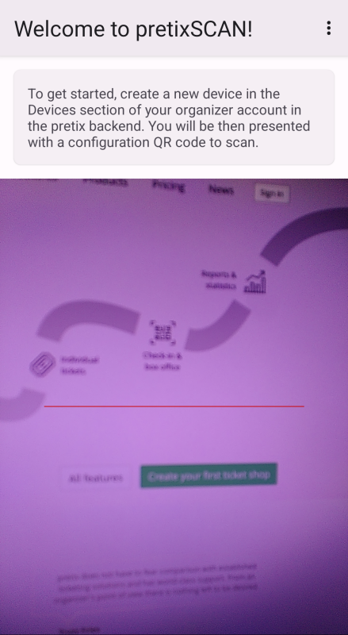
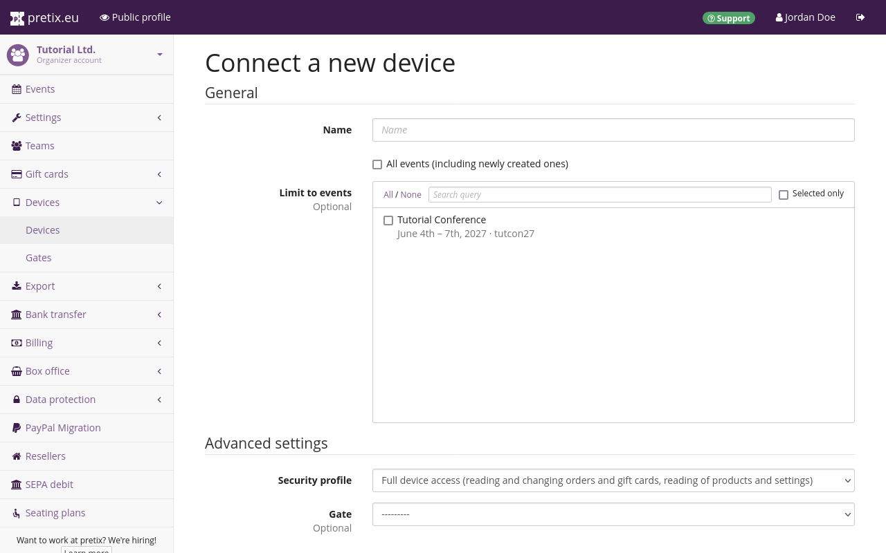
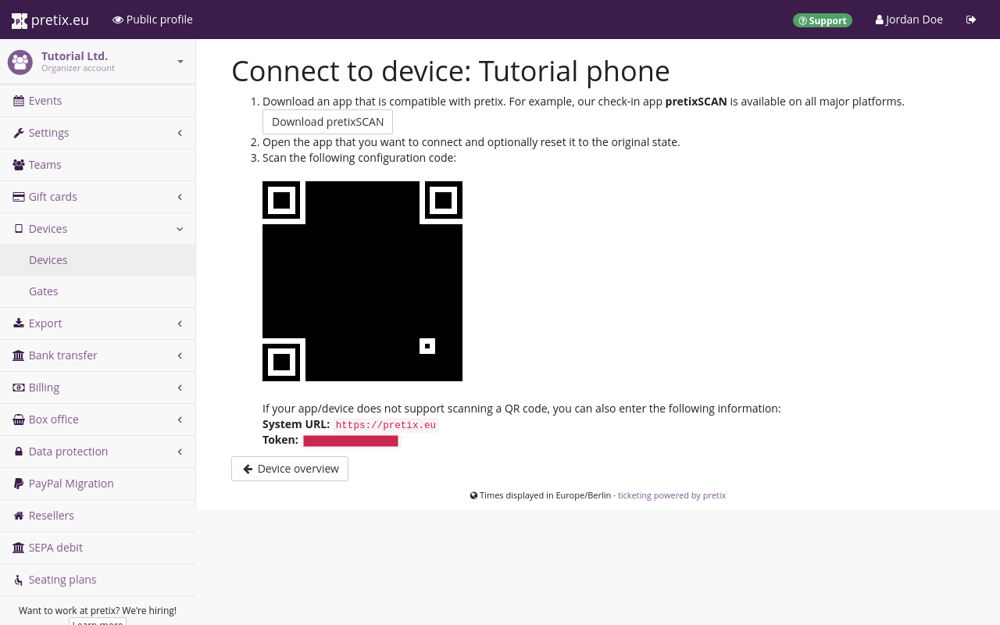
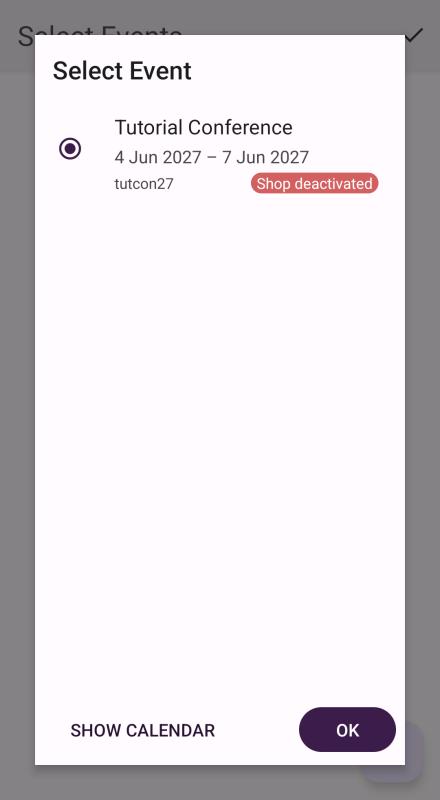
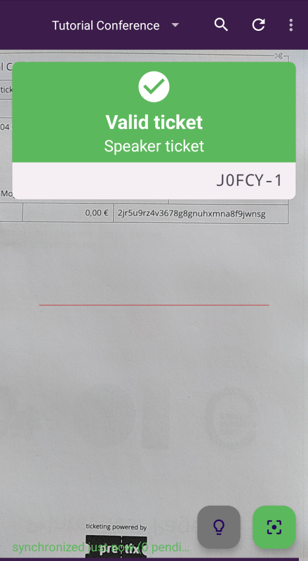

# pretixSCAN (Android)

The Android version of [pretixSCAN](https://pretix.eu/about/en/scan) is an application that helps you handle the check-in at your events. 
The primary function of pretixSCAN is to validate tickets, but it also offers many other features, such as: 

 - searching for participants manually if they do not have their ticket on hand 
 - printing attendee badges
 - quickly viewing attendance statistics

This article tells you how to install pretixSCAN for **Android** and how to make use of its features. 

## Prerequisites

pretixSCAN is intended for use with an event hosted with pretix. 

You need to have access to a device running Android version 7 or newer. 
See our [Android version support policy](https://docs.pretix.eu/en/latest/user/android-version-support.html#pretixscan) for more information. 

You also need access to the pretix backend in order to set up pretixSCAN on your device. 

## General usage 

This section guides you through the basic usage of pretixSCAN on Android. 
This includes the following steps: 

 - [installing the app](#installation-and-setup) and setting it up
 - [connecting to the backend](#connecting-the-device-to-the-pretix-backend)
 - performing basic [entry scanning](#entry-scanning)
 - searching for [attendee data](#searching-for-attendee-data)
 - enabling [badge printing](#enabling-badge-printing)

This section will guide you through those steps in detail. 

### Installation and setup 

!!! Note 
    pretixSCAN comes preinstalled on the scan smartphones that are available for rent on our website. 
    Thus, you will not have to install pretixSCAN on a scan smartphone that you rented from us. 
    For more information on our hardware offers, visit [our website](https://pretix.eu/about/en/hardware/scan). 

You can install pretixSCAN on your Android device [through the Google Play Store](https://play.google.com/store/apps/details?id=eu.pretix.pretixscan.droid) like any other app. 
If your device does not have access to the Google Play Store, you can download the latest version from our [pretix Marketplace](https://marketplace.pretix.eu/products/pretixscan-android/versions). 
On devices manufactured by Sunmi, you can also find the app in the Sunmi App Store. 

 

When you launch pretixSCAN for the first time, confirm that you understand the privacy and security implications of storing attendee data on your device. 
You have to grant pretixSCAN access to the device's camera in order to use the core functionality of validating tickets. 

!!! Note
    Our scan smartphones have both a camera and a scanner. 
    The scanner works much more quickly and reliably than the camera. 
    Thus, you should always use the scanner at your check-in. 

    In order to ensure that you are using the scanner, open pretixSCAN, tap the :btn-icon:fa3-ellipsis-h:: button in the top right corner, and then tap :btn:Settings:. 
    Scroll to the section titled "User interface". 
    Ensure that the box next to "Use device camera" is **unchecked**. 

Once you have granted permission, pretixSCAN will start accessing the scanner or camera instantly. 
It will also display a text box telling you to create a new device in our organizer account in the pretix backend. 
The next section is going to tell you how to do that. 

### Connecting the device to the pretix backend 

 

Open the [pretix backend](https://pretix.eu/control/) and navigate to :navpath:Your organizer → :fa3-mobile-phone: Devices:. 
Click the :btn-icon:fa3-plus: Connect a device: button. 
Give the device a unique and recognizable name such as "Entrance B phone 1". 
You can authorize the device for all events or limit its access to certain events only. 
Open the "Security profile" drop-down menu and select `pretixSCAN`.

 

Once you click the :btn:Save: button, pretix redirects you to a page displaying a QR code. 
Open pretixSCAN and scan the QR code with the camera or hardware scanner. 

If you cannot scan the QR code, then you can connect the device manually instead. 
In order to do so, tap the three button menu in the top right corner of the pretixSCAN app. 
Then, tap "Manual setup". 
Enter the system URL and token displayed in the pretix backend below the QR code. 

 

Once you scanned the QR code or entered the token successfully, the app will ask you to select the event for which you want to scan tickets. 
Select the event in the list or in the calendar and tap :btn:OK:. 

If you want to scan tickets for multiple events at the same time, check the box next to "Expert mode". 
Scanning tickets for one event at a time is enough for most use cases. 
You should only enable expert mode if you want to scan tickets for multiple events simultaneously. 
Then, select a check-in list and tap :btn:OK: again. 
The app will now land you on the main screen and 7start downloading event data from the server in the background. 

### Entry scanning

The app should now be in entry scanning mode. 
If it is, then it displays a pictogram of a gray box with an arrow pointing to the right :fa3-sign-in: in the top right corner. 
If the pictogram is yellow and the arrow points to the left :fa3-sign-out:, that means that the app is in "exit scanning" mode. 
Switch to entry scanning by tapping the :btn-icon:fa3-ellipsis-v:: button and :btn:Switch to entry scanning: in the popup menu. 

pretixSCAN will scan any QR code or barcode it can detect via the device's camera or scanner. 
Point the device at the code you want to scan. 
The app will then check the code against the selected check-in list on the server. 
There are three possible results: 

 1. If the ticket is valid and allows entry under the current conditions, pretixSCAN displays a green box titled "Valid ticket". 
 Underneath the green box, it lists the ticket type, order number, and position number. 
 2. If the ticket is valid but has already been checked in and not checked out again, pretixSCAN displays a yellow box titled "Ticket already used". 
 Underneath the yellow box, it lists the ticket type, order number, and position number, and also the date and time when the ticket was first scanned. 
 3. In all other cases, pretixSCAN displays a red box with a title explaining the problem. 
 Explanations can include, among others, "Invalid ticket", "Order canceled", or "Entry not allowed". 

 

If none of these things happen, then the code has not been scanned. 
Try adjusting the angle and distance between scanner and ticket or improving ambient lighting. 
You can turn the device's flashlight and automatic focus on or off with the buttons at the bottom of the screen. 
If you have trouble scanning a code from a phone screen, ask the customer to increase screen brightness to maximum. 

### Searching for attendee data 

An alternative to scanning a ticket code is searching for an attendee in pretixSCAN. 
If an attendee arrives at the check-in without a ticket, but claiming that they have bought one, you can search for their data. 
Tap the :btn-icon::fa3-search:: button at the top of the screen. 
In the search field, enter the attendee's name, order code, ticket secret, or email address. 
Tap the matching result in the list. 

The app will now check the validity of the ticket and return the same results as if it was scanning the ticket. 

### Enabling badge printing 

Badge printing only works if you have enabled the "Badges" plugin for the current event and the ticket you are scanning has a badge layout selected. 
In order to enable badge printing in pretixSCAN, you have to first install our additional app pretixPRINT on the same device and configure a connection to a printer. 

!!! Note 
    pretixPRINT comes preinstalled and configured on the scan smartphones that are available for rent on our website. 
    Thus, you will not have to install and configure pretixPRINT on a scan smartphone that you rented from us. 

Once you have done that, open pretixSCAN, tap the :btn-icon:fa3-ellipsis-h:: button in the top right corner, and then tap :btn:Settings:. 
Scroll down to the section titled "Badges" and check the box next to "Enable badge printing". 

From now on, the box that pops up whenever you scan a ticket will also include a :btn-icon:fa3-print:: button. 
You can manually print a badge for the ticket holder by tapping the :btn-icon:fa3-print:: button. 
A push notification will pop up while the device is sending the print job. 

If you want to automatically print a badge for every ticket you scan, go back to the settings page, tap "Print badges automatically" and select "Always". 
The app will still display the :btn-icon:fa3-print:: button, allowing you to manually print an extra badge. 

If you want to print out all badges twice after a scan, open the settings in pretixSCAN. 
Scroll down to the section titled "Badges" and check the box next to "Print every badge twice". 

## Advanced usage 

This section covers the following advanced use cases of pretixSCAN on Android: 

 - [locking the settings](#locking-the-settings)
 - [offline scanning](#offline-scanning)
 - Letting attendees [scan their own tickets](#letting-attendees-scan-their-own-tickets) using kiosk mode

### Locking the settings 

pretixSCAN offers you the option to lock settings behind a PIN. 
This can be useful if you want to prevent the people operating the check-in from changing any of the settings. 

Open pretixSCAN, tap the :btn-icon:fa3-ellipsis-h:: button in the top right corner and then tap :btn:Settings:. 
Scroll to the "User interface" subheading and tap "PIN protection". 
Then, tap on "Set PIN", enter a PIN, and note the PIN down in a safe place or save it in a password manager. 
As soon as you check the box next to "Enable PIN protection", pretixSCAN will lock the settings behind the PIN. 

This means that the next time you return to the home screen and attempt to open the settings, the app will require you to enter the PIN. 
You also have the option to protect other functions with the same PIN: statistics, switching between events, as well as switching between entrance and exit scanning mode. 

### Letting attendees scan their own tickets

If you want to let your attendees scan their own tickets, you should use **kiosk mode**. 
Kiosk mode hides the top bar on pretixSCAN's main screen. 
This makes it impossible for users to access the settings, change the event, search for user data, or trigger a synchronization with the server. 

pretix offers a security profile specifically for using pretixSCAN in kiosk mode. 
In order to enable that, open the [pretix backend](https://pretix.eu/control/) and navigate to :navpath:Your organizer → :fa3-mobile-phone: Devices:. 

Search for the device for which you want to enable the kiosk mode security profile in the list. 
Click the :btn-icon:fa3-edit:: "edit" button next to it. 
On the next page, under "Security profile", select `pretixSCAN (kiosk mode, no order sync, no search)`. 
Click the :btn:Save: button. 

!!! Note 
    The kiosk mode security profile disables order search. 
    If you want the possibility to use the order search on this device, select the security profile `pretixSCAN` instead. 
    If you follow the rest of the instructions in this section, then order search will still be locked behind a PIN. 

In order to enable kiosk mode on your device, lock the settings behind a PIN as described under [Locking the settings](#locking-the-settings). 
While you are in the "PIN protection" submenu, check the box next to "Kiosk mode". 
Once you return to the main screen, pretixSCAN will not display the menu bar at the top anymore. 

Use the [App pinning](https://support.google.com/android/answer/9455138?hl=en) feature of Android or your preferred solution to prevent users from leaving the app. 

In order to leave kiosk mode and display the menu bar again, you need a QR code of your PIN
Open [our QR code generator](https://qr.pretix.dev/) and enter your PIN.
Alternatively, you can use any QR code generator of your choice. 
Use pretixSCAN to scan the resulting QR code. 
The app will now display the top bar once again, allowing you to access the settings. 

### Offline scanning 

The default scanning behavior of pretixSCAN requires a reliable network connection. 
The app compares every code that it scans against the selected check-in list stored on the pretix server. 
If you are using pretixSCAN in an environment with an unreliable network connection or no connection at all, you may run into error messages while attempting to scan a code or search for attendee data. 
The solution for this problem is pretixSCAN's offline mode. 

In offline mode, the app will verify data against its internal database instead of the database on the server. 
It will still occasionally attempt to synchronize its own internal data with the server. 
You can scan codes and search for attendee data without encountering errors despite the lack of a network connection. 

Installing the app, connecting it to the backend and synchronizing data between the device and the server at least once still requires a working connection to the internet. 
Do these steps ahead of time in a setting where you do have a reliable connection if you are planning to use pretixSCAN in offline mode. 

!!! Warning 
    If you are using offline scanning with more than one device, then attendees can potentially use a single ticket for entry more than once. 
    However, this is only possible for a limited period of time. 
    As soon as the device that has scanned the ticket performs a successful synchronization, and then the other devices also perform a successful synchronization. 
    After that, pretixSCAN will correctly identify the ticket as "Ticket already used". 

If you want to enable offline mode, open pretixSCAN, tap the :btn-icon:fa3-ellipsis-h:: button in the top right corner and then tap :btn:Settings:. 
Then check the boxes next to "Offline scanning", "Automatic Synchronization", and "Download orders". 

If the network connection at your check-in is present, but unstable, you can leave "Offline scanning" unchecked and instead tap the setting "Automatically turn offline mode on and off". 
The default selection is "Manual mode (off)". 
This means that pretixSCAN will not enable or disable offline scanning automatically. 

If you select, for example, "3 seconds or errors", pretixSCAN will enable offline scanning if at least one of the following three conditions is met: 

 - pretixSCAN has been attempting to verify a code for three seconds without success
 - pretixSCAN has encountered three errors while attempting to verify a code
 - pretixSCAN has detected a loss of connection while attempting to verify a code

If you select "Only errors or connection loss", then pretixSCAN will enable offline scanning after encountering an error or detecting a loss of connection while attempting to verify a code. 

!!! Note 
    In offline mode, pretixSCAN will not recognize any tickets ordered while your shop is in test mode as valid. 
    Also, tickets ordered in test mode will not appear in the search. 

## Troubleshooting

### You do not have access to the PIN

**Problem:** The pretixSCAN settings are locked behind a PIN or kiosk mode is enabled. 
You do not have access to the PIN, but you need to unlock the settings. 

**Solution:** Reset app data. 
Open the settings on your Android device and delete the storage for the pretixSCAN app. 
This resets the app to a state as if freshly installed. 

Alternatively, you can uninstall the app and install it again. 

This also severs the connection to the pretix backend. 
Open the [pretix backend](https://pretix.eu/control/) and navigate to :navpath:Your organizer → :fa3-mobile-phone: Devices:. 
Look for the device you disconnected in the list. 
Click the :btn:Revoke access: button next to it. 

Then, connect the device once again as described under [Connecting the device to the pretix backend](#connecting-the-device-to-the-pretix-backend). 

## Further Information

 - [pretixSCAN repository on GitHub](https://github.com/pretix/pretixscan-android)
 - [Kurzanleitung pretixSCAN on Youtube (German)](https://www.youtube.com/watch?v=csy017Dm6vA)