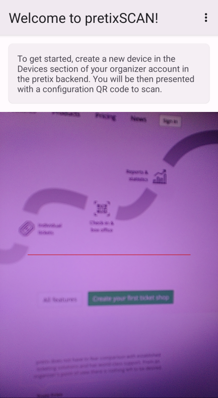
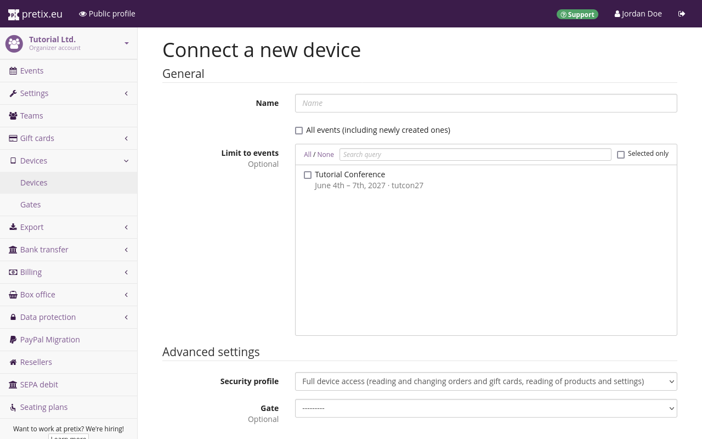
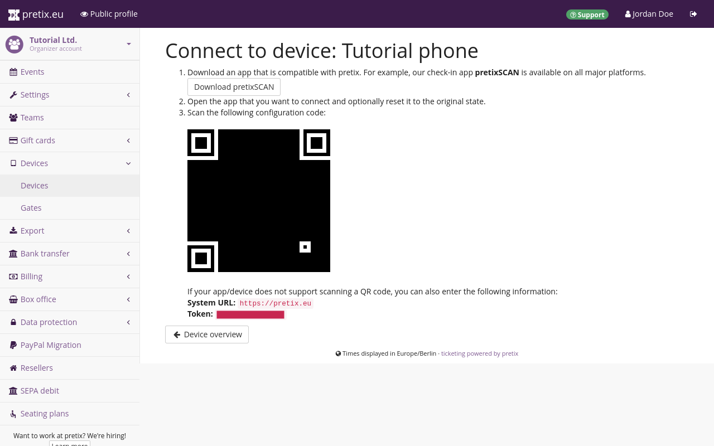
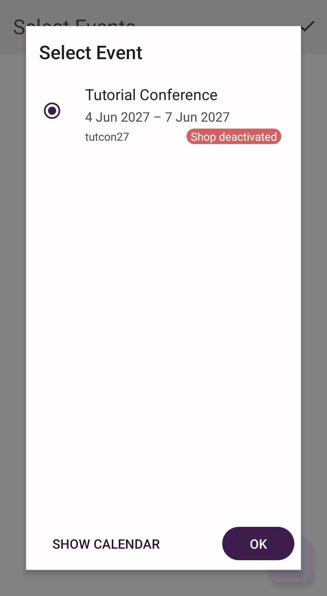
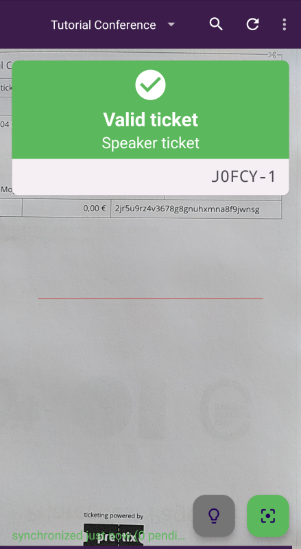
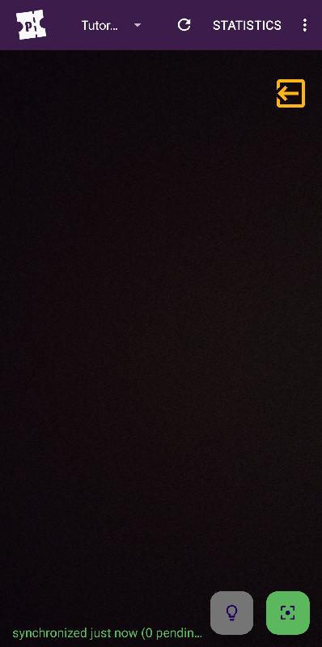
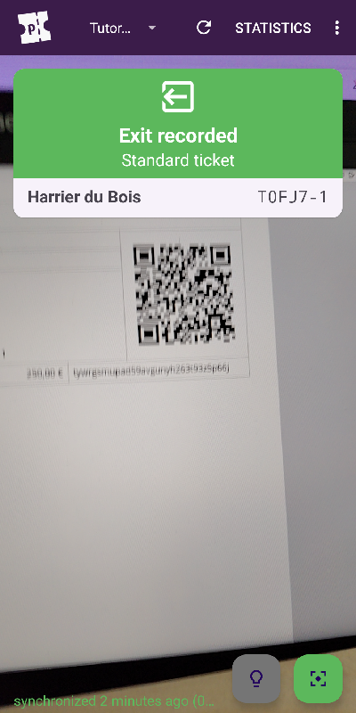
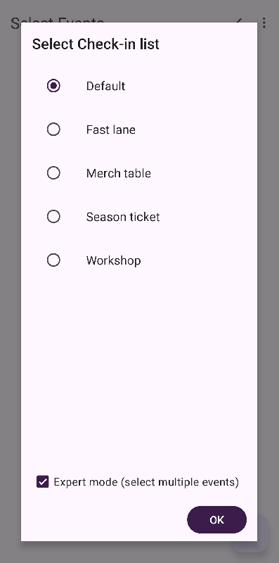
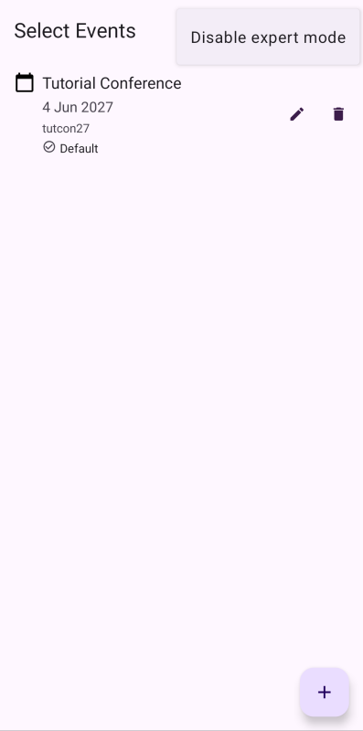

# pretixSCAN (Android)

The Android version of [pretixSCAN](https://pretix.eu/about/en/scan) is an application that helps you handle the check-in at your events.
The primary function of pretixSCAN is to validate tickets, but it also offers many other features, such as:

 - searching for participants manually if they do not have their ticket on hand
 - printing attendee badges
 - quickly viewing attendance statistics

This article tells you how to install pretixSCAN for **Android** and how to make use of its features.

## Prerequisites

pretixSCAN is intended for use with an event hosted with pretix.

You need to have access to a device running Android version 7 or newer.
See our [Android version support policy](https://docs.pretix.eu/en/latest/user/android-version-support.html#pretixscan) for more information.

You also need access to the pretix backend in order to set up pretixSCAN on your device.

## General usage

This section guides you through the basic usage of pretixSCAN on Android.
This includes the following steps:

 - [installing the app](#installation-and-setup) and setting it up
 - [connecting to the backend](#connecting-the-device-to-the-pretix-backend)
 - performing basic [entry scanning](#entry-scanning)
 - searching for [attendee data](#searching-for-attendee-data)
 - enabling [badge printing](#enabling-badge-printing)

This section will guide you through those steps in detail.

### Installation and setup

!!! Note
    pretixSCAN comes preinstalled on the scan smartphones that are available for rent on our website.
    Thus, you will not have to install pretixSCAN on a scan smartphone that you rented from us.
    For more information on our hardware offers, visit [our website](https://pretix.eu/about/en/hardware/scan).

You can install pretixSCAN on your Android device [through the Google Play Store](https://play.google.com/store/apps/details?id=eu.pretix.pretixscan.droid) like any other app.
If your device does not have access to the Google Play Store, you can download the latest version from our [pretix Marketplace](https://marketplace.pretix.eu/products/pretixscan-android/versions).
On devices manufactured by Sunmi, you can also find the app in the Sunmi App Store.

When you launch pretixSCAN for the first time, confirm that you understand the privacy and security implications of storing attendee data on your device.
You have to grant pretixSCAN access to the device's camera in order to use the core functionality of validating tickets.

!!! Note
    Our scan smartphones have both a camera and a scanner.
    The scanner works much more quickly and reliably than the camera.
    Thus, you should always use the scanner at your check-in.
    If you are using a device without a scanner, then you should use the camera instead.

    In order to confirm that the device uses the right setting, open pretixSCAN, tap the three-dot button :btn-icon:fa3-ellipsis-v:: in the top right corner, and then tap :btn:Settings:.
    Scroll to the section titled "User interface".
    If your device has a scanner, uncheck the box next to "Use device camera".
    If your device does have a scanner, check that box.

Once you have granted permission, pretixSCAN will start accessing the scanner or camera instantly.
It will also display a text box telling you to create a new device in our organizer account in the pretix backend.
The next section is going to tell you how to do that.

### Connecting the device to the pretix backend

Open the [pretix backend](https://pretix.eu/control/) and navigate to :navpath:Your organizer → :fa3-mobile-phone: Devices:.
Click the :btn-icon:fa3-plus: Connect a device: button.
Give the device a unique and recognizable name such as "Entrance B phone 1".
You can authorize the device for all events or limit its access to certain events only.
Open the "Security profile" drop-down menu and select `pretixSCAN`.

Once you click the :btn:Save: button, pretix redirects you to a page displaying a QR code.
Open pretixSCAN and scan the QR code with the camera or hardware scanner.

If you cannot scan the QR code, then you can connect the device manually instead.
In order to do so, tap the :btn-icon:fa3-ellipsis-v:: three-dot button in the top right corner of the pretixSCAN app.
Then, tap :btn:Manual setup:.
Enter the system URL and token displayed in the pretix backend below the QR code.

Once you scanned the QR code or entered the token successfully, the app will ask you to select the event for which you want to scan tickets.
Your next step depends on the type of event for which you want to scan tickets.

 - **Single event:** Select the event in the list or in the calendar and tap the :btn:OK: button.
   Then, select a check-in list and tap the :btn:OK: button again.

 - **Multiple events:** Enable expert mode.
   See [Scanning tickets for multiple events](#scanning-tickets-for-multiple-events).

 - **Single date within an event series:** Select the date in the list or in the calendar and tap the :btn:OK: button.
   Then, select a check-in list and tap the :btn:OK: button again.

 - **Event series with a check-in list that applies to all dates:** Select any of the dates from that event series.
   Tap the :btn:OK: button, select the check-in list, and tap the :btn:OK: button again.
   On the home screen, tap the three-dot button :btn-icon:fa3-ellipsis-v:: in the top right corner, and then tap :btn:Settings:.
   Under "Synchronization", check the box next to "Automatic event selection".

 - **Multiple dates in an event series in which each date has its own check-in lists:** Enable expert mode.
   See [Scanning tickets for multiple events](#scanning-tickets-for-multiple-events).

The app will now land you on the main screen and start downloading event data from the server in the background.

### Entry scanning

The app should now be in entry scanning mode.
If it is, then it displays a pictogram of a gray box with an arrow pointing to the right :fa3-sign-in: in the top right corner.
If the pictogram is yellow and the arrow points to the left :fa3-sign-out:, that means that the app is in "exit scanning" mode.
Switch to entry scanning by tapping the three-dot button :btn-icon:fa3-ellipsis-v:: and :btn:Switch to entry scanning: in the popup menu.

pretixSCAN will scan any QR code or barcode it can detect via the device's camera or scanner.
Point the device at the code you want to scan.
The app will then check the code against the selected check-in list on the server.
There are three possible results:

 1. If the ticket is valid and allows entry under the current conditions, pretixSCAN displays a green box titled "Valid ticket".
 Underneath the green box, it lists the ticket type, order number, and position number.
 2. If the ticket is valid but has already been checked in and not checked out again, pretixSCAN displays a yellow box titled "Ticket already used".
 Underneath the yellow box, it lists the ticket type, order number, and position number, and also the date and time when the ticket was first scanned.
 3. In all other cases, pretixSCAN displays a red box with a title explaining the problem.
 Explanations can include, among others, "Invalid ticket", "Order canceled", or "Entry not allowed".

If none of these things happen, then the code has not been scanned.
Try adjusting the angle and distance between scanner and ticket or improving ambient lighting.
You can turn the device's flashlight and automatic focus on or off with the buttons at the bottom of the screen.
If you have trouble scanning a code from a phone screen, ask the customer to increase screen brightness to maximum.

### Searching for attendee data

An alternative to scanning a ticket code is searching for an attendee in pretixSCAN.
If an attendee arrives at the check-in without a ticket, but claiming that they have bought one, you can search for their data.
Tap the :btn-icon:fa3-search:: button at the top of the screen.
In the search field, enter the attendee's name, order code, ticket secret, or email address.
Tap the matching result in the list.

The app will now check the validity of the ticket and return the same results as if it was scanning the ticket.

### Enabling badge printing

Badge printing only works if you have enabled the "Badges" plugin for the current event and the ticket you are scanning has a badge layout selected.
In order to enable badge printing in pretixSCAN, you have to first install our additional app pretixPRINT on the same device and configure a connection to a printer.

!!! Note
    pretixPRINT comes preinstalled and configured on the scan smartphones that are available for rent on our website.
    Thus, you will not have to install and configure pretixPRINT on a scan smartphone that you rented from us.

Once you have done that, open pretixSCAN, tap the three-dot button :btn-icon:fa3-ellipsis-v:: in the top right corner, and then tap :btn:Settings:.
Scroll down to the section titled "Badges" and check the box next to "Enable badge printing".

From now on, the box that pops up whenever you scan a ticket will also include a :btn-icon:fa3-print:: button.
You can manually print a badge for the ticket holder by tapping the :btn-icon:fa3-print:: button.
A push notification will pop up while the device is sending the print job.

If you want to automatically print a badge for every ticket you scan, go back to the settings page, open the menu labeled "Print badges automatically" and select `Always`.
The app will still display the :btn-icon:fa3-print:: button, allowing you to manually print an extra badge.

If you want to print out all badges twice after a scan, open the settings in pretixSCAN.
Scroll down to the section titled "Badges" and check the box next to "Print every badge twice".

### Switching to a different event or check-in list

If you want to switch to a different event or to a different check-in list for entry scanning, tap the name of your event at the top of the screen.
Select the event from the calendar or list and tap the :btn:OK: button.
Select the check-in list and tap the :btn:OK: button again.

If you want to scan tickets for multiple events at the same time, you should enable **expert mode**.
The same applies if you want to scan tickets for multiple dates in an event series which all have their own check-in lists.
See [Scanning tickets for multiple events](#scanning-tickets-for-multiple-events) for more information.

## Advanced usage

This section covers the following advanced use cases of pretixSCAN on Android:

 - [locking the settings](#locking-the-settings)
 - [offline scanning](#offline-scanning)
 - Letting attendees [scan their own tickets](#letting-attendees-scan-their-own-tickets) using kiosk mode

### Exit scanning

If you want to keep track of ticket holders leaving your event, you can use pretixSCAN's exit mode.
This is useful if you want to allow ticket holders to enter your event multiple times, but only if the same ticket is not currently checked in to the event.

Your check-in list must allow re-entering after an exit scan.
In order to enable that, open the [pretix backend](https://pretix.eu/control/) and navigate to :navpath:Your event → :fa3-check-square-o: Check-in:.
Search for the check-in list and click the :btn-icon:fa3-wrench:: "change" button next to it.
Switch to the :btn:Advanced: tab.
Check the box next to "Allow re-entering after an exit scan".

If your event has closing times, that is, times when no attendees are realistically present at the event anymore, then it makes sense to implement an automatic check-out.
In order to do so, enter a time in the field labeled "Automatically check out everyone at".
For instance, if you are operating a public swimming pool that closes at 10 PM and opens at 6 AM, you could enter `02:00:00` in that field.
This automatically checks out every ticket at 2 AM.

In order to enable exit scanning mode in pretixSCAN, tap the :btn-icon:fa3-ellipsis-v:: button in the top right corner and then tap :btn:Switch to exit scanning:.
The home screen will now display a pictogram of a yellow box with an arrow pointing to the left :fa3-sign-out:.
This confirms that the app is in exit scanning mode.

Scanning a valid ticket for the event in exit mode always results in a green box with the message "Exit recorded".
This happens regardless of whether the ticket is checked in or not.
Scanning the same ticket multiple times in exit mode always results in the "Exit recorded" message.

In order to leave exit scanning mode, tap the :btn-icon:fa3-ellipsis-v:: button in the top right corner and then tap :btn:Switch to entry scanning:.
The home screen will now display a pictogram of a gray box with an arrow pointing to the right :fa3-sign-in: in the top right corner.
The app is now in entry scanning mode.

### Locking the settings

pretixSCAN offers you the option to lock settings behind a PIN.
This can be useful if you want to prevent the people operating the check-in from changing any of the settings.

Open pretixSCAN, tap the :btn-icon:fa3-ellipsis-v:: button in the top right corner and then tap :btn:Settings:.
Scroll to the "User interface" subheading and tap :btn:PIN protection:.
Then, tap :btn:Set PIN:, enter a PIN, and note the PIN down in a safe place or save it in a password manager.
As soon as you check the box next to "Enable PIN protection", pretixSCAN will lock the settings behind the PIN.

This means that the next time you return to the home screen and attempt to open the settings, the app will require you to enter the PIN.
You also have the option to protect other functions with the same PIN: statistics, switching between events, as well as switching between entrance and exit scanning mode.

### Letting attendees scan their own tickets

If you want to let your attendees scan their own tickets, you should use **kiosk mode**.
Kiosk mode hides the top bar on pretixSCAN's main screen.
This makes it impossible for users to access the settings, change the event, search for user data, or trigger a synchronization with the server.

pretix offers a security profile specifically for using pretixSCAN in kiosk mode.
In order to enable that, open the [pretix backend](https://pretix.eu/control/) and navigate to :navpath:Your organizer → :fa3-mobile-phone: Devices:.

Search for the device for which you want to enable the kiosk mode security profile in the list.
Click the :btn-icon:fa3-edit:: "edit" button next to it.
On the next page, under "Security profile", select `pretixSCAN (kiosk mode, no order sync, no search)`.
Click the :btn:Save: button.

!!! Note
    The kiosk mode security profile disables order search.
    If you want the possibility to use the order search on this device, select the security profile `pretixSCAN` instead.
    If you follow the rest of the instructions in this section, then order search will still be locked behind a PIN.

In order to enable kiosk mode on your device, lock the settings behind a PIN as described under [Locking the settings](#locking-the-settings).
While you are in the "PIN protection" submenu, check the box next to "Kiosk mode".
Once you return to the main screen, pretixSCAN will not display the menu bar at the top anymore.

Use the [App pinning](https://support.google.com/android/answer/9455138?hl=en) feature of Android or your preferred solution to prevent users from leaving the app.

In order to leave kiosk mode and display the menu bar again, you need a QR code of your PIN
Open [our QR code generator](https://qr.pretix.dev/) and enter your PIN.
Alternatively, you can use any QR code generator of your choice.
Use pretixSCAN to scan the resulting QR code.
The app will now display the top bar once again, allowing you to access the settings.

### Offline scanning

The default scanning behavior of pretixSCAN requires a reliable network connection.
The app compares every code that it scans against the selected check-in list stored on the pretix server.
If you are using pretixSCAN in an environment with an unreliable network connection or no connection at all, you may run into error messages while attempting to scan a code or search for attendee data.
The solution for this problem is pretixSCAN's offline mode.

In offline mode, the app will verify data against its internal database instead of the database on the server.
It will still occasionally attempt to synchronize its own internal data with the server.
You can scan codes and search for attendee data without encountering errors despite the lack of a network connection.

Installing the app, connecting it to the backend and synchronizing data between the device and the server at least once still requires a working connection to the internet.
Do these steps ahead of time in a setting where you do have a reliable connection if you are planning to use pretixSCAN in offline mode.

!!! Warning
    If you are using offline scanning with more than one device, then attendees can potentially use a single ticket for entry more than once.
    However, this is only possible for a limited period of time.
    As soon as the device that has scanned the ticket performs a successful synchronization, and then the other devices also perform a successful synchronization.
    After that, pretixSCAN will correctly identify the ticket as "Ticket already used".

If you want to enable offline mode, open pretixSCAN, tap the three-dot button :btn-icon:fa3-ellipsis-v:: in the top right corner and then tap :btn:Settings:.
Then check the boxes next to "Offline scanning", "Automatic Synchronization", and "Download orders".

If the network connection at your check-in is present, but unstable, you can leave "Offline scanning" unchecked and instead tap :btn:Automatically turn offline mode on and off:.
The default selection is `Manual mode (off)`.
This means that pretixSCAN will not enable or disable offline scanning automatically.

If you select, for instance, "3 seconds or errors", pretixSCAN will enable offline scanning if at least one of the following three conditions is met:

 - pretixSCAN has been attempting to verify a code for three seconds without success
 - pretixSCAN has encountered three errors while attempting to verify a code
 - pretixSCAN has detected a loss of connection while attempting to verify a code

If you select "Only errors or connection loss", then pretixSCAN will enable offline scanning after encountering an error or detecting a loss of connection while attempting to verify a code.

!!! Note
    In offline mode, pretixSCAN will not recognize any tickets ordered while your shop is in test mode as valid.
    Also, tickets ordered in test mode will not appear in the search.

### Scanning tickets for multiple events

By default, pretixSCAN scans tickets for one event (or date within an event series) at a time.
If you want to scan tickets for more than one event, you can use **expert mode**.

This is useful if you are operating a single check-in for multiple events that are taking place at the same time.
It is also useful if you want to scan tickets for multiple dates in an event series in which each date has its own check-in lists.

!!! Note
    You do not need to enable expert mode if you are scanning tickets for any of the following:

     - a single event
     - a single date in an event series
     - an event series in which all events use the same check-in lists

If you want to scan tickets for multiple events or event series, then you need to give your device clearance for all of those.
In order to do so, open the [pretix backend](https://pretix.eu/control/) and navigate to :navpath:Your organizer → :fa3-mobile-phone: Devices:.

Search for the device to which you want to give clearance.
Click the :btn-icon:fa3-edit:: "edit" button next to it.
On the next page, if you want to give the device clearance for all events, check the box next to "All events (including newly created ones)".
If you want to give clearance for a limited selection of events, under "Limit to events", select the events for which you want to scan tickets.
Click the :btn:Save: button.

In order to activate expert mode in pretixSCAN, tap the name of your event in the bar at the top.
Select one of the events for which you want to scan tickets.
Then, tap the :btn:OK: button.
Select your check-in list.
Check the box next to "Expert mode (select multiple events)" and tap the :btn:OK: button.

Tap the :btn-icon:fa3-plus:: button.
Select another event and check-in list for which you want to scan tickets.
Repeat this step for every event for which you want to scan tickets.
You can add as many events as you like.
But you can only add one check-in list per event

You can change the check-in list by tapping the :btn-icon:fa3-pencil:: button next to it.
You can remove the event by tapping the :btn-icon:fa3-trash:: button.

Once you are happy with your choices, tap the :btn-icon:fa3-check:: button at the top of the screen.
This takes you back to the home screen of pretixSCAN.

If you want to **disable** expert mode, tap the name of your event at the top of the screen.
Remove all events for which you do not want to scan tickets.
Then, tap the three-dot menu :btn-icon:fa3-ellipsis-v:: and tap :btn:Disable expert mode:.

## Troubleshooting

### You do not have access to the PIN

**Problem:** The pretixSCAN settings are locked behind a PIN or kiosk mode is enabled.
You do not have access to the PIN, but you need to unlock the settings.

**Solution:** Reset app data.
Open the settings on your Android device and delete the storage for the pretixSCAN app.
This resets the app to a state as if freshly installed.

Alternatively, you can uninstall the app and install it again.

This also severs the connection to the pretix backend.
Open the [pretix backend](https://pretix.eu/control/) and navigate to :navpath:Your organizer → :fa3-mobile-phone: Devices:.
Look for the device you disconnected in the list.
Click the :btn:Revoke access: button next to it.

Then, connect the device once again as described under [Connecting the device to the pretix backend](#connecting-the-device-to-the-pretix-backend).

### pretixSCAN scans every ticket twice

**Problem:** A scan smartphone with pretixSCAN scans every ticket twice.
Depending on the check-in settings, the app may falsely display the yellow box saying "Ticket already used"

**Solution:** Fix the scan smartphone's scanner settings so that the app only receives one type of scanner output.

If you are using a **Sunmi** device, close pretixSCAN and open the Settings app.
Tap :btn:System (Languages, gestures, time, backup):.
Then, tap :btn:Scanner Setting:.
Open the :btn:App Settings: tab.

Tap :btn:Output method setting:.
On the page titled "Output method setting", activate "No direct output" and "Broadcast".
Tap the :btn:Save: button in the top right corner.
The Sunmi device should now scan each ticket once instead of twice.

If you are using a **Zebra** device, close pretixSCAN and open the DataWedge app.
Under "DataWedge-Profile", select `pretix`.
Under "Barcode input", check the box next to "Enabled".
Under "Keystroke output", uncheck the box next to "Enabled".
Under "Intent output", check the box next to "Enabled".

To summarize, "Barcode input" and "Intent output" should be active, whereas "Keystroke output" should be inactive.
The Zebra device should now scan each ticket once instead of twice.

If you are using scan smartphones from another manufacturer, set the scanner up in such a way that it only sends one type of output.

## Further Information

 - [pretixSCAN repository on GitHub](https://github.com/pretix/pretixscan-android)
 - [Kurzanleitung pretixSCAN on Youtube (German)](https://www.youtube.com/watch?v=csy017Dm6vA)