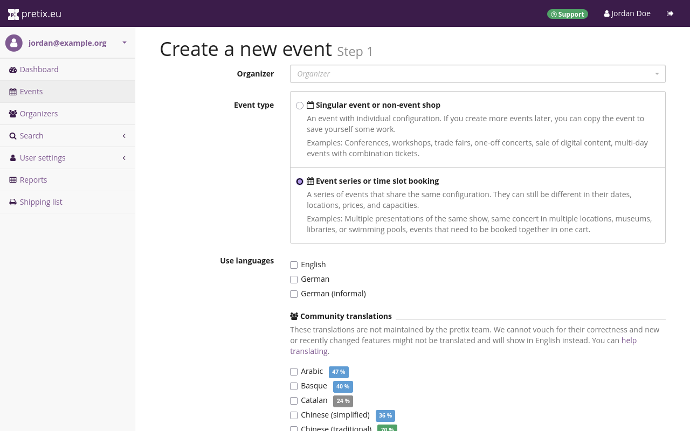
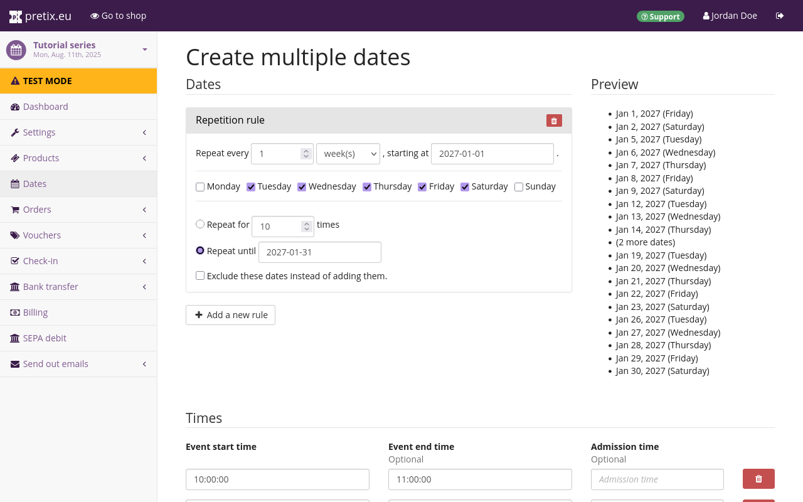
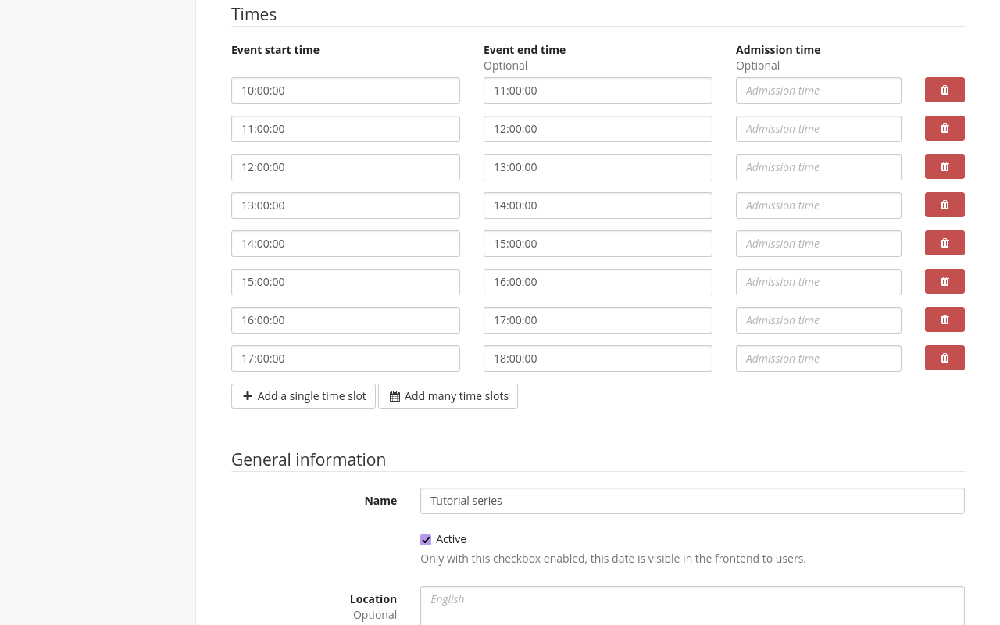
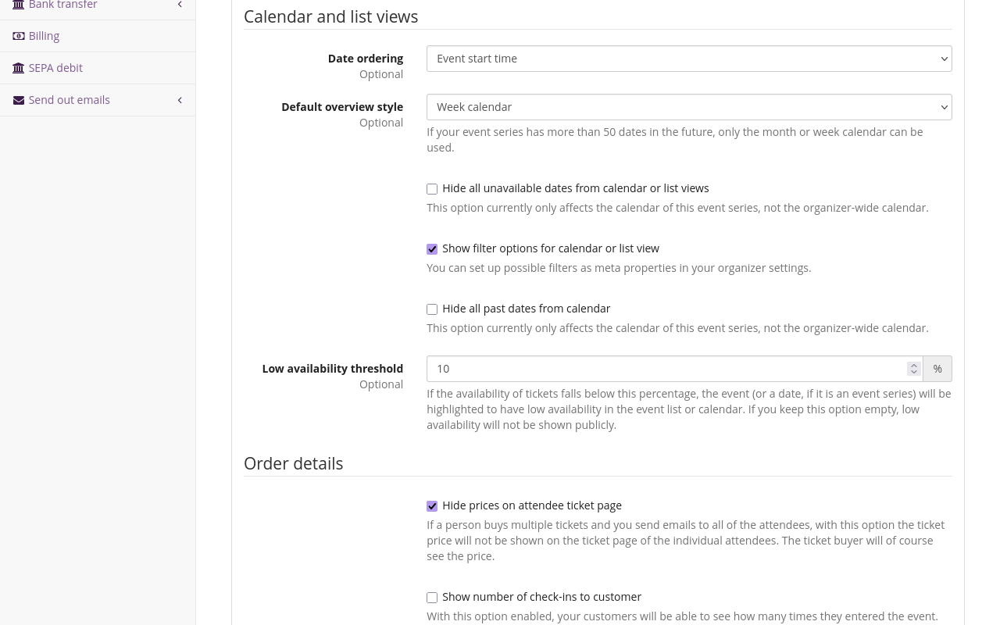
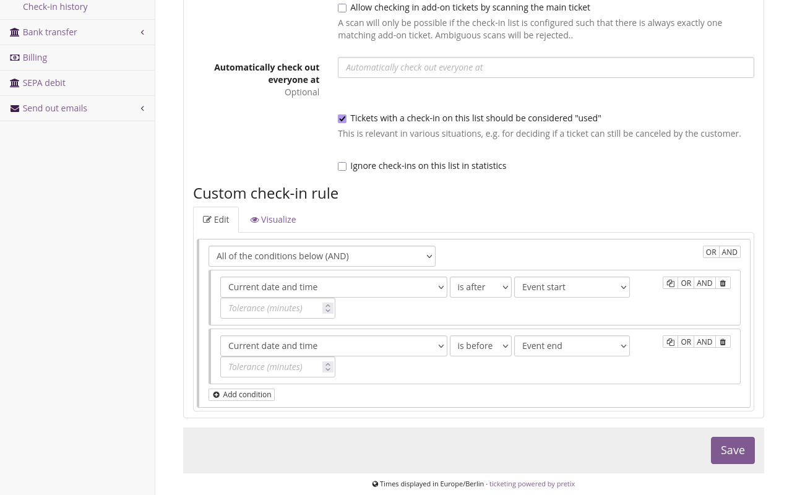
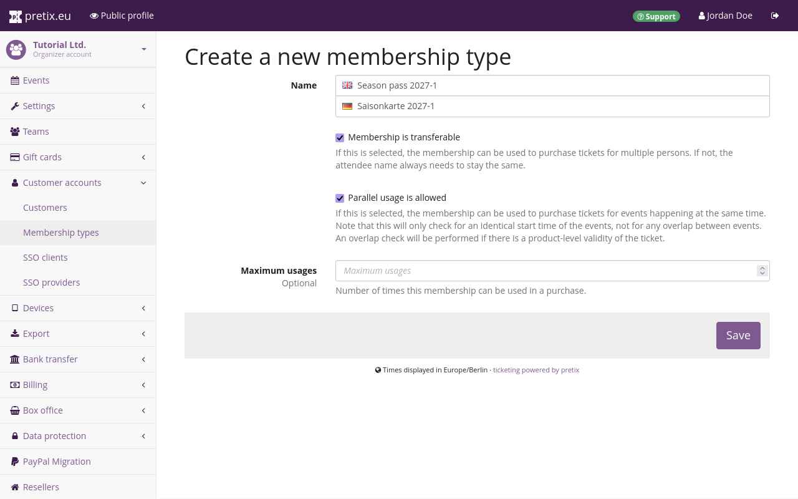
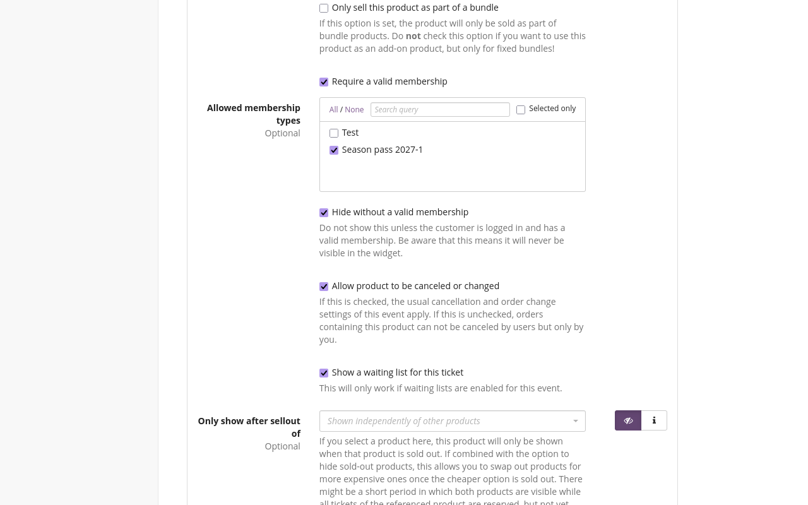
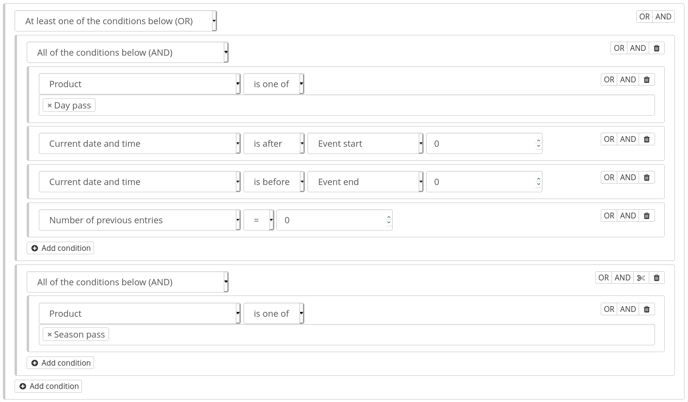

# Produkte

Ein Produkt ist alles, was Sie über pretix verkaufen: Tickets, Wertgutscheine, Konferenz-T-Shirts und so weiter.
pretix bietet Ihnen nahezu unbegrenzte Möglichkeiten, Produkte zu konfigurieren und zu strukturieren.
Dieser Artikel erläutert die grundlegende Vorgehensweise zum Erstellen eines Produkts und stellt einige praktische Anwendungsfälle für einige der weitergehenden pretix-Funktionen vor.

## Voraussetzungen

Produkte konfigurieren Sie auf Veranstaltungsebene, Sie müssen also zuerst eine Veranstaltung erstellen.

## Allgemeine Verwendung

Dieser Abschnitt erläutert die grundlegende Vorgehensweise zum Erstellen eines Produkts.
Zuerst erstellen Sie Kategorien, dann die eigentlichen Produkte und schließlich Kontingente.
Sie können Zusatzprodukte oder Produkte zum Cross-Selling **nur** erstellen, wenn Sie dafür eine Kategorie wählen.
Sie können ein Kontingent **nur** erstellen, wenn Sie ihm mindestens ein Produkt zuordnen.
Diese Anleitung erläutert die notwendigen Schritte daher in genau dieser Reihenfolge.

### Kategorien erstellen und bearbeiten

Kategorien haben verschiedene Zwecke.
Sie helfen Ihnen, Produkte sinnvoll zu gruppieren, sowohl im Backend als auch in Ihrem Shop.
Ihre Shop-Seite zeigt Produkte nach Kategorien geordnet an, damit Kund/*innen den gesuchten Artikel einfacher finden.
Produkte nach Kategorien zu ordnen, kann Ihnen helfen, im Backend den Überblick zu behalten.

Kategorien sorgen auch für die Trennung zwischen normalen Produkten, die direkt zu kaufen sind, und ergänzenden Produkten, die nur als Zusatzprodukte zu normalen Produkten angeboten werden.
Wenn Sie nicht nur Zutrittstickets verkaufen möchten, sondern auch Extras wie Merchandise, müssen Sie eine Kategorie für Zusatzprodukte erstellen.
Auch wenn Sie die Cross-Selling-Funktion nutzen möchten, benötigen Sie eine weitere Kategorie.

Wenn Sie nur eine begrenzte Zahl unterschiedlicher Produkte verkaufen und keine Zusatz- oder Cross-Selling-Produkte nutzen, müssen Sie keine Kategorien bearbeiten oder erstellen.

Um Kategorien zu bearbeiten oder zu erstellen, navigieren Sie zu :navpath:Ihre Veranstaltung → :fa3-ticket: Produkte → Kategorien:.
Die angezeigte Seite listet alle zuvor erstellten Produktkategorien auf.

Klicken Sie den Button :btn-icon:fa3-plus: Kategorie erstellen: und geben Sie einen Namen für die neue Kategorie ein.
Wählen Sie den zum Produkttyp in dieser Kategorie passenden Kategorietyp: normal, Zusatzprodukt, Cross-Selling oder normal + Cross-Selling.

Normale Produkte sind Einzelprodukte, die direkt gekauft werden können.
Zusatzprodukte sind Produkte, die **nicht** direkt gekauft, sondern beim Kauf nur anderen Produkten hinzugefügt werden können.
Art und Anzahl der Produkte im Warenkorb bestimmen, welche Zusatzprodukte der/*die Kund/*in wählen kann.

Cross-Selling-Produkte werden nicht im Shop, sondern erst an der Kasse angeboten.
Anders als bei Zusatzprodukten hängt es nicht vom Inhalt des Warenkorbs ab, welche Cross-Selling-Produkte der/*die Kund/*in kaufen kann.
Und Produkte des Typs „normal + Cross-Selling“ werden sowohl als Einzelprodukte als auch im Cross-Selling-Schritt angeboten.
Die unten aufgeführte Einstellung „Cross-Selling-Bedingung“ legt fest, wie Produkte der Kategorien „Cross-Selling“ und „normal + Cross-Selling“ in Ihrem Shop angeboten werden.

Klicken Sie unten auf der Seite den Button :btn:Speichern:.
Damit gelangen Sie zurück zur Seite „Produktkategorien“, auf der nun auch die neue Kategorie aufgeführt wird.

Sie können auch eine bereits vorhandene Kategorie bearbeiten und dabei ihren Namen, ihre Beschreibung und ihren Typ ändern.
Dazu klicken Sie auf ihren Namen oder den Bearbeitungsbutton :btn-icon:fa3-edit:: neben dem Listeneintrag.

### Produkte erstellen und bearbeiten

Wenn Sie Produkte erstellen oder bearbeiten möchten, navigieren Sie zu :navpath:Veranstaltung → :fa3-ticket: Produkte → Produkte:.
Die angezeigte Seite zeigt eine Liste aller Produkte zu dieser Veranstaltung.
Klicken Sie den Button :btn-icon:fa3-plus: Neues Produkt erstellen:. 
Wählen Sie einen Namen, eine Beschreibung, einen Standardpreis und den [Umsatzsteuer](../taxes.md)-Satz und klicken Sie den Button :btn:Speichern:.

Sie können auch ein vorhandenes Produkt bearbeiten, indem Sie seinen Namen oder den Bearbeitungsbutton :btn-icon:fa3-edit:: neben dem Listeneintrag klicken.

### Kontingente erstellen und bearbeiten

Ein Kontingent legt fest, wie viele Einheiten Ihres Produkts verkauft werden können.
Jedes Produkt muss Teil mindestens eines Kontingents sein, damit es im Shop verfügbar ist.

Wenn Sie Kontingente erstellen oder bearbeiten möchten, navigieren Sie zu :navpath:Veranstaltung → :fa3-ticket: Produkte → Kontingente:. 
Die Seite zeigt eine Liste aller Kontingente für die Veranstaltung sowie die Gesamtanzahl der Einheiten und die für jedes Kontingent verbleibende Kapazität.

Klicken Sie den Button :btn:Kontingent erstellen:. 
Wählen Sie einen Namen und eine Kapazität, markieren Sie die Produkte, die in diesem Kontingent enthalten sein sollen, sowie bei Bedarf erweiterte Optionen und klicken Sie dann den Button :btn:Speichern.

Sie können auch ein vorhandenes Kontingent bearbeiten, indem Sie seinen Namen oder den Bearbeitungsbutton :btn-icon:fa3-edit:: neben dem Listeneintrag klicken.

## Anwendungsfälle

Dieser Abschnitt behandelt sechs aufwändigere Anwendungsfälle und erläutert, wie Sie diese mit den pretix-Funktionen zum Anpassen von Produkten implementieren.

### Zeitfenster

In pretix können Sie den Zutritt zu einem Veranstaltungsort mit einer begrenzten Besucherkapazität, ein Museum etwa, über Zeitfenster definieren.
Dieser Guide erläutert Ihnen, wie Sie eine Veranstaltung mit Zeitfenstern erstellen.

Erstellen Sie eine neue Veranstaltung.
Wählen Sie bei „Veranstaltungsart“ die Option „Veranstaltungsreihe oder Zeitslotbuchung“.

Wie Sie grundsätzlich in pretix eine Veranstaltungsreihe erstellen, erfahren Sie in unserem Guide zu [Veranstaltungsreihen](../event-series.md).

#### Zeitfenster erstellen

Um Zeitfenster zu erstellen, müssen Sie in der Veranstaltungsreihe eine Reihe von „Terminen“ anlegen.
Navigieren Sie zu :navpath:Ihre Veranstaltung → :fa3-calendar: Termine: und klicken Sie den Button :btn-icon:fa3-plus:Mehrere neue Termine erstellen:.
Geben Sie ein Muster für die Veranstaltungstage ein.
Wenn Ihr Veranstaltungsort im Januar 2027 beispielsweise jede Woche von Dienstag bis Samstag geöffnet ist, geben Sie folgendes Muster ein:
„Wiederhole alle `1` `Woche(n)` mit Beginn am `01.01.2027`“
Markieren Sie die Felder für Dienstag, Mittwoch, Donnerstag, Freitag und Samstag.
Markieren Sie die Option „Wiederhole bis zum“ und geben Sie in das Feld `31.01.2027` ein.

Es ist sinnvoll, für mehrere Wochen Zeitfenster zu erstellen.
Erstellen Sie keine Zeitfenster für ein ganzes Jahr oder einen noch längeren Zeitraum:
Das macht es unnötig kompliziert, falls Sie später Änderungen daran vornehmen müssen.

Geben Sie unter „Uhrzeiten“ die Zeitfenster für jeden Veranstaltungstag ein.
Wenn Ihr Veranstaltungsort jeden Tag von 10 bis 18 Uhr geöffnet ist und jedes Zeitfenster eine volle Stunde beträgt, können Sie den Button :btn-icon:fa3-calendar: Viele Zeitfenster hinzufügen: klicken.
Geben Sie für „Beginn des ersten Zeitfensters“ „10:00:00“ ein, für „Ende der Zeitfenster“ „18:00:00“, für „Länge der Zeitfenster“ „60“ und für „Pause zwischen Zeitfenstern“ „0“.
Klicken Sie dann den Button :btn-icon:fa3-check: Erstellen:.
Falls Ihr Zeitfenster-Muster unregelmäßig oder komplexer ist, verwenden Sie den Button :btn-icon:fa3-plus: Einzelnes Zeitfenster hinzufügen: und bearbeiten Sie jede Zeile einzeln.

Wenn Sie an verschiedenen Wochentagen unterschiedliche Öffnungszeiten haben, müssen Sie diesen Vorgang jede Variante der Öffnungszeiten einzeln erstellen wie beschrieben.

Erstellen Sie bei „Kontingente“ ein oder mehrere Kontingente.
Diese Kontingente bestimmen, wie viele Personen ein Ticket für ein Zeitfenster buchen können.
Wenn Sie möchten, dass pro Zeitfenster nur jeweils 50 Personen Einlass erhalten, setzen Sie die „Gesamtanzahl“ auf `50`.
Wenn Sie alles wie gewünscht gewählt haben, klicken Sie den Button :btn:Speichern:.

!!! Hinweis
    Wenn Sie in einer Aktion eine größere Anzahl Zeitfenster erstellen, kann es eine kurze Zeit dauern, bis alle angezeigt werden.
    Wenn Sie in dieser Phase eine Fehlermeldung erhalten, warten Sie einige Minuten, bis der Server die Aufgabe abgeschlossen hat.
    Versuchen Sie es **nicht** sofort noch einmal.
    In den meisten Fällen werden die Termine korrekt angelegt, auch wenn eine Fehlermeldung angezeigt wird.

#### Die Kalenderansicht „Wochenkalender“ aktivieren

Für eine Veranstaltungsreihe oder das Buchen von Zeitfenstern ist es sinnvoll, auf der Shop-Seite den Überblick als Wochenkalender zu aktivieren.
Dazu navigieren Sie zu :navpath:Ihre Veranstaltung → :fa3-wrench: Einstellungen → Allgemein:.
Rufen Sie den Reiter :btn:Anzeige: auf und wählen Sie bei „Standard-Anzeige“ die Option „Wochenkalender“.

In Ihrem Shop wird jetzt ein Wochenüberblick aller Zeitfenster und ihrer jeweiligen Verfügbarkeit angezeigt.

#### Check-in

Wenn Sie Tickets für bestimmte Zeitfenster verkaufen, soll auch sichergestellt sein, dass Kund/*innen nur eingelassen werden, wenn ihr Ticket für das betreffende Zeitfenster gilt.
Dieser Abschnitt erläutert, wie Sie hierfür eigene Check-in-Regeln einrichten.
Navigieren Sie zu :navpath:Ihre Veranstaltung → :fa3-check-square-o: Check-in → Check-in-Listen: und klicken Sie den Button :btn-icon:fa3-plus: Neue Check-in-Liste erstellen:.  

Geben Sie einen Namen an, aber wählen Sie **keinen** bestimmten Termin.
Diese Check-in-Liste gilt für alle Termine.
Wechseln Sie zum Reiter :btn:Erweitert:.

Klicken Sie unter „Eigene Check-In-Regeln“ den Button :btn-icon:fa3-plus-circle: Bedingung hinzufügen: und wählen Sie im Dropdown-Menü „Alle der folgenden Bedingungen (UND)“.
Klicken Sie den Button :btn-icon:fa3-plus-circle: Bedingung hinzufügen: erneut und wählen Sie erst „Aktueller Zeitpunkt“, dann „ist nach“ und dann „Veranstaltungsbeginn“.
Das Feld „Toleranz (Minuten)“ können Sie leer lassen.
Wenn Sie den Teilnehmer/*innen die Möglichkeit geben möchten, beispielsweise 10 Minuten vor Veranstaltungsbeginn eingelassen zu werden, geben Sie bei „Toleranz (Minuten)“ `10` an.
Klicken Sie den Button :btn-icon:fa3-plus-circle: Bedingung hinzufügen: erneut und wählen Sie erst „Aktueller Zeitpunkt“, dann „ist vor“ und dann „Veranstaltungsende“.

Mit diesen beiden Einschränkungen können Kund/*innen Ihre Veranstaltung nur in dem Zeitfenster besuchen, für das sie ein Ticket gekauft haben.
Wenn Sie alles wie gewünscht gewählt haben, klicken Sie den Button :btn:Speichern:.

Wenn Sie pretixSCAN mit dieser Konfiguration verwenden, fordert die App Sie auf, eines der Zeitfenster zu wählen.
Es kommt nicht darauf an, welches Sie wählen.
Wichtig ist nur, dass Sie die Check-in-Liste wählen, die Sie eben konfiguriert haben.
Wählen Sie jedes Zeitfenster, das Teil der Veranstaltungsreihe ist, und anschließend die oben beschriebene Check-in-Liste.

### Dauerkarten

Dauerkarten sind oft für öffentliche Schwimmbäder, Sportvereine, Theater und andere Veranstaltungsorte erhältlich.
Dieser Abschnitt erläutert drei Verfahren, in pretix Dauerkarten einzurichten.
Diese Verfahren eignen sich für alle Tickets, die während eines bestimmten Zeitraums Zutritt zu allen Veranstaltungen ermöglichen.
Dabei ist es unerheblich, ob sich dieser Zeitraum über mehrere Jahre oder nur über einen einzigen Tag erstreckt.

Das erste Verfahren, Option A, verwendet Mitgliedschaften.
Option B arbeitet mit einem separaten Veranstaltungs-Shop, der nur Dauerkarten verkauft.
Option C verwendet eine Dauerkarte für eine Saison und aufwändigere Check-in-Regeln.

Mit **Option A** legt ein/*e Kund/*in beim Kauf einer Dauerkarte mit E-Mail-Adresse und Passwort ein Konto an.
In diesem Konto ist eine Mitgliedschaft gespeichert, die als Dauerkarte fungiert.
Kund/*innen, die diese Dauerkarte für eine Veranstaltung nutzen möchten, müssen ein Ticket für diese Veranstaltung kaufen.
Aufgrund der Mitgliedschaft ist das Ticket kostenlos.
Mit diesem Verfahren können Sie die Gesamtzahl Personen, die zu einer Veranstaltung oder einem Zeitfenster eingelassen werden, über Kontingente steuern.

Bei **Option B** erstellen Sie eine separate Veranstaltung bzw. einen separaten Termin für die gesamte Saison und verkaufen Dauerkarten in dem eigenen Shop für die Veranstaltung.
Leiten Sie Kund/*innen, die sich für Dauerkarten interessieren, zu dem Veranstaltungs-Shop bzw. Termin.
Die Kund/*innen erhalten beim Kauf einer Dauerkarte ein Einzelticket mit einem einzelnen Ticket-Code, den sie unbegrenzt häufig verwenden können.
Mit dem Experten-Modus in pretixSCAN können Sie Teilnehmer/*innen in einem Durchgang gleich für mehrere Veranstaltungen einchecken: für die aktuelle Standard-Veranstaltung und für die gesamte Saison.

Mit **Option C** bieten Sie Dauerkarten im selben Shop an wie reguläre Tickets.
Ebenso wie bei Option B erhalten die Kund/*innen beim Kauf einer Dauerkarte ein Einzelticket mit einem einzelnen Ticket-Code, den sie unbegrenzt häufig verwenden können.
Sie richten erweiterte Check-in-Regeln ein, die gewährleisten, dass Inhaber/*innen von Standard-Tickets nur zu bestimmten Zeitpunkten eingelassen werden.

#### Option A: Mitgliedschaften und mehrere Tickets

Option A erfordert, dass Kund/*innen über ein Kund/*innenkonto identifiziert werden.
Sie müssen daher zuerst in den Veranstalter-Einstellungen auf dem Reiter „Kundenkonten“ die Funktion für Kund/*innenkonten aktivieren.
Siehe auch: [Kund/*innenkonten](../customer-accounts.md)

Navigieren Sie anschließend zu :navpath:Ihr Veranstalter → :fa3-user: Kundenkonten → Mitgliedschafts-Typen:.
Klicken Sie den Button :btn-icon:fa3-plus: Neuen Mitgliedschafts-Typ erstellen:. 

Geben Sie dem neuen Mitgliedschafts-Typ einen eindeutigen und aussagekräftigen Namen.
Wenn es möglich sein soll, im Rahmen der Mitgliedschaft Tickets für unterschiedliche Personen zu kaufen, markieren Sie die Option „Mitgliedschaft ist übertragbar“.
Wenn es möglich sein soll, im Rahmen der Mitgliedschaft Tickets für unterschiedliche Veranstaltungen oder Termine mit demselben Startzeitpunkt zu kaufen, markieren Sie die Option „Parallele Nutzung ist möglich“.

Um einzustellen, dass im Rahmen der Mitgliedschaft nur eine begrenzte Anzahl Käufe getätigt werden kann, geben Sie diese Anzahl in das Feld „Maximale Nutzungen“ ein.
Wenn im festgelegten Zeitraum eine unbegrenzte Zahl Käufe möglich ist, lassen Sie das Feld leer.
Wenn Sie alles wie gewünscht gewählt haben, klicken Sie den Button :btn:Speichern:.

Wenn Sie den Mitgliedschafts-Typ erstellt haben, brauchen Sie eine Möglichkeit, diese Mitgliedschaften zu verkaufen.
Erstellen Sie eine neue Veranstaltung, deren Start- und Endtermine der Dauer der Saison entsprechen, für die Sie Dauerkarten verkaufen möchten.
Navigieren Sie zu :navpath:Ihre Veranstaltung → :fa3-ticket: Produkte: und klicken Sie den Button :btn-icon:fa3-plus: Neues Produkt erstellen:.
Wählen Sie einen Namen wie „Saisonkarte“ und einen Preis und klicken Sie dann den Button :btn:Speichern und mit mehr Einstellungen fortfahren:.

Wechseln Sie dann zum Reiter :btn:Zusätzliche Einstellungen:.
Wählen Sie unter „Dieses Produkt erstellt eine Mitgliedschaft vom Typ“ die Mitgliedschaft, die Sie eben erstellt haben.
Standardmäßig ist das Kontrollkästchen neben „Die Dauer der Mitgliedschaft entspricht der Dauer der Veranstaltung bzw. in Veranstaltungsreihen des gebuchten Termins“ angekreuzt.
Falls Sie mehrere Zeitkarten für unterschiedliche Zeiträume verkaufen, die nicht mit der Veranstaltungsdauer übereinstimmen, entfernen Sie die Markierung aus diesem Kontrollkästchen.

Damit Kund/*innen die Dauerkarte nicht mit dem Ticket verwechseln, empfiehlt es sich, die Möglichkeit zum Herunterladen des Tickets zu deaktivieren.
Navigieren Sie zu :navpath:Ihre Veranstaltung →  :fa3-wrench: Einstellungen: und entfernen Sie die Markierung aus dem Kästchen neben „Ticket-Download anschalten“. 

Nachdem Sie den Shop mit der Dauerkarte eingerichtet haben, müssen Sie kostenlose Produkte erstellen, die für jede in Frage kommende Veranstaltung nur mit der Dauerkarte erworben werden können.
Klonen Sie ein bestehendes Zutrittsticket, fügen Sie dem Namen eine Beschreibung wie etwa „für Personen mit Saisonkarte“ hinzu und setzen Sie den Preis auf null.
Klicken Sie den Button :btn:Speichern und mit mehr Einstellungen fortfahren: und wechseln Sie dann zum Reiter :btn:Verfügbarkeit:.
Markieren Sie das Kontrollkästchen bei „Erfordere eine aktive Mitgliedschaft“ und wählen Sie den Mitgliedschafts-Typ, den Sie erstellt haben.
Wenn Sie dieses Produkt nur Kund/*innen anzeigen möchten, die bereits eine aktive Mitgliedschaft in Ihrem Shop besitzen, markieren Sie das Kontrollkästchen neben „Ohne gültige Mitgliedschaft verstecken“.

Wiederholen Sie diese Schritte für jedes Produkt, das Inhaber/*innen von Dauerkarten kostenlos verfügbar sein soll.
Wenn Inhaber/*innen von Dauerkarten die Möglichkeit haben sollen, mehrere Ihrer Veranstaltung kostenlos zu besuchen, wiederholen Sie diese Schritte für jede in Frage kommende Veranstaltung.

#### Option B: Separater Shop für Dauerkarten

Option B besteht darin, für den Verkauf von Dauerkarten eine separate Veranstaltung bzw. einen separaten Termin zu erstellen.

Wenn Sie Dauerkarten für **mehrere Veranstaltungen** anbieten möchten, besteht die effizienteste Vorgehensweise darin, die Konfiguration für mindestens eine Einzelveranstaltung abzuschließen.
Anschließend [erstellen Sie eine neue Veranstaltung](../../tutorial/event.md).
Wählen Sie den Namen, die Kurzform und die Beschreibung der Veranstaltung so, dass klar wird, dass die im Shop erhältlichen Dauerkarten für einen bestimmten Zeitraum gelten.
So ein Name könnte beispielsweise lauten „Saisonkarten Sommer 2027“.
Geben Sie bei „Veranstaltungsbeginn“ und „Veranstaltungsende“ das Start- und Enddatum der Saison an.

Aktivieren Sie bei der Erstellung einer Veranstaltung in Schritt 3 das Feld „Konfiguration übernehmen“, um die Angaben aus einer der einzelnen Veranstaltungen im Laufe der Saison zu kopieren.

Löschen Sie aus der eben erstellten Veranstaltung alle vorhandenen Produkte.
Erstellen Sie dann ein personalisiertes Zutrittsprodukt mit einem Namen wie etwa „Saisonkarte Sommer 2027“.
Fügen Sie das Produkt einem Kontingent hinzu und bearbeiten Sie das Kontingent nach Bedarf.

Wenn Sie Dauerkarten für eine **Veranstaltungsreihe** erstellen möchten, erstellen Sie ein personalisiertes Zutrittsprodukt mit einem Namen wie etwa „Saisonkarte“.
Fügen Sie das Produkt einem Kontingent hinzu und bearbeiten Sie das Kontingent nach Bedarf.

Erstellen Sie dann einen Termin als Teil der Veranstaltungsreihe.
Machen Sie über den Namen und den Beschreibungstext für diesen Termin klar, dass Kund/*innen Dauerkarten erwerben können, indem sie diesen Termin wählen.
So ein Name könnte beispielsweise lauten „Saisonkarten“.
Geben Sie bei „Veranstaltungsbeginn“ und „Veranstaltungsende“ das Start- und Enddatum der Saison an.

Sie können mehr als einen Typ Dauerkarten anbieten.
Zum Beispiel können Sie [unterschiedliche Preisniveaus](discounts.md#different-price-levels) anbieten.

Um es für Kund/*innen attraktiver zu machen, auch später in der Saison noch eine Dauerkarte zu kaufen, können Sie den Preis senken.
Wenn Sie den Preis für einen Dauerkarte mit fortschreitender Saison reduzieren möchten, können Sie umgekehrt vorgehen wie bei [zeitabhängigen Frühbuchertickets](discounts.md#early-bird-tickets-based-on-time-for-singular-events), nur dass die Dauerkarte jetzt jeden Monat durch eine preisgünstigere Version ersetzt wird.
Falls zwischen den einzelnen Veranstaltungen in einer Saison längere Pausen liegen, haben Sie folgende Alternative: Sie bieten die Dauerkarte zunächst zu einem höheren Preis an und senken den Preis zwischen den Veranstaltungen mehrmals im Saisonverlauf.

Bei dieser Vorgehensweise müssen Sie darauf vorbereitet sein, Teilnehmer/*innen bei zwei Veranstaltungen gleichzeitig einzuchecken.
Wenn Sie pretixSCAN verwenden, können Sie dazu den Experten-Modus nutzen.
Öffnen Sie pretixSCAN.
Geben Sie oben im Bildschirm den Namen der Veranstaltung ein.
Wählen Sie die aktive Einzelveranstaltung aus der Liste und tippen Sie :btn:OK:.
Markieren Sie das Kontrollkästchen neben „Experten-Modus“.
Wählen Sie die Check-in-Liste für die Veranstaltung und tippen Sie :btn:OK:.

Tippen Sie den Button :btn-icon:fa3-plus::.
Wählen Sie die Veranstaltung im Rahmen der Dauerkarte und tippen Sie :btn:OK:.
Wählen Sie die Check-in-Liste und tippen Sie erneut :btn:OK:.
Auf dem Bildschirm werden nun die Einzelveranstaltung und die Veranstaltung im Rahmen der Dauerkarte angezeigt, außerdem das Datum des Veranstaltungsbeginns, die Kurzform, die Check-in-Liste sowie Buttons zum Bearbeiten und Löschen des Eintrags.

Tippen Sie oben im Bildschirm :btn-icon:fa3-check::.
Jetzt sollte es möglich sein, Tickets für beide Veranstaltungen gleichzeitig zu scannen.

#### Option C: ein Ticket für den Zutritt während der gesamten Saisondauer

Bei Option C erstellen Sie ein einzelnes Ticket, das über die gesamte Saisondauer den Zutritt zu einer Veranstaltungsreihe gewährt.
Diese Option ist für Ihre Kund/*innen einfacher zu nutzen als Option A, denn sie müssen dabei weder Konten eröffnen noch für jeden Besuch ein neues Ticket buchen.
Außerdem ist es – anders als bei Option B – nicht erforderlich, einen eigenen Veranstaltungs-Shop für Dauerkarten einzurichten.
Der Nachteil bei Option C ist, dass Sie komplexe Check-in-Regeln einrichten müssen.

Um auf diese Weise eine Dauerkarte zu erstellen, navigieren Sie zu :navpath:Ihre Veranstaltung → :fa3-ticket: Produkte: und klicken Sie den Button :btn-icon:fa3-plus: Neues Produkt erstellen:.
Geben Sie dem neuen Produkt einen Namen, etwa „Saisonkarte“.
Aktiveren Sie dieses Produkt für alle Termine in Ihrer Veranstaltungsreihe.

Sie müssen eigene Check-in-Regeln einrichten, damit Kund/*innen mit der Dauerkarte Zutritt zu allen Terminen erhalten.
Navigieren Sie zu :navpath:Ihre Veranstaltung → :fa3-check-square-o: Check-in → Check-in-Listen: und klicken Sie den Button :btn-icon:fa3-plus: Neue Check-in-Liste erstellen:.

Geben Sie einen Namen an, aber keinen bestimmten Termin.
Diese Check-in-Liste gilt für alle Termine.
Wechseln Sie zum Reiter :btn:Erweitert:.

Klicken Sie unter „Eigene Check-In-Regeln“ den Button :btn-icon:fa3-plus-circle: Bedingung hinzufügen: und wählen Sie aus dem Dropdown-Menü „Mindestens eine der folgenden Bedingungen (ODER)“.
Klicken Sie den Button :btn-icon:fa3-plus-circle: Bedingung hinzufügen: erneut und wählen Sie „Alle der folgenden Bedingungen (UND)" aus dem Dropdown-Menü.
Jetzt haben Sie eine ODER-Klammer mit einer UND-Klammer darin.

Klicken Sie den Button :btn-icon:fa3-plus-circle: Bedingung hinzufügen: **innerhalb der UND-Klammer** und wählen Sie „Produkt", dann „ist eines von“ und dann alle Zutrittstickets **außer** der Dauerkarte.
Klicken Sie den Button :btn-icon:fa3-plus-circle: Bedingung hinzufügen: innerhalb der UND-Klammer erneut und wählen Sie erst „Aktueller Zeitpunkt“, dann „ist nach“ und dann „Veranstaltungsbeginn“.
Sie können die Felder „Toleranz (Minuten)“ leer lassen oder eine Toleranzzeit von beispielsweise „10“ Minuten angeben, damit Teilnehmer/*innen bereits zehn Minuten vor Beginn des jeweiligen Zeitfensters Einlass erhalten.

Klicken Sie den Button :btn-icon:fa3-plus-circle: Bedingung hinzufügen: innerhalb der UND-Klammer erneut und wählen Sie erst „Aktueller Zeitpunkt“, dann „ist vor“ und dann „Veranstaltungsende“.
Klicken Sie den Button :btn-icon:fa3-plus-circle: Bedingung hinzufügen: innerhalb der UND-Klammer ein letztes Mal und wählen Sie „Anzahl bisheriger Eintritte“, dann „=“ und dann „0“.

Klicken Sie dann den Button :btn-icon:fa3-plus-circle: Bedingung hinzufügen: innerhalb der ODER-Klammer, aber **nicht** innerhalb der UND-Klammer.
Sie finden diesen Button weiter unten auf der Seite.
Wenn Sie mit dem Mauszeiger auf die Klammern zeigen, werden UND-Klammern rot, ODER-Klammern grün und die innerste Klammer violett angezeigt.
Wählen Sie „Produkt“, dann „ist eines von“ und dann Ihr Dauerkarten-Produkt.

Damit die Dauerkarte nicht von mehr als einer Person genutzt werden kann, sollten Sie noch eine weitere Bedingung hinzufügen.
Klicken Sie dazu unterhalb der Bedingung für die Dauerkarte den Button :btn-icon:fa3-plus-circle: Bedingung hinzufügen:.
Sie haben nun mehrere Optionen:

 - Wählen Sie „Aktueller Zutrittsstatus“, dann „=“ und dann „abwesend“.
 Das bewirkt, dass die Dauerkarte nur genutzt werden kann, wenn niemand gerade darüber eingecheckt ist.
 Das setzt allerdings voraus, dass Sie Inhaber/*innen von Dauerkarten beim Verlassen der Veranstaltung auschecken, wofür möglicherweise zusätzliches Personal nötig ist.
 - Wählen Sie „Anzahl bisheriger Eintritte seit Mitternacht“, „=“ und „0“.
 Das bewirkt, dass die Dauerkarte nur einmal pro Tag genutzt werden kann.
 - Wählen Sie „Minuten seit vorherigem Eintritt“, „≤“ und „15“.
 Das bewirkt, dass die Dauerkarte höchstens einmal alle fünfzehn Minuten genutzt werden kann.

Der Screenshot oben stellt diese Logik dar.
Diese Regeln sorgen dafür, dass Inhaber/*innen von Standardtickets am gewählten Termin nur eingelassen werden, wenn ihr Ticket bisher noch nicht genutzt wurde.
Sie sorgen auch dafür, dass Inhaber/*innen von Dauerkarten bei jedem Termin eingelassen werden.

### Gemischte Steuersätze

Abschnitte im Artikel über [Steuern](../taxes.md) erläutern, wie Sie anhand von Produktpaketen Produkte mit gemischten Steuersätzen erstellen.
Die genaue Vorgehensweise hängt davon ab, ob die [Steuer im Preis enthalten](../taxes.md#mixed-taxation-tax-included-in-price) ist oder die [Steuer auf den Preis aufgeschlagen](../taxes.md#mixed-taxation-tax-added-on-top-of-price) wird.

## Fehlerbehebung

### Ein Produkt wird nicht im Shop angezeigt

**Problem:** Sie haben ein Produkt erstellt, aber es wird nicht in Ihrem Shop angezeigt.

**Lösung:** Hier sind verschiedene Ursachen denkbar.
Überprüfen Sie Folgendes:

 1. Ist das Produkt inaktiv?
 Um diese Ursache zu beheben, navigieren Sie zu :navpath:Ihre Veranstaltung → :fa3-ticket: Produkte → Produkte:.
 Bearbeiten Sie das Produkt, das im Shop nicht angezeigt wird.
 Vergewissern Sie sich auf dem Reiter :btn:Allgemein:, dass das Kontrollkästchen neben „Aktiv“ markiert ist.

!!! Hinweis
    Alle Änderungen an der Produktkonfiguration treten erst in Kraft, nachdem Sie den Button :btn:Speichern: klicken.

 2. Ist die Verfügbarkeit Ihres Produkts auf andere Verkaufskanäle als Ihren Shop beschränkt?
 Um diese Ursache zu beheben, wechseln Sie zum Reiter :btn:Verfügbarkeit:.
 Vergewissern Sie sich, dass das Kontrollkästchen neben „Auf allen Verkaufskanälen verkaufen“ markiert ist.
 Ist dieses Kontrollkästchen nicht markiert, vergewissern Sie sich, dass das Kontrollkästchen neben „Online-Shop“ markiert ist.

 3. Ist die Verfügbarkeit Ihres Produkts auf einen bestimmten Zeitraum beschränkt?
 Um diese Ursache zu beheben, prüfen Sie zunächst die Einträge in den Feldern „Verfügbar ab“ und „Verfügbar bis“.
 Wenn die Felder leer sind, gibt es keine solche Einschränkung.
 Falls eines der Felder Daten und Uhrzeiten enthält, überprüfen Sie, dass das aktuelle Datum im angegebenen Zeitraum liegt.
 Wenn Sie möchten, dass das Produkt auch außerhalb des festgelegten Zeitraums im Shop angezeigt wird, aktivieren Sie die Option :btn-icon:fa3-info:: „Zeige das Produkt mit einer Information, warum es nicht verfügbar ist“.

 3. Ist das Produkt nur über einen Gutschein erhältlich?
 Um diese Ursache zu beheben, vergewissern Sie sich, dass das Kontrollkästchen neben „Dieses Produkt kann nur mit einem Gutschein gekauft werden“ **nicht** markiert ist.
 Ist es markiert, zeigt der Shop dieses Produkt nur solchen Kund/*innen an, die einen passenden Gutscheincode eingegeben haben.
 Wenn der Shop das Produkt dennoch allen Kund/*innen anzeigen soll, aktivieren Sie die Option :btn-icon:fa3-info:: „Zeige das Produkt mit einer Information, warum es nicht verfügbar ist“.

 4. Ist das Produkt nur als Teil eines Produktpakets erhältlich?
 Um diese Ursache zu beheben, vergewissern Sie sich, dass das Kontrollkästchen neben „Dieses Produkt nicht einzeln verkaufen, sondern nur als Teil eines festen Produktpakets“ **nicht** markiert ist.
 Ist es markiert, wird das Produkt nicht als eigenständiges Produkt im Shop angezeigt.
 Es wird nur als Teil eines anderen Produkts angezeigt, dem Sie es als Teil eines Produktpakets hinzugefügt haben.

 5. Ist das Produkt nur über eine Mitgliedschaft erhältlich?
 Um diese Ursache zu beheben, vergewissern Sie sich, dass das Kontrollkästchen neben „Erfordere eine aktive Mitgliedschaft“ **nicht** markiert ist.
 Ist es markiert, zeigt der Shop dieses Produkt nur solchen Kund/*innen an, die in ihrem Konto angemeldet sind und eine gültige Mitgliedschaft besitzen.

 6. Ist das Produkt nur erhältlich, wenn ein anderes Produkt ausverkauft ist?
 Um diese Ursache zu beheben, vergewissern Sie sich, dass das Kontrollkästchen neben „Nicht anzeigen, wenn Kontingent verfügbar“ leer ist.
 Wenn Sie in diesem Feld ein anderes Produkt angeben, wird der Shop dieses Produkt nur anzeigen, wenn das andere Produkt ausverkauft ist.
 Wenn der Shop das Produkt unabhängig von der Verfügbarkeit des anderen Produkts anzeigen soll, aktivieren Sie die Option :btn-icon:fa3-info:: „Zeige das Produkt mit einer Information, warum es nicht verfügbar ist“. 

 7. Hat das Produkt den falschen Kategorietyp?
 Um diese Ursache zu beheben, navigieren Sie zu :navpath:Ihre Veranstaltung → :fa3-ticket: Produkte → Kategorien:.
 Bearbeiten Sie die Kategorie, zu der das Produkt gehört.
 Vergewissern Sie sich, dass unter „Art der Kategorie“ entweder `Normale Kategorie` oder `Normale und Cross-Selling-Kategorie` gewählt ist.
 Falls `Zusatzprodukt-Kategorie` gewählt ist, ist das Produkt nur als Zusatzprodukt erhältlich.
 Falls `Cross-Selling-Kategorie` gewählt ist, ist das Produkt nur während des Cross-Selling-Schritts bei einem Kauf erhältlich.

 8. Ist das Produkt nicht Teil eines Kontingents?
 Um diese Ursache zu beheben, navigieren Sie zu :navpath:Ihre Veranstaltung → :fa3-ticket: Produkte → Kontingente:. 
 Vergewissern Sie sich, dass das Produkt in einem der Kontingente enthalten ist.
 Falls das Produkt Varianten hat, vergewissern Sie sich, dass mindestens eine Variante Teil eines Kontingents ist.
 Falls Sie eine Veranstaltungsreihe veranstalten, vergewissern Sie sich, dass das Kontingent dem Termin zugewiesen ist, der über den Shop gebucht werden soll.

 9. Ist das Produkt Teil eines leeren Kontingents?
 Um diese Ursache zu beheben, vergewissern Sie sich, dass keines der Kontingente, in denen das Produkt enthalten ist, leer ist.
 Falls eines der Kontingente bereits ausverkauft war, vergewissern Sie sich, dass das Kontrollkästchen neben „Dieses Kontingent schließen, sobald es einmal ausverkauft war“ **nicht** markiert ist.