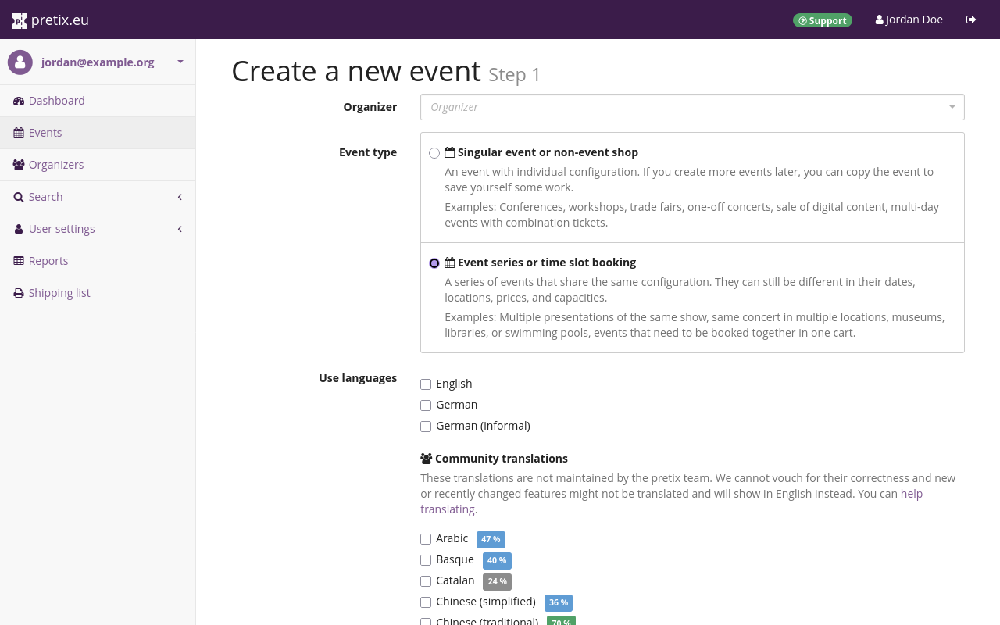
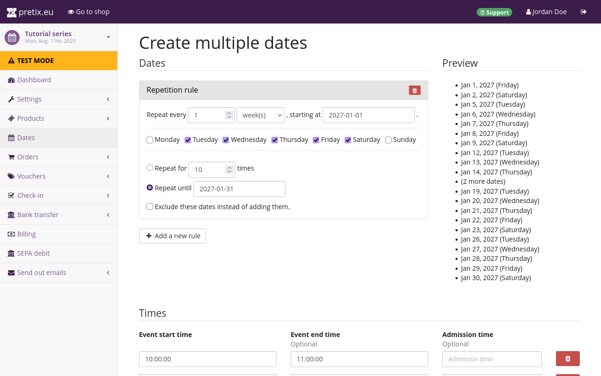
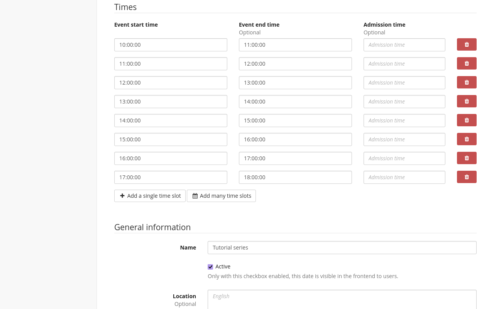
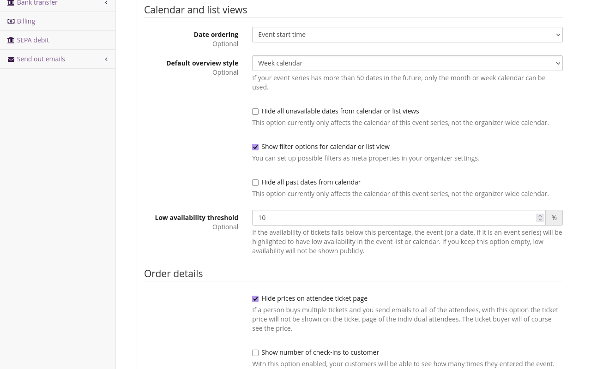
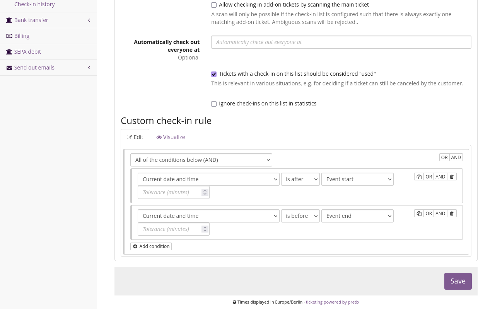
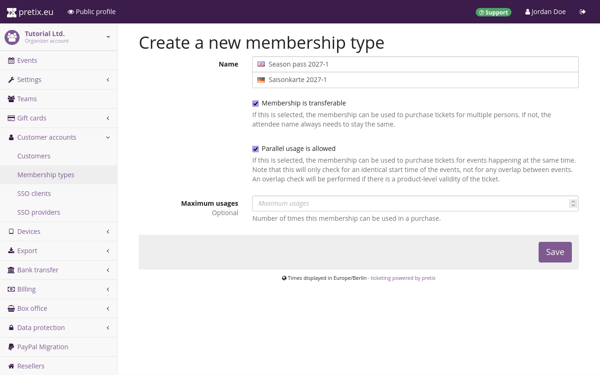
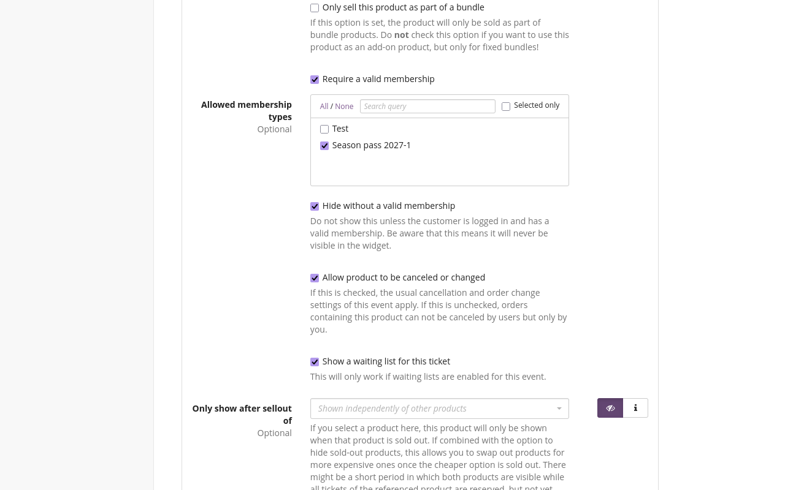

# Products

A product is anything sold via pretix: tickets, gift cards, conference t-shirts and so on. 
pretix offers you almost unlimited possibilities for configuring and structuring products. 
This article guides you through the basic process of creating a product and explains several practical applications for some of the more advanced features of pretix. 

## Prerequisites

Products are configured on the event level, so you have to create an event first. 

## General usage

This section guides you through the basic process of product creation. 
This involves first creating categories, then the products themselves, and finally quotas. 
You **cannot** create add-on products or products for cross-selling without choosing a category for them. 
You **cannot** create a quota without adding at least one product to it. 
Thus, this guide will explain those steps in that order.

### Creating and editing categories

 

Categories do several things. 
They help you group products sensibly, both in the backend and in your shop. 
Your shop page will display products grouped by categories which can help customers find the item they are looking for more easily.  
Sorting products into categories can help you keep track of them in the backend. 

Categories also separate normal products, which can be purchased directly, from additional products, which are only offered as add-ons to normal products. 
If you want to sell not only admission tickets, but also extras such as merchandise, you have to create a category for add-on products. 
You also need an extra category if you are planning to use the cross-selling feature. 

If you only sell a limited number of different products and you are not using the add-ons or cross-selling feature, then you do not need to edit or create any categories. 

In order to edit or create categories, navigate to :navpath:Your event → :fa3-ticket: Products → Categories:. 
This page lists all previously created product categories. 

Click the :btn-icon:fa3-plus: Create a new category: button and give the new category a name. 
Choose the category type depending on the type of products in this category: normal, add-on, cross-selling, or normal + cross-selling. 

Normal products are standalone products that can be purchased directly. 
Add-on products are products that **cannot** be purchased directly, but only as add-ons to other products during checkout. 
The types and numbers of products in the cart decides what add-on products the customer can select. 

Cross-selling products are also not offered in the shop, but during checkout. 
Unlike add-on products, the contents of the cart to not decide what cross-selling products the customer can buy. 
Finally, products of the "normal + cross-selling" type are offered as both standalone products and in the cross-selling step. 
The "Cross-selling condition" setting below determines how products in the "cross-selling" and "normal + cross-selling" categories are offered in your shop. 

Click the :btn:Save: button at the bottom of the page. 
This takes you back to the product categories page, which now also lists the newly created category. 

You can also edit an already existing category and change its name, description, and type, by clicking its name or the :btn-icon:fa3-edit:: edit button next to it in the list. 

### Creating and editing products

 

If you want to create or edit products, navigate to :navpath:Event → :fa3-ticket: Products → Products:. 
This page shows the list of all products of this event. 
Click the :btn-icon:fa3-plus: Create a new product: button. 
Choose a name, a description, a default price and a [sales tax](../taxes.md) and click the :btn:Save: button. 

You can also edit an already existing product by clicking its name or the :btn-icon:fa3-edit:: edit button next to it in the list. 

### Creating and editing quotas 

A quota determines how many instances of your product can be sold. 
Every product has to be part of at least one quota before it becomes available in the shop. 

If you want to create or edit quotas, navigate to :navpath:Event → :fa3-ticket: Products → Quotas:. 
This page shows the list of all quotas for the event as well as the total capacity and how many items are left for each quota. 

Click the :btn-icon:fa3-plus: Create a new quota: button. 
Choose a name and a capacity, check the products to be contained in this quota, and any advanced options, and then click the :btn:Save: button. 

You can also edit an already existing quota by clicking its name or the :btn-icon:fa3-edit:: edit button next to it in the list. 

## Applications 

This section covers advanced use cases and how to implement them using the options pretix offers for customizing products. 

### Time slots 

You can use pretix to set up access to a venue with a limited visitor capacity, such as a museum, based on time slots. 
This guide shows you how to create an event with time slots. 

Create a new event. 
Under "Event type", select "Event series or time slot booking". 

For general instructions on how to set up an event series with pretix, refer to our guide on [event series](../event-series.md).

#### Creating slots

In order to create time slots, you have to create a number of "dates" in the event series. 
Navigate to :navpath:Your event → :fa3-calendar: Dates: and click the :btn-icon:fa3-plus:Create many new dates: button. 
Enter a pattern for your opening days. 
If your venue opens every week from Tuesday to Sunday in January of 2027, enter the following pattern: 
"Repeat every `1` `week(s)`, starting at `2027-01-01`" 
Check the boxes for Tuesday, Wednesday, Thursday, Friday, and Saturday. 
Select "Repeat until" and enter `2027-01-31` into the field.  

It makes sense to create time slots for a few weeks at a time. 
Do not create time slots for a full year or an even longer period of time. 
Doing so would make it too complicated to make changes later. 

Under "Times", specify the time slots for each opening day. 
If your venue opens every day from 10 AM to 6 PM and each time slot corresponds to a full hour, you can click the :btn-icon:fa3-calendar: Add many time slots: button. 
Specify "Start of first slot" as "10:00:00", "End of time slots" as "18:00:00", "Length of slots" as "60" and "Break between slots" as "0". 
Then, click the :btn-icon:fa3-check: Create: button. 
If your time slot pattern is more irregular or complex, use the :btn-icon:fa3-plus: Add a single time slot: button and edit each line individually. 

If you have different opening times on different days of the week, you will need to go through the creation process multiple times.

Under "Quotas, create one or multiple quotas. 
These quotas determine how many people can book a ticket for each time slot. 
If you want each time slot to be attended by a maximum of 50 people, set the "Total capacity" to `50`
Once you are happy with your choices, click the :btn:Save: button. 

!!! Note
    If you create a large number of time slots at once, it may take a moment until all of them can be displayed. 
    If you encounter an error message during this stage, wait a few minutes for the server to finish the task. 
    Do **not** try again immediately. 
    In most cases, the dates will be created successfully even if an error message is displayed. 

#### Enabling the week calendar view

For an event series or time slot booking, it makes sense to enable the "Week calendar" overview style for the shop page. 
In order to do so, navigate to :navpath:Your Event → :fa3-wrench: Settings → General:. 
Open the :btn:Display: tab and set "Default overview style" to "Week calendar":

Your ticket shop will now display a weekly overview over all time slots and their availability. 

#### Check-in

If you are selling tickets for certain time slots, then you also want customers to be admitted to the event only if their ticket matches the current time slot. 
This section explains how to set this up using custom check-in rules. 
Navigate to :navpath:Your event → :fa3-check-square-o: Check-in → Check-in lists: and click the :btn-icon:fa3-plus: Create a new check-in list: button. 

Specify a name, but do **not** choose a specific date. 
This check-in list will apply to all dates. 
Open the :btn:Advanced: tab. 

Under "Custom check-in rule", click the :btn-icon:fa3-plus-circle: Add condition: button and select "All of the conditions below (AND)" from the dropdown menu. 
Click :btn-icon:fa3-plus-circle: Add condition: again and select "Current date and time", then "is after", then "Event start". 
Click :btn-icon:fa3-plus-circle: Add condition: again and select "Current date and time", then "is before", then "Event end". 
You can leave the "Tolerance (minutes)" fields empty or specify a tolerance of a few minutes for some leniency. 

With these two restrictions, customers can only access your event during the time slot for which they bought a ticket. 
Once you are happy with your choices, click the :btn:Save: button. 

When using pretixSCAN with this setup, the app will ask you to select one of the time slots. 
The choice does not matter. 
It is only important that you select the check-in list you just set up. 
Select any time slot that is part of the event series and then select the check-in list described above. 

### Season tickets

Season tickets are often used for public swimming pools, sports clubs, theaters, and other types of venues. 
This section explains two methods for setting them up in pretix. 
These methods can be used for any ticket that grants access to all events during a certain time period. 
It does not matter whether that time period spans several years or just a single day. 

The first method, option A, uses memberships. 
The second method, option B, uses a single season ticket. 

With **Option A**, a customer who purchases a season ticket creates an account with their email address and a password. 
The season ticket will be stored in that account. 
Whenever the customer wants to use the season ticket, they need to purchase a ticket for that event. 
Their membership allows them to get that ticket for free. 
If your venue has limited capacity or reserved seating, use option A. 
This method allows you to control the total number of people that can be admitted to an event or time slot using quotas. 

With **Option B**, a customer who purchases a season ticket receives a single ticket with a single ticket secret that can be used an unlimited number of times. 
Use option B if you are only hosting a single event or event series, the capacity of your venue is virtually unlimited, and you do not need to know in advance how many season ticket holders will show up.

#### Option A: Memberships and multiple tickets

Option A requires customers to be identified with a customer account.
Thus, you first need to enable the customer accounts feature in your organizer settings in the "Customer accounts" tab. 
See also: [Customer accounts](../customer-accounts.md) 

Once you have done that, navigate to :navpath:Your organizer → :fa3-user: Customer accounts → Membership types:. 
Click the :btn-icon:fa3-plus: Create a new membership type: button. 

Give the new membership type a distinct and informative name. 
If you want the membership to allow purchase of tickets for multiple different people, check the box next to "Membership is transferable". 
If you want the membership to allow purchase for multiple different events or dates with the same start time, check the box next to "Parallel usage is allowed". 

If you want to limit the membership to a certain number of purchases, specify that number in the "Maximum usages" field. 
If you want to allow unlimited purchases within the specified time frame, leave this field empty. 
Once you are happy with your choices, click the :btn:Save: button. 

Once you have created the membership type, you also need a way to sell these memberships. 
Create a new event with start and end dates corresponding to the duration of the season for which you want to sell season passes. 
Navigate to :navpath:Your event → :fa3-ticket: Products: and click the :btn-icon:fa3-plus: Create a new product: button. 
Choose a name such as "Season pass" and a price, and then click the :btn:Save and continue with more settings: button. 

Then, open the :btn:Additional settings: tab. 
Under "This product creates a membership of type", select the membership you just created. 
By default, the box next to "The duration of the membership is the same as the duration of the event or event series date" is checked. 
If you are selling multiple time-based passes with different periods of validity which do not match the duration of the event, uncheck the box. 

In order to prevent customers from confusing their season pass with their ticket, it makes sense to disable ticket downloads. 
Navigate to :navpath:Your event → :fa3-wrench: Settings: and uncheck the box next to "Allow users to download tickets". 

Once the season pass shop has been set up, you need to create free products that can only be purchased with the season pass for each applicable event. 
Clone an existing admission ticket, append a descriptor such as "for season ticket holders" to the name, and set the price to zero. 
Click the :btn:Save and continue with more settings: button and then open the :btn:Availability: tab. 
Check the box next to "Require a valid membership" and select the membership type you created. 
If you want to display this product only to customers who already have an active membership in your shop, check the box next to "Hide without a valid membership". 

Repeat these steps for every product you want to make available for free for season pass holders. 
If you want season pass holders to be able to attend multiple of your events for free, repeat these steps for every applicable event. 

#### Option B: All-access in a single pass

Option B is setting up a single all-access pass. 
This is less complicated to set up than option A because it does not require your customers to set up accounts and book a new ticket on every visit.
However, you can only use option B if you have only a single event series, and no space limitations at your venue. 

In order to set up a single all-access pass, navigate to :navpath:Your event → :fa3-ticket: Products: and click the :btn-icon:fa3-plus: Create a new product: button. 
Give the new product a name such as "Season ticket". 
Enable this product for all dates in your event series. 

You have to set up custom check-in rules to allow customers access to all dates with the season pass. 
Navigate to :navpath:Your event → :fa3-check-square-o: Check-in → Check-in lists: and click the :btn-icon:fa3-plus: Create a new check-in list: button. 

Specify a name, but do **not** choose a specific date. 
This check-in list will apply to all dates. 
Open the :btn:Advanced: tab. 

Under "Custom check-in rule", click the :btn-icon:fa3-plus-circle: Add condition: button and select "At least one of the conditions below (OR)" from the dropdown menu. 
Click the :btn-icon:fa3-plus-circle: Add condition: button again and select "All of the conditions below (AND)" from the dropdown menu. 
You now have an OR-bracket with an AND-bracket inside it. 

Click the :btn-icon:fa3-plus-circle: Add condition: button **within the AND-bracket** and select "Product", then "is one of", and then all admission tickets **other than** the season pass. 
Click the :btn-icon:fa3-plus-circle: Add condition: button within the AND-bracket again and select "Current date and time", then "is after", then "Event start". 
Click the :btn-icon:fa3-plus-circle: Add condition: button within the AND-bracket again and select "Current date and time", then "is before", then "Event end". 
You can leave the "Tolerance (minutes)" fields empty or specify a tolerance of a few minutes for some leniency. 
Click the :btn-icon:fa3-plus-circle: Add condition: button within the AND-bracket a final time and select "Number of previous entries", then "=", then "0". 

Then, click the :btn-icon:fa3-plus-circle: Add condition: button that is located within the OR-bracket, but **not** within the AND-bracket. 
It should be further down on the page. 
Select "Product", then "is one of", and then your season pass product. 

The logic is depicted in the screenshot above. 
These rules ensure that regular tickets holders are only admitted to their chosen date and if their ticket has not been used before. 
They also ensure that season ticket holders are always admitted. 

### Mixed taxation 



The article on [taxes](../taxes.md) has a section explaining how to set up products with [mixed taxation](../taxes.md#mixed-taxation) using bundles. 

## Troubleshooting 

### A product does not appear in the ticket shop 

If you have created a product and it is not displayed in your ticket shop, perform the following checks: 

 1. Check if the product's "active" checkbox is enabled.

 2. Check if the product's "Available from" or "Available until" settings restrict it to a date range.

 3. Check if the product's checkbox "This product will only be shown if a voucher matching the product is redeemed." is enabled. 
 If this is the case, the product will  only be shown if the customer redeems a voucher that directly matches to this product. 
 It will not be shown if the voucher only is configured to match a quota that contains the product.

 4. Check if the product is in a category that has the "Products in this category are add-on products" checkbox enabled. 
 If this is the case, the product won't show up on the shop front page, but only in the first step of checkout when a product in the cart allows to add add-on products from this category.

 5. Check that a quota exists that contains this product. 
 If your product has variations, check that at least one variation is contained in a quota. 
 If your event is an event series, make sure that the product is contained in a quota that is assigned to the series date that you access the shop for.

 6. If the sale period has not started yet or is already over, check the "Show items outside presale period" setting of your event.