# Products

A product is anything sold via pretix: tickets, gift cards, conference t-shirts and so on. 
pretix offers you almost unlimited possibilities for configuring and structuring products. 
This article guides you through the basic process of creating a product and explains several practical applications of some of the more advanced features of pretix. 

## Prerequisites

Products are configured on the event level, so you have to create an event first. 

## General usage

This section guides you through the basic process of product creation. 
This involves first creating categories, then the products themselves, and finally quotas. 
You cannot create add-on products or products for cross-selling without choosing a category for them. 
You cannot create a quota without adding at least one product to it. 
Thus, this guide will explain those steps in that order.

### Creating and editing categories

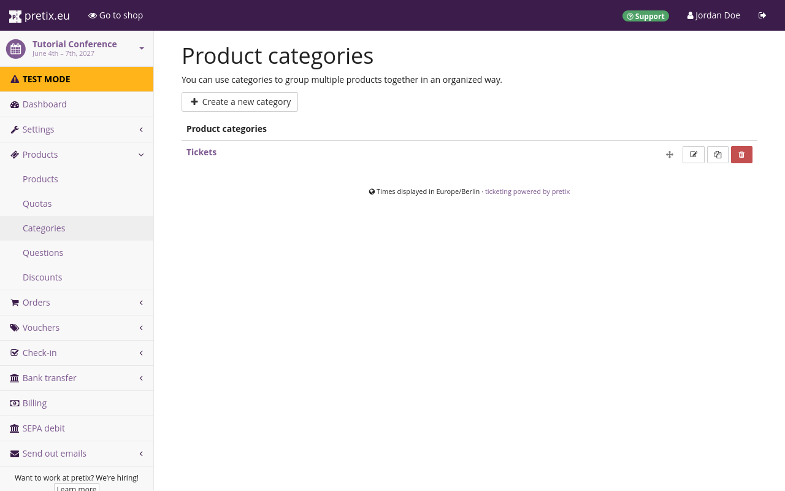 

Categories do several things. 
They help you group products into sensible categories both in the backend and in your shop. 
Your shop page will display products grouped by categories which can help customers find the item they are looking for more easily.  
Sorting products into categories can help you keep track of them in the backend. 

Categories also separate normal products, which can be purchased directly, from additional products, which are only offered as add-ons to normal products. 
If you want to sell not only admission tickets, but also extras such as merchandise, you have create a category for add-on products. 
You also need an extra category if you are planning to use the cross-selling feature. 

In order to edit categories, navigate to :navpath:Your event → :fa3-ticket: Products → Categories:. 
This page shows the list of all product categories. 

Click the :btn-icon:fa3-plus: Create a new category: button and give the new category a descriptive name. 
Choose the category type depending on the type of products in this category: normal, add-on, cross-selling, or normal + cross-selling. 

Normal products are standalone products that can be purchased directly. 
Add-on products are products that are only offered as add-ons to normal products. 
Cross-selling products are products that are only offered in the cross-selling step as a customer is purchasing other products. 
Finally, products in the "normal + cross-selling" category are both offered as standalone products and in the cross-selling step. 
The "Cross-selling condition" setting below determines how products in the "cross-selling" and "normal + cross-selling" categories are offered in your shop. 

Click the :btn:Save: button at the bottom of the page. 
This takes you back to the product categories page, which now also lists the newly created category. 

You can also edit an already existing category and change its name, description, and type, by clicking its name or the :btn-icon:fa3-edit:: edit button next to it in the list. 

### Creating and editing products

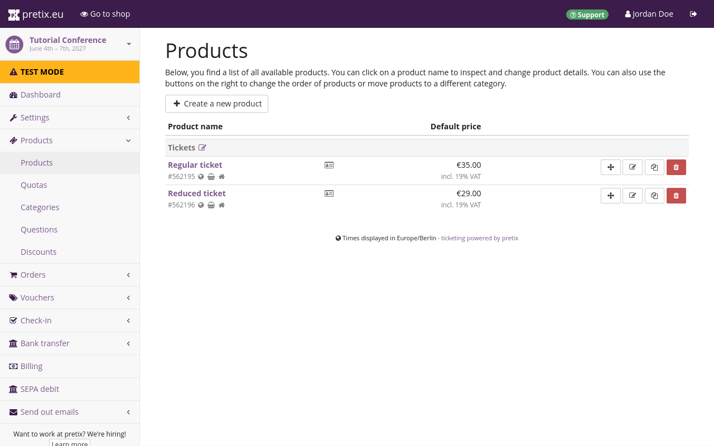 

If you want to create or edit products, navigate to :navpath:Event → :fa3-ticket: Products → Products:. 
This page shows the list of all products. 
Click the :btn-icon:fa3-plus: Create a new product: button. 
Choose a name, a description, a default price and a sales tax and click the :btn:Save: button. 

You can also edit an already existing product by clicking its name or the :btn-icon:fa3-edit:: edit button next to it in the list. 

### Creating and editing quotas 

A quota determines how many instances of your product can be sold. 
Every product has to be part of at least one quota before it becomes available in the shop. 

If you want to create or edit quotas, navigate to :navpath:Event → :fa3-ticket: Products → Quotas:. 
This page shows the list of all quotas for the event as well as the total capacity and how many items are left for each quota. 

Click the :btn-icon:fa3-plus: Create a new quota: button. 
Choose a name and a capacity, check the products to be contained in this quota, and any advanced options, and then click the :btn:Save: button. 

You can also edit an already existing quota by clicking its name or the :btn-icon:fa3-edit:: edit button next to it in the list. 

## Applications 

This section covers advanced use cases and how to implement them using the options pretix offers for customizing products. 

### Time slots 

You can use pretix to set up access to a venue with a limited visitor capacity, such as a museum, based on time slots. 
This guide shows you how to create an event with time slots. 

Create a new event. 
Under "Event type", select "Event series or time slot booking". 

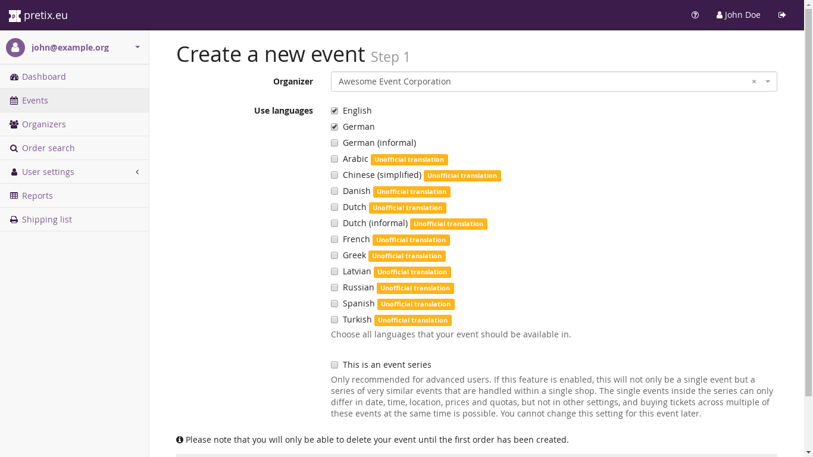

For general instructions on how to set up an event series with pretix, refer to our guide on [event series](../event-series.md).

#### Creating slots

In order to create time slots, you have to create a number of "dates" in the event series. 
Navigate to :navpath:Your event → :fa3-calendar: Dates: and click the :btn-icon:fa3-plus:Create many new dates: button. 
Enter a pattern for your opening days. 
If your venue opens every week from Tuesday to Sunday in January of 2027, enter the following pattern: 
"Repeat every `1` `week(s)`, starting at `2027-01-01`" 
Check the boxes for Tuesday, Wednesday, Thursday, Friday, and Saturday. 
Select "Repeat until" and enter `2027-01-31` into the field.  

It makes sense to create time slots for a few weeks at a time. 
Do not create time slots for a full year or an even longer period of time. 
Doing so would make it too complicated to make changes later. 

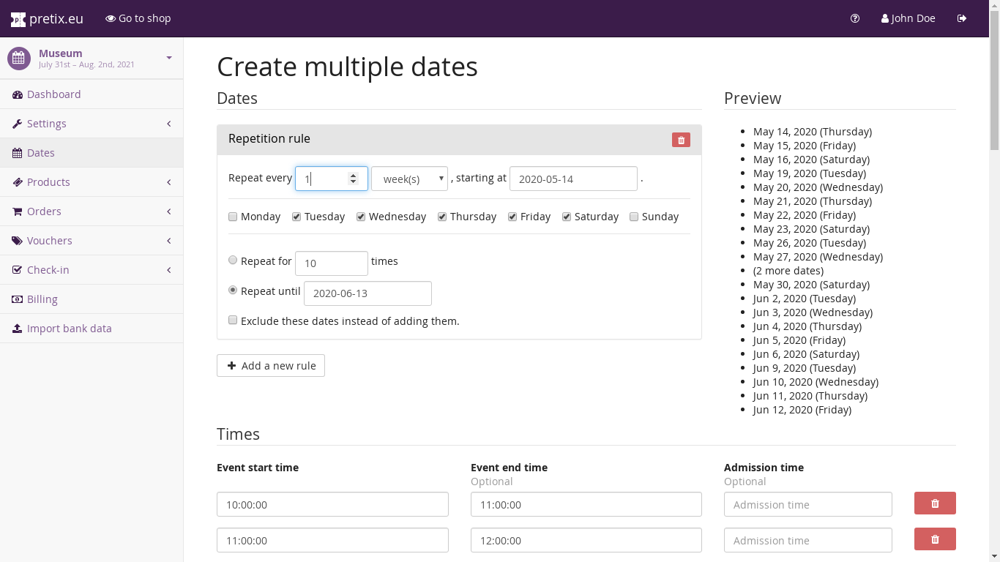

Under "Times", specify the time slots for each opening day. 
If your venue opens every day from 10 AM to 6 PM and each time slot corresponds to a full hour, add a total of seven lines. 
Enter an "Event start time" of `10:00:00` and an "Event end time" of `11:00:00` into the first line. 
Repeat this for every line, incrementing the hours for both start and end time by one for each line. 

If you have different opening times on different days of the week, you will need to go through the creation process multiple times.

Under "Quotas, create one or multiple quotas. 
These quotas determine how many people can book a ticket for each time slot. 
If you want each time slot to be attended by a maximum of 50 people, set the "Total capacity" to `50`

Once you are happy with your choices, click the :btn:Save: button. 

!!! Note
    If you create a large number of time slots at once, it may take a moment until all of them can be displayed. 
    If you encounter an error message during this stage, wait a few minutes for the server to finish the task. 
    Do **not** try again immediately. 
    In most cases, the dates will be created successfully even if an error message is displayed. 

#### Enabling the week calendar view

For an event series or time slot booking, it makes sense to enable the "Week calendar" overview style for the shop page. 
In order to do so, navigate to :navpath:Your Event → :fa3-wrench: Settings → General:. 
Open the :btn:Display: tab and set "Default overview style" to "Week calendar":

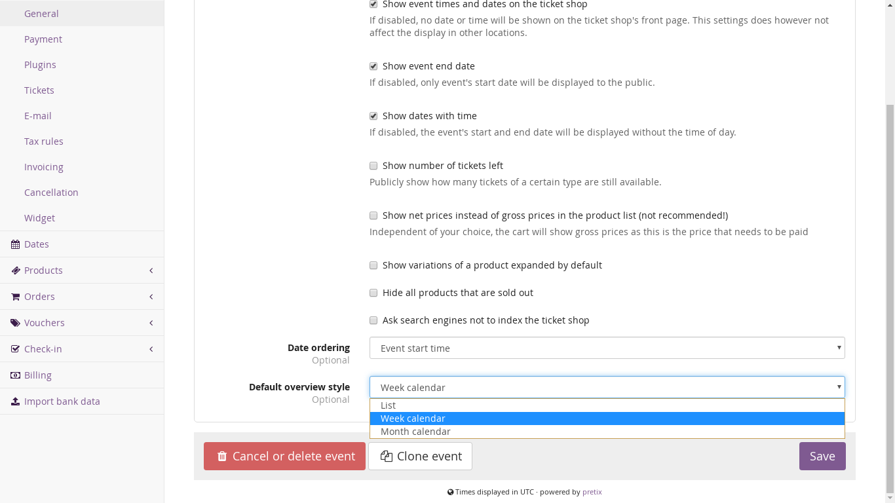

Your ticket shop will now display a weekly overview over all time slots and their availability. 

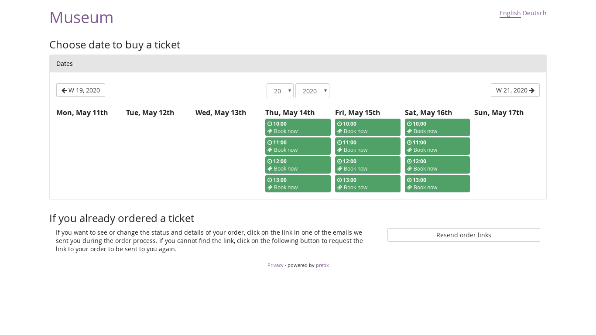

#### Check-in

If you are selling tickets for certain time slots, then you also want customers to be admitted to the event only if their ticket matches the current time slot. 
This section explains how to set this up using custom check-in rules. 
Navigate to :navpath:Your event → :fa3-check-square-o: Check-in → Check-in lists: and click the :btn-icon:fa3-plus: Create a new check-in list: button. 

Specify a name, but do **not** choose a specific date. 
This check-in list will apply to all dates. 
Open the :btn:Advanced: tab. 

Under "Custom check-in rule", click the :btn-icon:fa3-plus-circle: Add condition: button and select "All of the conditions below (AND)" from the dropdown menu. 
Click :btn-icon:fa3-plus-circle: Add condition: again and select "Current date and time", then "is after", then "Event start". 
Click :btn-icon:fa3-plus-circle: Add condition: again and select "Current date and time", then "is before", then "Event end". 
You can leave the "Tolerance (minutes)" fields empty or specify a tolerance of a few minutes for some leniency. 

With these two restrictions, customers can only access your event during the time slot for which they bought a ticket. 
Once you are happy with your choices, click the :btn:Save: button. 

When using pretixSCAN with this setup, the app will ask you to select one of the time slots. 
The choice does not matter. 
It is only important that you select the check-in list you just set up. 
Select any time slot that is part of the event series and then select the check-in list described above. 

### Season tickets

Season tickets and similar time-based tickets are popular for swimming pools, sports clubs, theaters and lots of other types of venues. 
In this section, we show you different ways to set them up with pretix. 
Of course, other types of tickets such as week tickets, month tickets or tickets of ten can be created with the same mechanism.

There is a big difference between the two ways we show below.

With Option A, a customer who purchases a season ticket creates an account with their email address and a password and the season ticket will be saved in that account. 
If the customer wants to use the season ticket, they need to buy an additional free ticket for the specific event they want to visit. 
This makes sense for all events or venues with limited capacity or reserved seating, because it still allows you to set an upper limit of people showing up for a specific event or time slot.

With Option B, a customer who purchases a season ticket receives a single ticket with a single QR code that can be used an unlimited number of times. 
This makes sense if the capacity of your venue is virtually unlimited and you do not need to know in advance how many season ticket holders will show up.

#### Option A: Memberships and multiple tickets

Since this approach requires customers to be identified with a customer account, you first need to enable the customer accounts feature in your organizer settings in the "Customer accounts" tab. 
See also: [Customer accounts](../customer-accounts.md) 

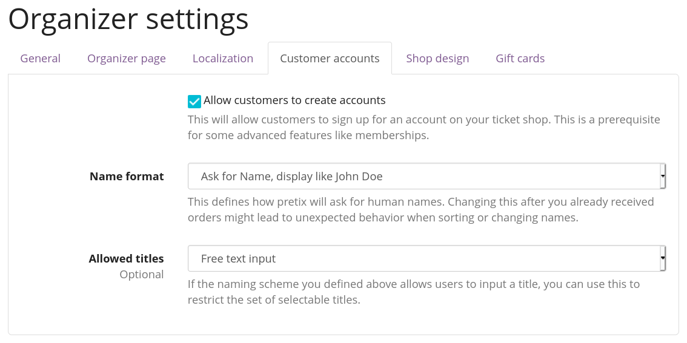

After doing so, a new menu item "Customer accounts" will also show up in the main menu of your organizer account on the left. 
Open its menu and click "Membership types". 
Then, select to "create a new membership type".

You can name the membership type in a way that clearly explains where it is valid, e.g. "season pass main location" or "season pass all locations". 
There are a few details you can configure on this page, such as whether the season pass can be used by multiple different persons, or if the season pass can be used for multiple tickets for the same time slot. 
You can also define a maximum number of usages, which is useful if you e.g. use this feature to add a "ticket of ten".

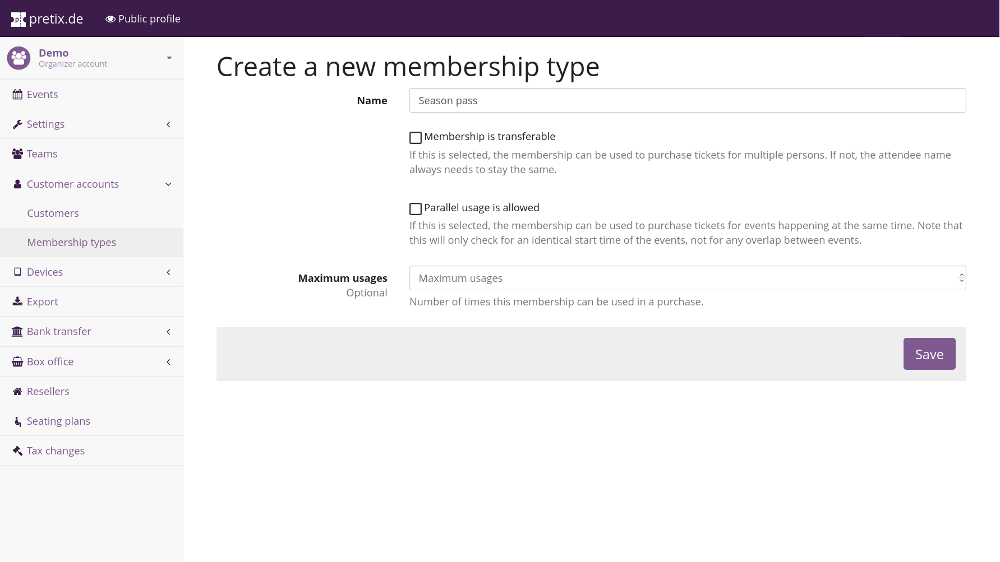

Next, you need a way of selling these season passes. 
Theoretically this can be done through the same event series that you usually use, but it's probably cleaner and easier to find for customers if you create a new event that you only use to sell season passes. 
The start and end date of the new event should correspond to the dates of your season.

Inside the new event, you only need to create a single product which you can call "season ticket". 
Inside that product's settings, head to the "Additional settings" section and look for the option "This product creates a membership of type". 
Select the membership type you just created. 
By default, the checkbox "The duration of the membership is the same as the duration of the event or event series date" is active, which is fine for our season ticket example, but you might need to unset it and provide custom timing for other ticket types such as week passes.

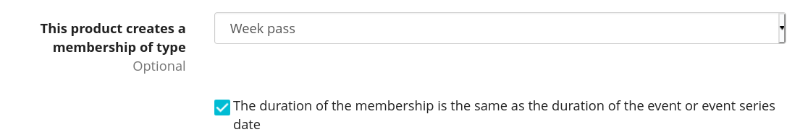

To prevent confusion, it might be useful to turn off ticket downloading at "Settings" → "Tickets" for your new event. 
That's it, you are now ready to sell season tickets!

We can now deal with how to use the season tickets. 
Move back to your existing event and create a new product or product variation of your regular product which you call "ticket for season ticket holders" and assign a price of zero. 
In the "Availability" section of the product or variation settings, check the option "Require a valid membership" and again select the membership type you created. 
You can of course repeat this with all events the season ticket holder should have access to.

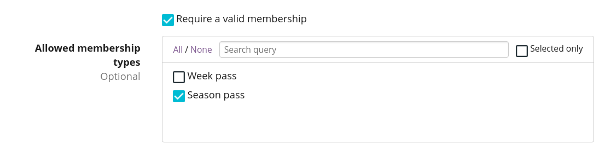

#### Option B: All-access in a single pass

If you have only a single event series with many time slots and you do not care how many season ticket holders show up, there's a solution that does not require your customers to set up accounts and book a new ticket on every visit.

Instead, you can just create an additional product "Season ticket" that you enable either in a "special" date of your event series just created for this purpose, or in all of your dates so it can be easily found by customers.

Then, you can set up your check-in lists with custom logic in the "Advanced" tab of your check-in list settings. 
The logic needs to ensure the following requirements:

 - Regular ticket holders can only get in during their assigned time frame and when they haven't used their ticket before.
 - Season ticket holders can always get in.

Here's an example on how to set this up:
Create an OR-bracket (At least one of the conditions below). 
Within that OR-condition, create two AND-brackets (All of the conditions below). 
Within the first AND-bracket, create the following conditions: 

 - "Product" "is one of" "Day pass" 
 - "Current date and time" "is after" "Event start" with a tolerance of 0 
 - "Current date and time" "is before" "Event end" with a tolerance of 0 
 - "Number of previous entries" equals 0 

Then, within the second AND-bracket, create the following condition: 
"Product" "is one of" "Season pass".  

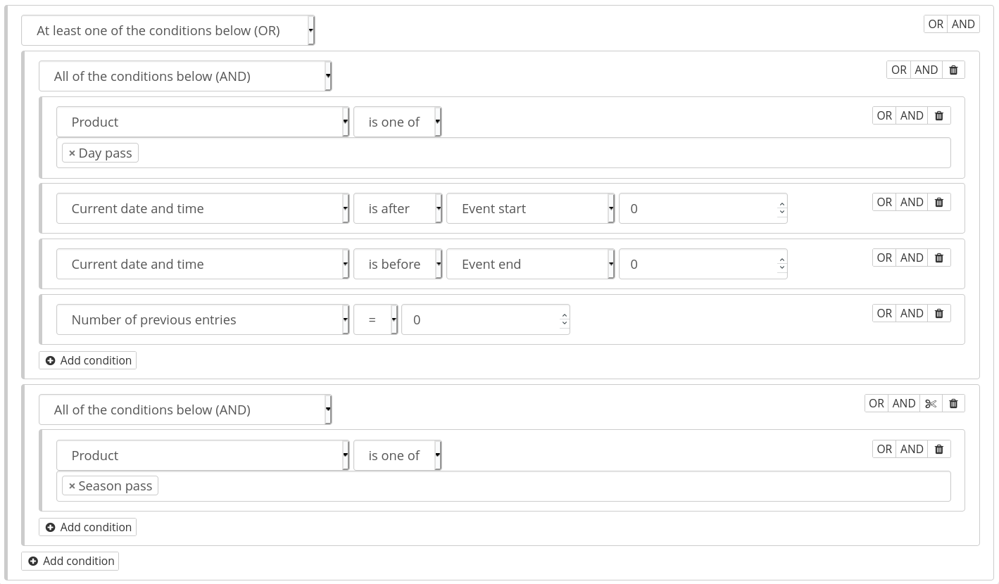

### Mixed taxation 



The article on [taxes](../taxes.md) has a section explaining how to set up products with [mixed taxation](../taxes.md#mixed-taxation) using bundles. 

## Troubleshooting 

### A product does not appear in the ticket shop 

If you have created a product and it is not displayed in your ticket shop, perform the following checks: 

 1. Check if the product's "active" checkbox is enabled.

 2. Check if the product's "Available from" or "Available until" settings restrict it to a date range.

 3. Check if the product's checkbox "This product will only be shown if a voucher matching the product is redeemed." is enabled. 
 If this is the case, the product will  only be shown if the customer redeems a voucher that directly matches to this product. 
 It will not be shown if the voucher only is configured to match a quota that contains the product.

 4. Check if the product is in a category that has the "Products in this category are add-on products" checkbox enabled. 
 If this is the case, the product won't show up on the shop front page, but only in the first step of checkout when a product in the cart allows to add add-on products from this category.

 5. Check that a quota exists that contains this product. 
 If your product has variations, check that at least one variation is contained in a quota. 
 If your event is an event series, make sure that the product is contained in a quota that is assigned to the series date that you access the shop for.

 6. If the sale period has not started yet or is already over, check the "Show items outside presale period" setting of your event.