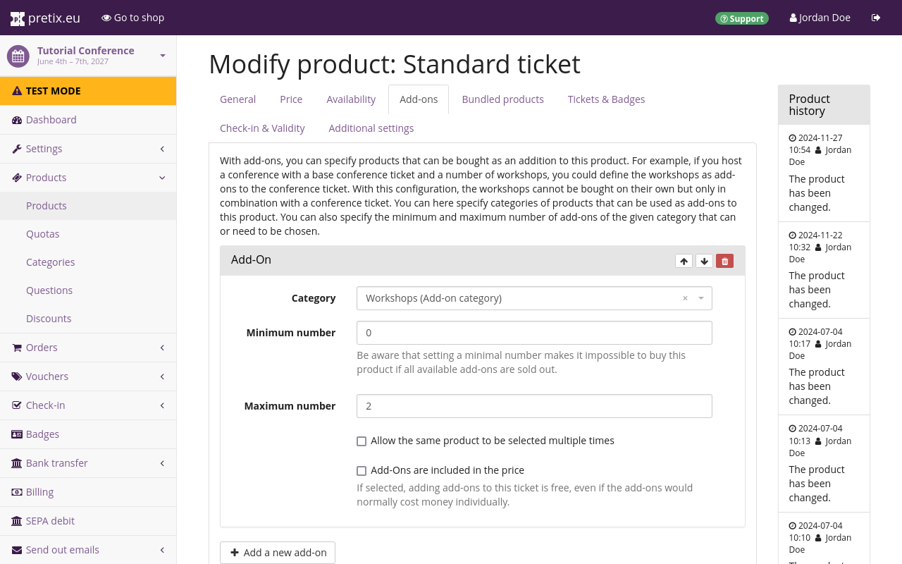
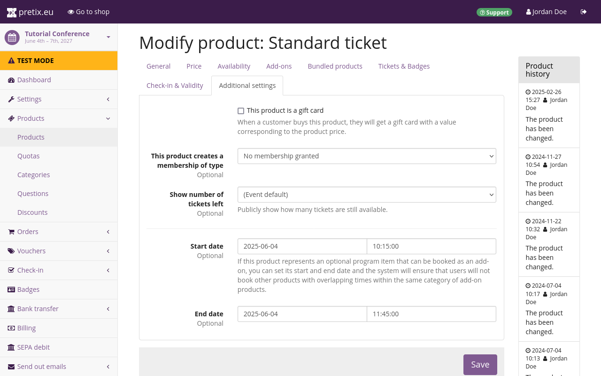

# Sitzungen

Manche Veranstaltungen bestehen aus mehreren kleineren Veranstaltungen („Sitzungen“) mit eingeschränkter Kapazität, und Teilnehmer/*innen können auswählen, an welchen dieser Sitzungen sie teilnehmen möchten. 
Wenn Sie etwa eine Konferenz mit mehreren Workshops planen, eine Festveranstaltung mit verschiedenen Aktivitäten oder eine ähnliche Veranstaltung, brauchen Sie unter Umständen eine Möglichkeit, den Zutritt zu diesen Sitzungen zu kontrollieren. 

pretix bietet Ihnen dazu zwei Optionen. 
Sie können entweder Zusatzprodukte mit festen Zeitfenstern verwenden oder eine Erweiterung mit speziellen Funktionen für variable Zeitfenster. 
Dieser Artikel erläutert beide Optionen. 

Wenn für einige der Sitzungen abweichende Preise gelten oder an jeder Sitzung nur eine begrenzte Anzahl Personen teilnehmen kann, sollten Sie mit [Zusatzprodukten](sessions.md#option-a-add-on-products-with-fixed-time-slots) arbeiten. 

Wenn Sie abweichende Preise haben sowie Sitzungen mit unterschiedlichen Anfangs- und Endzeiten, die einander überlappen und sich deshalb nicht ohne Weiteres in Zeitfenster einteilen lassen, sollten Sie mit [Agenda-Beschränkungen](sessions.md#option-b-add-on-products-with-variable-time-slots) arbeiten. 

Wenn das, was Sie planen, keine Sitzungen als Teil einer größeren Hauptveranstaltung sind, sondern eine Reihe von Veranstaltungen, die man einzeln besuchen kann, lesen Sie stattdessen unseren Artikel über [Veranstaltungsreihen](../event-series.md). 

## Option A: Zusatzprodukte mit festen Zeitfenstern

Wenn Sie eine größere Zahl von Sitzungen anbieten, der Veranstaltungsort nur begrenzte Plätze bietet oder Sie für mindestens eine der Sitzungen einen höheren Preis berechnen möchten, sollten Sie Zusatzprodukte mit festen Zeitfenstern verwenden. 
Dieser Abschnitt erläutert die Vorgehensweise dazu. 

Erstellen Sie zuerst mindestens ein Standard-Zutrittsprodukt für die Veranstaltung und eine Kategorie für Zusatzprodukte. 
Erstellen Sie anschließend ein neues Produkt für das erste Zeitfenster. 
Fügen Sie dieses Produkt zur eben angelegten Kategorie hinzu, wählen Sie „Produkt mit mehreren Varianten“ und setzen Sie den Preis auf null. 
Wechseln Sie zum Reiter „Varianten“ und erstellen Sie für jede Sitzung, die in diesem Zeitfenster stattfindet, eine Variante. 
Wiederholen Sie diese Schritte für jedes Zeitfenster und jede Sitzung Ihrer Veranstaltung. 

Ein Beispiel: Sie veranstalten eine Konferenz mit Workshops, an denen jeweils nur maximal 20 Personen teilnehmen können. 
Der Zeitplan sieht so aus: 

| Zeit                | Raum A     | Raum B                         |
|---------------------|------------|--------------------------------|
| Mittwoch Vormittag  | Vortrag    |                                |
| Mittwoch Nachmittag | Workshop A | Workshop B                     |
| Donnerstag Vormittag| Workshop C | Workshop D (20 € zusätzlich)       |

Ergänzend zu den Standard-Zutrittsprodukten für diese Konferenz müssen Sie auch folgende Produkte erstellen: 

 - eine Kategorie namens „Workshops“, bei der das Kontrollkästchen „Produkte in dieser Kategorie sind Zusatzprodukte“ markiert ist
 - in der Kategorie „Workshops“ ein kostenloses Produkt namens „Mittwoch Nachmittag“ in zwei Varianten:
     - Workshop A
     - Workshop B
 - in der Kategorie „Workshops“ ein kostenloses Produkt namens „Donnerstag Vormittag“ in zwei Varianten:
     - Workshop C (kostenlos)
     - Workshop D (20 €)
 - ein Kontingent für jedes Zusatzprodukt (Workshop), jeweils mit der Gesamtkapazität 20 

Wenn Sie diese Kategorien, Produkte und Kontingente erstellt haben, bearbeiten Sie die Standard-Zutrittstickets und wechseln Sie zum Reiter :btn:Zusatzprodukte:. 
Fügen Sie ein Zusatzprodukt aus der Kategorie „Workshops“ hinzu, die „Minimale Anzahl“ ist 0, die „Maximale Anzahl“ ist 2, und klicken Sie den Button :btn:Speichern:. 
So können Ihre Kund/*innen wählen, an welchen Workshops sie teilnehmen möchten. 
Dies gibt Ihnen auch die Möglichkeit, über die Kontingente für die einzelnen Workshops die geplante Anzahl der Teilnehmer/*innen im Blick zu behalten. 

## Option B: Zusatzprodukte mit variablen Zeitfenstern

<!-- md:hosted -->
<!-- md:enterprise -->

!!! Hinweis
    In pretix Hosted können Sie die Erweiterung „Agenda-Beschränkungen“ ohne Zusatzkosten nutzen. 
    Wenn Sie die Erweiterung mit pretix Enterprise nutzen möchten, wenden Sie sich bitte an sales@pretix.eu.
    Die Erweiterung „Agenda-Beschränkungen“ können Sie nicht in pretix Community nutzen. 

Wenn sich bei Ihrer Veranstaltung die Anfangs- und Endzeiten der Sitzungen überlappen und nicht ohne Weiteres in Zeitfenster einteilen lassen, können Agenda-Beschränkungen die Lösung sein. 
Im folgenden Beispiel lassen sich die Agenda-Beschränkungen einsetzen: 

| Zeit                | Raum A     | Raum B                         |
|-------------|--------------------------|--------------------------|
| 09:00–11:00 | Diskussion 1             | Workshop 1 (erste Hälfte)|
| 11:00–13:00 | Diskussion 2             | Workshop 1 (zweite Hälfte)|
| 14:00–16:00 | Workshop 2 (erste Hälfte)| Diskussion 3             |
| 16:00–18:00 | Workshop 2 (zweite Hälfte)| Diskussion 4             |

In diesem Beispiel sind die Workshops 1 und 2 doppelt so lang wie die Diskussionen. 
Daher ist es nicht sinnvoll, dieses Programm mit Zusatzprodukten umzusetzen, wie für [Option A](sessions.md#option-a-add-on-products-with-fixed-time-slots) beschrieben: 
Damit müssten Kund/*innen nämlich entweder beide Hälften der Workshops einzeln buchen oder Kombinationen von einander überlappenden Sitzungen buchen, an denen sie nicht teilnehmen können. 
Solche komplexeren Zeitpläne können Sie mit der Funktion Agenda-Beschränkungen umsetzen. 

Um die entsprechende Erweiterung zu aktivieren, navigieren Sie zu :navpath:Ihre Veranstaltung → :fa3-wrench: Einstellungen → Erweiterungen: und rufen den Reiter :btn:Funktionen: auf.  
Suchen Sie in der Liste nach der Erweiterung „Agenda-Beschränkungen“ und klicken Sie den Button :btn:Aktivieren: daneben. 

Erstellen Sie eine Kategorie für Sitzungstickets und markieren Sie das Kontrollkästchen „Produkte in dieser Kategorie sind Zusatzprodukte“. 
Erstellen Sie für jede einzelne Sitzung ein Produkt, fügen Sie es der Kategorie der Sitzungstickets hinzu und wechseln Sie zum Reiter :btn:Zusätzliche Einstellungen:. 
Legen Sie anhand der Felder „Beginn“ und „Ende“ den Zeitraum der Sitzung fest. 
Erstellen Sie ein Kontingent für jedes der Zusatzprodukte für die Sitzungen, wobei die Gesamtkapazität des Kontingents die maximal mögliche Zahl von Teilnehmer/*innen an jeder Sitzung ist. 

!!! Hinweis 
    Die Funktion „Agenda-Beschränkungen“ prüft nur auf zeitliche Konflikte zwischen Produkten derselben Kategorie. 
    Ordnen Sie alle Produkte für möglicherweise überlappende Zeiträume derselben Kategorie zu. 

Bearbeiten Sie die Standard-Zutrittstickets für Ihre Veranstaltung und wechseln Sie zum Reiter :btn:Zusatzprodukte:. 
Fügen Sie ein Zusatzprodukt aus der Kategorie mit Sitzungstickets hinzu, setzen Sie die „Minimale Anzahl“ auf 0 und die „Maximale Anzahl“ auf einen Wert, der größer oder gleich der größtmöglichen Zahl von Sitzungen ist, an der jemand teilnehmen kann. 
Klicken Sie den Button :btn:Speichern:. 

So können Ihre Kund/*innen wählen, an welchen Workshops sie teilnehmen möchten. 
„Beginn“ und „Ende“ jedes Zusatzprodukts beschränken, welche Sitzungskombinationen Ihre Kund/*innen buchen können. 
Über die Kontingente für die einzelnen Workshops können Sie die geplante Anzahl der Teilnehmer/*innen begrenzen. 