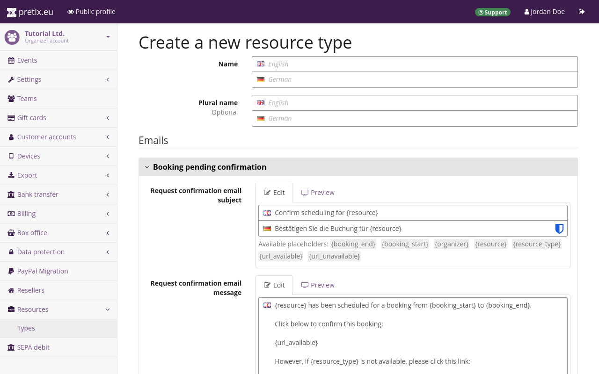
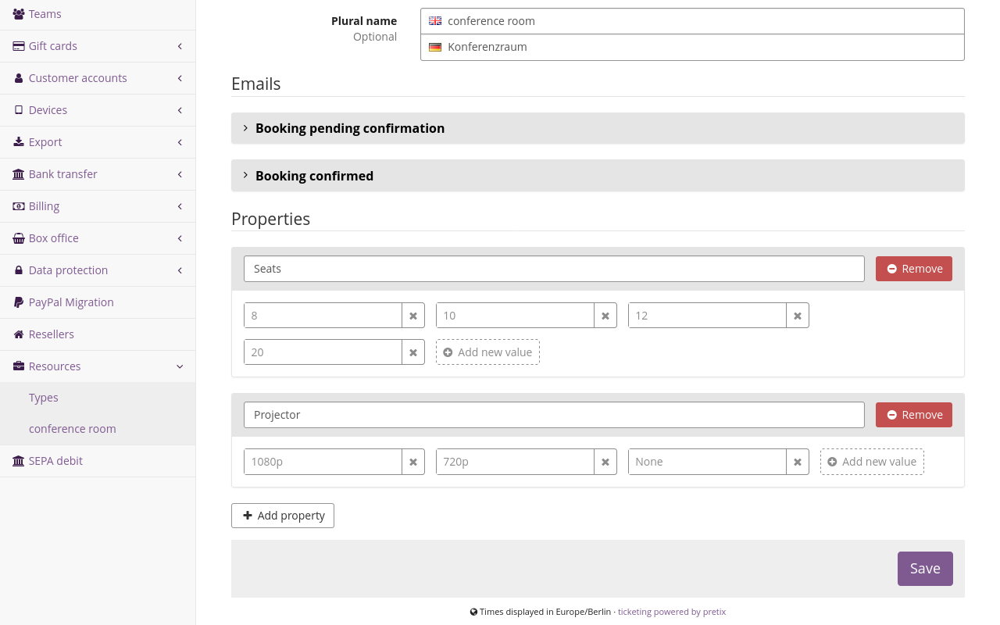
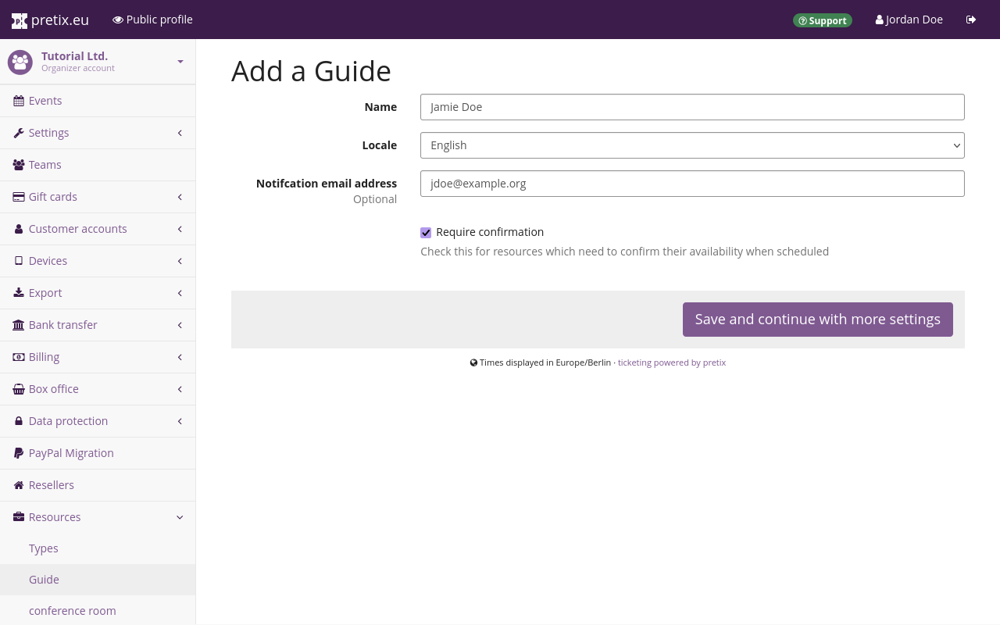
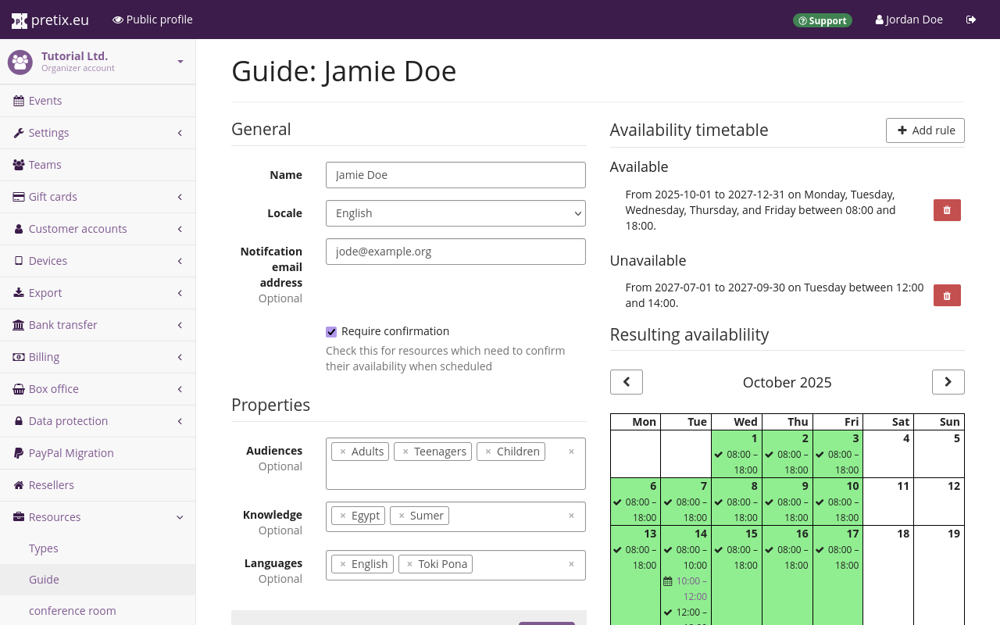

# Resources and scheduling

Your event schedule may not be based on time alone. 
It may also depend on the availability of personnel, spaces, equipment, or other resources. 
The "Resources and scheduling" plugin allows you to manage those resources and schedule dates in your [event series](event-series.md) accordingly. 
This article tells you how to use it. 

## Prerequisites

You need to have at least one event series with which you want to use resources and scheduling. 
The plugin offers no useful features for singular events. 

## How To 

Using resources and scheduling involves the following steps: 

 1. [Enabling the plugin](resources-and-scheduling.md#enabling-the-plugin) on the organizer level and event series level
 3. [Creating resource types](resources-and-scheduling.md#creating-resource-types) such as a type for all guides or and one for all rooms 
 4. [Managing properties](resources-and-scheduling.md#managing-properties) for resource types
 5. [Creating resources](resources-and-scheduling.md#creating-resource-types), for instance, individual guides or rooms 
 6. [Creating a product for scheduling](resources-and-scheduling.md#creating-a-product-for-scheduling), for instance, a guided tour ticket
 7. [Creating dates for scheduling](resources-and-scheduling.md#creating-dates-for-scheduling), for instance, guides tours 
 8. [Assigning resources to dates](resources-and-scheduling.md#assigning-resources-to-dates), for instance, assigning a guide to a tour
 9. [Confirming or denying a scheduling](resources-and-scheduling.md#confirming-or-denying-a-scheduling) depending on whether the resource is actually available at the planned time

The following sections will guide you through those steps in detail. 

### Enabling the plugin 

In order to enable the plugin for your organizer, navigate to :navpath:Your organizer → :fa3-wrench: Settings → Plugins:. 
Search the "Resources and Scheduling" plugin in the list and click the :btn:Enable: button. 
If the "Resources and Scheduling" plugin is already active, then it will have a green ":fa3-check: Active" tag next to it. 
In that case, click the :btn:Manage events: button. 

Both buttons take you to a page listing the organizer's events. 
Check every event series with which you want to use the plugin and click the :btn:Save: button. 

Alternatively, in order to enable the plugin for an individual event series, navigate to :navpath:Your event series → :fa3-wrench: Settings → Plugins:. 
Search the "Resources and Scheduling" plugin in the list and click the :btn:Enable: button. 
If the plugin is already active, then it will have a green ":fa3-check: Active" tag next to it. 

### Creating resource types

!!! Note 
    Once you have created a resource type, it is not possible to delete it. 
    You can still edit and rename the resource in order to repurpose it. 
    But deleting it from the organizer account entirely is not possible. 

Before you can create and manage individual resources, you have to create resource types. 
A resource type may, for example, represent the following: 

 - personnel such as guides, instructors, supervisors, etc. 
 - facilities such as specialized rooms, sports courts, theater halls, etc. 
 - equipment such as audio guides, film screening equipment, pedal boats, etc. 

You can use pretix to manage any kind of resource and create a resource type for it. 
You should create exactly one resource type for every type of resource that you want to manage. 

In order to create a new resource type, navigate to :navpath:Your organizer → :fa3-briefcase: Resources → Types:. 
Enter a "Name" for the resource. 

If you do not enter a "Plural name", then pretix will append an `s` to the "Name" for the plural. 
If the plural of your resource type's name is not formed by appending an `s` to the end, specify a "Plural name". 
For instance, if your resource type is named `person`, enter `people` in the "Plural name" field. 

pretix will send the email under "Booking pending confirmation" to the email address associated with the individual resource whenever you assign the resource to a date. 
pretix will send the email under "Booking confirmed" to the email address associated with the individual resource whenever the recipient confirms a booking through the previous email. 
You set the email address for each resource individually. 
See [managing individual resources](resources-and-scheduling.md#managing-individual-resources) for more information. 

Adapt the subject and message text of both emails to your liking. 
You should always include the placeholders `{url_available}` and `{url_unavailable}` in the "Booking pending confirmation" email message. 
You cannot confirm or decline a booking without these links. 
We also recommend using the other placeholders in your email message because they communicate relevant information. 

Click the :btn:Save: button. 

### Managing properties 

Most resources are not interchangeable. 
They usually have one or multiple properties which vary from one to the next and which are relevant for booking. 
You can use pretix to keep track of these properties while scheduling dates. 

In order to edit properties on a resource type, navigate to :navpath:Your organizer → :fa3-briefcase: Resources → Types:. 
Click the :btn-icon:fa3-edit:: edit button next to the resource type in the list. 
Under the headline "Properties", you can manage properties. 
Alternatively, you can add properties while creating a new resource type. 

Assume, for example, you are creating a property type for conference rooms. 
These conference rooms differ as to how many people they seat and whether or not they have a projector for presentations. 
The projectors also vary in terms of display resolution (either 1080p or 720p). 

In this case, you click the :btn-icon:fa3-plus: Add property: button. 
Under "Name", enter `Seats`. 
Under "value", enter `8`. 
Click the :btn-icon:fa3-plus: Add new value: button and enter `12` in the new field. 
Click the same button again and enter `20` in the new field. 
Your resource type "conference room" now has the "Seats" property which can be `8`, `12`, or `20`. 

Click the :btn-icon:fa3-plus: Add property: button. 
Under "Name", enter `Projector`. 
Under "value", enter `1080p`. 
Click the :btn-icon:fa3-plus: Add new value: button and enter `720p` in the new field. 
Click the same button again and enter `None` in the new field. 
Your resource type "conference room" now has the "Projector" property which can be `1080p`, `720p`, or `None`. 

If you are using the properties feature to keep track of guides, you could create properties such as language skills, expertise, or target audiences. 
Once you are happy with your choices, click the :btn:Save: button. 

In order to remove a property, click the :btn-icon:fa3-minus-circle: Remove: button next to it. 
This will display a box listing the resources that will be affected by this change. 
Removing the property will also remove that property from all affected resources, along with all defined values. 
If you are sure that you want to do this, confirm the removal by clicking :btn:Yes, remove this property:. 

### Managing individual resources 

After you have created a resource type and added properties to it, you can create individual resources. 
An individual resource may, for example, represent the following: 

 - a person who works at your venue as a guide 
 - a room 
 - a piece of equipment 

Every resource type you created in the previous step has added a new submenu under :navpath:Your organizer → :fa3-briefcase: Resources:. 
Navigate to the submenu for the resource type you created in the previous step. 
For instance, if you created a resource type named "Guide", navigate to :navpath:Your organizer → :fa3-briefcase: Resources → Guide:. 

Click the :btn-icon:fa3-plus: Add a Guide: button. 
If your resource has a different name, then the button will have a different label, too. 

If the resource you are creating represents a person, enter their name under "Name". 
Under "Locale", select the language you want to use to communicate with the person through pretix. 
Under "Notification email address", enter their email address. 
Check the "Require confirmation" field. 

If the resource represents an inanimate object, enter the room number, inventory number, or another unique identifier. 
Select the "Locale" and Notification email address corresponding to the person or team in charge of the resource. 

Once you are happy with your choices, click :btn:Save and continue with more settings:. 

Under "Properties", assign properties to the resource. 
For instance, if you are adding a guide and they speak English and Toki Pona, click the "Languages" field and select `English` and `Toki Pona`. 

Under "Availability timetable", define when the resource is available. 
Click the :btn-icon:fa3-plus: Add rule: button. 

Assume, for instance, your guide's availability is expected to stay the same July through September 2027. 
They will work Monday through Friday from 8 AM to 4 PM. 
They will not be available on Tuesday at 12 AM to 2 PM because of a weekly team meeting. 

In that case, you enter a "Start" date of `2027-07-01` and an "End" of `2027-09-30`. 
Select all days from Monday through Friday. 
Select a "Start time" of `09:00:00` and an end time of `17:00:00`. 
Click the :btn:Save: button. 

Click the :btn-icon:fa3-plus: Add rule: button again. 
Enter the same "Start" and "End" times as above. 
Check "Tuesday". 
Enter a "Start time" of `12:00:00` and an "End time" of `14:00:00`. 
Under "Available", select "Resource is unavailable". 
Click the :btn:Save: button. 

The calendar view under "Resulting availability" will now display the available times for this resource. 
Once you are happy with your configuration of the resource, click the :btn:Save: button. 

If you want to delete a resource, navigate to the submenu for the corresponding resource type. 
Click the :btn-icon:fa3-trash:: button next to the resource you want to delete. 
Alternatively, click the name of the resource and then click the :btn-icon:fa3-trash:: button in the top right corner. 

Both buttons take you to a page asking you to confirm the deletion. 
pretix will deactivate the resource, but keep records of its past usages. 

### Creating a product for scheduling 

Navigate to :Navpath:Your event series → :fa3-ticket:Products: and create or edit a personalized admission product. 
For general information on creating products, see our guide on [products](products/index.md). 
Do **not** add the product to any quotas. 
Open the :btn:Requirements: tab. 

In the "Default duration (minutes)" field, enter the time resources will typically be booked for. 
For instance, if a tour usually takes 90 minutes, enter `90`. 
This field is optional, but if you want to use the [Quick entry](resources-and-scheduling.md#quick-entry) feature, then you need to enter a number here. 

In the "Default quota size" field, enter the maximum number of people that can use the resource at the same time. 
For instance, if a tour guide can accommodate no more than 30 people at a time, enter `30`. 

If you want to assign resources to dates based on customer demand, you should check the box next to "Allow customers to book before resources are scheduled". 
If you want to assign resources to dates before selling any tickets for those dates, then you should leave it unchecked. 

Click the :btn-icon:fa3-plus: Add a new requirement: button. 
Select the "Resource type" that is necessary for this date. 
Under "Amount", specify the amount of resources that are needed, usually `1`. 

You can use the "Cost per unit" field to specify an expected cost per individual resource. 
For instance, the value in this field might represent the fee paid to the guide for each completed tour. 
pretix uses this field for data exports. 
It does not affect the price of the product. 

Under "Property values", check all values that are required for this type of date. 
For instance, assume you are offering a tour of the Ancient Egypt for English-speaking children. 
In this case, you select the "Resource type" `Guide` and the "Property values" `Children`, `Egypt`, and `English`. 

Click the :btn:Save: button. 

### Creating dates for scheduling 

Navigate to :Navpath:Your event series → :fa3-calendar:Dates: and click the :btn-icon:fa3-plus: Create many new dates: button. 
Set up the dates according to your preferences. 
For general information on creating dates, see [Creating and editing dates in the event series](event-series.md#creating-and-editing-dates-in-the-event-series). 

Under the heading "Quotas", in the field labeled "Products", select the product you created in the [previous step](resources-and-scheduling.md#creating-a-product-for-scheduling). 

We recommend only selecting one product with resource requirements. 
pretix applies resource requirements once for every product that has them. 
If your date has two products that both require a guide, then your date will require two guides for scheduling. 

If you want to sell tours and tickets as separate products, then you should add a tour product with requirements and any number of regular tickets that do not have requirements. 

### Assigning resources to dates 

In order to assign resources to dates, navigate to :navpath:Your event → :fa3-calendar: Scheduling → Dashboard:. 
Click :btn:Dates with not all resources scheduled:. 
This takes you to a page titled "Dates missing resources" which lists all dates with unfulfilled resource requirements. 
It should list all dates you created in the previous step. 

Click one of the dates. 
Under "Additional settings", you can find the "Schedule" settings. 
There is a field for every resource type that is required by one of the products assigned to this date. 
The required properties of the resource are listed below that field. 
Click the field and select the individual resource you want to assign. 

Assume, for instance, your date requires a resource of the type "Guide". 
The required properties are "Children", "Egypt", and "English". 
Click the field and select a guide that fulfills those requirements. 

Click the :btn:Save: button. 
As soon as you do this, your event's contact mail address will send an email to the resource's notification email address. 

### Confirming or denying a scheduling

Whenever a user assigns a resource to a date in pretix, the server sends an email to that resource's notification email address. 

In order to confirm scheduling, click the link that ends with `confirm`. 
This takes you to a webpage saying "Thank you for your response, the event organizer has been notified". 
The pretix server will also send an email to the resource's notification email address confirming the scheduling. 
Both the scheduling dashboard and the page for the individual date will note that the requirement for the date has been fulfilled. 

In order to decline the scheduling, click the link that ends with `deny`. 
This also takes you to a webpage saying "Thank you for your response, the event organizer has been notified". 
The pretix server will not send a confirmation email. 
The requirement for the date will remain open. 

### Quick entry 

The "Quick entry" feature allows you to find out when required resources for a product are available on a given date. 
This is useful if you are making an appointment with a group of customers, for instance when scheduling a tour. 
It is also useful if you want to create dates based on when the required resources are available. 

Navigate to :navpath:Your event → :fa3-calendar: Scheduling → Quick entry:. 
Under "Date", enter the date on which you want to search availabilities. 
Under "Products", select "All" or at least one product. 

This field only displays products with a "Default duration" as defined in the product settings, on the "Resource requirements" tab. 
See [Creating a product for scheduling](resources-and-scheduling.md#creating-a-product-for-scheduling) for information on how to add resource requirements for a product. 

Use the field "Search raster" to define the degree of precision for the search. 
Then, click the :btn:Continue: button. 

Choose a starting time for your date by selecting it under "Available times" or entering it under "Start time". 
If you selected multiple products on the previous page, use "Product" to choose a specific product. 

If check the box next to "Show publicly", then the setting "Show in lists" for this date will be activated and your shop's calendar and list views will display this date to costumers. 
Uncheck this box if you don't want the date to be visible to all visitors of your online shop. 

If you want to create an order for the date right away, check the box next to "Create order". 
Click the :btn:Continue: button. 

If you checked the box next to "Create order", then the next page allows you to enter details for that order. 
If you unchecked the box next to "Create order", then pretix will skip this page. 

Enter the "Amounts" of products to sell through that order and a price for each of the products. 
You may also enter an "Email address" to be associated with the order. 
Then, click the :btn:Continue: button. 

On the last step of the quick entry, select the resources necessary for the date. 
The required properties are listed below the field. 
Then, click the :btn:Save: button. 
If you created an order, then you will land on the page for that order. 
If you did not create an order, then you will land on the scheduling dashboard. 