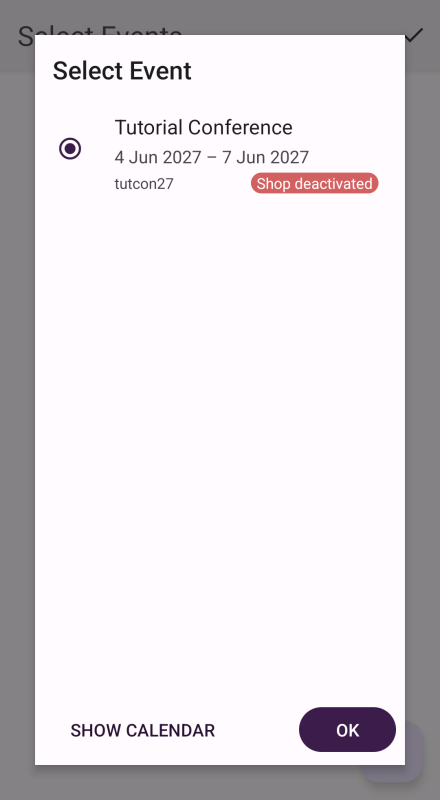

# pretixSCAN (Android)

pretixSCAN is a powerful application that helps you handle the check-in at your events. 
This article is about the Android version of pretixSCAN, which is also the most feature-rich version of the application. 
pretixSCAN is also available for Windows, Linux, and iOS. 
Those versions of the software will be documented on separate pages. 

The primary function of pretixSCAN is to validate tickets, but it also offers many other features, such as: 

 - searching for participants manually if they do not have their ticket on hand 
 - printing attendee badges
 - quickly viewing attendance statistics

This article will tell you how to install pretixSCAN for **Android** and how to make use of its features. 

pretixSCAN is not to be confused with our other apps: pretixPRINT, which takes care of the printing of tickets, badges and receipts for you; pretixPOS, which handles product sales; or pretixLEAD, which facilitates lead acquisition at your events. 

## Prerequisites

pretixSCAN is meant for use with an event hosted using pretix. 

You need to have access to a device running Android version 5 or newer. 
See our [Android version support policy](https://docs.pretix.eu/en/latest/user/android-version-support.html#pretixscan) for more information. 

You also need access to the pretix backend in order to set up pretixSCAN on your device. 

## How To

### Installation and setup 

!!! Note 
    pretixSCAN comes preinstalled on the scanner smartphones that are available for rent on our website. 
    You can skip this step if you are using devices that you rented from us. 
    For more information on our hardware offers, visit [our website](https://pretix.eu/about/en/hardware/scan). 

 

You can install pretixSCAN on your Android device [through the Google Play Store](https://play.google.com/store/apps/details?id=eu.pretix.pretixscan.droid) like any other app. 
If your device does not have access to the Google Play Store, you can download the latest version from our [pretix Marketplace](https://marketplace.pretix.eu/products/pretixscan-android/versions). 
On devices manufactured by Sunmi, you can also find the app in the Sunmi App Store. 

When you launch pretixSCAN for the first time, confirm that you understand the privacy and security implications of storing attendee data on your device. 
You have to grant pretixSCAN access to the device's camera in order to use the core functionality of validating tickets. 

pretixSCAN will start accessing the scanner or camera instantly once you have granted permission. 
It will also display a text box telling you to create a new device in our organizer account in the pretix backend. 
The next section is going to tell you how to do that. 

### Connecting the device to the pretix backend 

 

Open the [pretix backend](https://pretix.eu/control/) and navigate to :navpath:Your organizer → :fa3-mobile-phone: Devices:. 
Give the device a unique and recognizable name such as "Entrance B phone 1". 
You can authorize the device for all events or limit its access to certain events only. 
Select "pretixSCAN" from the "Security profile" dropdown menu. 

 

Once you click :btn:Save:, you will be taken to a page displaying a QR code. 
Scan the QR code with the camera or hardware scanner while on the setup screen of pretixSCAN. 

If you cannot scan the QR code, there is an alternative solution: 
Tap the three button menu in the top right corner of the pretixSCAN app and then tap "Manual setup". 
Enter the system URL and token displayed in the pretix backend below the QR code. 

 

Once you scanned the QR code or entered the token successfully, the app will ask you to select the event for which you want to scan tickets. 
Select the event in the list or in the calendar and tap :btn:OK:. 

If you want to scan tickets for multiple events at the same time, check the box next to "Expert mode". 
In most cases, scanning tickets for one event at a time is enough. 
Do not enable expert mode if you do not want to scan tickets for multiple events simultaneously. 
Then, select a check-in list and tap :btn:OK: again. 
The app will now land you on the main screen and start downloading event data from the server in the background. 

### Entry scanning

The app should now be in entry scanning mode, which is recognizable by the pictogram of a gray box with an arrow pointing to the right :fa3-sign-in: in the top right corner. 
If the pictogram is yellow and the arrow points to the left :fa3-sign-out:, that means that the app is in "exit scanning" mode. 
Switch to entry scanning by tapping the :btn-icon:fa3-ellipsis-v:: button and :btn:Switch to entry scanning: in the popup menu. 

pretixSCAN will scan any QR code or barcode it can detect via the device's camera or scanner. 
Point the device at the code you want to scan. 
The app will then check the code against the selected check-in list on the server. 
There are three possible results: 

 1. If the ticket is valid and allows entry under the current conditions, pretixSCAN displays a green box titled "Valid ticket". 
 Underneath the green box, it lists the ticket type, order number, and position number. 
 2. If the ticket is valid but has already been checked in and not checked out again, pretixSCAN displays a yellow box titled "Ticket already used". 
 Underneath the yellow box, it lists the ticket type, order number, and position number, and also the date and time when the ticket was first scanned. 
 3. In all other cases, pretixSCAN displays a red box with a title explaining the problem. 
 Explanations can include, among others, "Invalid ticket", "Order canceled", or "Entry not allowed". 

 

If none of these things happen, then the code has not been scanned. 
Try adjusting the angle and distance between scanner and ticket or improving ambient lighting. 
You can turn the device's flashlight and automatic focus on or off with the buttons at the bottom of the screen. 
If you have trouble scanning a code from a mobile phone screen, ask the customer to increase screen brightness to maximum. 

### Searching for attendee data 

An alternative to scanning a ticket code is searching for an attendee in pretixSCAN. 
If an attendee arrives at the check-in without a ticket, but claiming that they have bought one, you can search for their data. 
Tap the :btn-icon::fa3-search:: button at the top of the screen. 
In the search field, enter the attendee's name, order code, ticket secret, or email address. 
Tap the matching result in the list. 

The app will now check the validity of the ticket and return the same results as if the ticket was being scanned. 

### Enabling badge printing 

Badge printing only works if the "Badges" plugin has been enabled for the current event and the ticket you are scanning has a badge layout selected. 
In order to enable badge printing in pretixSCAN, you have to first install our additional app pretixPRINT on the same device and configure a connection to a printer. 

Once you have done that, open pretixSCAN, tap the :btn-icon:fa3-ellipsis-h:: button in the top right corner, and then tap :btn:Settings:. 
Scroll down to the section titled "Badges" and check the box next to "Enable badge printing". 

From now on, a :btn-icon:fa3-print:: button will be displayed in the top right corner of the box that pops up whenever you scan a ticket. 
You can manually print a badge for the ticket holder by tapping the :btn-icon:fa3-print:: button. 
A push notification will pop up while the print job is being sent. 

If you want to automatically print a badge for every ticket you scan, go back to the settings page, tap "Print badges automatically" and select "Always". 
The :btn-icon:fa3-print:: button will still be displayed, allowing you to manually print an extra badge. 

If you want all badges to be printed twice, go to the settings page and check the box next to "Print every badge twice". 

### Locking the settings 

pretixSCAN offers you the option to lock settings behind a PIN. 
This can be useful if you want to prevent the people operating the check-in from changing any of the settings. 

Open pretixSCAN, tap the :btn-icon:fa3-ellipsis-h:: button in the top right corner and then tap :btn:Settings:. 
Scroll to the "User interface" subheading and tap "PIN protection". 
Then, tap on "Set PIN", enter a PIN, and note the PIN down in a safe place or save it in a password manager. 
As soon as you check the box next to "Enable PIN protection", the settings will be locked by PIN. 

This means that the next time you return to the home screen and attempt to open the settings, you will be prompted to enter the PIN. 
You also have the option to protect the other functions of the app with the same PIN: statistics, switching between events, as well as switching between entrance and exit scanning mode. 

!!! Warning
    The PIN settings page also has the option to turn on kiosk mode. 
    Kiosk mode fundamentally limits the functionality of the app. 
    There are only two ways to leave kiosk mode: scanning a QR code of the PIN, or performing a hard reset of the pretixSCAN app. 

    Do not turn on kiosk mode unless you are planning to use the device in a self-serve setup with customers scanning their own tickets. 
    Do not turn on kiosk mode before you have decided on a PIN, generated a QR code for it and stored it in a safe place. 

### Offline scanning 

The default scanning behavior of pretixSCAN requires a reliable network connection. 
Every code scanned is compared against the selected check-in list that is stored on the pretix server. 
If you are using pretixSCAN in an environment with an unreliable network connection or no connection at all, you may run into error messages while attempting to scan a code or search for attendee data. 
The solution for this problem is pretixSCAN's offline mode. 

In offline mode, the app will verify data against its internal database instead of the database on the server. 
It will still occasionally attempt to synchronize its own internal data with the server. 
You can scan codes and search for attendee data without encountering errors despite the lack of a network connection. 

Installing the app, connecting it to the backend and synchronizing data between the device and the server at least once still requires a working connection to the internet. 
Do these steps ahead of time in a setting where you do have a reliable connection if you are planning to use pretixSCAN in offline mode. 

!!! Warning 
    If you are using offline scanning with more than one device, then a single ticket can potentially be used for entry more than once. 
    As soon as the device that has scanned the ticket performs a successful synchronization, and then the other devices also perform a successful synchronization, the ticket will be recognized as "Ticket already used". 

If you want to enable offline mode, open pretixSCAN, tap the :btn-icon:fa3-ellipsis-h:: button in the top right corner and then tap :btn:Settings:. 
Then check the box next to "Offline scanning". 
Make sure that the settings "Automatic Synchronization" and "Download orders" are also both checked. 

If the network connection at your check-in is present, but unstable, you can leave "Offline scanning" unchecked and instead tap the setting "Automatically turn offline mode on and off". 
By default, "Manual mode (off)" is selected, which means that offline scanning will not be enabled or disabled automatically. 

If you select, for example, "3 seconds or errors", pretixSCAN will enable offline scanning after unsuccessfully attempting to verify a code for 3 seconds; after encountering 3 errors while attempting to verify a code; or after detecting a loss of connection while attempting to verify a code. 

If you select "Only errors or connection loss", then pretixSCAN will enable offline scanning after encountering an error or detecting a loss of connection while attempting to verify a code. 

!!! Note 
    While you are using pretixSCAN in offline mode, tickets ordered while your shop is in test mode will not be recognized as valid and will also not show up in the search. 

## Further Information

 - [pretixSCAN repository on GitHub](https://github.com/pretix/pretixscan-android)
 - [Kurzanleitung pretixSCAN on Youtube (German)](https://www.youtube.com/watch?v=csy017Dm6vA)