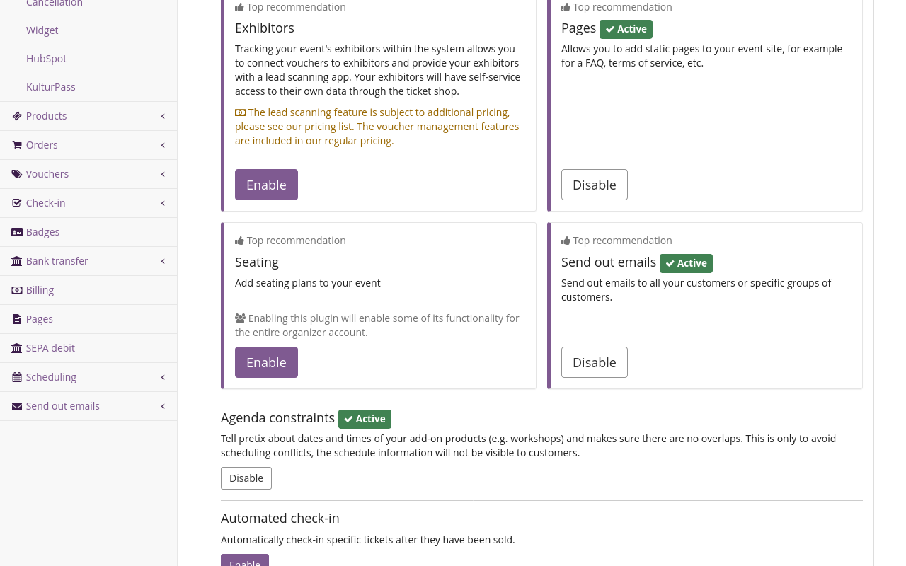
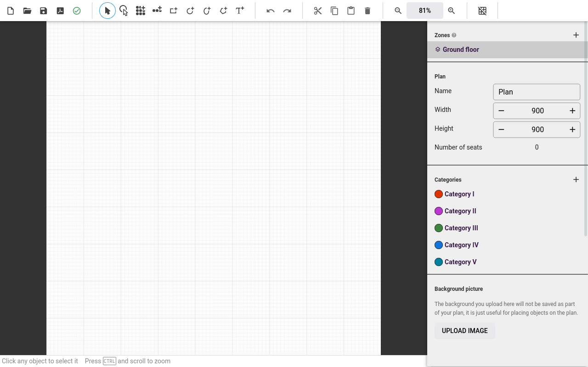
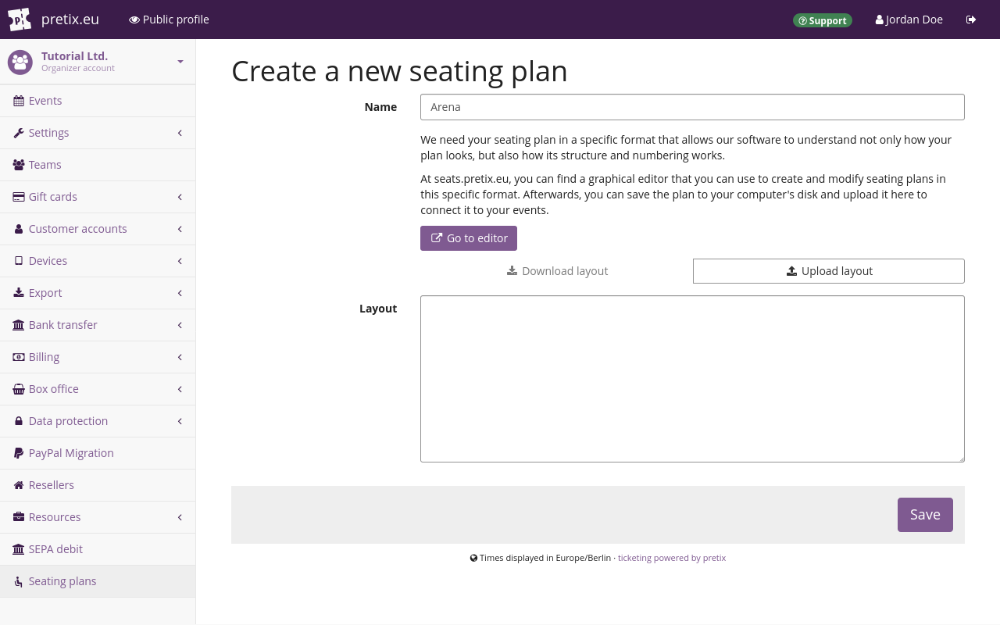
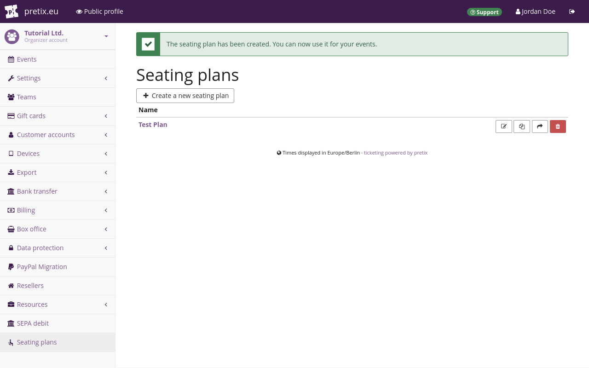

# Seating

This article tells you how to use the seating feature of pretix. 
This feature allows you to create seating plans. 
You can then use those seating plans to sell tickets for individual seats. 
This is useful if, for example, your event is taking place at a theater, a stadium, or a dining hall. 
Your customers will be able to look at the seating plan and choose their preferred seat. 

The usefulness of the seating feature is not limited to seats. 
You can also use it to sell or assign booths at a trade fair, tables in a reading room, or spots in a parking lot. 
Seating plans can represent any space with a fixed layout and a limited number of usable spots. 

## Prerequisites

Many aspects of seating are handled on the event level, so you need to create an event first. 

## How to

If you want to sell tickets based on individual seats for your event, you need to take the following steps: 

 - [Enabling the plugin](#enabling-the-plugin) 
 - Using the seating plan editor to [create a layout](#creating-a-layout)
 - [Creating an entry for the seating plan](#creating-an-entry-for-a-seating-plan) in your organizer account
 - [Creating products for seating](#creating-products-for-seating)
 - [Assigning your seating plan to your event](#assigning-a-seating-plan-to-an-event)

The following sections will guide you through those steps in detail. 

### Enabling the plugin

In order to enable the "Seating" plugin for your event, navigate to :navpath:Your organizer → :fa3-wrench: Settings → Plugins: and open the :btn:Features: tab. 
The Seating plugin is included as a "Top recommendation" at the top of the page. 
Click the :btn:Enable: button next to it. 

Check the events for which you want to use seating plans in the list labeled "Events with active plugin". 
Now that you have enabled the seating plugin, all settings associated with seating are available for your organizer. 

### Creating a layout

The central component of any seating plan is the JSON file defining the layout. 
In order to create a new layout, open the editor at [https://seats.pretix.eu/](https://seats.pretix.eu/). 
You can use this editor without being logged in to a pretix account. 

Alternatively, navigate to :navpath:Your organizer → :i-seat: Seating plans: and click the :btn-icon:fa3-plus: Create a new seating plan: button. 
On the next page, click the :btn-icon:fa3-external-link: Go to editor: button. 
This also takes you to [https://seats.pretix.eu/](https://seats.pretix.eu/). 

If you have an **image** file containing a plan of your venue, that image can be helpful for creating the layout. 
If you want to use such an image as the background for your layout, set the "Width" and "Height" of the layout to the resolution of the image. 
Then, click the :btn:UPLOAD IMAGE: button and select the file. 

If your venue has more than one floor or seating block, then you should create a corresponding number of **zones** in the layout. 
If your venue has seat and row numbers that occur more than once, and you want to depict those numbers in the layout, then you have place the seats in separate zones. 
In order to create a new zone, click the :fa3-plus: button next to "Zones" in the sidebar and enter a name. 

!!! Note
    Select your preferred zone before creating any seats, rows, or other elements. 
    Once you have created an element in one zone, you cannot move it to a different zone. 

In order to **zoom** in and out of the layout, hold the `Ctrl` key and move your mouse wheel. 
Alternatively, you can use the buttons :btn-icon:fa3-search-minus:: and :btn-icon:fa3-search-plus:: in the top bar. 

In order to **move the view** around, hold the `Ctrl` key, click the layout, and move your mouse. 

In order to **edit** an existing element, click the :btn-icon:fa3-mouse-pointer:: "select rows or shapes button" in the top bar. 
If you want to select individual seats, click the :btn-icon:i-tool-seatselect:: "select seats" button instead. 
Click the element. 
If you want to select multiple elements, hold the `Shift` key while clicking them. 
Alternatively, hold the left mouse button and move the mouse to draw a selection rectangle around them. 

In order to **move** selected elements, drag and drop them with the mouse or use the arrow keys. 
Use the `Shift` key for larger movements and the `Alt` key for smaller movements. 
If you want to align elements to the grid, hold the `Ctrl` key while moving them. 

The editor will **validate** your layout. 
It will warn you if there are duplicate seat numbers or row numbers. 
Numbers are counted for each zone independently. 
This means that the same row and seat number can occur once on each zone. 
You can still assign different row and seat numbers to minimize confusion. 

**Copying rows** may create duplicate seat numbers. 
Change the row number of the row you copied to an number that is not yet in use on the plan. 
Then, activate the "Reversed" toggle and deactivate it again. 
This refreshes seat numbers so that there will be no more duplicates in that row. 

In order to **save** the layout, click the :btn-icon:fa3-save:: save button in the top left. 
This opens a dialog allowing you to save the resulting JSON file on your computer. 

### Creating an entry for a seating plan

Seating plans are handled on the organizer level. 
This allows you to use seating plans for multiple events hosted by the same organizer. 

After you have [created a layout](#creating-a-layout) in the form of a JSON file, you create a corresponding entry for a seating plan in your organizer account. 
In order to do so, navigate to :navpath:Your organizer → :i-seat: Seating plans: and click the :btn-icon:fa3-plus: Create a new seating plan: button. 

On the next page, click the :btn-icon:fa3-upload: Upload layout: button. 
Select the JSON file you created and downloaded in the [previous step](#creating-a-layout). 
This fills the "Layout" field with the contents of the file. 

Enter a name for the seating plan in the "Name" field and click the :btn:Save: button. 
You will land on a page titled "Seating plans", displaying a button for creating another new seating plan, and a list including the plan you just created. 

### Creating products for seating

Selling products via a seating plan has implications for the configuration of products in your shop. 
For general information on creating products, refer to our guide on [products](products/index.md). 

It is not possible to offer multiple different products to a single seat category. 
But it is possible to offer multiple product variations. 
If you want to offer more than one type of product per seat, then you have to create a product with multiple variations. 
Assign that product to the corresponding seat category. 

You can offer both seating products and other products in your shop. 
Your shop will display the seating plan at the top, and the list of other products available for purchase below. 
This is useful if, for instance, you are offering tickets for a standing area at your venue. 
It is also useful if you are offering any type of non-admission product such as catering or merchandise. 

### Assigning a seating plan to an event

In order to assign a seating plan to an event, navigate to :navpath:Your event → :fa3-wrench: Settings → Seating plans:. 
Click the field labeled "Seating plan". 
Select the seating plan from the list. 

Assign products to the seating categories. 
All products that you assign to seating categories are available through the seating plan displayed at the top of your shop page. 
They do not appear in the list below and can only be selected through the seating plan. 
Products that you do not assign to seating categories will be listed below the seating plan. 

If you want your customers to be able to select their own seats, check the box next to "Customers can choose their own seats". 

If you want to assign seats to customers, uncheck the box next to "Customers can choose their own seats". 
You will need to manually assign seats to customers before the event. 
Customers will not know their seat after their purchase and it might not be written on their ticket? 

Click the :btn:Save: button. 
As soon as you have assigned a seating plan to an event, it becomes impossible to change that seating plan under that name. 
You can still edit the plan and create a new entry for the updated version. 

Alternatively, if your seating plan is only assigned to this event, you can delete your selection from the field labeled "Seating plan" and click the :btn:Save: button again. 
This makes it possible to edit the seating plan and assign it to this event afterwards. 

## Further information

[pretix-Tutorial: Saalplan-Editor](https://www.youtube.com/watch?v=3KRhHa58tBo) on YouTube (German)