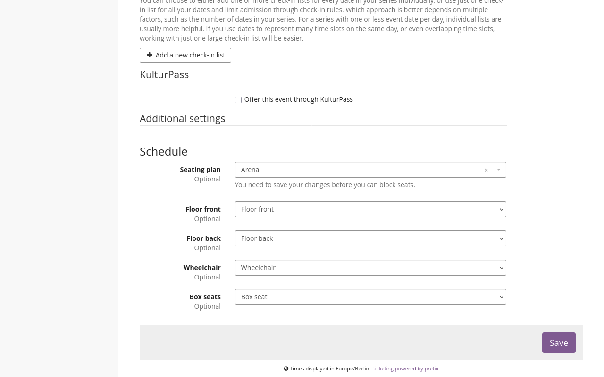
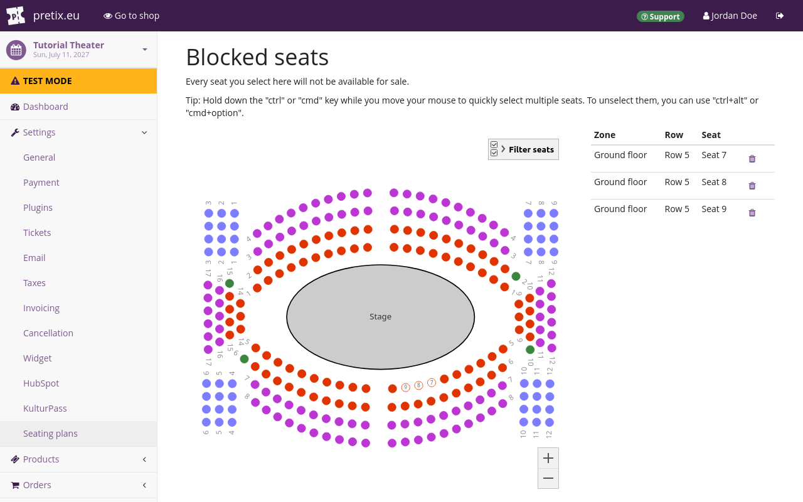

# Seating

<!-- md:hosted -->
<!-- md:enterprise -->

This article tells you how to use the seating feature of pretix. 
This feature allows you to create seating plans. 
You can then use those seating plans to sell tickets for individual seats. 
This is useful if, for example, your event is taking place at a theater, a stadium, or a dining hall. 
Your customers will be able to look at the seating plan and choose their preferred seat. 

The usefulness of the seating feature is not limited to seats. 
You can also use it to sell or assign, for instance, tables in a reading room or spots in a parking lot. 
Seating plans can represent any space with a fixed layout and a limited number of usable spots. 

The seating feature is available on pretix Hosted and on pretix Enterprise. 
It is not available on pretix Community. 

## Prerequisites

Many aspects of seating are handled on the event level, so you need to create an event first. 

## General usage

If you want to sell tickets based on individual seats for your event, you need to take the following steps: 

 - [Enabling the plugin](#enabling-the-plugin) 
 - Using the seating plan editor to [create a layout](#creating-a-layout) which the editor will then [validate](#validating-the-layout)
 - [Creating an entry for the seating plan](#creating-an-entry-for-a-seating-plan) in your organizer account
 - [Creating products for seating](#creating-products-for-seating)
 - [Assigning your seating plan to your event](#assigning-a-seating-plan-to-a-single-event) or your [event series](#assigning-a-seating-plan-to-a-date-in-an-event-series)
 - [Configuring seating plan behavior](#configuring-seating-plan-behavior)

The following sections will guide you through those steps in detail. 

### Enabling the plugin

In order to enable the "Seating" plugin for your event, navigate to :navpath:Your organizer → :fa3-wrench: Settings → Plugins: and open the :btn:Features: tab. 
This page includes the Seating plugin as a "Top recommendation" at the top. 
Click the :btn:Enable: button next to it. 

Check the events for which you want to use seating plans in the list labeled "Events with active plugin". 
Now that you have enabled the seating plugin, all settings associated with seating are available for your organizer. 

### Creating a layout

The central component of any seating plan is the JSON file defining the layout. 
In order to create a new layout, open the editor at [https://seats.pretix.eu/](https://seats.pretix.eu/). 
You can use this editor without being logged in to a pretix account. 

Alternatively, navigate to :navpath:Your organizer → :i-seat: Seating plans: and click the :btn-icon:fa3-plus: Create a new seating plan: button. 
On the next page, click the :btn-icon:fa3-external-link: Go to editor: button. 
This also takes you to [https://seats.pretix.eu/](https://seats.pretix.eu/). 

If you have an **image** file containing a plan of your venue, that image can be helpful while creating the layout. 
If you want to use such an image as guidance during layout creation, click the :btn:UPLOAD IMAGE: button and select the file. 
The layout editor will not save the image you upload here as part of your layout. 
It merely serves as a useful template for placing seats and other objects on the layout. 

If you have uploaded an image, then it makes sense to adapt the **width** and **height** to the dimensions of that image. 
If not, you can create seats and other objects first, and adapt width and height of the layout to fit those elements comfortably. 

If your venue has more than one floor or seating block, then you should create a corresponding number of **zones** in the layout. 
If your venue has seat and row numbers that occur more than once, and you want the layout to reflect those exact numbers, then you have place the seats in separate zones. 
In order to create a new zone, click the :fa3-plus: button next to "Zones" in the sidebar and enter a name. 

pretix maps products to seats depending on the **seat category**. 
If you want to sell only one product for all seats on your plan, then you only need one seat category. 
If you want to sell different products for different seats, then you need one seat category per product. 

Create a seat category by clicking the :btn-icon:fa3-plus:: button next to the headline "Categories" in the sidebar. 
Enter a name and select a color for the seat category. 
You can remove a seat category by clicking the :btn-icon:fa3-trash:: button next to it. 
Change the name and color by clicking the :fa3-pencil:: button. 

!!! Note 
    If you are using a Mac computer, you can use the `⌘` key aka `Command` key in place of the `Ctrl` key. 
    The `Ctrl` key also works. 

In order to **zoom** in and out of the layout, hold the `Ctrl` key and move your mouse wheel. 
Alternatively, you can use the buttons :btn-icon:fa3-search-minus:: and :btn-icon:fa3-search-plus:: in the top bar. 

In order to **move the view** around, hold the `Ctrl` key, click the layout, hold the mouse key, and move your mouse. 

In order to **select** existing elements, click the :btn-icon:fa3-mouse-pointer:: "select rows or shapes" button in the top bar. 
If you want to select only a single seat, click the :btn-icon:i-tool-seatselect:: "select seats" button instead. 
Click the element. 
You can also select a single seat by clicking the :btn-icon:fa3-mouse-pointer:: "select rows or shapes" button and then double-clicking the seat. 

!!! Note 
    Ideally, the radius of seats in your plan should not deviate too far from the default value of 10. 
    Creating much smaller seats may result in them being difficult to select. 
    Creating much larger seats may result in text labels being too difficult to read. 

If you want to select multiple elements, hold the `Shift` key while clicking them. 
Alternatively, hold the left mouse button and move the mouse to draw a selection rectangle around them. 
Use the sidebar on the right to edit the properties of all elements in your selection. 

In order to **move** selected elements, drag and drop them with your mouse. 
If you want to keep the movement aligned to the grid, hold the `Shift` button while you are moving them. 
Alternatively, you can use the arrow keys. 
Hold the `Shift` key for larger movements and the `Alt` key for smaller movements. 

If you want to move selected elements to a **different zone**, click the :btn-icon:fa3-cut:: "cut" button. 
Alternatively, press `Ctrl`+`X`. 
Select the zone to which you want to move the elements. 
Click the :btn-icon:fa3-paste:: "paste" button. 
Alternatively, press `Ctrl`+`V`. 

In order to **save** the layout, click the :btn-icon:fa3-save:: "save" button in the top left. 
This opens a dialog allowing you to save the resulting JSON file on your computer. 
If clicking the :btn-icon:fa3-save:: "save" button instead opens a notification stating that your plan contains validation errors, see [Validating the layout](#validating-the-layout). 

### Validating the layout

The editor will **validate** your layout. 
If the validation succeeds, then the "Validation" symbol in the top bar will be a green checkmark :btn-icon:fa3-check-circle-o::. 
If validation fails, then the symbol will be a red exclamation mark :btn-icon:fa3-exclamation-circle:: instead. 
Clicking the :btn-icon:fa3-save:: "Save" button while validation is failing results in your browser displaying a warning popup. 
You can still download the faulty plan by clicking the :btn:OK: button in that warning popup. 

One possible cause for a failed validation are **duplicate** combinations of zone, row number, and seat numbers. 
Each unique combination may only occur once. 
Another possible cause are duplicate seat IDs. 

Seat IDs can be one of three things: 

 1. a [UUID](https://en.wikipedia.org/wiki/Universally_unique_identifier) consisting of letters, numbers, and dashes
 2. a string containing the zone, row number, and seat number, joined with dashes. 
 3. a custom string defined by you

The editor will assign seats the first option (UUID) during creation if you do not change any of the defaults (row or seat number). 
If you change seat or row number, or if you use the "Reversed" toggle, the editor will assign the second option (zone, row number, and seat number, joined with dashes) as the seat ID. 
You can edit the seat ID by selecting a single seat and editing the string in the "Seat ID" field. 

**Copying rows** creates duplicate seat IDs as well as combination of zone, row number, and seat number. 
Change the row number of the row you copied to an number that is not yet in use on the plan. 
Then, activate the "Reversed" toggle and deactivate it again. 
This refreshes seat IDs so that there will be no more duplicates in that row. 

!!! Note 
    Activating or deactivating the "Reversed" toggle on a row replaces all seat IDs in that row with a string containing the zone, row number, and seat number, joined with dashes. 
    This is also true for any custom seat IDs that you entered manually. 

In order to **save** the layout, click the :btn-icon:fa3-save:: save button in the top left. 
This opens a dialog allowing you to save the resulting JSON file on your computer. 

### Creating an entry for a seating plan

Seating plans are handled on the organizer level. 
This allows you to use seating plans for multiple events hosted by the same organizer. 

After you have [created a layout](#creating-a-layout) in the form of a JSON file, you create a corresponding entry for a seating plan in your organizer account. 
In order to do so, navigate to :navpath:Your organizer → :i-seat: Seating plans: and click the :btn-icon:fa3-plus: Create a new seating plan: button. 

On the next page, click the :btn-icon:fa3-upload: Upload layout: button. 
Select the JSON file you created and downloaded in the [previous step](#creating-a-layout). 
This fills the "Layout" field with the contents of the file. 

Enter a name for the seating plan in the "Name" field and click the :btn:Save: button. 
You will land on a page titled "Seating plans", displaying a button for creating another new seating plan, and a list including the plan you created. 

### Creating products for seating

Selling products via a seating plan has implications for the configuration of products in your shop. 
For general information on creating products, refer to our guide on [products](products/index.md). 

It is not possible to offer multiple different products to a single seat category. 
You can use a product with multiple product variations instead. 
If you want to offer more than one type of product per seat, then you have to create a product with multiple variations. 
Assign that product to the corresponding seat category. 

Create one quota for each seat category you offer in your seating plan. 
Set the "total capacity" of the quota to the number of seats in the seat category. 
For instance, if your seating plan has 48 seats in the seat category "Box seats", create a quota with a total capacity of 48. 
Add the product that you assigned to the "Box seats" seat category to that quota. 

Both the number of seats on the plan and the total capacity of the quota limit the number of purchases possible. 
If the quota runs out, then customers will not be able to select a seat in the corresponding seat category. 
If you sell all seats in the seat category, then customers will also not be able to buy a ticket for that seat category. 

The "waiting list" feature only works as expected if the total capacity of the quota and the number of seats in the corresponding seat category are equal. 

You can offer both seating products and other products in your shop. 
Your shop will display the seating plan at the top, and the list of other products available for purchase below. 
This is useful if, for instance, you are offering tickets for a standing area at your venue. 
It is also useful if you are offering any type of non-admission product such as catering or merchandise. 

### Assigning a seating plan to a single event

In order to assign a seating plan to an event, navigate to :navpath:Your event → :fa3-wrench: Settings → Seating plans:. 
Click the field labeled "Seating plan". 
Select the seating plan from the list. 

Assign products to the seating categories. 
All products that you assign to seating categories are available through the seating plan displayed at the top of your shop page. 
They do not appear in the list below. 
Customers will only be able to select them through the seating plan. 
The shop will list products that you do not assign to seating categories below the seating plan. 

Once you are happy with your choices, click the :btn:Save: button. 

### Assigning a seating plan to a date in an event series 

If you are using seating plans for your [event series](event-series.md), you do not have to use the same seating plan for the entire series. 
You can assign seating plans for each date individually. 
In order to do so, navigate to :navpath:Your event → :fa3-calendar: Dates:. 
Create or edit the dates to which you want to assign your seating plan. 

Scroll to the "Additional settings" subheading. 
Click the field labeled "Seating plan". 
Select the seating plan from the list. 

Assign products to the seating categories. 

Customers visiting your online shop will first select their preferred date from the calendar or list. 
Once they have selected a date, they will then select their preferred products from the seating plan and list. 

All products that you assign to seating categories are available through the seating plan displayed at the top of your shop page. 
They do not appear in the list below. 
Customers will only be able to select them through the seating plan. 
The shop will list products that you do not assign to seating categories below the seating plan. 

Once you are happy with your choices, click the :btn:Save: button. 

### Configuring seating plan behavior

In order to configure seating plan behavior for your singular event or event series, navigate to :navpath:Your event → :fa3-wrench: Settings → Seating plans:. 
If you want your customers to be able to select their own seats, check the box next to "Customers can choose their own seats". 

If you want to assign seats to customers, uncheck the box next to "Customers can choose their own seats". 
You will need to manually assign seats to customers before the event. 
You should take care of this manual assignment before issuing tickets to your customers. 
Otherwise, pretix cannot include the seat information on the ticket. 

Click the :btn:Save: button. 

## Advanced usage 

The following sections describe use cases that go beyond the basic setup process for seating plans. 

### Blocking seats 

You can disable sales for a certain selection of seats. 
In order to do so for a single event, navigate to :navpath:Your event → :fa3-wrench: Settings → Seating plans:. 
In order to do the same for a date in an event series, navigate to :navpath:Your event → :fa3-calendar: Dates: and select the date in question. 
The process is the same from here on out. 

Click the :btn:Change blocked seats: button. 
This takes you to a page titled "Blocked seats". 

!!! Note 
    If you are using a Mac computer, use the `⌘` key aka `Command` key in place of the `Ctrl` key. 

Click the seats on your seating plan that you want to block from sale. 
If you want to select multiple seats, hold the `Ctrl` key and the left mouse button to draw a rectangle around those seats. 

If you want blocked seats to be available again, click them again. 
If you want to make multiple seats available again, hold the `Ctrl` and `Alt` keys and the left mouse button to draw a rectangle around those seats. 
Once you are happy with your choices, click the :btn:Save: button. 

### Restricting availability

If you want to make a selection of seats only available to a specific group of people, then you can use one of two methods: 

 1. Configuring a product for restricted audience and assigning the seats to a corresponding category. 
 You should generally use this method because it is more flexible. 
 2. Blocking seats and allowing a certain sales channel to bypass the block. 
 This method is useful if you want to be able to still sell blocked seats manually. 
 It is also useful if you want to entrust this decision to the personell operating a specific sales channel, for example the POS at your event, or a reseller. 

For the **first method**, create a seat category. 
Assign the seats you want to reserve for the restricted audience to it. 
Create a product that you set up for a restricted audience with one of the methods described in [Products/Restricted audience](products/restricted-audience.md). 

Assign that product to the seat category as described in [Assigning a seating plan to a single event](#assigning-a-seating-plan-to-a-single-event) or [Assigning a seating plan to a date in an event series](#assigning-a-seating-plan-to-a-date-in-an-event-series). 

For the **second method**, block the seats for which you want to restrict availability as described under [Blocking seats](#blocking-seats). 
Then, navigate to :navpath:Your event → :fa3-wrench: Settings → Seating plans:. 
Under "Allow to buy blocked seats on these channels", select the sales channel for through you want those blocked seats to still be available. 

### Making changes to a seating plan that is already in use 

As soon as you have assigned a seating plan to an event or date, it becomes impossible to change that seating plan under the same name. 
But there are two methods for still making changes to the plan. 

 1. Removing the selection of the plan, editing it, and selecting it for the event or date again
 2. Migrating your existing plan to a new plan

The **first method** only works if your seating plan is only assigned to a single event or date, and if you have not sold any products for the seats on it yet. 
In order to remove the selection of your seating plan for a single event, navigate to :navpath:Your event → :fa3-wrench: Settings → Seating plans:. 
In order to do the same for a date in an event series, navigate to :navpath:Your event → :fa3-calendar: Dates: and select the date in question. 
The process is the same from here on out. 

Delete your selection from the field labeled "Seating plan" and save your changes. 
This makes it possible to edit the seating plan and assign it to this event or date once more. 
You will have to map categories to products again. 

The **second method** uses the migration feature. 
You should use this if your seating plan is assigned to multiple events or dates, or if you have already sold products for the seats on it. 
Even if you are just making a small change, it is still necessary to migrate to a new plan. 

Edit the layout as needed. 
For every seat in your previous layout that you have already sold or created a voucher for, your new layout must contain a seat with the same seat ID. 
Save the layout and create a new entry for the seating plan in your organizer account. 

In order to migrate from the previous seating plan to the new, navigate to :navpath:Your organizer → :i-seat: Seating plans:. 
Search for the seating plan from which you want to migrate in the list. 
Click the :btn-icon:fa3-share:: "Migrate to new plan" button next to it. 

On the next page, select all events or dates for which you want to migrate the seating plan. 
Under "New seating plan", select the plan to which you want to migrate. 
Click the :btn:Save: button. 

pretix will check whether all seats that you already sold are present in the new plan. 
It will also check whether all seats that are in use in a voucher are present. 
The identifying factor is the seat ID. 
If the new plan fails to fulfill these two requirements, then the migration will fail. 
The page will display an error message. 

If the new plan fulfills both requirements, then the migration will be successful. 

## Further information

[pretix-Tutorial: Saalplan-Editor](https://www.youtube.com/watch?v=3KRhHa58tBo) on YouTube (German)