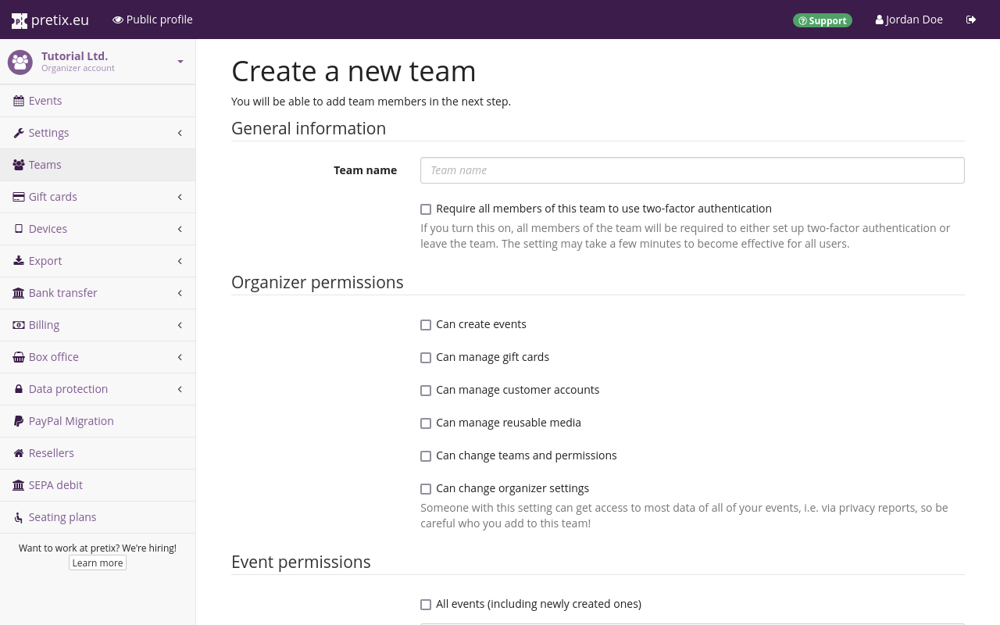
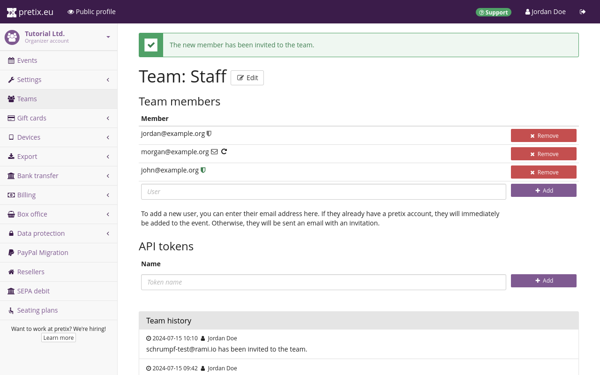

# Teams

You do not have to manage your events all by yourself. 
pretix allows you to invite colleagues, organize them into multiple teams, and grant or revoke their access settings and events. 
This article tells you how to use the "Teams" settings page, [create teams](teams.md#creating-a-new-team), [send out team invitations](teams.md#inviting-someone-to-your-team), [accept an such an invitation](teams.md#accepting-an-invitation-to-a-team), and [enable two-factor authentication](teams.md#two-factor-authentication-2fa). 

## Prerequisites

Creating teams and managing permissions for them requires administrator access to an organizer account. 
If you do not have access to an organizer account at all, then you are probably looking for the subsection on how to [accept an invitation to a team](teams.md#accepting-an-invitation-to-a-team). 

## How to

 

Navigate to :navpath:Your organizer →  :fa3-users: Teams:. 
This page will list all teams that are associated with your organizer account. 
If you have not made any changes here, the list will contain a single entry named "Administrators" which contains you and has all possible permissions. 
You can view the list of members and API tokens of a team by clicking the :btn-icon:fa3-list:: button next to it. 
You can view the settings and permissions by clicking the :btn-icon:fa3-edit:: button. 

### Creating a new team

 

Having navigated to :navpath:Your organizer → :fa3-users: Teams:, click the :btn-icon:fa3-plus: Create a new team: button in order to create a new team.

What you name your new team and which permissions you grant it is up to you. 
For example, you could name your team "Staff" to distinguish it from the administrators and give it the following organizer permissions: 
"Can create events", "Can manage gift cards", and "Can manage customer accounts". 

You could give the team access to "All events (including newly created ones)" and grant it the following event permissions: 
"Can change event settings", "Can change product settings", "Can view orders", "Can change orders", "Can view vouchers", and "Can change vouchers". 

The option "Can change organizer settings" applies to all settings which are nested under :navpath:Your organizer: and which are not controlled by any of the other options on this page. 
If the URL of the settings page for which you want to grant or revoke permissions includes `/control/organizer/`, then it is controlled by this option. 
Again, this only applies to settings which are not controlled by any of the other checkboxes under "Organizer permissions". 

The option "Can change event settings" applies to all settings which are nested under :navpath:Your event: and which are not controlled by any of the other options on this page. 
If the URL of the settings page for which you want to grant or revoke permissions includes `/control/event/`, then it is controlled by this option. 
Again, this only applies to settings which are not controlled by any of the other checkboxes under "Event permissions". 
It also applies only to events you checked under "Limit to events", or to all events if you checked "All events (including newly created ones)". 

If you need to grant different permissions for other events, you need to create an additional team and use it to grant permissions for the other event. 

Again, the name and exact permissions you grant depend on your individual use case. 
You can always change these settings later, but you can prevent future problems and confusion by finalizing these choices before inviting anyone to the team. 
Clicking the :btn:Save: button creates the team and takes you to an overview of its members. 

### Inviting someone to your team

 

Navigate to :navpath:Your organizer → :fa3-users: Teams: and select the team for which you want to send out an invitation. 
You can invite someone to your team by entering their email address into the field at the bottom of the list of team members and clicking the :btn-icon:fa3-plus: Add: button. 
If the person you added already has a pretix account using that same email address, they will be granted access to this organizer account instantly. 
They will not be notified by the system, so you should let them know that they have been granted access. 
The person will appear in the list with either a gray or a green :fa3-shield: symbol next to them, indicating whether or not they have enabled [two-factor authentication](teams.md#two-factor-authentication-2fa). 

If the person you added does not yet have a pretix account, they will receive an email invitation to create one. 
They will appear in the list with a :fa3-envelope-o: symbol for their status as "invited, pending response" and a :btn-icon:fa3-rotate-right:: button for resending the invitation email. 

!!! Note 
    This page also lets you add an API token that will grant access to the pretix API using the same level of permissions as the team members. 
    For more information on API tokens, see our [API documentation](https://docs.pretix.eu/en/latest/api/tokenauth.html). 

### Accepting an invitation to a team

 

If you have been invited to a team and you do not have a personal pretix account yet, you will receive an email that looks similar to the one in the screenshot above. 
Clicking the link in that email takes you to a dialog where you can create an account by entering a password and clicking the :btn:Register: button. 
Once you have done so, you will land on the dashboard displaying a notification saying "Welcome to pretix! You are now part of the team 'Staff'." 
You will now have access to the organizer account and associated events as specified by the person inviting you. 

 

If you have been invited to a team and you already have a personal pretix account, you can log in to pretix. 
You will now have access to the organizer account and associated events as specified by the person who invited you. 

### Two-factor authentication (2FA) 

You can enable two-factor authentication by clicking your name in the top right corner of the website, which takes you to a page titled "Account settings". 
Next to "Two-factor authentication", click :btn:Enable:. 
You will then be asked to add a device: a smartphone with Google Authenticator or a comparable application, or a WebAuthn-compatible hardware token such as a Yubikey. 
Provide a "Device name", choose the "Device type", and click :btn:Continue:. 

If you choose your smartphone as an authentication device, you have to open the authenticator app on your smartphone and scan the QR code displayed in the pretix backend. 
If you choose a WebAthn-compatible hardware token, your browser will prompt you to touch it. 
In either case, the box next to "Require second factor for future logins" will be checked by default, meaning that you have to have this device on hand every time you want to log in ot pretix now. 

While creating or editing a team, you can check the box next to "Require all members of this team to use two-factor authentication". 
This setting may take a few minutes to take effect. 
The next time a member of that team who has not enabled 2FA logs in, they will be taken to the page titled "Two-factor authentication". 
They cannot leave that page until they enable 2FA (and add a device if necessary), or leave the team in question. 