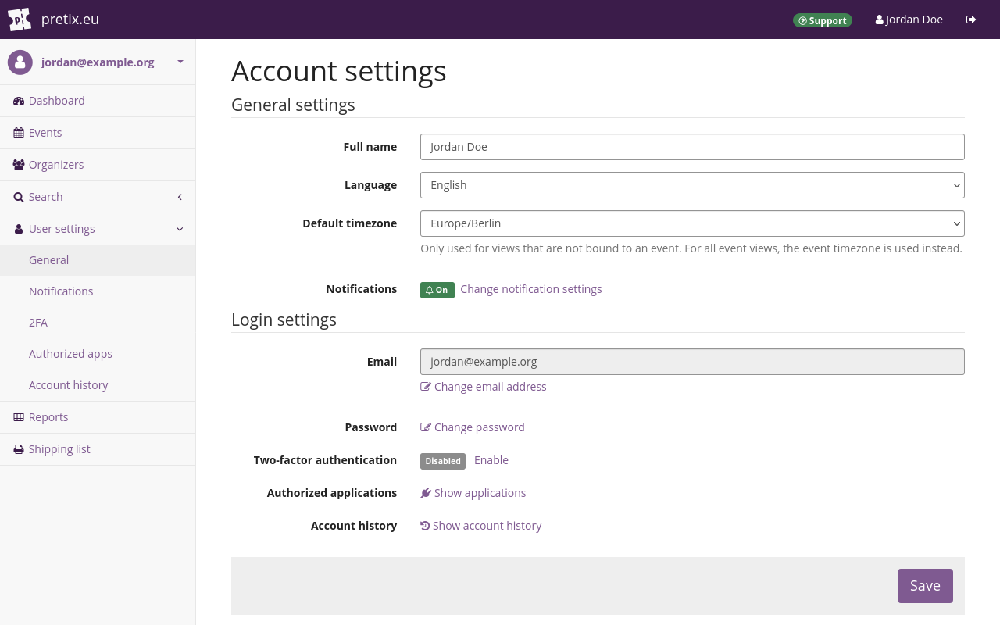
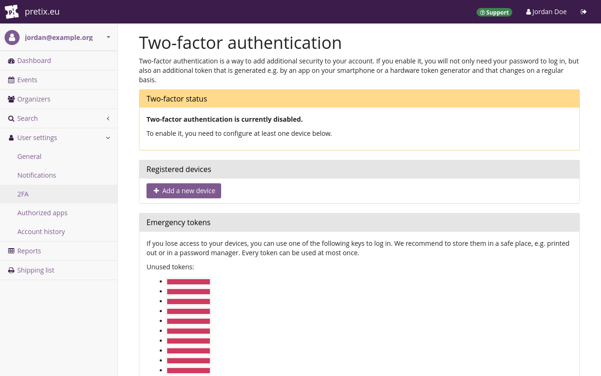

# Two-factor authentication 

The term "Two-factor authentication" or "2FA" refers to using two factors to authenticate your identity. 
This provides more security than authenticating with a single factor such as a password. 
pretix supports (2FA) for your user account. 

The first factor is always your password. 
The second factor can either be a WebAuthn-compatible hardware token or an authenticator application. 
This article explains the advantages of 2FA and how to set it up for your pretix user account. 

## Prerequisites

Depending on the authentication method you intend to use, you need to have either a WebAuthn-compatible hardware token such as a Yubikey or an authenticator app capable of generating Time-based one-time passwords (TOTP), such as Microsoft Authenticator, Google Authenticator, or Bitwarden. 

## How to

Log in to your pretix user account. 
Click the :btn-icon:fa3-user: [Your name]: button in the top right corner. 
This takes you to your user account settings. 

Take a look at the "Two-factor authentication" setting. 
If 2FA is disabled, then there is a gray "Disabled" tag next to it. 
In order to enable 2FA, click :btn:Enable:. 

On the next page, click the :btn-icon:fa3-plus: Add a new device:. 
Enter a name. 
The next steps are different depending on whether you want to use [a TOTP app](#using-a-totp-app) or a [hardware token](#using-a-hardware-token). 

!!! Note 
    In order to maximize security, only add a single device for 2FA. 
    **Do not** add both a TOTP app and a hardware token. 
    **Do not** add multiple TOTP apps 
    **Do not** add multiple hardware tokens. 
    Every additional method for logging in to your account offers potential attackers an additional point of entry. 

### Using a TOTP app 

Under "Device type", select `Smartphone with the Authenticator application`. 
Then, click :btn:Continue:. 
Open your TOTP app. 
Create a new entry for the TOTP secret. 
Scan the QR code being displayed in the pretix backend. 
Alternatively, click :btn:Can't scan the barcode?: and enter the code displayed under `3.`. 

!!! Note 
    **Do not** store your password and your TOTP secret in the same password manager. 
    If both factors can be accessed through the same master password, then the second factor only offers very little increased security compared to single-factor authentication. 
    For instance, **do not** add the TOTP secret to the same password manager entry as your pretix user account data. 
    Use separate apps for TOTP generation and password storage, or at least separate databases. 

Save the entry in your TOTP app. 
It should now display a six-digit code that changes every 30 seconds. 
Enter this code in the pretix backend in the field labeled "Enter the displayed code here". 
Click :btn:Continue:. 

This takes you back to the page titled "Two-factor authentication". 
The page will now state that 2FA is enabled and under "Registered devices", it will list the device running the TOTP app. 

From now on, you will need both your password and the TOTP from your app to log in to your pretix user account. 

### Using a hardware token 

Connect the hardware token to your computer. 
Under "Device type", select `WebAuthn-compatible hardware token (e.g. Yubikey)`. 
Then, click :btn:Continue:. 
A new page will open and your browser will prompt you to activate your hardware token. 
Activate it. 
For instance, if you are using a Yubikey, touch the blinking capacitive button. 

This takes you back to the page titled "Two-factor authentication". 
The page will now state that 2FA is enabled and under "Registered devices", it will list the hardware token. 

From now on, you will need both your password and the hardware token to log in to your pretix user account. 

## Troubleshooting 

What are common problems that could be encountered here? 
How do you solve them? 

## Further information

What other media do we have on the subject? 
Youtube videos, PDF handouts, vendor documentation (for plugins etc.) etc.? 
Link it here and explain what it does. 

## See also 

Link to other relevant guides, for example, in the case of Payment Providers, link to the articles on payment settings and plugins. 