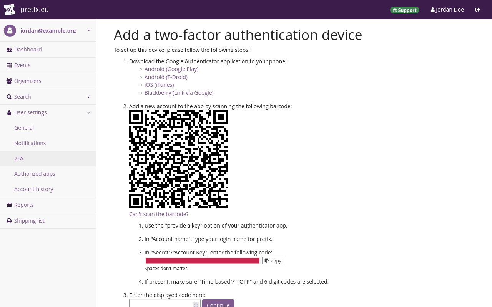

# Two-factor authentication 

The term "Two-factor authentication" or **2FA** refers to using two factors to authenticate your identity. 
This provides more security than authenticating with a single factor such as a password. 

You can secure your pretix user account with 2FA. 
The first factor is always your password. 
The second factor can be a WebAuthn-compatible hardware token or an authenticator application. 

This article explains the advantages of 2FA and how to set it up for your pretix user account. 

## Prerequisites

Depending on the authentication method you intend to use, you need to have: 

 - a WebAuthn-compatible hardware token such as a Yubikey **or** 
 - an authenticator app capable of generating time-based one-time passwords (TOTP), such as Microsoft Authenticator, Google Authenticator, or Bitwarden. 

## How to

Log in to your pretix user account. 
Click the :btn-icon:fa3-user: [Your name]: button in the top right corner. 
This takes you to your user account settings. 

Before you set up 2FA, you should store your **emergency tokens** outside of pretix. 
You can use these codes in place of your 2FA device in case you lose access to it. 
Copy the codes and print them or write them down on paper. 
Store that paper in a safe place such as a locked drawer. 

Alternatively, you can store the emergency tokens digitally in an encrypted file or in a password manager. 
**Do not** store them in the same password manager or database that also contains your account password. 

!!! Note 
    Ensure that you have stored your emergency tokens outside of pretix and that you know where to find them. 
    You need these tokens in case you lose access to your 2FA device. 

Take a look at the "Two-factor authentication" setting. 
If 2FA is disabled, then there is a gray "Disabled" tag next to it. 
In order to enable 2FA, click the :btn:Enable: button. 

On the next page, click the :btn-icon:fa3-plus: Add a new device: button. 
Enter a name. 
The next steps are different depending on whether you want to use [a TOTP app](#using-a-totp-app) or a [hardware token](#using-a-hardware-token). 

!!! Note 
    Once you have set up 2FA, losing access to the device for 2FA means also losing access to your pretix user account. 
    In order to prevent such a situation, you can add multiple devices. 

    However, every additional method for logging in to your account offers potential attackers an additional point of entry. 
    In order to maximize security, only add a single device for 2FA. 

A hardware token is typically smaller than a phone and only used for authentication purposes, so it can potentially be easier to lose. 
A hardware token costs money. 
You must remove your hardware token from the computer and keep it on your person whenever your computer is not locked in your personal office or in your home. 

If you use separate applications for password storage and TOTP generation, then the TOTP method offers good security. 

### Using a TOTP app 

Under "Device type", select `Smartphone with the Authenticator application`. 
Then, click the :btn:Continue: button. 

Open your TOTP app. 
Create a new entry for the TOTP secret. 
Scan the QR code that the pretix backend is displaying. 
Alternatively, click :btn:Can't scan the barcode?: and enter the code displayed under `3`. 

!!! Note 
    **Do not** store your password and your TOTP secret in the same password manager. 
    If it is possible to access both factors through the same primary password, then the second factor only offers very little increased security compared to single-factor authentication. 
    
    For instance, **do not** add the TOTP secret to the same password manager entry as your pretix user account data. 
    Use separate apps for TOTP generation and password storage, or at least separate databases. 

Save the entry in your TOTP app. 
It should now display a six-digit code that changes every 30 seconds. 
This code is the time-based one time password. 
Enter it in the pretix backend in the field labeled "Enter the displayed code here". 
Then, click the :btn:Continue: button. 

This takes you back to the page titled "Two-factor authentication". 
The page will now state that 2FA is enabled and under "Registered devices", it will list the device running the TOTP app. 

From now on, you will need both your password and the TOTP from your app to log in to your pretix user account. 

### Using a hardware token 

Connect the hardware token to your computer. 
Under "Device type", select `WebAuthn-compatible hardware token (e.g. Yubikey)`. 
Then, click the :btn:Continue: button. 

A new page will open and your browser will prompt you to activate your hardware token. 
Activate it. 
For instance, if you are using a Yubikey, touch the blinking capacitive button. 

This takes you back to the page titled "Two-factor authentication". 
The page will now state that 2FA is enabled and under "Registered devices", it will list the hardware token. 

From now on, you will need both your password and the hardware token to log in to your pretix user account. 

## Troubleshooting 

### You have lost access to your 2FA device

If you have lost access to your 2FA device because it is broken, stolen, or lost, then you should take the following steps: 

 - use one of your emergency tokens to log in 
 - remove the 2FA device from your user account 
 - acquire a replacement for the lost 2FA device 
 - add that device to your account 

In order to do so, open the [login page](https://pretix.eu/control/login). 
Enter your email address and password. 
When the page prompts you to touch your hardware key or enter the TOTP, enter one of the emergency tokens instead. 
Then, click the :btn:Continue: button. 

You can only use each emergency token once. 
Delete it from the list or cross it out after you have used it. 

Click the :btn-icon:fa3-user: [Your name]: button in the top right corner. 
This takes you to your user account settings. 
Click :btn:Change two-factor settings:. 
Seek out the lost device in the list and click the :btn:Remove: button next to it. 
If this is the only connected 2FA device, then this action will disable 2FA for your account. 

Acquire a replacement for the lost 2FA device. 
Add that device to your account as described under [How to](#how-to). 

### You have lost access to your 2FA device and to the emergency tokens 

If you have lost access to your 2FA device and to the emergency tokens, you should contact our support via [email](mailto:support@pretix.eu) or [phone](tel:+4962213217750). 

## See also 

If you want to require your coworkers to use 2FA for their pretix accounts, refer to the article on [Teams](teams.md#two-factor-authentication-2fa). 