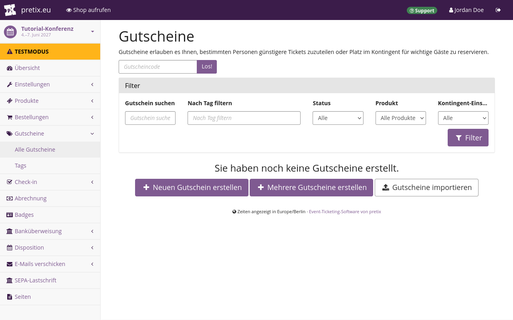
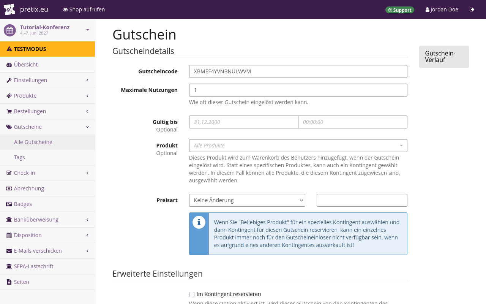
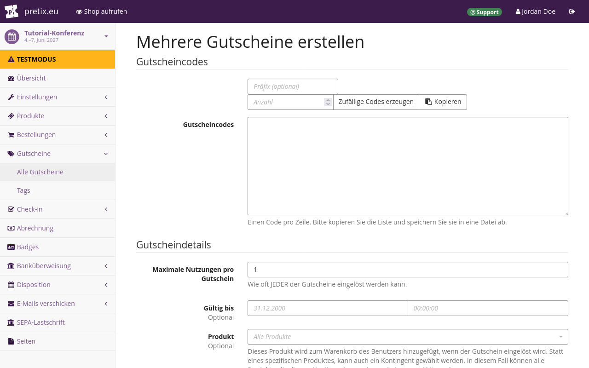
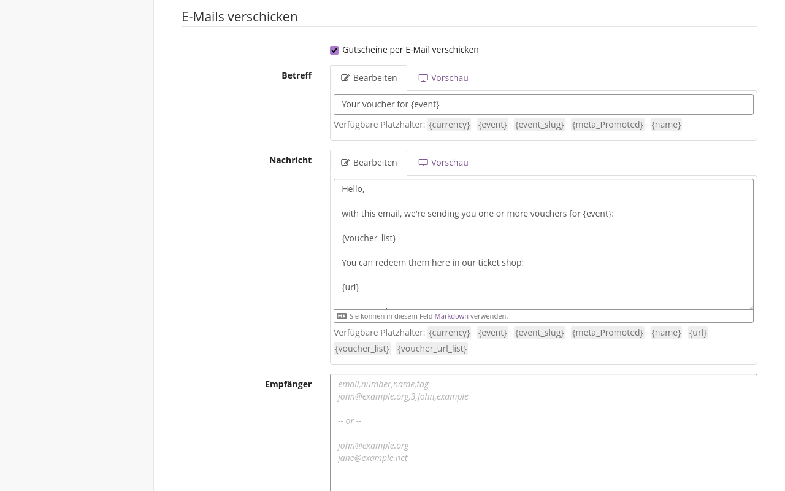
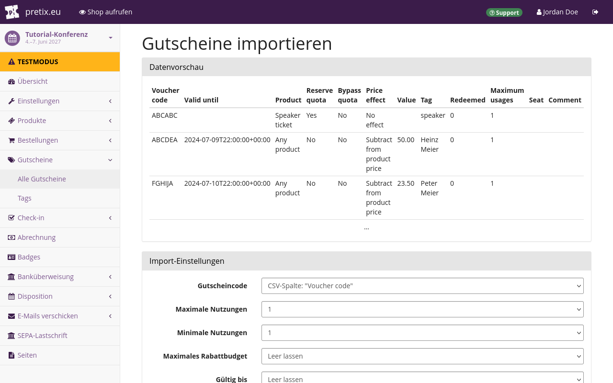
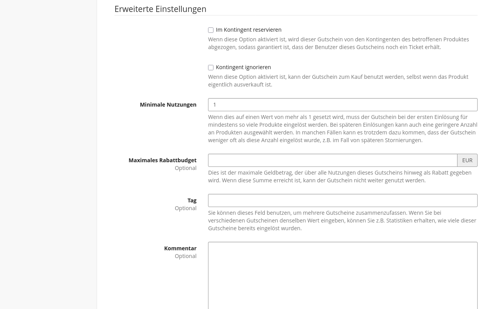

# Gutscheine

Gutscheine sind Codes, die im Shop für bestimmte Produkte eingelöst werden können.
Mit pretix können Sie diese Codes und die dazugehörigen URLs automatisch generieren und per E-Mail versenden.
Gutscheine haben viele nützliche Anwendungsmöglichkeiten.
Sie können sie dafür benutzen:

- Produkte für Personen, die einen Gutschein haben, zu einem [ermäßigten Preis](#einen-limitierten-rabatt-anbieten) anzubieten
- ein Produkt nur einer [ausgewählten Personengruppe](vouchers.de.md#exklusive-produktverfügbarkeit) zugänglich oder sichtbar zu machen (z.B. Vortragenden auf einer Konferenz oder geladenen Gäst\*innen)
- eine bestimmte Menge an Produktkontingent für Personen mit  einem Gutschein zu [reservieren](vouchers.de.md#tickets-reservieren)
- sicherzustellen, dass Personen mit einem Gutschein [weiterhin Zugang](vouchers.de.md#ein-kontingent-umgehen) zu einem Produkt haben, auch wenn es ausverkauft ist

!!! Note
    Gutscheine sind nicht mit [Wertgutscheinen](gift-cards.md) zu verwechseln.
    Wertgutscheine dienen im Wesentlichen als zusätzliche Zahlungsmethode für Ihre Kund*innen.
    Sie entsprechen immer einem festen Geldbetrag, der vom Gesamtbetrag der Bestellung abgezogen wird.
    Wertgutscheine können unabhängig von der Art der Veranstaltung und dem Veranstalter verwendet werden.
    Sie haben keinen Einfluss auf die Verfügbarkeit und Sichtbarkeit bestimmter Produkte.

## Voraussetzungen

Gutscheine werden auf Veranstaltungsebene verwaltet.
Daher müssen Sie erst die Veranstaltung anlegen, für die Sie Gutscheine erstellen möchten.
Wenn Sie pretix Hosted nutzen, müssen Sie erst Ihr Konto aktivieren, bevor Sie Gutscheine per E-Mail versenden können.

## Allgemeine Nutzung

Die Einstellungsseite für Gutscheine finden Sie unter :navpath:Ihre Veranstaltung → :fa3-tags: Gutscheine:.
Hier erhalten Sie einen Überblick über alle bereits erstellten Gutscheine sowie Optionen zum Suchen und Filtern dieser Gutscheine.



### Einen einzelnen Gutschein erstellen

Wenn Sie den Button :btn-icon:fa3-plus: Neuen Gutschein erstellen: klicken, gelangen Sie zu einem Dialog, in dem Sie einen einzelnen neuen Gutschein erstellen können.
Das ist dann nützlich, wenn Sie einen einzelnen Gutscheincode veröffentlichen möchten, der einmal oder mehrmals verwendet werden kann.
Das Feld "Gutscheincode" enthält bereits einen automatisch generierten Vorschlag.
Sie können ihn übernehmen oder durch einen beliebigen eigenen Code ersetzen.
Der Code muss zwischen 5 und 255 Zeichen lang sein.
Alle Kleinbuchstaben werden in Großbuchstaben umgewandelt.



Wenn Sie einen oder mehrere Gutscheine generieren, sollten Sie diese kopieren oder auf Ihrem Computer speichern.
Verwenden Sie dafür beispielsweise eine Text- oder Tabellendatei.

Wenn Sie für eine Veranstaltung mehr als eine Art von Gutschein erstellen, ist es sinnvoll, im Feld "Tag" ein Schlagwort einzugeben.
Das macht es später einfacher, bestimmte Gutscheine in der Liste zu finden, zu bearbeiten oder zu duplizieren.
Ein sinnvoller Eintrag im Feld "Tag" könnte etwa der Zweck sein, für den die Gutscheine erstellt wurden, zum Beispiel "Zeitlich begrenztes Angebot".

Sobald Sie auf den Button :btn:Speichern: klicken, wird der Gutschein erstellt.
Danach gelangen Sie auf eine neue Seite mit dem Titel "Gutscheindetails".
Auf dieser Seite finden Sie den "Gutschein-Link", den Sie an Ihre Kund\*innen versenden können.
Wenn Ihre Kund\*innen den Link öffnen, gelangen sie direkt in den Shop in dem der Gutscheincode bereits ausgewählt wurde.
Dadurch werden alle dem Gutschein zugewiesenen Produkte angezeigt.

Sie können alle Einstellungen, die vor der Erstellung verfügbar sind, auch noch nach der Erstellung des Gutscheins ändern.

### Mehrere Gutscheine erstellen

Der Button :btn-icon:fa3-plus: Mehrere Gutscheine erstellen: öffnet einen Dialog, in dem Sie mehrere neue Gutscheine erstellen können.
Geben Sie im Feld "Anzahl" die Anzahl der Gutscheincodes ein, die Sie erstellen möchten.
Wenn Sie etwas in das Feld "Präfix" eingeben bevor Sie Codes generieren, dann beginnt jeder generierte Code mit diesem Präfix.
Sobald Sie auf :btn:Zufällige Codes generieren: klicken, wird die von Ihnen angegebene Anzahl an Codes im Feld "Gutscheincodes" angezeigt.

Sie können auch eigene Gutscheincodes angeben, indem Sie diese manuell in das Feld "Codes" eingeben.
Die Codes werden durch Zeilenumbrüche getrennt.
Sie müssen also jeden Code in einer neuen Zeile eingeben.



Die Einstellungen in den Abschnitten "Gutscheindetails" und "Erweiterte Einstellungen" entsprechen denen im Dialog "Einen einzelnen Gutschein erstellen".

Sie sollten im Feld "Tag" einen Tag eingeben, um die Gutscheine später besser zuordnen und wiederfinden zu können.
Zusätzlich sollten Sie die Codes kopieren und sie in einer Text- oder Tabellendatei speichern.
Wenn Sie vorhaben, Gutscheine über die E-Mail-Funktion von pretix zu versenden, klicken Sie noch **nicht** auf den Button "Speichern".
Lesen Sie stattdessen den [Unterabschnitt zum Gutscheine per E-Mail versenden](vouchers.md#sending-out-vouchers-via-email).

Wenn Sie mit den Einstellungen fertig sind, klicken Sie auf den Button :btn:Speichern: und Ihre Gutscheine werden erstellt.
Dadurch gelangen Sie zur Überblicks-Seite "Gutscheine".
Sie können alle Einstellungen, die vor der Erstellung verfügbar sind, auch noch nach der Erstellung der Gutscheine ändern.

### Gutscheine per E-Mail versenden

Über das Dialogfeld "Mehrere Gutscheine erstellen" haben Sie auch Zugriff auf die E-Mail-Optionen.
So können Sie mit pretix Gutscheine per E-Mail versenden, nachdem Sie sie erstellt haben.
Aktivieren Sie unten auf der Seite das Kontrollkästchen neben "Gutscheine per E-Mail versenden", um die E-Mail-Optionen anzuzeigen.

Über die E-Mail-Optionen können Sie den Betreff und den Inhalt Ihrer E-Mails festlegen.
Unter jedem Feld werden die entsprechenden verfügbaren Platzhalter aufgelistet.
Jedes Feld enthält voreingestellte Standardtexte.



Es gibt zwei Methoden zur Angabe der Empfänger.
Die einfache Methode besteht darin, eine Liste von E-Mail-Adressen in das Feld "Empfänger" einzugeben.
Trennen Sie dabei die E-Mail-Adressen durch Zeilenumbrüche voneinander.
Bei dieser Methode muss die Anzahl der E-Mail-Adressen (und somit der Zeilen) mit der Anzahl der generierten Gutscheincodes übereinstimmen.
Wenn Sie dieselbe E-Mail-Adresse mehr als einmal eingeben, werden mehrere E-Mails an diese Adresse versendet.
Dabei enthält jede E-Mail einen anderen Gutscheincode.

Die fortgeschrittene Methode besteht darin, eine durch Kommas getrennte Liste in das Feld "Empfänger" einzugeben.
Die Liste darf bis zu vier Spalten enthalten:

- **email**, die E-Mail-Adressen der Empfänger\*innen
- **number**, die Anzahl der Gutscheincodes, die an die jeweilige E-Mail-Adresse versendet werden
- **name**, der mit der E-Mail-Adresse verknüpfte Name; dieser Name wird verwendet, um den Platzhalter {name} in den Feldern "Betreff" und "Nachricht" oben auszufüllen
- **tag**, der zur Nachverfolgung zusätzlicher Informationen verwendet werden kann

Geben Sie in der ersten Zeile die Überschriften der Spalten ein, die Sie verwenden möchten.
Trennen Sie die Überschriften mit Kommas und **ohne** Leerzeichen.
Diese Kopfzeile ist zwingend erforderlich.
Sie können die Reihenfolge der Spalten frei wählen.
Geben Sie darunter die Kontaktdaten ein.
Verwenden Sie dabei für jede E-Mail-Adresse wieder eine eigene Zeile.
Alle zusätzlichen Informationen werden in derselben Zeile durch Kommas getrennt eingegeben.
Im folgenden Beispiel würde Jordan 3, Morgan 1 und Jamie 10 Gutscheincodes erhalten:

```
email,number,name
jordan@example.org,3,Jordan Doe
morgan@example.org,1,Morgan Doe
jamie@example.org,10,Jamie Doe
```

Die Anzahl der Gutscheincodes, die Sie auf diese Weise versenden, muss mit der Anzahl an generierten Gutscheincodes übereinstimmen.
Die Software zeigt Ihnen eine Fehlermeldung an, wenn die Werte nicht übereinstimmen.
Die E-Mails werden versendet, sobald Sie den Button :btn:Speichern: klicken.

### Gutscheine importieren


Über den Button :btn-icon:fa3-upload:Gutscheine importieren: auf der Seite "Gutscheine" können Sie eine Liste von Gutscheinen aus einer externen Quelle oder einer zuvor exportierten pretix-Veranstaltung hochladen.
Klicken Sie den Button :btn:Durchsuchen...: und wählen Sie eine CSV-Datei mit einer Kopfzeile aus.
Klicken Sie dann  den Button  :btn:Import starten:.
Wenn die Datei erfolgreich importiert und als CSV-Datei verarbeitet werden kann, gelangen Sie auf eine neue Seite.
Dort finden Sie eine Vorschau der Daten sowie eine umfangreiche Auswahl an Import-Einstellungen.



Die Einstellungen entsprechen den Abschnitten "Gutscheindetails" und "Erweiterte Einstellungen", die Sie auf der Seite "Mehrere Gutscheine erstellen" finden können.
Nur die Einstellungen zur Erstellung der Gutscheincodes und zum Versenden der E-Mails fehlen.
Sie können für jede Einstellung eine Spalte aus der CSV-Datei angeben.

Der Inhalt dieser Spalte wird dann verwendet, um die Optionen für jeden einzelnen Gutschein festzulegen.
Falls Ihre CSV-Datei keine entsprechende Spalte enthält, können Sie stattdessen einen der Standardwerte verwenden.
Sobald Sie den Button :btn:Import durchführen: klicken, versucht pretix, die Spalten aus der CSV-Datei gemäß den von Ihnen festgelegten Einstellungen zu verarbeiten.

Wenn die Daten in den Spalten nicht dem erwarteten Datentypen entsprechen, wird eine Fehlermeldung angezeigt.
Wenn der Import erfolgreich war, werden die Gutscheine für die aktuelle Veranstaltung den Vorgaben entsprechend erstellt.
Diese können Sie im Überblick auf der Seite "Gutscheine" einsehen und bearbeiten.

### Liste aller Gutscheine herunterladen

Sie können eine Liste aller Gutscheine der aktuellen Veranstaltung herunterladen, indem Sie  den Button :btn-icon:fa3-download: Liste herunterladen: klicken.
Wenn Sie den Button klicken, startet der Download einer Datei mit dem Namen "vouchers.csv".
Diese Datei können Sie anschließend mit einem Texteditor oder einem Programm für Tabellenkalkulation bearbeiten.
Die Datei "vouchers.csv" enthält folgende Spalten:

Gutscheincode, Gültig bis, Produkt, Im Kontingent reservieren, Verfügbarkeit ignorieren, Preisart, Wert, Tag, Eingelöst, Maximale Nutzungen, Sitzplatz, Kommentar.

## Anwendungsmöglichkeiten

Wie in der Einleitung beschrieben gibt es zahlreiche Anwendungsmöglichkeiten für  Gutscheine.
Die folgenden Abschnitte erklären diese Anwendungsmöglichkeiten.

### Einen limitierten Rabatt anbieten

Sie können einen Gutscheincode für einen limitierten Rabatt erstellen, um mehr Kund\*innen für Ihren Shop zu gewinnen.
Sie können die Gültigkeit des Gutscheins auf einen begrenzten Zeitraum, eine bestimmte Anzahl von Einlösungen oder ein maximales Rabattbudget limitieren.
Es ist auch möglich, die verschiedenen Arten von Limitierungen miteinander zu kombinieren.

Navigieren Sie zu :navpath:Ihre Veranstaltung → :fa3-tags: Gutscheine: und klicken Sie den Button :btn-icon:fa3-plus: Neuen Gutschein erstellen:.
Das Feld "Gutscheincode" enthält bereits einen automatisch generierten Vorschlag.
Sie können ihn übernehmen oder durch einen beliebigen eigenen Code ersetzen.

Wenn der Gutschein nur für ein bestimmtes Produkt gelten soll, dann wählen Sie das entsprechende Produkt im Feld "Produkt" aus.
Wenn der Gutschein für alle Produkte eines Kontingents gelten soll, dann wählen Sie in diesem Feld das entsprechende Kontingent aus.
Wenn der Gutschein für alle Produkte in Ihrem Shop gelten soll, dann lassen Sie das Feld frei.

Die Option "Preisart" bietet Ihnen verschiedene Möglichkeiten, wie sich der Gutschein auf den Produktpreis auswirken soll.
Beispielsweise können Sie unter "Preisart" die Option "Produktpreis reduzieren um (%)" auswählen und im folgenden Feld den Wert "10" festlegen.
Dadurch gewährt der Gutschein bei Einlösung 10% Rabatt.

Deaktivieren Sie das Kontrollkästchen neben " Zeigt versteckte Produkte an, die zu diesem Gutschein passen".
Wenn Sie diese Option aktiviert lassen und Gutscheine für "Alle Produkte" veröffentlichen, können Kund\*innen, die den Gutschein einlösen, alle ausgeblendeten Produkte sehen.

Sie können die Gültigkeit des Gutscheins auf eine bestimmte Anzahl von Einlösungen beschränken.
Geben Sie dazu im Feld "Maximale Nutzungen" an, wie oft der Gutschein maximal eingelöst werden können soll.
Wenn Sie keine Begrenzung festlegen möchten, geben Sie eine sehr hohe Zahl, beispielsweise 999999, ein.

Wollen Sie die Gültigkeit des Gutscheins auf ein bestimmtes Höchstbudget beschränken, können Sie die Option "Maximales Rabattbudget" benutzen.
Wenn Sie beispielsweise "Maximales Rabattbudget" auf 1000,00 € festlegen und der Gutschein einen Rabatt von 10,00 € gewährt, verliert er seine Gültigkeit, sobald er 100 Mal eingelöst wurde.

Wenn Sie die Gültigkeitsdauer des Gutscheins auf einen bestimmten Zeitraum beschränken möchten, tragen Sie für die Option "Gültig bis" das Ende des zeitlich begrenzten Angebots ein, beispielsweise das Ende des folgenden Tages.

Klicken Sie den Button :btn:Speichern:, sobald Sie mit Ihren Einstellungen zufrieden sind.
Sie können den Code von der Übersichtsseite der Gutscheine kopieren und ihn beispielsweise über einen Newsletter, einen Social-Media-Beitrag oder über Printmedien veröffentlichen.

### Exklusive Produktverfügbarkeit

Mit Gutscheinen können Sie ein Produkt (oder mehrere Produkte) für eine ausgewählte Gruppe von geladenen Gäst\*innen reservieren.
Diese Möglichkeit eignet sich für Fälle, in denen Sie die Empfänger im Voraus kennen und über eine vollständige Liste ihrer E-Mail-Adressen verfügen, beispielsweise bei Vereinsmitgliedern, Referent\*innen einer Konferenz oder VIPs, die eine Einladung erhalten.

Wenn Sie die Verfügbarkeit für ein **einzelnes Produkt** einschränken möchten, navigieren Sie zu :navpath:Ihre Veranstaltung → :fa3-ticket: Produkte → Produkte:.
Erstellen oder bearbeiten Sie dort das betreffende Produkt.
Öffnen Sie den Reiter :btn:Verfügbarkeit: und aktivieren Sie das Kontrollkästchen neben "Dieses Produkt kann nur mit einem Gutschein gekauft werden".

Neben dieser Option befindet sich ein Sichtbarkeits-Umschalter.
Wenn Sie diesen Umschalter auf "Verstecke das Produkt, wenn es nicht verfügbar ist" (:btn-icon:fa3-eye-slash::) setzen, dann wird das Produkt in Ihrem Shop ausgeblendet.
Das Produkt wird nur Kund*innen angezeigt, die einen der Gutscheincodes in das Gutscheinfeld eingegeben haben oder die über einen der Gutscheinlinks in den Shop gelangt sind.

Wenn Sie die Verfügbarkeit für bestimmte Produktvarianten einschränken möchten, bearbeiten Sie die entsprechende Variante und aktivieren Sie das Kontrollkästchen neben "Nur anzeigen, wenn ein passender Gutschein eingelöst wird".
Bei Produktvarianten ist es nicht möglich, diese ausschließlich über einen Gutschein verfügbar zu machen, sie aber dennoch in Ihrem Shop anzuzeigen.

Wenn Sie die Verfügbarkeit für **mehrere Produkte** einschränken möchten, führen Sie die oben beschriebenen Schritte für jedes Produkt einzeln durch.
Ein Gutschein kann so eingestellt werden, dass er die Verfügbarkeit eines einzelnen Produkts oder aber die aller Produkte innerhalb eines Kontingents beeinflusst.
Daher müssen Sie ein Kontingent anlegen und nur die betreffenden Produkte hinzufügen.
Die "Gesamtkapazität" müssen Sie so festlegen, dass sie die Anzahl der E-Mails abdeckt, die Sie versenden möchten.

Unabhängig davon, ob Sie die Verfügbarkeit nur für ein einzelnes oder für mehrere Produkte eingeschränkt haben, empfiehlt es sich, die Gutscheincodes per E-Mail an Ihre Empfänger zu versenden.
Navigieren Sie zu :navpath:Ihre Veranstaltung" → Gutscheine: und klicken Sie den Button :btn-icon:fa3-plus: Mehrere neue Gutscheine erstellen:.
Dieser Vorgang wird im Abschnitt "[Gutscheine per E-Mail versenden](vouchers.md#sending-out-vouchers-via-email)" ausführlich beschrieben.
Generieren Sie genauso viele Gutscheincodes, wie Personen, die Sie einladen möchten.
Über die Spalte "number" in der Liste der "Empfänger" können Sie mehrere Gutscheine an dieselbe E-Mail-Adresse versenden.

Wählen Sie unter "Produkt" das Produkt aus (oder das Kontingent, falls es mehr als ein Produkt gibt), das Sie den Gutscheininhaber\*innen sichtbar machen wollen.
Aktivieren Sie am Ende der Seite das Kontrollkästchen neben "Zeigt versteckte Produkte an, die zu diesem Gutschein passen".
Diese Option ist nur relevant, wenn der Sichtbarkeits-Umschalter des Produkts auf "ausgeblendet" gesetzt ist.

Wenn Sie Mitarbeiter oder VIPs einladen, möchten Sie möglicherweise die Kosten für alle Zusatzprodukte erlassen, die Gutscheininhaber zusätzlich zu ihrem Ticket auswählen.
Aktivieren Sie dazu das Kontrollkästchen neben "Alle Zusatzprodukte kostenlos anbieten, wenn dieser Gutschein eingelöst wird".

Um die E-Mail-Optionen anzuzeigen, aktivieren Sie das Kontrollkästchen neben "Gutscheine per E-Mail verschicken".
Geben Sie die E-Mail-Adressen in das Feld "Empfänger" ein oder nutzen Sie die fortgeschrittene Methode, die im Abschnitt ["Gutscheine per E-Mail versenden"](vouchers.de.md#gutscheine-per-e-mail-versenden) beschrieben wird.
Die E-Mails werden versendet, sobald Sie den Button :btn:Speichern: klicken.

### Tickets reservieren

Mit Gutscheinen können Sie Produkte aus einem Kontingent reservieren.
Dies ist nützlich, wenn Sie sicherstellen möchten, dass eine bestimmte Personengruppe Zugang zu Ihrer Veranstaltung erhält.
Das können beispielsweise Gäst\*innen sein, die von den auftretenden Künstler\*innen zu einem Konzert eingeladen wurden.
Navigieren Sie zu :navpath:Ihre Veranstaltung → :fa3-tags: Gutscheine: und klicken Sie den Button :btn-icon:fa3-plus: Mehrere Gutscheine erstellen:.
Legen Sie die Anzahl der Codes so fest, dass pro Mitglied der betreffenden Gruppe ein Gutschein generiert wird.

Optional können Sie ein beschreibendes Präfix wie "GÄSTELISTE-" wählen.

Wählen Sie unter "Produkt" das Standard-Ticket Ihrer Veranstaltung und unter "Preisart" die Option "Produktpreis verändern auf".
Geben Sie in das folgende Feld `0,00` ein.
Das gewährt jeder Person mit einem Gutschein Anspruch auf ein kostenloses Standard-Ticket.



Aktivieren Sie das Kontrollkästchen neben "Im Kontingent reservieren".
Das bedeutet, dass eine bestimmte Produktmenge aus dem Kontingent reserviert wird.
Diese Menge ist gleich der Summe der maximalen Anzahl von Nutzungen aller von Ihnen erstellten Gutscheine.
Die so reservierten Produkte können ohne einen Gutschein nicht erworben werden.
Wenn Sie beispielsweise 5 Gutscheine erstellen, die jeweils maximal 3 Mal verwendet werden können, werden 15 Produkte aus dem Kontingent reserviert.

Bitte beachten Sie, dass dies den Gutscheininhabern keinen verlässlichen Zugang zu Produkten garantiert, wenn Sie unter "Produkt" eine der Optionen von "Beliebiges Produkt aus Kontingent" ausgewählt haben **und** die Produkte Teil von mehr als einem Kontingent mit begrenzter Kapazität sind.
Sie können diese Methode jedoch weiterhin nutzen, wenn Sie unter "Produkt" ein bestimmtes Produkt auswählen oder wenn die betreffenden Produkte nur Teil eines einzigen Kontingents sind.

### Ein Kontingent umgehen

Eine weitere Methode, um den Zugang zu Produkten für Gutscheininhaber\*innen sicherzustellen, besteht darin, ihnen zu ermöglichen, die Kontingente zu umgehen.
Dies ist zum Beispiel dann sinnvoll, wenn Sie bereits die Mehrheit oder alle Tickets für Ihre Veranstaltung verkauft haben, aber sicherstellen möchten, dass eine bestimmte Personengruppe trotzdem teilnehmen kann.

Erstellen Sie einen oder mehrere Gutscheine mit Ihren gewünschten Einstellungen.
Aktivieren Sie das Kontrollkästchen neben "Kontingent ignorieren".
Dadurch erhalten Gutscheininhaber\*innen Zugriff auf Produkte, auch wenn alle entsprechenden Kontingente bereits ausverkauft sind.

!!! Note
    Wenn Sie die Option "Kontingent ignorieren" verwenden, dann entsteht dadurch das Risiko einer Überbuchung.
    Wir empfehlen, diese Funktion nicht zu benutzen, wenn Sie mit strengen räumlichen Einschränkungen rechnen müssen, wie beispielsweise der Anzahl der verfügbaren Sitzplätze, dem Platzangebot am Veranstaltungsort oder der Anzahl der bestellten Mahlzeiten.