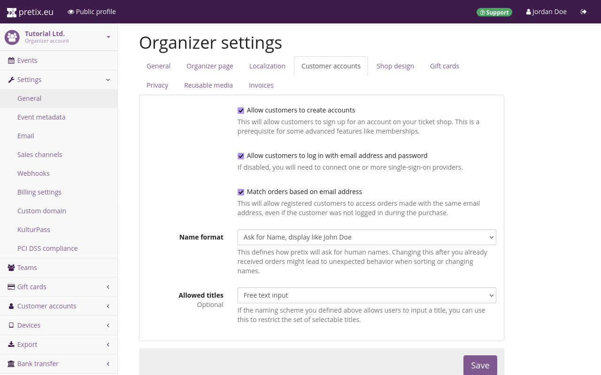

## Customer accounts 

What does this article tell you? What does it not tell you? 
For example, in the article on gift cards, quickly explain the difference between gift cards and vouchers and link to the article on vouchers. 

## Prerequisites

What conditions have to be met for this information to be applicable? 
Which settings have to be adjusted, which plugins have to be activated, which previous knowledge is assumed by the article? 

## How To (?)

 

Switch to the "Customer accounts" tab. 
By default, all boxes on this page should be unchecked. 
If you don't plan for your customers to create accounts, you can leave them unchecked and you don't have to take any action on this tab. 

pretix offers some features that only work with customer accounts. 
If you want to offer your customers memberships that give them access to reduced price offers or members-only products, then you have to enable customer accounts. 
If you expect your customers to repeatedly log in to your shop and make purchases through the same account, then you have to enable customer accounts. 
You can enable customer accounts by checking the "Allow customers to create accounts" box at the top of the page. 

Checking that box makes another box appear that is checked by default: "Allow customers to log in with email address and password". 
Keep this box checked if you want customers to log in to your pretix ticket shop directly. 
Uncheck it if you want them to log in via an external sign-on service. 
You'll have to enable the corresponding plugin on the event level. 

## Troubleshooting 

What are common problems that could be encountered here? 
How do you solve them? 

## Further Information

What other media do we have on the topic? 
Youtube videos, PDF handouts, vendor documentation (for plugins etc.) etc.? 
Link it here and explain what it does

## See Also 

Link to other relevant topics, for example, in the case of Payment Providers, link to the articles on payment settings and plugins. 
Do not link to pages already linked underneath the title heading, prerequisites, or further information. 