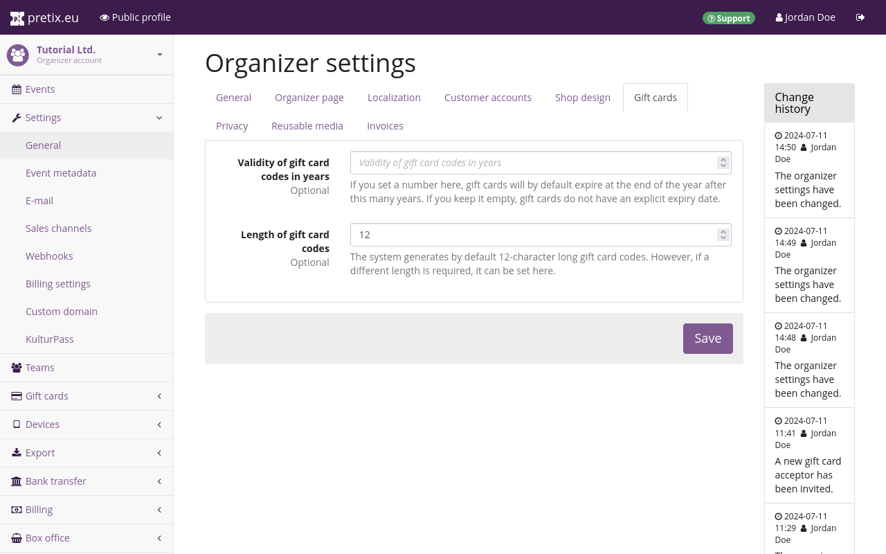
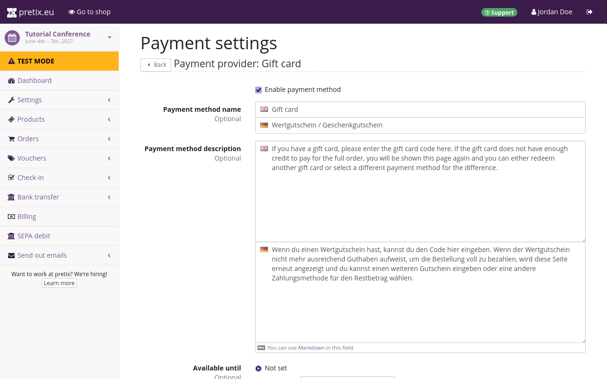
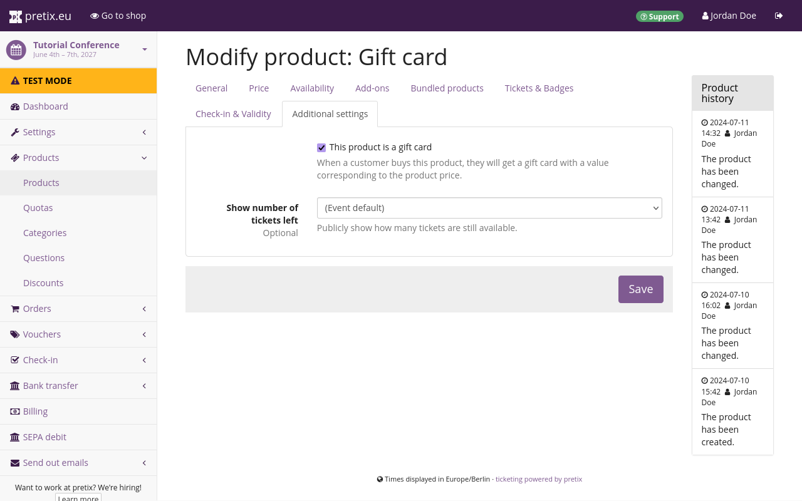
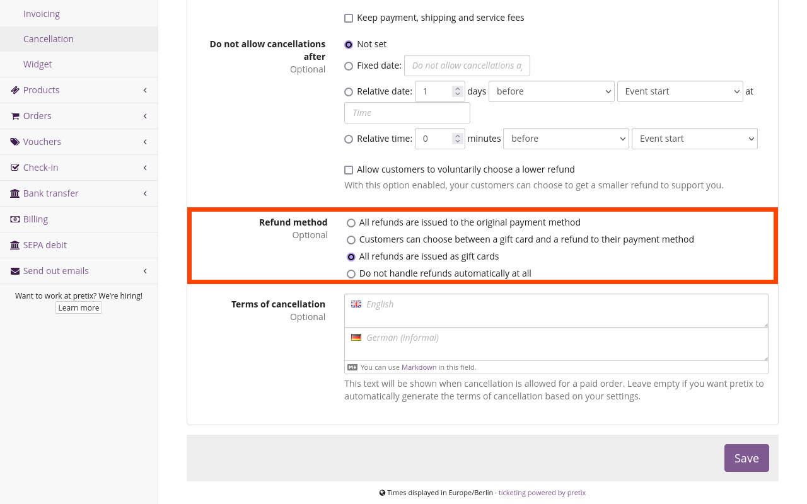
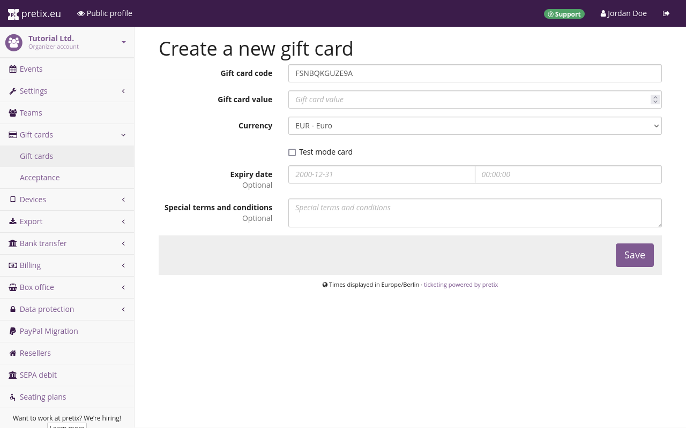
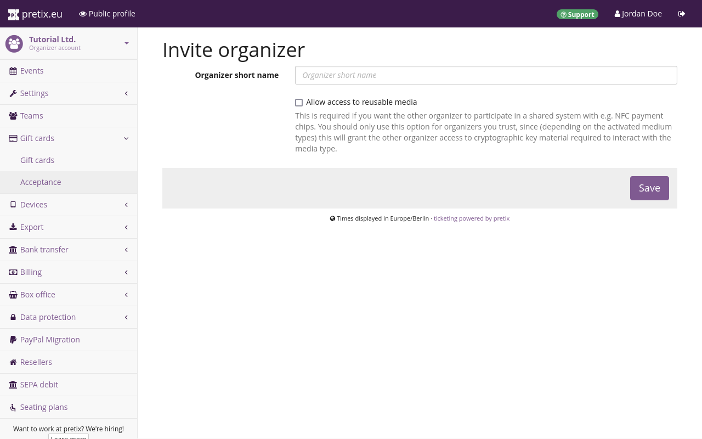
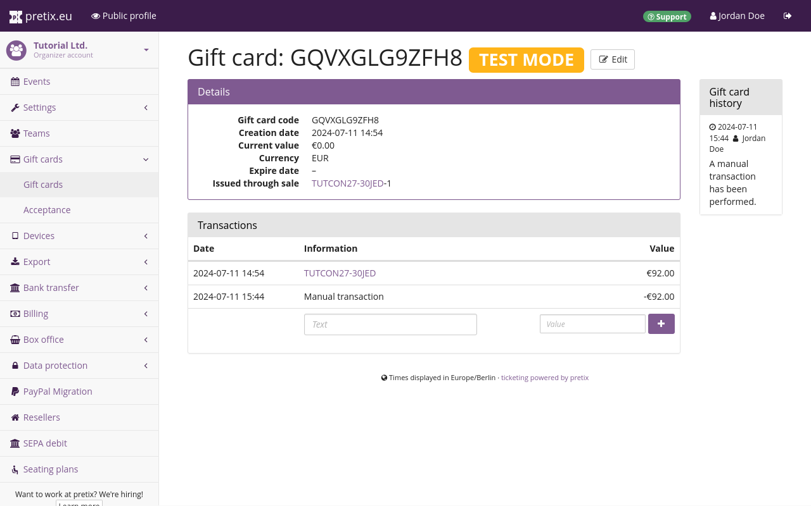

# Gift Cards

Gift cards are a type of product you can sell in one of your shops, which customers can then use as a payment method for another purchase in one of your shops. 
Gift cards behave like a payment method when used in your shop and can be enabled or disabled like any other payment provider.
The only difference is that there is no dedicated plugin for gift cards since gift cards are part of the core functionality of the pretix software.

Gift cards are not to be confused with [vouchers](vouchers.md).
Unlike vouchers, gift cards always represent a fixed amount of money that is subtracted from the total of the order. 
Gift cards are not suitable for promotional campaigns as they do not allow a discount on the purchased products. 
Also unlike vouchers, gift cards can be used across different events and organizers and do not affect the availability and visibility of certain products. 

!!! Note 
    pretix treats gift cards as "multi-purpose vouchers" within the meaning of EU Council Directive 2016/1065 of 27 June 2016. 
    pretix does not support charging taxes on the sale of gift cards. 
    Instead, taxes will always be charged on the purchase for which the respective gift card is used.

## Prerequisites

In order to use gift cards as a payment method for an event, they have to be enabled for that event.
Gift cards are enabled by default.
If they are not enabled, you can enable them by browsing to :navpath:Your event → :fa3-wrench: Settings → Payment:, clicking the :btn-icon:fa3-gear:Settings: button next to "Gift cards" and checking the box next to " Enable payment method" at the top of the page.

pretix only supports selling gift cards at a tax rate of 0%.
Sales tax is applied to the purchase that is made using the gift card—not to the purchase of the gift card itself.
This is the procedure prescribed by tax law in Germany and in some other countries for multi-purpose vouchers. 

You have to create a tax rule with a rate of 0% before you can create a gift card.
You can do so by navigating to :navpath:Your event → :fa3-wrench: Settings → Tax rules:, clicking the :btn-icon:fa3-plus:Create a new tax rule: button, setting the "tax rate" field to 0.00%, and saving the rule under a distinct internal name.



## General usage

By default, gift cards will be valid indefinitely; they will have codes which are 12 digits in length; and they will be accepted as a payment method for any newly created event without any restrictions. 
The next two sections will tell you how to change these settings. 

### Gift card validity and code length

General settings for gift cards can be found on your organizer page. 
Settings on the organizer level only apply to gift cards issued **after** these settings have been saved. 
They do **not** apply retroactively to previously created gift cards. 
It is therefore advisable to read this subsection and finalize your decisions on these settings before selling or manually issuing any gift cards. 

Navigate to :navpath:Your organizer → :fa3-wrench: Settings → General: and switch to the "Gift cards" tab. 
Organizer-level settings for gift cards can be adjusted on this page.
The "Validity of gift card codes in years" field allows you to specify for how many years your gift cards should be valid. 
The field accepts whole numbers as input. 

The exact expiry date is always the end of the calendar year in which the specified duration runs out. 
For example, if you enter 1 into the field and then create a gift card in the year 2025, then the gift card will be valid until midnight of December 31st, 2026. 
This field is empty by default, meaning gift cards will remain valid indefinitely. 
If you issue gift cards manually, you can set an individual date of expiration before or after the end of the period you chose here. 

!!! Warning 
    Many jurisdictions require a minimum period of validity of three years for gift cards. 
    We recommend seeking legal advice before restricting the period of validity for gift cards. 

This page also lets you choose the length of gift card codes issued in your shop. 
The default is 12 digits, the minimum is 6 digits, and the maximum is 64 digits. 
We recommend that you keep the default length of 12 characters unless you have a specific reason to change it. 

### Accepting gift cards as a payment method 

Any gift card issued by your organizer account will be valid for every event created by that organizer account. 
The gift card payment method is enabled by default for any newly created event. 
In your customers' view of your shops, the option for paying via gift card is hidden until the first gift card has been issued by your organizer account. 

You can find the settings for gift cards as a payment method by navigating to :navpath:Your event → :icon:fa3-wrench: Settings → Payment: and clicking the :btn-icon:fa3-gear:Settings: button next to "Gift cards". 
Here, you can restrict the availability of the payment method by date, time period relative to the event, sales channel, and region, just like you can with any other payment method. 

If you do not want to accept gift cards as payment for a certain event at all, you have to uncheck the box next to "Enable payment method" at the top of the page.
Note that these settings apply on the event level, so they have to be changed for each event individually. 

## Methods for issuing gift cards 

There are three methods for issuing gift cards to your customers: selling them in your shop or via pretixPOS, refunding a purchase in the form of a gift card, and issuing them manually. 
These methods will be described in the following sections. 

### Creating a gift card to offer in your shop

If you want to sell gift cards in your shop, you can create them just like any other product. 
Navigate to :navpath:Your event → :fa3-ticket: Products: and click the :btn-icon:fa3-plus:Create a new product: button. 
Choose "Non-admission product" as the "Product type" and a 0.00% tax rule for the "Sales tax". 

After clicking :btn:Save and continue with more settings:, switch to the "Additional settings" tab, check the box next to "This product is a gift card", and click :btn:Save:. 
If you check the box next to "Free price input", the customer will be able to freely choose the value of the gift card. 

Once you have created the gift card, create a new quota and add the gift card to it. 
Since gift cards are usually not bound by any physical limitations, it makes sense to give this quota an unlimited capacity by leaving the "Total capacity" field empty. 

It is advisable to check the box next to "Ignore this quota when determining event availability" because the gift card is not an admission product. 
The number of gift cards you are selling has nothing to do with the total number of admission tickets you are planning to sell for your event. 

### Using gift cards for self-service refunds 

pretix can automatically issue refunds in the form of gift cards.
To set up this feature, navigate to :navpath:Your event → :fa3-wrench: Settings → Cancellation: and open the "Paid orders" tab. 
Under "Refund method", choose either "Customers can choose between a gift card and a refund to their payment method" or "All refunds are issued as gift cards". 
Click the :btn:Save: button to confirm your changes. 

Make sure gift cards are enabled as a payment method for the same event, or a current or future event for which customers will realistically be willing to use their gift cards. 

### Using gift cards for manual refunds 

You can use pretix to manually issue a refund for an order by creating a gift card. 
Navigate to :navpath:Your event → :fa3-shopping-cart: Orders: and click the order you want to refund. Under the subheading "Payments", click the :btn:Create a refund: button. 

Choose the amount to be refunded and the action you want to take with the order, then click :btn:Continue:. 
Enter an amount larger than 0.00 into the "Refund amount" field next to "Create a new gift card". 
Optionally, you may select an "Expiration date". 

A gift card of the specified value will be created as soon as you click "Perform refund". 
You will then land on a page titled "Send email" where you have the option to send the customer an email containing the gift card code. 
Gift cards created for refunds will also appear under :navpath:Your organizer → :fontawesome-regular-credit-card: Gift cards:. 

### Manually issuing gift cards

You may want to manually issue a single gift card, for example for a customer who acquired a voucher in paper form or via a different software. 
You can do so by navigating to :navpath:Your organizer → :fontawesome-regular-credit-card: Gift cards:.
This will land you on a page titled "Issued gift cards" displaying a search dialog, a button for manually issuing a gift card, and a list of gift card codes that have been issued already. 

!!! Note 
    Once a gift card has been created, it cannot be deleted (only devalued—see [manually changing a gift card's value](gift-cards.md#manually-changing-a-gift-cards-value)). 
    If you are just exploring this feature for preliminary tests, make sure to check the box next to "Test mode card". 
    This means the gift card is only valid while your shop is in test mode. 

    A test mode card cannot be turned into a non-test mode card or vice versa after it has been created. 
    Do not issue non-test mode gift cards with codes that can be easily guessed. 

Click the :btn-icon:fa3-plus:Manually issue a gift card: button. 
The "Gift card code" field will already be filled out with a randomly generated code, but you can change that code to your liking. 
Any code you enter here manually must be between 2 and 190 digits in length and may only contain Latin letters, numbers, dots and dashes.
Diacritic symbols such as umlauts and accents are not supported. 

You have to specify a "Gift card value" larger than zero in the currency of your choice. 
The currency you choose here has to match the currency of the events for which the gift card is intended to be used. 

If you want to create a gift card for use in test mode, check the box next to "Test mode card". 
If you want to create a gift card for use in the live shop, do not check that box. 
A test mode card will only work in test mode and a non-test mode card will only work when the shop is live. 

The default value in the "Expiry date" fields is determined by the "Validity of gift card codes in years" setting on the organizer settings page. 
If you clear the contents of the "Expiry date" fields, the gift card you are creating will remain valid indefinitely regardless of the organizer-level settings. 
The gift card is created once you click :btn:Save:. 

Once a gift card has been created, it cannot be deleted and only the following properties can be edited: date and time of expiry, ownership, and special terms and conditions. 
You can do so by navigating to :navpath:Your organizer → :fontawesome-regular-credit-card: Gift cards:, clicking the gift card, and then clicking the :btn-icon:fa3-edit: Edit: button. 
Changing a gift card's value by manually adding transactions is described in the section on [manually changing a gift card's value](gift-cards.md#manually-changing-a-gift-cards-value). 

## Advanced usage 

There are some optional applications for gift cards that are only relevant for some use cases. 
pretix allows you to invite another organizer to accept your gift cards, or have another organizer invite you to accept theirs. 
pretix also allows you to devalue gift cards manually. 
These processes will be explained in the following sections. 

### Accepting gift cards across different organizers

It is possible for other organizer accounts to accept gift cards issued by you. 
By default, gift cards issued by your organizer account will also only be accepted by your organizer account. 
However, you can invite another organizer to accept your gift cards. 

You can do so by navigating to :navpath:Your organizer → :fontawesome-regular-credit-card: Gift cards → Acceptance: and clicking the :btn:Invite new organizer: button. 
Enter the organizer's short form into the field and click :btn:Save:. 
This will return you to the acceptance settings page, where the organizer will now be listed with the status "invited". 

The organizer can then navigate to the same settings page and "Accept" or "Decline" the invitation via the corresponding buttons. 
If they accept your invitation, the page will display their status as "active". 
You can retract the invitation or remove their ability to accept your gift cards via the :btn:Remove: button. 

If you want to accept another organizer's gift cards in your shops, you will have to ask them to send you an invitation and accept it as described above. 
Either way, it is your own responsibility to handle the exchange of money to offset the transactions between you and the other organizers. 
The export "Gift card redemptions" at :navpath:Organizer → Export: can be helpful for sorting out this exchange of money.

### Manually changing a gift card's value

A gift card's value can be changed manually. 
This is useful if a customer uses a gift card for a transaction that is not tracked by pretix. 
For example, if you are using a separate point of sale system for selling food and drinks and a customer uses a gift card for a payment at that point of sale, you can track the value of the gift card by subtracting the amount from the gift card manually. 

In order to do so, navigate to :navpath:Your organizer → :fontawesome-regular-credit-card: Gift cards: and click the gift card in question in the list. 

Note down the reason for the change in the text field in the "Information" column.
The gift card's "Current value" is displayed in the "Details" box. 
Enter the negative amount of the transaction into the "Value" field. 
For example, for a purchase totaling 12.50, enter "-12.50" and click the :btn-icon:fa3-plus:: button. 
This will add a new entry to the list of transactions and change the "Current value" of the gift card accordingly. 

The same process can be used for increasing or decreasing the value of a gift card if it has been created with the wrong value, or if it has been created in error, in which case you simply subtract the entire value from the gift card. 
If you do so, attempting to use the gift card in your shop will yield a message stating that all credit on the card has been used up. 

## Further Information

 - [pretix Tutorial: Geschenkgutscheine (German) on YouTube](https://www.youtube.com/watch?v=ZEnXy2SXNsc)

## See Also

 - [Payment](payment/index.md) 
 - [Vouchers](vouchers.md)