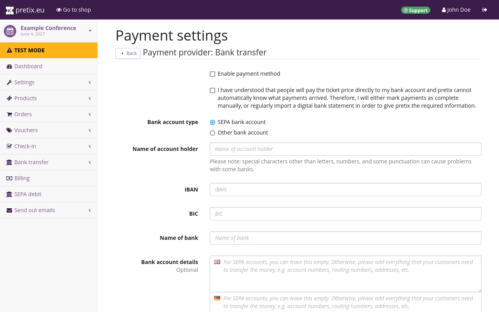

# Payment Providers

Payment providers are the means by which your customers can pay for their purchases in your ticket shop. 
There are two types of payment providers: methods that are handled entirely within pretix, such as bank transfers and gift cards; and integrations with external services such as Stripe and PayPal. 
You have to enable and set up at least one payment provider if you want to receive payments from your customers via pretix. 
This article will show you how to do that. 

## Prerequisites

Setting up payment providers is handled on the event level, so you need to create an event first. 

Make sure you have an active account with each external payment provider you intend to use with pretix. 
For example, if you want to receive payments via PayPal, you need to have a PayPal business account. 

## How To 

Setting up payment providers in pretix involves the following steps: 

 1. Enable the plugin for the payment provider
 2. Connect to your account with the payment provider 
 3. Enter mandatory info on the settings page for the payment provider
 4. Make optional adjustments
 5. Enable the payment provider
 6. Repeat steps 1 through 5 for each payment provider you want to use
 7. Set deadlines and advanced settings

The following sections will guide you through those steps in detail. 

### Plugins for Payment Providers 

pretix allows handling payment via more than three dozen payment providers. 
There is a plugin for each one of them. 
You have to enable the plugins for every payment provider that you want to use for your event. 
This section is going to tell you how to do that. 

Navigate to [Your Event] → "Settings" → "Plugins". 
The "payment providers" tab displays our top recommendations for payment provider plugins: bank transfer, PayPal and Stripe at the top of the page. 
Below that, you can find the list of plugins for all other payment providers available in pretix. 
By default, the plugins for bank transfer, PayPal, Stripe and SEPA Direct debit will be active. 

Choose the payment providers that you want to use from the top recommendations and the list and click the :btn:Enable: button next to them. 
You can tell that a plugin is enabled by the green "✓ Active" tag and the purple :btnEnable: button being replaced by a white :btn:Disable: button. 
Disable any active plugins that you do not want to use for your event. 

### Settings for Payment Providers 

Enabling a plugin does not yet make the payment method available in your shop. 
You also need to provide some data for each payment provider you want to use on the settings page. 
This section is going to tell you how to do that. 

Navigate to [Your Event] → "Settings" → "Payment". 
The "payment providers" tab on this page displays the list of active payment providers. 
By default, this list includes bank transfer, gift card, PayPal, SEPA debit and Stripe; gift card is enabled and all other entries are disabled. 
If you have enabled or disabled any of the default plugins for payment providers, your list will look different. 
Every payment provider that you have enabled the plugin for on the "plugins" page appears in this list. 
The list will also always contain the entry for gift cards. 
Gift cards are the only payment method that is not handled by a plugin since gift cards are part of the core functions of the pretix software. 

You can edit and enable payment providers by clicking the :btn:⚙ Settings: button next to them. 
Each payment method requires some mandatory information and settings before you can enable it. 
For example, the settings page for bank transfer requires you to enter your bank details and to check a box confirming that you have understood the specific conditions that apply to this payment method. 
You can also apply a wide range of optional settings to each payment provider. 
For example, you can restrict availability of the payment method by date, country and sales channel. 

If the payment provider is an external service, the settings page only contains a button for connecting with your account on that service. 
Once the connection has been confirmed, the settings page for the payment provider will display the usual settings. 
For detailed information on how to set up and enable specific payment providers, refer to the next three sections. 

### Bank transfer 

This section is going to tell you how to set up bank transfers as a method for receiving payments via pretix. 
Navigate to [Your Event] → "Settings" → "Payment". 
On the "payment providers" tab, click on the :btn:Settings: button next to the entry for "bank transfer" in the list. 
This takes you to the settings page for bank transfers. 

### PayPal

This section is going to tell you how to connect to your PayPal account and use it to receive payments via pretix. 

### Stripe

This section is going to tell you how to connect to your PayPal account and use it to receive payments via pretix. 

For example, the settings page for Stripe contains a :btn:Connect with Stripe: button. 
Clicking this button redirects you to stripe.com and opens a dialog for authorizing the connection between your Stripe and pretix accounts. 
Once the connection has been confirmed, the settings page for the payment provider contains the usual mandatory and optional settings. 

### Deadlines

Navigate to [Your Event] → "Settings" → "Payment". 
The "deadlines" tab lets you set payment terms measured in either days or minutes. 
By default, the payment term for your customers is set to 14 days. 
This page also lets you make optional adjustments such as a last day of payment, an additional expiration delay beyond the time communicated to your customer, and the option to only end payment terms on weekdays. 

!!! Note
 
    Payment deadlines are configured on the event level. The same settings apply to all payment providers. 

## Troubleshooting 

__A payment provider does not show up in [Your Event] → "Settings" → "Payment"__
Navigate to [Your Event] → "Settings" → "Plugins" and open the "payment providers" tab. 
Enable the corresponding plugin. 
Make sure it has the green "✓ Active" tag next to it. 

__A payment provider does not show up in your test shop/Customers cannot select a payment method during their purchase__ 
Navigate to [Your Event] → "Settings" → "Payment" and open the "payment" tab. 
Click the :btn:⚙ Settings: button next to the payment provider that isn't showing up in the shop. 
Check the "☑ Enable payment method" box. 
Then scroll to the bottom of the page and click :btn:Save:. 
If any mandatory information hasn't been filled out yet, the webpage will notify you. 
Fill out all the mandatory information and click :btn:Save: again. 
The corresponding payment method should now show up in your online shop. 

## Further Information

Here is the full list of articles on setting up and using specific payment providers: 

 -  [Bank transfer](payment/bank-transfer.md) 
 -  [Stripe](payment/stripe.md) 
 -  [PayPal](payment/paypal.md) 

## See Also 

Link to other relevant topics, for example, in the case of Payment Providers, link to the articles on payment settings and plugins. 
Do not link to pages already linked underneath the title heading, prerequisites, or further information. 