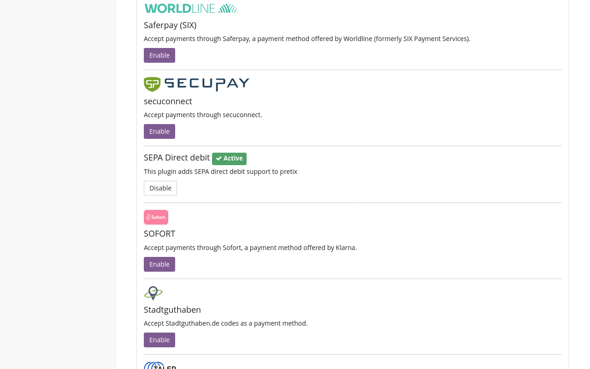

# Title

Plugins are optional parts of pretix that can be installed to extend the available functionality and that can be turned on or off completely for every event. For your event, a number of plugins might be active already, but you can unlock even more functionality by going to “Settings” → “Plugins” and enable more of them, if you need.

For each plugin, you will find a short description as well as an Enable/Disable button. The pretix website has an overview of available plugins and more details of them. If you are on the pretix.eu hosted service, look for the “pretix Hosted” badge in the plugin list to learn which ones are supported there.

If you are running pretix on your own server, refer to the installation manual of your installation type to learn how to install additional plugins (manual or Docker).

This part of the documentation contains information about available plugins that can be used to extend pretix’s functionality. If you want to create a plugin, please go to the Developer documentation instead.

## Prerequisites

What conditions have to be met for this information to be applicable? Which settings have to be adjusted, which plugins have to be activated, which previous knowledge is assumed by the article? 

## How To 

What does the feature do? How do you use it? How do you apply it to your individual use case? This is the main body of the article. 

### Plugins for Payment Providers 

pretix allows handling payment via more than three dozen payment providers. 
There is a plugin for each one of them. 
You have to enable the plugins for every payment provider that you want to use for your event. 
This section is going to tell you how to do that. 

Navigate to :navpath:Your Event → Settings → Plugins:. 
The :btn:payment providers: tab displays our top recommendations for payment provider plugins: bank transfer, PayPal and Stripe at the top of the page. 
Below that, you can find the list of plugins for all other payment providers available in pretix. 
By default, the plugins for bank transfer, PayPal, Stripe and SEPA Direct debit will be active. 

Choose the payment providers that you want to use from the top recommendations and the list and click the :btn:Enable: button next to them. 
You can tell that a plugin is enabled by the green "✓ Active" tag and the purple :btn:Enable: button being replaced by a white :btn:Disable: button. 
Disable any active plugins that you do not want to use for your event. 

## Troubleshooting 

What are common problems that could be encountered here? How do you solve them? 

## Further Information

What other media do we have on the topic? Youtube videos, PDF handouts, vendor documentation (for plugins etc.) etc.? Link it here and explain what it does

## See Also 

Link to other relevant topics, for example, in the case of Payment Providers, link to the articles on payment settings and plugins. Do not link to pages already linked underneath the title heading, prerequisites, or further information. 