# Product structure 

A product is anything sold via pretix: tickets, gift cards, conference t-shirts and so on. 
pretix offers you almost unlimited possibilities for configuring and structuring products. 
This article guides you through the basic process of creating a product and explains several practical applications of some of the more advanced features of pretix. 

## Prerequisites

Products are configured on the event level, so you have to create an event first. 

## General usage

This section guides you through the basic process of product creation. 
This involves first creating categories, then the products themselves, and finally quotas. 
You cannot create a product without choosing a category for it. 
You cannot create a quota without adding at least one product to it. 
So this sequence of actions is the most sensible. 

### Creating and editing categories

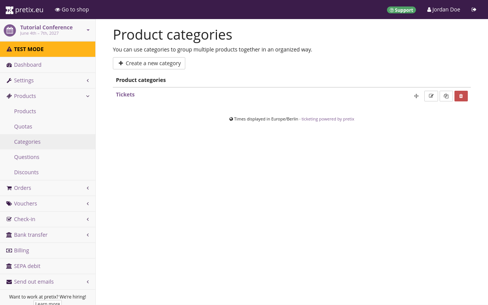 

Categories separate standalone products from additional products. 
If you want to sell not only admission tickets, but also extras such as stickers, you have to have at least two different categories. 
You also need an extra category if you are planning to use the cross-selling feature. 
Sorting products into categories can help you better keep track of them in the backend. 
Finally, your shop page will display products grouped by categories which can help customers find the article they are looking for more easily. 

In order to edit categories, navigate to :navpath:Your event → :fa3-ticket: Products → Categories:. 
This page shows the list of all product categories. 

Click the :btn-icon:fa3-plus: Create a new category: button and give the new category a descriptive name. 
Choose the category type depending on the type of products in this category: normal, add-on, cross-selling, or normal + cross-selling. 

Normal products are standalone products that can be purchased directly. 
Add-on products are products that are only offered as add-ons to normal products. 
Cross-selling products are products that are only offered in the cross-selling step as a customer is purchasing other products. 
Finally, products in the "normal + cross-selling" category are both offered as standalone products and in the cross-selling step. 
The "Cross-selling condition" setting below determines how products in cross-selling and normal + cross-selling categories are offered in your shop. 

Click the :btn:Save: button at the bottom of the page. 
This takes you back to the product categories page, which now also lists the newly created category. 

You can also edit an already existing category and change its name, description and type by clicking its name or the :btn-icon:fa3-edit:: edit button next to it in the list. 

### Creating and editing products

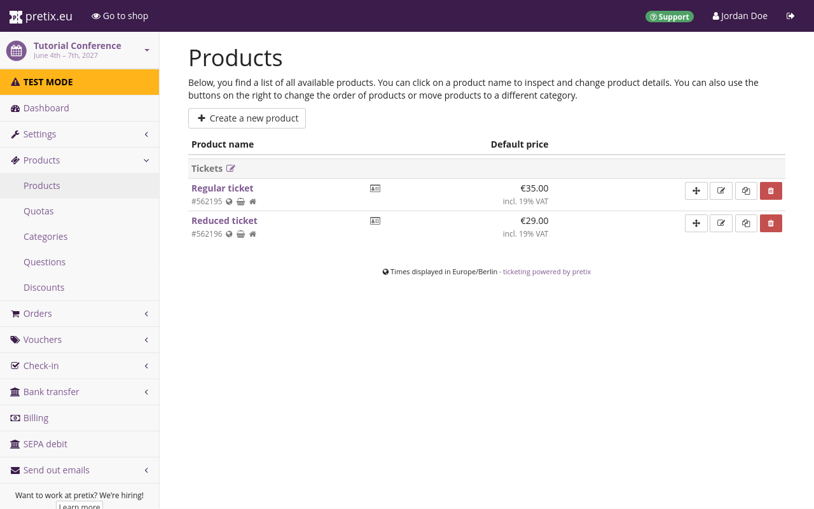 

If you want to create or edit products, navigate to :navpath:Event → :fa3-ticket: Products → Products:. 
This page shows the list of all products. 
Click the :btn-icon:fa3-plus: Create a new product: button. 
Choose a name, a description, a default price and a sales tax and click the :btn:Save: button. 

You can also edit an already existing product by clicking its name or the :btn-icon:fa3-edit:: edit button next to it in the list. 

### Creating and editing quotas 

A quota determines how many instances of your product can be sold. 
Every product has to be part of at least one quota before it becomes available in the shop. 

If you want to create or edit quotas, navigate to :navpath:Event → :fa3-ticket: Products → Quotas:. 
This page shows the list of all quotas for the event as well as the total capacity and how many items are left for each quota. 

Click the :btn-icon:fa3-plus: Create a new quota: button. 
Choose a name and a capacity, check the products to be contained in this quota, and any advanced options, and then click the :btn:Save: button. 

You can also edit an already existing quota by clicking its name or the :btn-icon:fa3-edit:: edit button next to it in the list. 

## Applications 

This section covers advanced use cases and how to implement them using the options pretix offers for customizing products. 

### Multiple price levels 

You may need more than a single price for admission tickets for your event—for example, if you are selling discount tickets for pensioners or students. 
In order to do so, first create the basic admission ticket and configure it according to your requirements. 
Then, clone the ticket once for each differing price level. 
Adjust the name and the price of each cloned ticket. 

Add all products to one general quota. 
Set the capacity of the quota to the maximum number of tickets you want to sell. 

If you want to place an additional limit on the number of discount tickets available, create another quota and set the capacity to the maximum number of discount tickets you want to sell. 
Add only the discount tickets to this quota. 
pretix will subtract from both quotas whenever a discount ticket is sold, and only subtract from the general quota when a regular ticket is sold. 

### Early-bird tiers based on dates 

Let's say you run a conference with the following pricing scheme:

 - 12 to 6 months before the event: € 450
 - 6 to 3 months before the event: € 550
 - closer than 3 months to the event: € 650

Of course, you could just set up one product and change its price at the given dates manually, but if you want to set this up automatically, here's how:

Create three products (e.g. "super early bird", "early bird", "regular ticket") with the respective prices and one shared quota of your total event capacity. 
Then, set the "available from" and "available until" configuration fields of the products to automatically activate and deactivate them for sale based on the current date.

If you're in an event series, this will likely not help you since these dates would need to be the same for all dates in your series. 
As an alternative, you can go to the "Dates" section of your event series, select one or more dates, and scroll down to the "product settings" section. 
Here, you can also define availability times for individual products just for this date individually.

### Early-bird tiers based on ticket numbers

Let's say you run a conference with 400 tickets with the following pricing scheme:

 - First 100 tickets ("super early bird"): € 450
 - Next 100 tickets ("early bird"): € 550
 - Remaining tickets ("regular"): € 650

First of all, create three products:

 - "Super early bird ticket"
 - "Early bird ticket"
 - "Regular ticket"

Then, create three quotas:

 - "Super early bird" with a size of 100 and the "Super early bird ticket" product selected. 
   At "Advanced options", select the box "Close this quota permanently once it is sold out".
 - "Early bird and lower" with a size of 200 and both of the "Super early bird ticket" and "Early bird ticket" products selected. 
   At "Advanced options", select the box "Close this quota permanently once it is sold out".
 - "All participants" with a size of 400, all three products selected and no additional options.

Next, modify the product "Regular ticket". 
In the section "Availability", you should look for the option "Only show after sellout of" and select your quota "Early bird and lower". 
Do the same for the "Early bird ticket" with the quota "Super early bird ticket".

This will ensure the following things:

 - Each ticket level is only visible after the previous level is sold out.
 - As soon as one level is really sold out, it's not coming back, because the quota "closes", i.e. locks in place.
 - By creating a total quota of 400 with all tickets included, you can still make sure to sell the maximum number of tickets, even if e.g. early-bird tickets are canceled.

Optionally, if you want to hide the early bird prices once they are sold out, go to "Settings", then "Display" and select "Hide all products that are sold out". 
Of course, it might be a nice idea to keep showing the prices to remind people to buy earlier next time ;)

Please note that there might be short time intervals where the prices switch back and forth: 
When the last early bird tickets are in someone's cart (but not yet sold!), the early bird tickets will show as "Reserved" and the regular tickets start showing up. 
However, if the customers holding the reservations do not complete their order, the early bird tickets will become available again. 
This is not avoidable if we want to prevent malicious users from blocking all the cheap tickets without an actual sale happening.

### Workshops at a conference 

When running a conference, you might also organize a number of workshops with smaller capacity. 
To be able to plan, it would be great to know which workshops an attendee plans to attend.

#### Option A: Questions

Your first and simplest option is to just create a multiple-choice question. 
This has the upside of making it easy for users to change their mind later on, but will not allow you to restrict the number of attendees signing up for a given workshop – or even charge extra for a given workshop.

#### Option B: Add-on products with fixed time slots

The usually better option is to go with add-on products. 
Let's take for example the following conference schedule, in which the lecture can be attended by anyone, but the workshops only have space for 20 persons each:

| Time                | Room A     | Room B                         |
|---------------------|------------|--------------------------------|
| Wednesday morning   | Lecture    |                                |
| Wednesday afternoon | Workshop A | Workshop B                     |
| Thursday morning    | Workshop C | Workshop D (20 € extra charge) |

Assuming you already created one or more products for your general conference admission, we suggest that you additionally create:

 - A category called "Workshops" with the checkbox "Products in this category are add-on products" activated
 - A free product called "Wednesday afternoon" within the category "Workshops" and with two variations:
   - Workshop A
   - Workshop B
 - A free product called "Thursday morning" within the category "Workshops" and with two variations:
   - Workshop C
   - Workshop D with a price of 20 €
 - Four quotas for each of the workshops
 - One add-on configuration on your base product that allows users to choose between 0 and 2 products from the category "Workshops"

#### Option C: Add-on products with variable time slots

The above option only works if your conference uses fixed time slots and every workshop uses exactly one time slot. 
If your schedule looks like this, it's not going to work great:

| Time        | Room A                  | Room B                   |
|-------------|-------------------------|--------------------------|
| 09:00-11:00 | Talk 1                  | Workshop 1 (first half)  |
| 11:00-13:00 | Talk 2                  | Workshop 1 (second half) |
| 14:00-16:00 | Workshop 2 (first half) | Talk 3                   |
| 16:00-18:00 | Workshop 2 (second half | Talk 4                   |

In this case, we recommend that you go to Settings, then Plugins and activate the plugin Agenda constraints.

Then, create a product (without variations) for every single part that should be bookable (talks 1-4 and long workshops 1 and 2) as well as appropriate quotas for each of them.

All of these products should be part of the same category. 
In your base product (e.g. your conference ticket), you can then create an add-on product configuration allowing users to add products from this category.

If you edit these products, you will be able to enter the "Start date" and "End date" of the talk or workshop close to the bottom of the page. 
If you fill in these values, pretix will automatically ensure no overlapping talks are booked.

!!! Note

    This option is currently only available on pretix Hosted. If you are interested in using it with pretix Enterprise, please contact sales@pretix.eu.

### Discount packages 

Imagine you run a trade show that opens on three consecutive days and you want to have the following pricing:

 - Single day: € 10
 - Any two days: € 17
 - All three days: € 25

In this case, there are multiple different ways you could set this up with pretix.

#### Option A: Combination products

With this option, you just set up all the different combinations someone could by as a separate product. In this case, you would need 7 products:

 - Day 1 pass
 - Day 2 pass
 - Day 3 pass
 - Day 1+2 pass
 - Day 2+3 pass
 - Day 1+3 pass
  - All-day pass

Then, you create three quotas, each one with the maximum capacity of your venue on any given day:

 - Day 1 quota, linked to "Day 1 pass", "Day 1+2 pass", "Day 1+3 pass", and "All-day pass"
 - Day 2 quota, linked to "Day 2 pass", "Day 1+2 pass", "Day 2+3 pass", and "All-day pass"
 - Day 3 quota, linked to "Day 3 pass", "Day 2+3 pass", "Day 1+3 pass", and "All-day pass"

This way, every person gets exactly one ticket that they can use for all days that they attend. You can later set up check-in lists appropriately to make sure only tickets valid for a certain day can be scanned on that day.

The benefit of this option is that your product structure and order structure stays very simple. However, the two-day packages scale badly when you need many products.

We recommend this setup for most setups in which the number of possible combinations does not exceed the number of parts (here: number of days) by much.

#### Option B: Add-ons and bundles

We can combine the two features "product add-ons" and "product bundles" to set this up in a different way. Here, you would create the following five products:

 - Day 1 pass in a category called "Day passes"
 - Day 2 pass in a category called "Day passes"
 - Day 3 pass in a category called "Day passes"
 - Two-day pass
 - All-day pass

This time, you will need five quotas:
 - Day 1 quota, linked to "Day 1 pass"
 - Day 2 quota, linked to "Day 2 pass"
 - Day 3 quota, linked to "Day 3 pass"
 - Two-day pass quota, linked to "Two-day pass" (can be unlimited)
 - All-day pass quota, linked to "All-day pass" (can be unlimited)

Then, you open the "Add-On" tab in the settings of the Two-day pass product and create a new add-on configuration specifying the following options:

 - Category: "Day passes"
 - Minimum number: 2
 - Maximum number: 2
 - Add-Ons are included in the price: Yes

This way, when buying a two-day pass, the user will be able to select exactly two days for free, which will then be added to the cart. 
Depending on your specific configuration, the user will now receive two separate tickets, one for each day.

For the all-day pass, you open the "Bundled products" tab in the settings of the All-day pass product and add three new bundled items with the following options:

 - Bundled product: "Day 1/2/3"
 - Bundled variation: None
 - Count: 1
 - Designated price: 0

This way, when buying an all-day pass, three free day passes will automatically be added to the cart. 
Depending on your specific configuration, the user will now receive three separate tickets, one for each day.

This approach makes your order data more complicated, since e.g. someone who buys an all-day pass now technically bought four products. However, this option allows for more flexibility when you have lots of options to choose from.

!!! Tip

    Depending on the packages you offer, you might not need both the add-on and the bundle feature, i.e. you only need the add-on feature for the two-day pass and only the bundle feature for the all-day pass. 
    You could also set up the two-day pass like we showed here, but the all-day pass like in option A!

### Group discounts 

Often times, you want to give discounts for whole groups attending your event.

#### Automatic discounts

pretix can automatically grant discounts if a certain condition is met, such as a specific group size. 
To set this up, head to **Products**, **Discounts** in the event navigation and **Create a new discount**. 
You can choose a name so you can later find this again. 
You can also optionally restrict the discount to a specific time frame or a specific sales channel.

Next, either select **Apply to all products** or create a selection of products that are eligible for the discount.

For a **percentual group discount** similar to “if you buy at least 5 tickets, you get 20 percent off", set **Minimum number of matching products** to “5" and **Percentual discount on matching products** to “20.00".

For a **buy-X-get-Y discount**, e.g. “if you buy 5 tickets, you get one free", set **Minimum number of matching products** to “5", **Percentual discount on matching products** to “100.00", and **Apply discount only to this number of matching products** to “1".

#### Fixed group packages

If you want to sell group tickets in fixed sizes, e.g. a table of eight at your gala dinner, you can use product bundles. Assuming you already set up a ticket for admission of single persons, you then set up a second product **Table (8 persons)** with a discounted full price. Then, head to the **Bundled products** tab of that product and add one bundle configuration to include the single admission product **eight times**. Next, create an unlimited quota mapped to the new product.

This way, the purchase of a table will automatically create eight tickets, leading to a correct calculation of your total quota and, as expected, eight persons on your check-in list. You can even ask for the individual names of the persons during checkout.

#### Minimum order amount

If you want to promote discounted group tickets in your price list, you can also do so by creating a special **Group ticket** at the reduced per-person price and set the **Minimum amount per order** option of the ticket to the minimal group size.

For more complex use cases, you can also use add-on products that can be chosen multiple times.

This way, your ticket can be bought an arbitrary number of times – but no less than the given minimal amount per order.

### Restricted audience 

Not all events are for everyone. 
Sometimes, there is a good reason to restrict access to your event or parts of your event only to a specific, invited group. 
There are three ways to implement this with pretix:

#### Option A: Required voucher codes

You can use vouchers to make a product (or multiple products) only available to a select group of invited guests. 
Refer to [Vouchers: Exclusive product availability](vouchers.md#exclusive-product-availability) for detailed instructions. 

#### Option B: Order approvals

If you do not know your audience already, but still want to restrict it to a certain group, e.g. people with a given profession, you can check the "Buying this product requires approval" in the settings of your product. 
If a customer tries to buy such a product, they will be able to place their order but can not proceed to payment. 
Instead, you will be asked to approve or deny the order and only if you approve it, we will send a payment link to the customer.

This requires the customer to interact with the ticket shop twice (once for the order, once for the payment) which adds a little more friction, but gives you full control over who attends the event.

#### Option C: Registered customers & memberships

You can also do this by requiring that customers have a [customer account](customer-accounts.md) and an active membership. 
You can find more information on this mechanism under [season tickets](products.md#season-tickets).

### Time slots 

A more advanced use case of pretix is using pretix for time-slot-based access to an area with a limited visitor capacity, such as a museum or other attraction. 
This guide will show you the quickest way to set up such an event with pretix.

First of all, when creating your event, you need to select that your event represents an "event series":

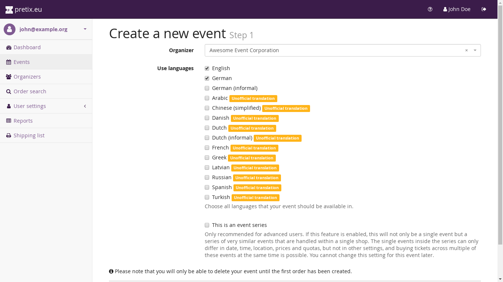

You can click here for a more general description of event series with pretix, but everything you need to know is in this chapter as well.
TK nach dem Mergen auf event-series.md verlinken 

#### Creating slots

To create the time slots, you need to create a number of "dates" in the event series. 
Select "Dates" in the navigation menu on the left side and click "Create many new dates". 
Then, first enter the pattern of your opening days. 
In the example, the museum is open week Tuesday to Sunday. 
We recommend to create the slots for a few weeks at a time, but not e.g. for a full year, since it will be more complicated to change things later.

Then, scroll to the times section and create your time slots. 
You can do any interval you like. 
If you have different opening times on different week days, you will need to go through the creation process multiple times.

Scroll further down and create one or multiple quotas that define how many people can book a ticket for that time slot. 
In this example, 50 people in total are allowed to enter within every slot:

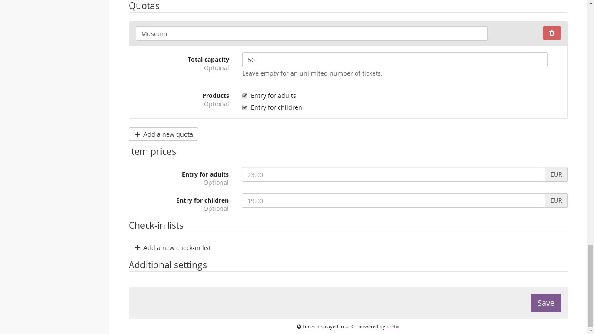

Do **not** create a check-in list at this point. We will deal with this further below in the guide. Now, press "Save" to create your slots.

!!! Warning

    If you create a lot of time slots at once, the server might need a few minutes to create them all in our system. If you receive an error page because it took too long, please do not try again immediately but wait for a few minutes. Most likely, the slots will be created successfully even though you saw an error.

#### Event settings

We recommend that you navigate to "Settings" > "General" > "Display" and set the settings "Default overview style" to "Week calendar":

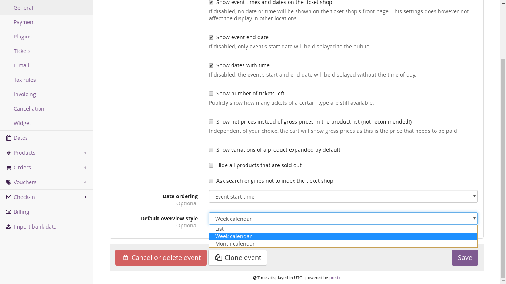

Now, your ticket shop should give users a nice weekly overview over all time slots and their availability:

#### Check-in

If you want to scan people at the entrance of your event and only admit them at their designated time, we recommend the following setup: 
Go to "Check-in" in the main navigation on the left and create a new check-in list. 
Give it a name and do not choose a specific data. We will use one check-in list for all dates. 
Then, go to the "Advanced" tab at the top and set up two restrictions to make sure people can only get in during the time slot they registered for. 
You can create the rules exactly like shown in the following screenshot:

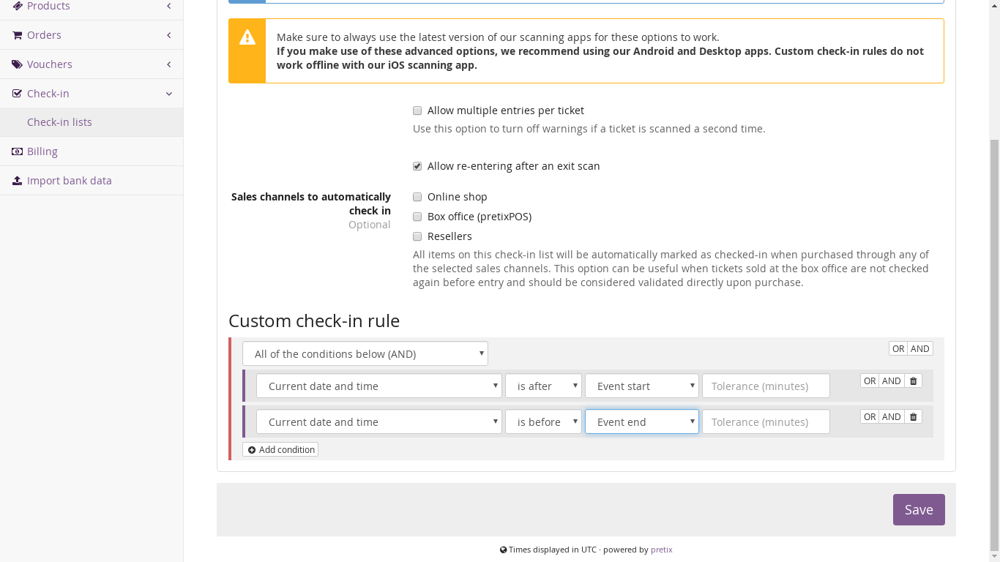

If you want, you can enter a tolerance of e.g. "10" if you want to be a little bit more relaxed and admit people up to 10 minutes before or after their time slot.

Now, download our Android or Desktop app and register it to your account. 
The app will ask you to select one the time slots, but it does not matter, you can select any one of them and then select your newly created check-in list. 
That's it, you're good to go!

### Season tickets

Season tickets and similar time-based tickets are popular for swimming pools, sports clubs, theaters and lots of other types of venues. In this article, we show you different ways to set them up with pretix. Of course, other types of tickets such as week tickets, month tickets or tickets of ten can be created with the same mechanism.

There is a big difference between the two ways we show below.

With Option A, a customer who purchases a season ticket creates an account with their email address and a password and the season ticket will be saved in that account. If the customer wants to use the season ticket, they need to buy an additional free ticket for the specific event they want to visit. This makes sense for all events or venues with limited capacity or reserved seating, because it still allows you to set an upper limit of people showing up for a specific event or time slot.

With Option B, a customer who purchases a season ticket receives a single ticket with a single QR code that can be used an unlimited number of times. This makes sense if the capacity of your venue is virtually unlimited and you do not need to know in advance how many season ticket holders will show up.

#### Option A: Memberships and multiple tickets

Since this approach requires customers to be identified with a customer account, you first need to enable the customer accounts feature in your organizer settings in the "Customer accounts" tab.

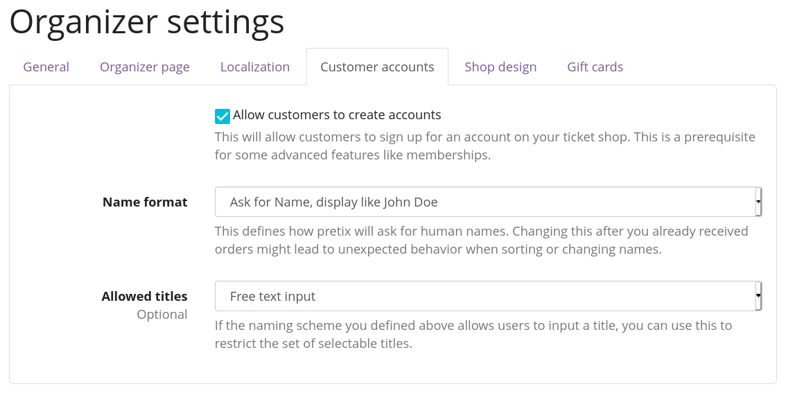

After doing so, a new menu item "Customer accounts" will also show up in the main menu of your organizer account on the left. 
Open it's menu and click on "Membership types". Then, select to "create a new membership type".

You can name the membership type in a way that clearly explains where it is valid, e.g. "season pass main location" or "season pass all locations". 
There are a few details you can configure on this page, such as whether the season pass can be used by multiple different persons, or if the season pass can be used for multiple tickets for the same time slot. 
You can also define a maximum number of usages, which is useful if you e.g. use this feature to add a "ticket of ten".

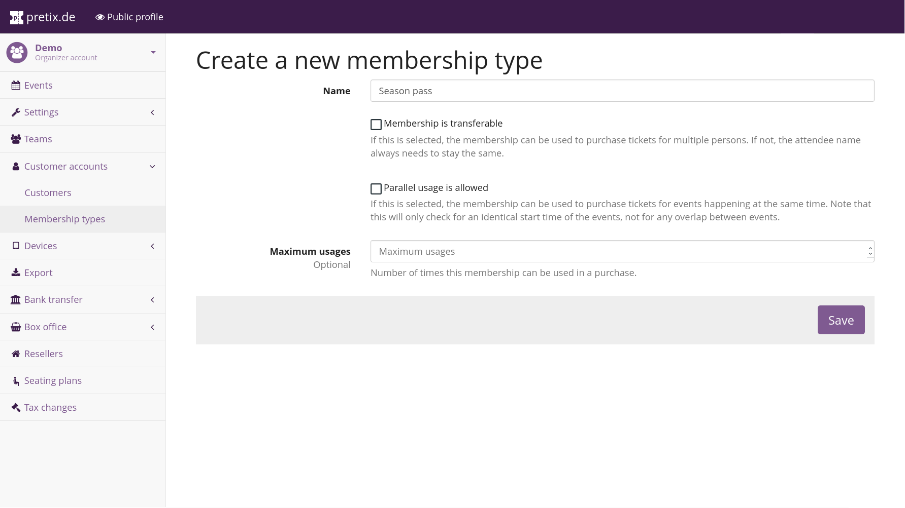

Next, you need a way of selling these season passes. 
Theoretically this can be done through the same event series that you usually use, but it's probably cleaner and easier to find for customers if you create a new event that you only use to sell season passes. 
The start and end date of the new event should correspond to the dates of your season.

Inside the new event, you only need to create a single product which you can call "season ticket". 
Inside that product's settings, head to the "Additional settings" section and look for the option "This product creates a membership of type". 
Select the membership type you just created. 
By default, the checkbox "The duration of the membership is the same as the duration of the event or event series date" is active, which is fine for our season ticket example, but you might need to unset it and provide custom timing for other ticket types such as week passes.

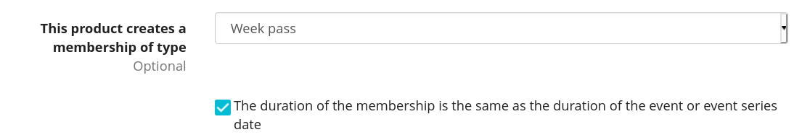

To prevent confusion, it might be useful to turn off ticket downloading at "Settings" → "Tickets" for your new event. 
That's it, you are now ready to sell season tickets!

We can now deal with how to use the season tickets. 
Move back to your existing event and create a new product or product variation of your regular product which you call "ticket for season ticket holders" and assign a price of zero. 
In the "Availability" section of the product or variation settings, check the option "Require a valid membership" and again select the membership type you created. 
You can of course repeat this with all events the season ticket holder should have access to.

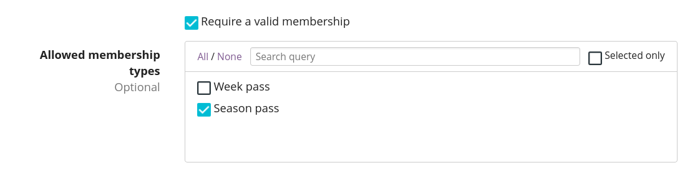

#### Option B: All-access in a single pass

If you have only a single event series with many time slots and you do not care how many season ticket holders show up, there's a solution that does not require your customers to set up accounts and book a new ticket on every visit.

Instead, you can just create an additional product "Season ticket" that you enable either in a "special" date of your event series just created for this purpose, or in all of your dates so it can be easily found by customers.

Then, you can set up your check-in lists with custom logic in the "Advanced" tab of your check-in list settings. 
The logic needs to ensure the following requirements:

 - Regular ticket holders can only get in during their assigned time frame and when they haven't used their ticket before.
 - Season ticket holders can always get in.

Here's an example on how to set this up:

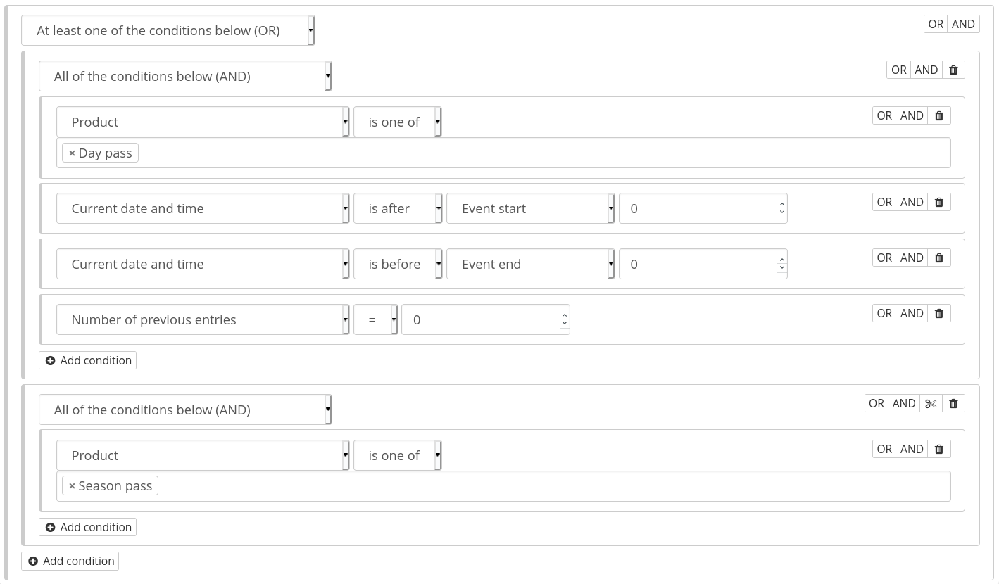

### Mixed taxation 

Let's say you are a charitable organization in Germany and are allowed to charge a reduced tax rate of 7% for your educational event. 
However, your event includes a significant amount of food, you might need to charge a 19% tax rate on that portion. 
For example, your desired tax structure might then look like this:

 - Conference ticket price: € 450 (incl. € 150 for food)

  - incl. € 19.63 VAT at 7%

  - incl. € 23.95 VAT at 19%

You can implement this in pretix using product bundles. In order to do so, you should create the following two products:

 - Conference ticket at € 450 with a 7% tax rule

 - Conference food at € 150 with a 19% tax rule and the option “Only sell this product as part of a bundle" set

In addition to your normal conference quota, you need to create an unlimited quota for the food product.

Then, head to the Bundled products tab of the “conference ticket" and add the “conference food" as a bundled product with a designated price of € 150.

Once a customer tries to buy the € 450 conference ticket, a sub-product will be added and the price will automatically be split into the two components, leading to a correct computation of taxes.

## Troubleshooting 

### A product does not appear in the ticket shop 

If you have created a product and it is not displayed in your ticket shop, perform the following checks: 

 1. Check if the product's "active" checkbox is enabled.

 2. Check if the product's "Available from" or "Available until" settings restrict it to a date range.

 3. Check if the product's checkbox "This product will only be shown if a voucher matching the product is redeemed." is enabled. 
 If this is the case, the product will  only be shown if the customer redeems a voucher that directly matches to this product. 
 It will not be shown if the voucher only is configured to match a quota that contains the product.

 4. Check if the product is in a category that has the "Products in this category are add-on products" checkbox enabled. 
 If this is the case, the product won't show up on the shop front page, but only in the first step of checkout when a product in the cart allows to add add-on products from this category.

 5. Check that a quota exists that contains this product. 
 If your product has variations, check that at least one variation is contained in a quota. 
 If your event is an event series, make sure that the product is contained in a quota that is assigned to the series date that you access the shop for.

 6. If the sale period has not started yet or is already over, check the "Show items outside presale period" setting of your event.