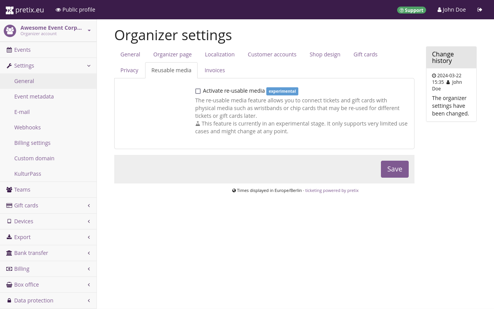

# Reusable media 

 

Reusable media are currently an experimental feature. We recommend that you do not enable reusable media unless you have a specific use case in mind. Please contact us if you intend to use reusable media for your event. 
