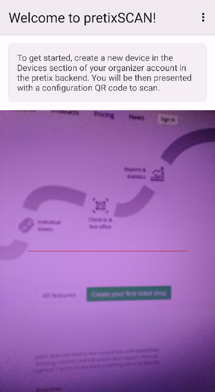
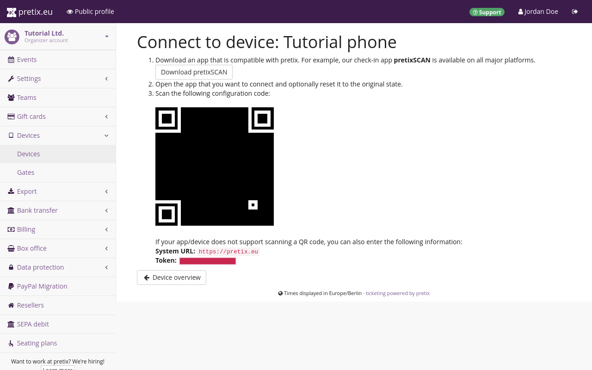

# pretixSCAN—Android app 

pretixSCAN is a powerful Android application that helps you handle the check-in at your events. 
The primary function of pretixSCAN is to validate tickets, but it also offers many other features, such as: 

 - searching for participants manually if they do not have their ticket on hand 

This article will tell you how to get install pretixSCAN for **Android** and how to make use of its features. 

pretixSCAN is also available for Windows, Linux, and iOS. 
Those versions of the software will be documented on separate pages. 
This article is about the Android version of pretixSCAN, which is also the most feature-rich version of the application. 

pretixSCAN is not to be confused with our other apps: pretixPRINT, which takes care of the printing of tickets, badges and receipts for you; pretixPOS, which handles product sales; or pretixLEAD, which collects and manages contact data of attendees at your event. 

## Prerequisites

pretixSCAN is meant for use with an event hosted using pretix. 
This article assumes that you are hosting an event with pretix. 

You need to have access to a device running Android version 5 or newer; for full functionality, Android version 6 or newer. 
The device also needs to have a camera or integrated code scanner. 
See our [support policy](https://docs.pretix.eu/en/latest/user/android-version-support.html#pretixscan) for more information. 

You also need a separate device from which you can access the pretix backend while you are setting up your device running pretixSCAN. 

## How To

### Installation and setup 

pretixSCAN comes preinstalled on the scanner smartphones that are available for rent and for sale on our website. 
You can skip this step if you are using devices that you rented or bought from us. 
For more information on our hardware offers, visit [our website](https://pretix.eu/about/en/hardware/scan). 

 

You can install pretixSCAN on your Android device [through the Google Play Store](https://play.google.com/store/apps/details?id=eu.pretix.pretixscan.droid) like any other app. 
When you launch pretixSCAN for the first time, confirm that you understand the privacy and security implications of storing attendee data on your device. 
You have to grant pretixSCAN access to the device's camera in order to use the core functionality of validating tickets. 
pretixSCAN will start accessing the scanner or camera instantly once you have granted permission. 
It will also display a text box telling you to create a new device in our organizer account in the pretix backend. 
The next section is going to tell you how to do that. 

### Connecting the device to the pretix backend 

 

Open the [pretix backend](https://pretix.eu/control/) and navigate to [Your organizer] :fontawesome-solid-arrow-right: ":fontawesome-solid-mobile-screen: Devices". 
Give the device a unique and recognizable name such as "Entrance B phone 1". 
You can authorize the device for all events or limit its access to certain events only. 
Select "pretixSCAN" from the "Security profile" dropdown menu. 

 

Once you click :btn:Save:, you will be taken to a page displaying a QR code. 
Use pretixSCAN on your Android device to scan the QR code. 
If you have trouble scanning the QR code, there is an alternative solution: 
Tap the three button menu in the top right corner of the pretixSCAN app and then tap "Manual setup". 
You will be asked to enter a system URL and a token. 
If you are using pretix Hosted, the system URL will always be https://pretix.eu. 
If you are self-hosting pretix (pretix Community or pretix Enterprise), you will have to enter the address of your server. 
Enter the token displayed in the backend in the field in the pretixSCAN app. 

 

Once you scanned the QR code or entered the token successfully, the app will ask you to select the event you want to scan tickets for. 
Check the event in the list or in the calendar and tap :btn:OK:. 
Then, select a check-in list and tap :btn:OK: again. 
The app will now land you on the main screen and download event data from the server. 

### Entry scanning

The app should now be in entry scanning mode, which is recognizable by the pictogram of a gray box with an arrow pointing to the right in the top right corner. 
If the pictogram is yellow and the arrow points to the left, that means that the app is in "exit scanning" mode. 
Switch to entry scanning by tapping the :btn-icon:material-dots-vertical:: button and :btn:Switch to entry scanning: in the popup menu. 

pretixSCAN will scan any QR code or barcode it can detect via the device's camera or scanner. 
Simply point the device at the code you want to scan. 
There are three possible results: 

 1. If the ticket is valid, has not been checked in yet, and allows entry under the current conditions, pretixSCAN displays a green box titled "Valid ticket". 
 It lists the ticket type, order number, and item number. 
 2. If the ticket is valid but has already been checked in and not checked out again, pretixSCAN displays a yellow box titled "Ticket already used". 
 It lists the ticket type, order number, and item number, and also the date and time when the ticket was first scanned. 
 3. In all other cases, pretixSCAN displays a red box with a title explaining the problem. 
 Explanations can include  "Invalid ticket", "Order canceled", or "Entry not allowed". 

 

If none of these things happen, then the code has not been scanned. 
Try adjusting the angle and distance between scanner and ticket or improving ambient lighting. 
You can turn the device's flashlight and automatic focus on or off with the buttons at the bottom of the screen. 
If you have trouble scanning a code from a mobile phone screen, ask the customer to increase screen brightness to maximum. 

### Searching for attendee data 

An alternative to scanning a ticket code is searching for attendee data in pretixSCAN. 
If an attendee arrives at the check-in without a ticket, but claiming that they have bought one, you can search for their data. 
Tap the :btn-icon:fontawesome-solid-magnifying-glass:: button at the top of the screen. 
In the search field, enter the attendee's name, order code, ticket secret, or any of the other data they have provided. 
Tap the matching result in the list. 
The app will now check the validity and check-in status of the ticket and return the same results as if the ticket was being scanned. 
This works in both entry scanning mode and exit scanning mode. 

## Troubleshooting 

What are common problems that could be encountered here? How do you solve them? 

## Further Information

 - [pretixSCAN repository on GitHub](https://github.com/pretix/pretixscan-android)
 - [Kurzanleitung pretixSCAN on Youtube (German)](https://www.youtube.com/watch?v=csy017Dm6vA)

## See Also 

Link to other relevant topics, for example, in the case of Payment Providers, link to the articles on payment settings and plugins. Do not link to pages already linked underneath the title heading, prerequisites, or further information. 