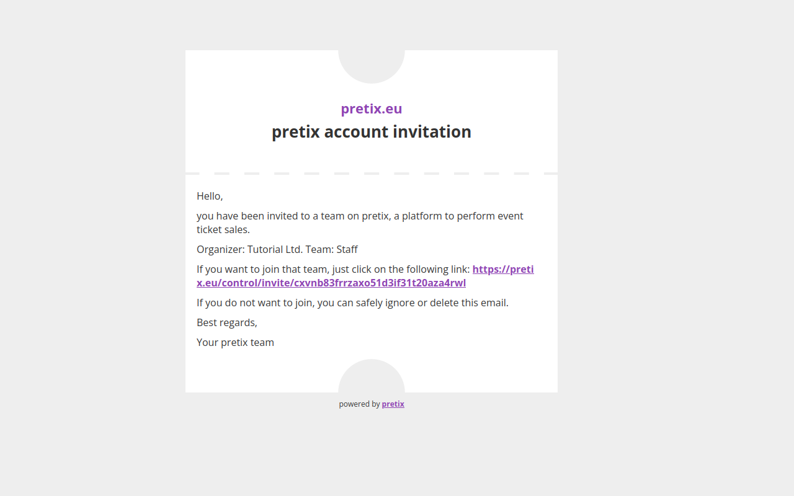

# Teams

You do not have to manage your events all by yourself. 
pretix allows you to invite people, organize them into multiple teams, and manage permissions as to who is allowed to access which settings and events. 
This article is going to tell you how use the "Teams" settings page, how to create teams, how to send out team invitations, and how to accept an such an invitation. 

## Prerequisites

This article assumes that you have administrator access to an organizer account—that is, that you have the rights to change teams and permissions within pretix. 
If you do not have access to an organizer account at all, then you are probably looking for the subsection on how to [accept an invitation to a team](teams.md#accepting-an-invitation-to-a-team). 

## General usage

 

Navigate to [Your organizer] :fontawesome-solid-arrow-right: ":fontawesome-solid-people-group: Teams". 
This page will list all teams that are associated with your organizer account. 
If you have not made any changes here, the list will contain a single entry named "Administrators" which contains you and has all possible permissions. 
You can view the list of members and API tokens of a team by clicking the :btn-icon:fontawesome-solid-list:: button next to it. 
You can view the settings and permissions by clicking the :btn-icon:fontawesome-solid-pen-to-square:: button. 

### Creating a new team

 

Click the :btn-icon:fontawesome-solid-plus: Create a new team: button. 
How you name your new team and which permissions you grant it is completely up to you. 
For example, you could name your team "Helpers" to distinguish it from the administrators, activate the requirement for two-factor authentication, and give it the following organizer permissions: 
"Can create events", "Can manage gift cards", and "Can manage customer accounts". 
You could give the team access to "All events (including newly created ones)" and grant it the following event permissions: 
"Can change event settings", "Can change product settings", "Can view orders", "Can change orders", "Can view vouchers", and "Can change vouchers". 

Again, the name and exact permissions you grant depend on your individual use case. 
You can always change these settings later, but you can prevent future problems and confusion by finalizing these choices before inviting anyone to the team. 
Clicking the :btn:Save: button creates the team and takes you to an overview of its members. 

### Inviting someone to your team

 

Navigate to [Your organizer] :fontawesome-solid-arrow-right: ":fontawesome-solid-people-group: Teams" and select the team for which you want to send out an invitation. 
You can invite someone to your team by entering their email address into the field at the bottom of the list of team members and clicking the :btn-icon:fontawesome-solid-plus: Add: button. 
If the person you added already has a pretix account, they will be granted access to this organizer account instantly.
They will appear in the list with either a gray or a green :fontawesome-solid-shield-halved: symbol next to them, indicating whether or not they have enabled two-factor authentication. 

If the person you added does not have a pretix account yet, they will receive an email containing an invitation for creating one. 
They will appear in the list with a :material-email-outline: symbol for their status as "invited, pending response" and a :btn-icon:fontawesome-solid-arrow-rotate-right:: button for resending the invitation email. 

This page also lets you add an API token that will grant access to the pretix API using the same level of permissions as the team members. 
For more information on API tokens, see our [API documentation](https://docs.pretix.eu/en/latest/api/tokenauth.html). 

### Accepting an invitation to a team

 

If you have been invited to a team and you do not have a personal pretix account yet, you will receive an email that looks similar to the one in the screenshot above. 
Clicking the link in that email takes you to a dialog where you can create an account by simply entering a password and clicking the :btn:Register: button. 
Once you have done that, you will land on the dashboard displaying a notification saying "Welcome to pretix! You are now part of the team 'Helpers'." 
You will now have access to the organizer account and associated events as specified by the person inviting you. 

 

If you have been invited to a team and you already have a personal pretix account, you can simply log in to pretix. 
You will now have access to the organizer account and associated events as specified by the person inviting you. 

## See Also 

If you came to this page from the tutorial, [this link](../tutorial/organizer-account.md)  will take you back there. 