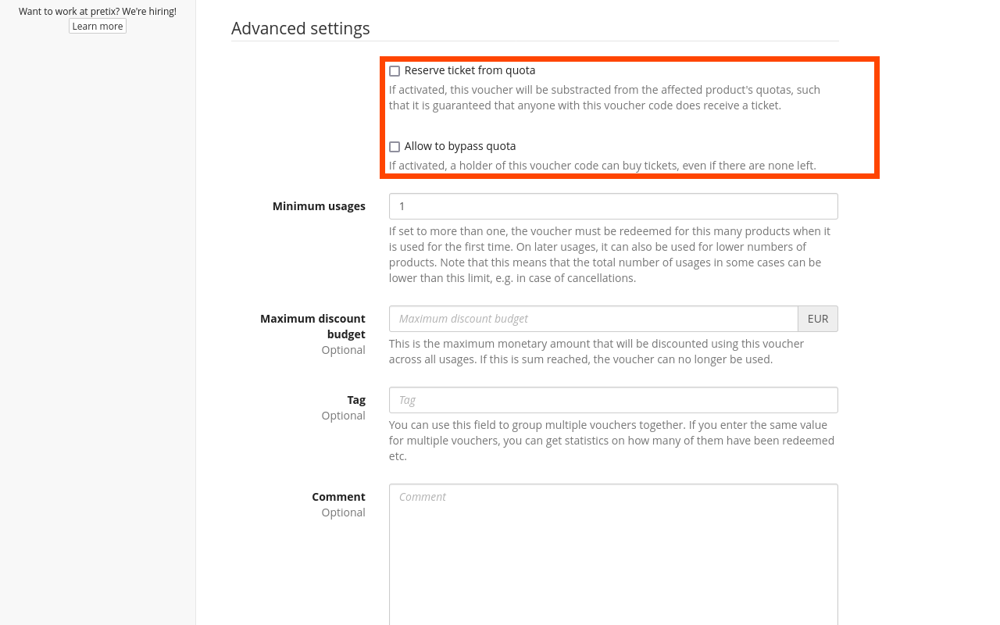

# Vouchers

Vouchers are codes which can be redeemed for certain products in your shop. 
pretix allows you to automatically generate these codes as well as associated URLs and send them out via email. 
Vouchers have several useful applications. 
You can use them to:

 - make products available at a reduced price for voucher holders
 - make a product available only to a select group of people (such as speakers at a conference or invited guests)
 - reserve a certain quantity of a product quota for voucher holders
 - make sure that voucher holders still have access to a product even if it is sold out
 - make products in your shop visible only to voucher holders

!!! Note 
    Vouchers are not to be confused with [gift cards](gift-cards.md). 
    Gift cards essentially function like an additional method of payment for your customers. 
    They always represent a fixed amount of money that is subtracted from the total of the order. 
    Gift cards can be used across different events and organizers and do not affect the availability and visibility of certain products. 

## Prerequisites

Vouchers are handled on the event level, so you first need to create the event for which you want to create vouchers. 
If you are using pretix Hosted, your account needs to be activated before you can send out vouchers via email. 

## General usage

The settings page for vouchers is located at :navpath:Your Event → :fontawesome-solid-tags: Vouchers:. 
It gives you an overview of all vouchers that have already been created as well as options for searching and filtering vouchers. 


### Creating a single voucher 

Clicking the :btn-icon:fontawesome-solid-plus: Create a new voucher: button takes you to a dialog for creating a single new voucher. 
This is useful for when you are planning to publish a single voucher code that can then either be used once or multiple times. 
The "Voucher code" field already contains an automatically generated suggestion, but you can change it and provide your own as long as it is at least 5 and no more than 255 characters in length. 
Any lower-case letters will be converted to upper case. 


Whenever you generate one or more vouchers, it is recommended that you copy them and save them, for example in a plain text file or a spreadsheet on your computer. 

Whenever you create more than one type of voucher for an event, it is recommended that you enter a descriptor in the "Tag" field. 
This can make it easier to find, edit and clone certain sets of vouchers in the list. 
A useful entry in the "Tag" field could be the purpose for which they were created, for example, "Limited Time Offer". 

The voucher will be created as soon as you click the :btn:Save: button. 
This will take you to the "Voucher details" page 
This page displays the "Voucher link" which you can send to your customers. 
Opening that link will take them to the shop with the voucher code preselected and all associated products visible. 
All settings that are available previous to creation can also be changed after the voucher has already been created. 

### Creating multiple vouchers 

The :btn-icon:fontawesome-solid-plus: Create multiple new vouchers: button takes you to a dialog for creating multiple new vouchers. 
Enter the number of voucher codes you want to create in the "Number" field. 
If you type anything into the "Prefix" field prior to generating the codes, then each code you generate will start with that prefix. 
Once you click :btn:Generate random codes:, the number of codes you specified will be displayed in the "Codes" field. 

You may also provide your own voucher codes by manually entering them into the "Codes" field. 
Codes are separated by line breaks, i.e., each code must be entered in a new line. 


The settings in the "Voucher details" and "Advanced settings" sections are the same as in the dialog for creating a single voucher. 

If you intend to use pretix to send out vouchers via email, do **not** save the vouchers yet, but instead refer to the [subsection on sending out vouchers via email](vouchers.md#sending-out-vouchers-via-email). 
It is recommended that you choose a tag in the "Tag" field, copy the codes, and save them in a text file or in a spreadsheet. 
This is particularly useful if you intend to distribute them by means other than the pretix-native mail functionality. 

Once you have made your choices, click the :btn:Save: button and the vouchers will be created. 
This will take to the "Vouchers" overview page. 
You can still edit the settings for the vouchers, but you have to do that for each voucher individually. 

### Sending out vouchers via email 

The dialog for creating multiple new vouchers also gives you access to the email options, allowing you to instantly send out vouchers via email through pretix after creating them. 
Check the box next to "Send vouchers via email" at the bottom of the page to expand the email options. 

The email options allow you to specify the subject line and the message content of the emails you want to send out. 
Each field lists the placeholders that are available for that field and comes with default pre-written content. 


There are two methods for specifying the recipients: 
The more basic method is providing a list of email addresses separated by line breaks in the "Recipients" field. 
When using this method, the number of email addresses (and thus, lines) must be the same as the number of voucher codes generated. 
If you enter the same email address more than once, then multiple emails will be sent to that address, each one containing a different voucher code. 

The more advanced method is entering a comma-separated list into the "Recipients" field with up to four columns: 

 - **email**, containing the recipient email addresses
 - **number**, containing the number of voucher codes that will be sent to each email address
 - **name**, the name associated with the email address; this name will be used to fill the {name} placeholder in the "Subject" and "Message" fields above 
 - **tag**, which can be used to track additional information 

Enter the names of the columns you wish to populate and use into the first line, separated by commas and **without** spaces. 
Enter the contact data below, again with each email address getting its own line and additional data going into the same line, separated by commas. 
In the following example, Jordan would be sent 3, Morgan 1, and Jamie 10 voucher codes: 

```
email,number,name
jordan@example.org,3,Jordan Doe
morgan@example.org,1,Morgan Doe
jamie@example.org,10,Jamie Doe
```

The total number of voucher codes you are sending out with this method has to match the number of voucher codes generated. 
Otherwise, the software will display an error message. 
Emails will be sent out as soon as you click the :btn:Save: button. 

### Importing vouchers 


The :btn-icon:fontawesome-solid-upload: Import vouchers: button on the "Vouchers" page lets you upload a list of vouchers from an external source or exported from a previous pretix event. 
Click the :btn:Browse...: button,  choose a .csv file with a header row, and click the :btn:Start import: button. 
If the file can be successfully imported and parsed as a .csv file, you will land on a new page with a preview of the data and a wide selection of import settings. 


These settings are the same as the ones on the "Create multiple vouchers" page in the sections "Voucher details" and "Advanced settings". 
Only the options for generating the voucher codes and sending out emails are missing here. 
For each individual setting, you can specify a column from the .csv file. 

The contents of that column will then be used to set the option for each individual voucher. 
If your .csv file does not have a corresponding column, you can instead use one of the default values. 
Once you click :btn:Perform import:, pretix will attempt to parse the columns from the .csv file according to the settings you specified. 

An error message will be displayed if any of the data in the columns does not fit the expected data type. 
If the import is successful, the vouchers will be created for the current event as specified and can be viewed and edited in the overview on the "Vouchers" page. 

### Downloading the full list of vouchers

You can download the full list of vouchers for the current event by clicking the :btn-icon:fontawesome-solid-download: Download list: button. 
Clicking that button will instantly start a download of a file named "vouchers.csv" to your device which can then be edited with a text editor or a spreadsheet editor. 
The vouchers.csv file will contain the following columns: 

Voucher code, Valid until, Product, Reserve quota, Bypass quota, Price effect, Value, Tag, Redeemed, Maximum usages, Seat, Comment

## Applications 

As described in the introduction, vouchers have several useful applications. 
These applications will be explained in the following subsections. 

### Offering a limited discount 

You can create a voucher code for a limited time discount to attract more customers to your shop. 

Navigate to :navpath:Your Event → ":fontawesome-solid-tags: and click the :btn-icon:fontawesome-solid-plus: Create a new voucher: button. 
Leave the automatically generated suggestion in the "Voucher code" field or provide your own. 
Set "Maximum usages" to the upper limit of discounted purchases that you want to allow.
If you do not want to set a limit, use a very high number such as 999999. 
Alternatively, you can use the "Maximum discount budget" option below to limit potential losses in case of unexpectedly high usage of the voucher. 

Set the "Valid until" option to the end of the limited time offer, for example the end of the following day. 
You can restrict usage of this voucher to only certain products by selecting a product or quota in the "Product" field. 
The "Price effect" option offers several different possibilities as to what effect the voucher should have on the price of the product. 
As an example, you could set "Price effect" to "Reduce product price by (%)" and set "Voucher value" to "10" for a 10% discount upon use of the voucher. 

Uncheck the box next to "Show hidden products that match this voucher". 
Leaving this option checked while issuing vouchers for "All products" would mean that all hidden products are visible to a customer who is using the voucher. 
Click :btn:Save: once you are happy with your choices. 

### Exclusive product availability

You can use vouchers to make a product (or multiple products) only available to a select group of invited guests. 
This option is appropriate for cases in which you know the group of recipients beforehand and have a full list of their email addresses, e.g. members of a club, speakers at a conference, or VIPs who get an invitation. 

Navigate to  :navpath:Your Event → :fontawesome-solid-ticket: Products → Products: and create or edit the admission product for which you want to restrict availability. 
Open the :btn:Availability: tab and check the box next to "This product can only be bought using a voucher".

If you set the visibility toggle next to this option to "Hide product if unavailable" (:btn-icon:fontawesome-solid-eye-slash:), then the product will be hidden in your shop. 
It will only be displayed to customers who entered one of the voucher codes into the voucher field, or who landed in the shop by following one of the voucher links. 
Repeat these steps for each product that you want to make available exclusively through this voucher. 

Next, create a quota, add only the products in question to it, and set the "Total capacity" so that it covers the number of emails you are planning to send out. 

Then, navigate to :navpath:Your Event → :fontawesome-solid-tags: Vouchers: and click the :btn-icon:fontawesome-solid-plus: Create multiple new vouchers: button. 
Generate the same number of voucher codes as people you are planning to invite. 
You can send multiple vouchers to the same email address using the "number" column in the list of "Recipients". 
See also: [Sending out vouchers via email](vouchers.md#sending-out-vouchers-via-email). 

Under "Product", choose the product (or the quota, if there is more than one product) which you want to make available to the voucher holders. 
If you have set the visibility toggle of the product to hidden, check the box next to "Shows hidden products that match this voucher" at the bottom of the page. 
This option has no effect if the visibility toggle is set to "Show product with info on why it's unavailable". 

An optional step that can be useful if e.g. you are inviting VIPs is checking the box next to "Offer all add-on products for free when redeeming this voucher". 
This means that the cost for all add-on products that voucher holders select on top of their ticket will be waived. 

Check the box next to "Send vouchers via email" in order to display the email options. 
Enter the mail addresses into the "Recipients" field. 
The software will display an error message if the number of recipients and generated vouchers do not match up. 

### Reserving tickets

You can use vouchers to reserve products from a quota. 
This is useful if you need to ensure that a certain group of people gains access to your event, for example, guests invited to a concert by the performing artists. 
Navigate to :navpath:Your Event → :fontawesome-solid-tags: Vouchers:, click the :btn-icon:fontawesome-solid-plus: Create multiple new vouchers: button, and set the number of codes to generate one voucher per member of the group in question. 

Optionally, you may choose a descriptive prefix such as "GUEST-LIST-". 
Set "Product" to your event's basic admission ticket, set "Price effect" to "Set product price to" and the voucher value to 0.00. 
This means that the voucher will entitle each holder to one basic admission ticket for free. 



Check the box next to "Reserve ticket from quota". 
This means that a number of products equal to the number of vouchers you are creating will be reserved from the quota so that they cannot be purchased without a voucher. 

Please note that this does not give voucher holders reliable access to products if you selected one of the "Any product in quota" options under "Product" **and** the products are part of more than one quota with limited capacity. 
You can still use this method without worrying about that if you select a specific product under "Product", or if the products in question are only part of one quota. 

### Bypassing a quota 

Another method for ensuring access to products for the voucher holders is allowing them to bypass quotas. 
This is useful if, for example, you have already sold most or all of the admission tickets to your event but want to make sure that a certain group of people can still attend. 

Create one or multiple vouchers with settings according to your needs. 
Check the box next to "Allow to bypass quota". 
This gives voucher holders access to products even if all corresponding quotas are already sold out. 

!!! Note 
    Using the "Allow to bypass quota" option carries the risk of overbooking. 
    We do not recommend using this feature if you are working with strict physical limitations such as the number of available seats, space at the event venue, or the number of meals that have been ordered.