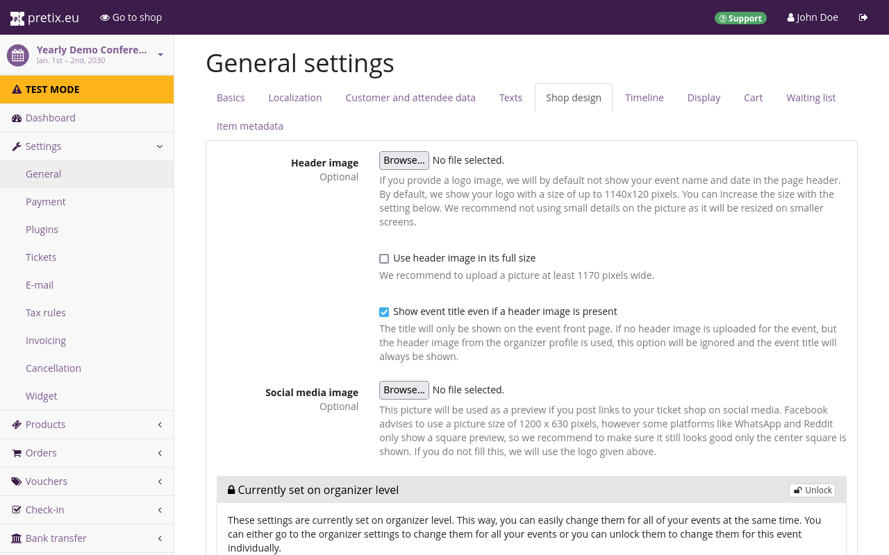

# Event series

After setting up an organizer account, the next step is creating an event series.
This article describes the creation and basic setup of an event series.
Here is a quick summary of the steps we are going to take in this section:

 - [create an event series](event.md#event-creation)
 - [get an overview](event.md#event-level-dashboard) of the event's status on the dashboard
 - [enable the collection](event.md#customer-and-attendee-data) of customer and attendee data
 - [add images](event.md#shop-design) to the ticket shop

This covers all the necessary steps for creating an event.
We will then move on to modify our products according to our needs in the next article of this tutorial.

## Event creation

In order to create an event, we must first log in to our [pretix](https://pretix.eu/control/) account.
After that, clicking the :btn:pretix.eu: button in the top left corner of the website takes us to the dashboard and an overview of our upcoming events.
We will now click the :btn-icon:fa3-plus:Create a new event: button.

 

An event in pretix is always associated with an organizer account, so we have to choose one here.
We will choose the organizer that is hosting this event—that is, the one we set up in the previous step of this tutorial.
We cannot change this selection after we have created the event.
Thus, we have to ensure we are picking the correct organizer account here.

Next, we have to choose the event type.
There are two options: "Singular event or non-event shop" and "Event series or time slot booking".
For this tutorial, we want to create a shop for a museum that operates most days of the week for an entire season.
Thus, we are going to choose the option "Event series or time slot booking".

We are going to choose which languages to use for the event.
By default, the languages we chose while setting up the organizer account should be active.
We will activate or deactivate languages as needed.

Once we are happy with our choices, we are going to click the :btn:Continue: button.



We are now asked to provide a name and a short form for the event.
For this tutorial, we are going to create a shop for the 2027 season.
Therefore, in the "Event name" field, we will enter `Tutorial Museum`.
For the "Short form" field, we will come up with an abbreviation for "Tutorial Museum" and include the last two digits of the year.

We will enter `tutmus27` into the field.
pretix appends the short form to the organizer's URL.
In our case, this results in the following URL:
https://pretix.eu/tut/tutmus27



Like the name and short form, the start time for our event series is mandatory information.
We are going to enter the first of January, 2027, into the start time field.

Since we already know our venue, we are going to put that location into pretix now.
This information is optional.
We can still change it later.
pretix will use our input into the "Location" field to search OpenStreetMap for that location.

If pretix can find the location, it will fill out the "Geo coordinates" fields automatically and the map preview will center on that location.
If it cannot find any results for the input, we can manually drag the marker on the map to the event location.
This will automatically update the "Geo coordinates" fields.
Alternatively, we can use the more advanced search function on [OpenStreetMap.org](https://www.openstreetmap.org) and copy the coordinates over to the "Geo coordinates" fields.

We have to choose a currency for our event.
We are going to click the "Currency" drop-down menu and select the `Euro`.

This page also allows us to set a sales tax rate for our event.
It is possible to change taxation rules after we have finished creating the event.
We are holding our event in Germany and a single percentage rule applies to all of our products.
Thus, we are going to add a 19% tax rule here.

!!! Note
    Every tax rate you assign to a product, you have to create first.
    If there are multiple different tax rates that apply to your products, create one tax rate for each of them.
    If you are selling products with a 0% tax rate (such as [gift cards](../../guides/gift-cards.md)), you still need to create a 0% tax rule first.
    For more information, see our guide on [creating tax rules](../../guides/taxes.md#creating-tax-rules).

Once we are happy with our choices, we are going to click the :btn:Continue: button.



 

We are then asked if we want to copy information from a previously created event.
This option can save us a lot of work from our second event onwards.
But since this is the first event we are organizing with this organizer account, we will leave the default (_"Do not copy"_) and click :btn:Continue:.

 

pretix will now land us on the "General settings" page for the event series.
We will provide a general email address at which our customers can contact us in the "Contact address" field.
Our shop page footer will display this email address with the label "Contact event organizer".
We will also provide a URL to legal imprint information for our organization's online presence in the "Imprint URL" field.
These two pieces of information are mandatory for our ticket shop to go live.

Once we click :btn:Save: at the bottom of the page, pretix takes us to an overview of the event.
This overview gives us the event name, the timeline of tickets sales and presale, and the status of our ticket shop.
The ticket shop should be in test mode at this point.

## Event-level dashboard

Now that we have created our event, we have access to all possible options for the event.
We can visit the event-level dashboard by clicking the :btn:pretix.eu: button in the top left corner and then selecting our event in the list titled "Your upcoming events".
The event-level dashboard gives us an overview of the event's basic information and status.
It allows us to leave internal comments for ourselves or our team and it logs recent changes.

At this point, the overview will probably display a warning that our organizer account is not active yet.
The first time we see this warning, we are going to click the link and fill out the necessary information in the form.

Activating an account is a manual process and may take some time depending on the availability of the pretix team.
The team will activate our account during the following business day.
During this time, the warning will persist even if we have already provided all necessary information.

## Customer and attendee data

We are planning to print badges for our attendees during the conference.
That means we have to record their name and affiliation during purchase.

On the event-level dashboard, we will click :btn-icon:fa3-wrench: Settings: in the sidebar, which lands us on the general settings page for the event.
We will open the :btn:Customer and attendee data: tab at the top.
The options on this tab allow us to set questions for certain information for every ticket purchased.
We will scroll down to the subheading "Attendee data (once per personalized ticket)".

We will set the attendee name to "Ask and require input" and the company option to "Ask, but do not require input".
In the text field labeled "Attendee data explanation", we will add an explanation as to why we are collecting the data in question.
Our explanation reads as follows:
"We will use the name, title and company you submit for your badge."

Under "Form settings", we can choose the format in which pretix will ask attendees for names and titles.
We are going to select `Ask for Title + Given name + Family name, display like Dr John Doe` for names and `Free text input` for titles.
Changing these settings after already having received orders can lead to issues when sorting or changing names.
Thus, we will finalize our choice here before taking the ticket shop live.

We will click the :btn:Save: button to save these settings.

## Shop design

Switching to the "Shop design" tab at the top allows us to add images to our event shop and customize its colors.
Clicking the :btn-icon:fa3-eye:Go to shop: button in the bar at the top takes us to a preview of the shop from the customers' perspective.
A shop created with pretix Hosted will by default be located at https://pretix.eu/:placeholder:OrganizerShortForm:/:placeholder:EventShortForm:/.
The shop we are creating for this tutorial is located at [https://pretix.eu/tut/tutcon27/](https://pretix.eu/tut/tutcon27/).

By default, the page header of our shop will display the name of the event.
The shop design settings allow us to replace the name with a header image that tells our customers about the event (e.g., by means of the event name, logo, or recognizable design).

We are going to add a header image by clicking the :btn:Browse...: button next to the "Header image" option and choosing a .png file with a resolution of 1140 × 120 pixels to upload from our computer.
By default, the header image will replace the name of the event at the top of the page.
But we still want to include the name of the event.
Thus, we are going to check the box next to "Show event title even if a header image is present".

We are also going to upload a .png file for the "Social media image" option.
pretix will use this image as a preview for any links to our ticket shop we post on social media.
If we do not upload a file here, then pretix will use the header image for previews instead.

Any changes we make on this page will only become visible in the event shop after we have clicked the :btn:Save: button.

## Conclusion

We have gone through the four-step event creation process, gotten an overview of the event's status on the event dashboard, enabled the collection of customer and attendee data, and added images to the ticket shop.
We can now move on to [creating dates](dates.md) to our event series.