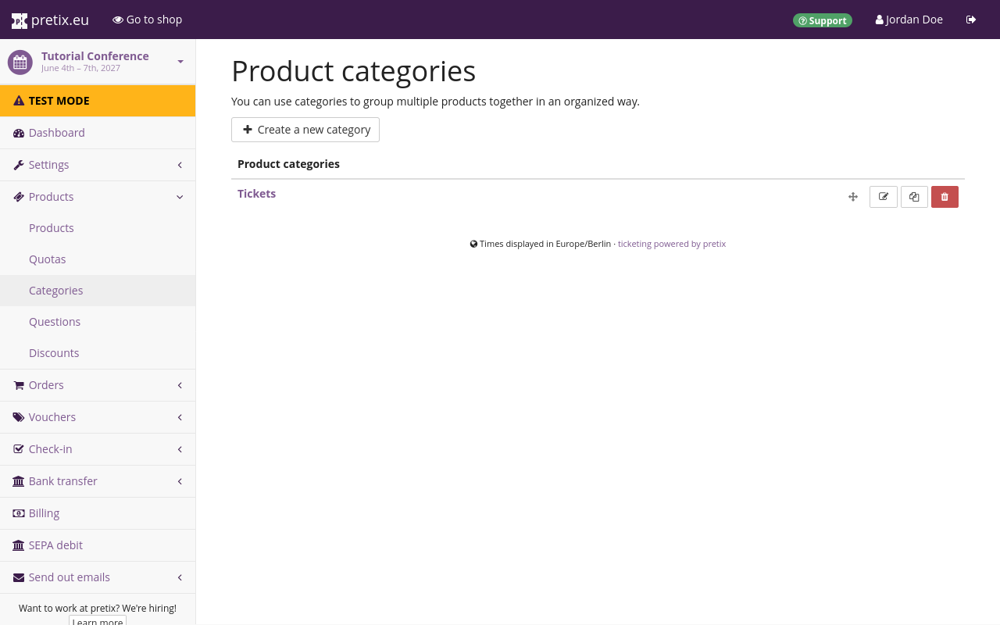
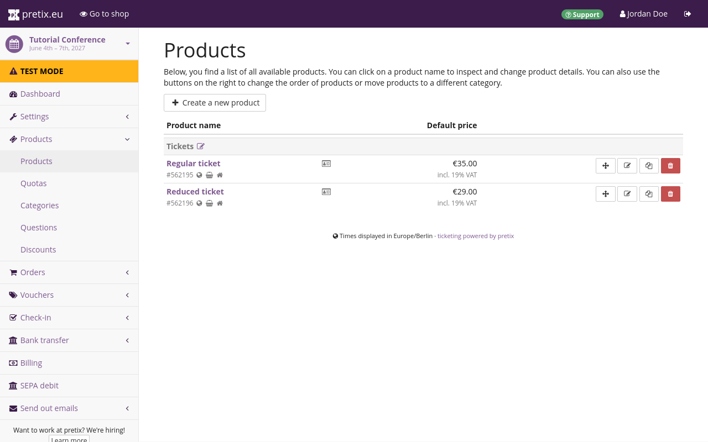
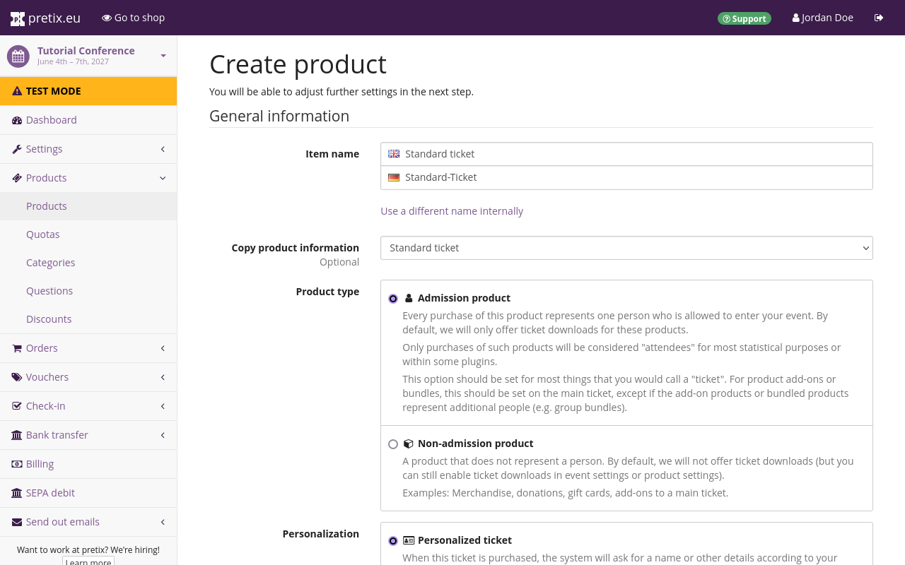
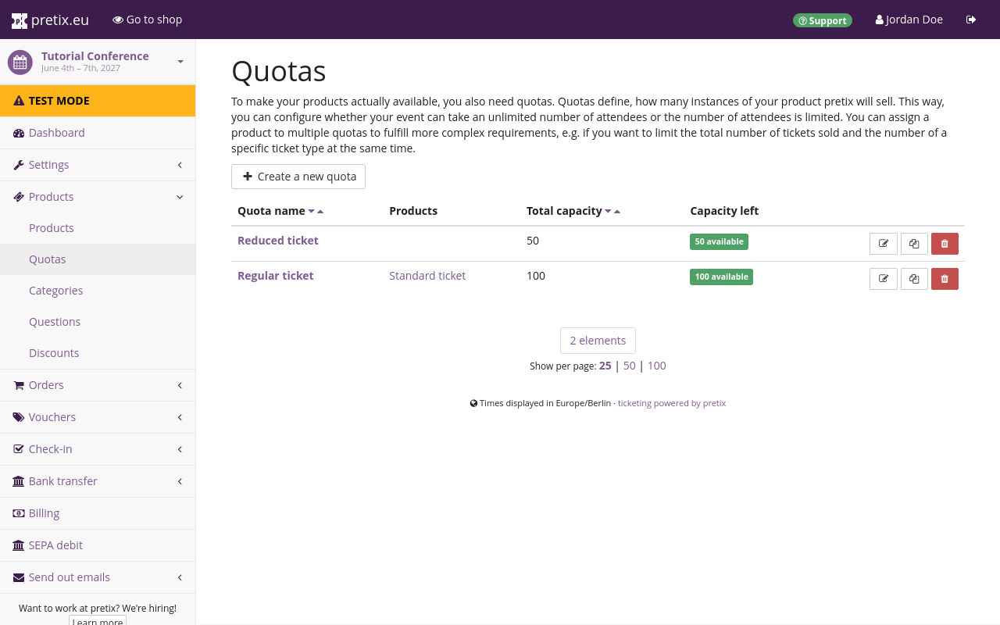

# Products

A product is anything sold via pretix: tickets, gift cards, t-shirts and so on.
We will be selling a variety of products in our shop.
It is not possible to create dates without preparing the products that we will sell for those dates first.

In this article, we will cover the process of creating the following products and making them available in our shop:

 - a basic [admission ticket](products.md#creating-and-editing-products)
 - a [discount ticket](products.md#discount-ticket) for students
 - a ticket for our [guided tour](#guided-tour-tickets) (as well as a discount version)

We are going to start by [creating categories](products.md#creating-and-editing-categories) to sort our products into.
Then, we will create the products themselves.
Lastly, we are going to [create quotas](products.md#creating-and-editing-quotas) with unlimited capacity for our admission tickets.

## Creating and editing categories

Categories can help us group products into sensible categories both in the backend and in our shop.
They also separate products that customers can purchase individually from add-on products and cross-selling products.
We do not need add-on or cross-selling products for our museum, but we are going to sell full-price and discounted tickets in our shop.
That means our next step is to create a category for discounted tickets.

For that, we will navigate to our personal dashboard by clicking :btn-icon:i-pretix: pretix.eu: in the top left corner of the website.
We will then select our event series in the list of "Your upcoming events", open :btn-icon:fa3-ticket: Products: in the sidebar and click the :btn:Categories: subentry.
This page shows the list of all product categories, which at the moment should only include a single category named "Tickets" of the type "Normal category".

We will click the :btn-icon:fa3-edit:: change button next to the "Tickets" category.
We will change the "Category name" to `Full-price tickets` and click the :btn:Save: button.

Back on the on the page titled "Product categories", we will click the :btn-icon:fa3-plus: Create a new category: button and give the category a name such as "Discounted tickets".
Under "Category type", we will select `Normal category`.
We are not planning to use the cross-selling feature for our museum, so the cross-selling categories are not relevant for us.
The same is true for add-on categories.

Clicking the :btn:Save: button at the bottom of the page takes us back to the product categories page.
This page now lists two entries: "Tickets" and our newly created category named "Discounted tickets".

## Creating and editing products

Now that we have prepared the necessary categories for our products, we can edit the existing products and create new ones to suit our needs.

First, we will edit the "Regular ticket" so that we can base all other tickets on this one.
In order to do so, we will navigate to :navpath:Event → :fa3-ticket: Products → Products:.
The website should display two tickets that pretix created automatically along with the event: "Regular ticket" and "Reduced ticket".
We will click "Regular ticket", which takes us to the "Modify product" dialog.

We will change the English item name to `Regular admission` and provide a German translation.
We are going to add the following description:
`Regular ticket granting access to the museum.`
Next, we will click the :btn:Price: tab and change the "Default price" to €10.00.
We will also select the appropriate tax rate of 19% from the "Sales tax" drop-down menu.



Once we have done so, we are going to click the :btn:Save: button.

### Discount ticket

We will now create the discount ticket based on the "Regular admission" ticket we edited in the previous step.
There are two advantages to this approach: First, we do not have to repeat all the same steps, and second, we are reducing our risk of forgetting any of them.
We do not need the "Reduced ticket" anymore.
We will navigate to the products page, click the red :btn-icon:fa3-trash:: delete button next to the reduced ticket, and confirm that we want to delete it.

Back on the product overview, we will click the :btn-icon:fa3-copy:: clone button next to the regular admission ticket in order to clone it.
We will name the new ticket "Discounted admission", provide a translation, change the "Default price" to €8.00, and click the :btn:Save: button.

!!! Note
    A warning is now displayed in a yellow box at the top of the page, saying:
    "Please note that your product will not be available for sale until you have added your item to an existing or newly created quota."
    This warning will also appear during the creation of subsequent products.
    We can safely **ignore it** for now because we will take care of adding products to quotas in the next section of this article.
    That will make the warning disappear.

On the next page, we have to adjust the "Description" field to inform our customers of the prerequisites for access to the discounted ticket.
Our description reads:
"This ticket is only valid if you provide a student ID at check-in."

We will then switch to the :btn:Price: tab.
We will change the "Default price" to €8.00 and the original price to the price of the regular admission ticket, that is, €10.00.
Our shop will display the original price struck-through and the new default price in bold green, highlighting the price discount.

Then, we will navigate to the :btn:Check-in and validity: tab and check the box next to "Requires special attention".
We have to provide instructions for the person operating the check-in at our event in the "Check-in text" field.
Our instructions say: `Check for student ID`.
We will then click the :btn:Save: button.

### Guided tour tickets

We are going to create another ticket for our guided tour.
In order to do so, we will navigate to the products page and click the :btn-icon:fa3-plus: Create a new product: button.
We will name our new ticket "Guided tour" and provide a German translation.
Under "Category", we will select `Full-price tickets`.
We will add a description such as the following:

"Ticket for a guided tour.
Guided tours start every Monday and Wednesday at 10 AM.
The guided tour ticket also grants you access to the museum."

Then, will change the "Default price" to €15.00 and select the appropriate tax rate of 19% from the "Sales tax" drop-down menu.
We can leave all other settings on this page unchanged and click the :btn:Save and continue with more settings: button.

We will then navigate to :navpath:Event → :fa3-ticket: Products → Products: and click the :btn-icon:fa3-copy:: clone button next to the "Guided tour" ticket.
We will name this ticket "Guided tour (discount)", provide a German translation, select the category "Discounted tickets", and set the price to €10.00.
We will then click the :btn:Save and continue with more settings: button.

At the end of this process, we should have two categories with two tickets each:
the "Full-price tickets" category containing "Regular admission" and "Guided tour", and the "Discounted tickets" category containing "Discount admission" and "Guided tour (discount)".

## Creating and editing quotas

A quota determines how many instances of our product we can sell through our shop.
Every product has to be part of at least one quota before it becomes available in the shop.
In this section, we are going to create quotas and add our products to them.

We will navigate to :navpath:Event → :fa3-ticket: Products → Quotas:.
This page shows the list of all quotas for the event.
At the moment, this includes the "Regular ticket" quota, containing the regular admission ticket as a product, and the "Reduced ticket" quota, not containing any ticket.
The list also displays the total capacity and how many items remain for each quota.

### Quotas for tickets

First, we will edit a quota for our regular and discount admission tickets.
It makes sense to include both tickets in a single quota because we cannot plan ahead how many of the tickets we sell are going to be discount tickets.
We will click the :btn-icon:fa3-edit:: change button next to the "Regular ticket" quota in the list.
We are also going to rename this quota to `Standard and discount admission` to avoid confusion.
The "Regular admission ticket" should already be checked in the list of products.

We will also check the "Discounted admission ticket" in the list and remove the entry in the "Total capacity" field.
This means that there will not be a limit on how many of these tickets we can sell.
We are planning to sell these tickets for the entire 2027 season, not for a single date.
Thus, it makes no sense to limit the total number.

We will leave the rest of the settings unchanged and click the :btn:Save: button.
This takes us to a detailed overview of the status of the "Standard ticket" quota.

Since this quota now includes both the standard and discount admission tickets, we do not need the "Reduced ticket" quota anymore.
We will navigate back to the quotas page and click the :btn-icon:fa3-trash:: delete button next to the "Reduced ticket" quota.

Our "Guided tour" product will be part of one quota per date.
We will create those quotas along with the dates later.

## Conclusion

We have created all the tickets and other products that we are planning to sell in our shop, sorted them into categories, and added two of them to quotas.
In the next step, we are going to create [dates](dates.md) for which our customers can buy those products.