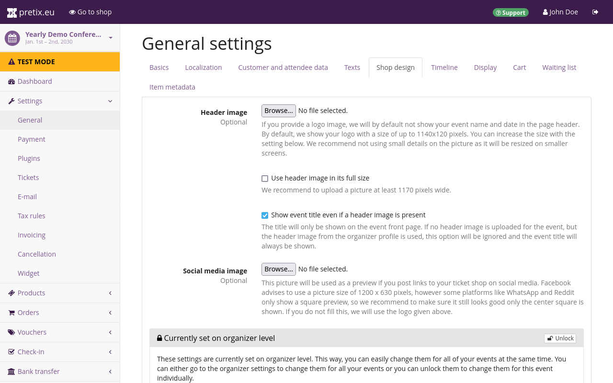

# Event 

After setting up an organizer account, the next step is creating an event. 
This article describes the creation and basic setup of an event. 
In this article, we will: 

 - create an event
 - get an overview of the event's status on the dashboard
 - enable the collection of customer and attendee data 
 - add images to the ticket shop 

This covers all the necessary steps for creating an event and setting up the ticket shop so that we can modify our product to our needs in the next article of this tutorial. 

## Event creation 

In order to create an event, we must be logged in to our [pretix](https://pretix.eu/control/) account. 
Clicking the :btn:pretix.eu: button in the top left corner of the website takes us to the dashboard and an overview of our upcoming events. 
We will now click the :btn-icon:fontawesome-solid-plus:Create a new event: button. 

 

An event in pretix is always associated with an organizer account, so we have to choose one here. 
We will choose the organizer that is hosting this event—that is, the one we just set up in the previous step of this tutorial. 
This selection cannot be changed after the event has been created, so it is important to pick the correct organizer account here. 

Next, we have to choose the event type. 
There are two options: "Singular event or non-event shop" and "Event series or time slot booking". 
For this tutorial, we want to create a simple conference that takes place on a weekend, so we are going to choose the option "Singular event or non-event shop". 

We are going to choose which languages to use for the event. 
By default, the languages chosen while setting up the organizer account should already be checked here. 
We will simply activate and deactivate the languages as needed.



 

After clicking :btn:Continue:, we are now asked to provide a name and a short form for the event. 
We are going to create a simple example conference for this tutorial. 
Therefore, we will choose "Example Conference" for the "event name" field, and "tutcon27" for the "short form" field. 
The short form is appended to the organizer's URL. 
In our case, this results in the following URL: [https://pretix.eu/tut/tutcon27](https://pretix.eu/tut/tutcon27). 



Since we already know the location for our event, we're going to put that location into pretix now. 
This information is optional and can still be changed later. 
Our input into the "location" field will be used to search OpenStreetMap for that location. 
If the location can be found, the "geo coordinates" fields will be filled out automatically and the map preview will center on that location. 
If no results can be found for the input, the marker on the map can be dragged to the event location manually. 
This will automatically update the "geo coordinates" fields. 
Alternatively, we can use the more advanced search function on [OpenStreetMap.org](https://www.openstreetmap.org) and copy the coordinates over to the "geo coordinates" fields. 

Just like the name and short form, the start time and the currency for our event are mandatory information. 
We're going to enter the fourth of June, 2027, into the start time field and we're going to choose the Euro in the currency drop-down menu. 

This page also allows us to set a sales tax rate for our event. 
Taxation rules can also be changed after event creation is finished. 
We are holding our event in Germany and a single percentage rule applies to all of our products. 
Thus, we are going to add a 19% tax rule here. 



 

We are then asked if we want to copy information from a previously created event. 
This step can save us a lot of work from our second event onwards. 
But since this is the first event we're organizing with this organizer account, we will simply leave the default (_"Do not copy"_) and click :btn:Continue:. 

 

The next page congratulates us on creating our event and gives us an opportunity to make quick changes to the products and basic settings for the event. 
We do not need to touch these quick settings at the moment. 
We will take a closer look at products (tickets, gift cards, etc.) in the next section of this tutorial. 
All we are going to do on this page is add two more pieces of information that are mandatory for our ticket shop to go live. 
We will provide a general email address at which our customers can contact us in the "contact address" field. 
This email address will be displayed in the page footer of our shop with the label "contact event organizer". 
We will provide a URL to legal imprint information for our organization's online presence in the "imprint URL" field. 

Once we click :btn:Save: at the bottom of the page, we are taken to an overview of the event, which gives us its name, the timeline of tickets sales and presale, and the status of our ticket shop, which should be in test mode at this point. 

## Event-level Dashboard

Now that we have created our event, we have access to all possible options for the event. 
We can visit the event-level dashboard by clicking the :btn:pretix.eu: button in the top left corner and then selecting the event we just created in the list titled "your upcoming events". 
The event-level dashboard gives us an overview of the event's basic information and status. 
It allows us to leave an internal comment for ourselves or our team and it logs recent changes. 

 

At this point, the overview will probably display a warning that our organizer account is not yet active. 
The first time we see this warning, we are going to click the link and fill out the necessary information in the form. 
Activating an account is a manual process and may take some time depending on the availability of the pretix team. 
The account should usually be activated during the following business day. 
Thus, this warning may persist for a while even if all necessary information has already been provided. 

## Customer and attendee data 

We are planning to print badges for our attendees during the conference. 
That means we have to record their name and affiliation during purchase. 
While we are viewing the event-level dashboard, we will click ":fontawesome-solid-wrench: Settings" in the sidebar, which lands us on the general settings page for the event. 
We will open the "customer and attendee data" tab at the top. 
Here, under the "attendee data (once per personalized ticket)" subheading, there are options for asking certain information for every ticket purchased.  
We will set the attendee name to "Ask and require input" and the company option to "Ask, but do not require input". 
In the text fields labeled "attendee data explanation", we will add an explanation as to why we're collecting the data in question. 
Our explanation reads as follows: 
"We will use the name, title and company you submit for your badge."

Under "form settings", we can choose the format in which pretix will ask attendees for names and titles. 
We are going to select "ask for title + given name + family name, display like John Doe" for names and "free text input" for titles. 
We will finalize our choice here before taking the ticket shop live.
This is important because changing these settings after already having received orders can lead to issues when sorting or changing names.

## Shop design 

 

Switching to the "shop design" tab at the top allows us to add images to our event shop and customize its colors. 
Clicking the :btn-icon:fontawesome-regular-eye:Go to shop: button in the bar at the top takes us to a preview of the shop from the customers' perspective. 
A shop created with pretix Hosted will by default be located at https://pretix.eu/[OrganizerShortForm]/[EventShortForm]/. 
The shop we are creating for this tutorial is located at [https://pretix.eu/tut/tutcon27/](https://pretix.eu/tut/tutcon27/). 

By default, the name of the event will be displayed in the page header of our shop. 
The shop design settings allow us to replace the name with a header image that tells our customers about the event (e.g., by means of the event name, logo, or recognizable design). 
We are going to add a header image by clicking the :btn:Browse...: button next to the "Header image" option and choosing a .png file with a resolution of 1140 × 120 pixels to upload from our computer. 
By default, the header image will replace the name of the event at the top of the page. 
We still want to include the name of the event though, so we are going to check the box next to "show event title even if a header image is present". 

We are also going to upload a .png file for the "social media image" option. 
This will be used as a preview for any links to our ticket shop we post on social media. 
Not uploading a file here would mean that the header image will be used for previews instead. 

## Conclusion 

We have gone through the four-step event creation process, gotten an overview of the event's status on the event dashboard, enabled the collection of customer and attendee data, and added images to the ticket shop. 
We can now move on to creating products to be sold in our shop. 
